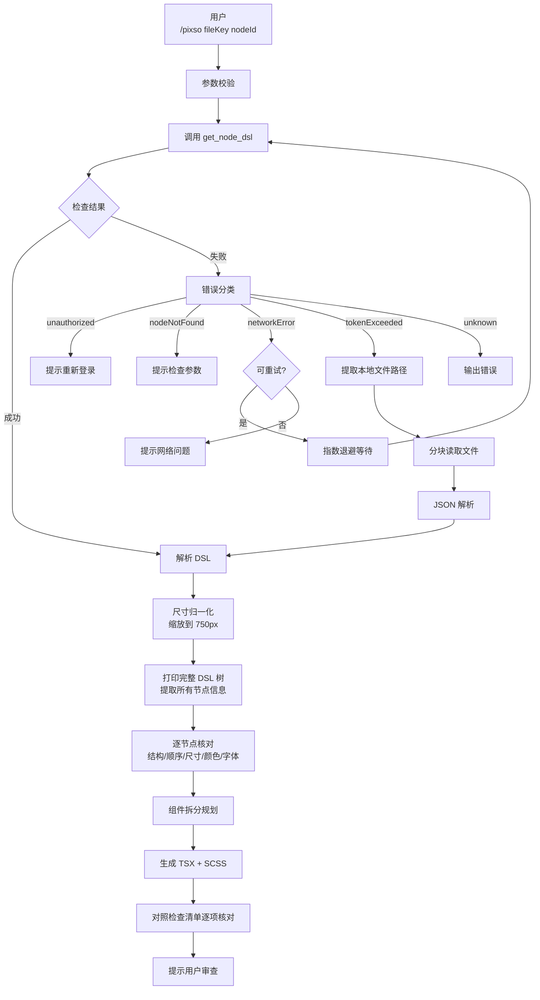

# Pixso 设计稿获取与代码生成命令

**触发方式**: `/pixso <fileKey> [nodeId]`

**功能**: 通过 Pixso MCP 服务获取设计稿 DSL，自动处理各种错误场景（包括大结果 token 超限），并生成符合项目规范的 React + TypeScript + SCSS 代码。

---

## 错误处理规则

本命令内置分类错误处理策略：

| 错误类型 | 触发条件 | 处理方式 | 重试 |
|----------|----------|----------|------|
| 未授权 | `Invalid token` / 认证失败 | 提示重新配置 Token | ❌ |
| 节点不存在 | `node not found` | 提示检查 nodeId | ❌ |
| 网络错误 | 超时/连接断开 | 指数退避重试 | ✅ 最多 3 次 |
| **Token 超限** | `exceeds maximum allowed tokens` | **自动读取本地文件** | ⭐ 特殊处理 |
| 限流 | 频率限制 | 退避重试 | ✅ 最多 2 次 |
| 服务端错误 | Pixso 内部错误 | 重试一次 | ✅ 最多 1 次 |
| 未知错误 | 其他 | 输出错误信息让用户排查 | ❌ |

---

## 完整工作流程



---

## ✅ 强制：DSL 完整解析流程

### 第一步：打印完整树结构并提取所有信息

**必须执行**：使用 Python 脚本遍历整个 DSL 树，输出每个节点的：
- 层级关系（缩进显示父子关系）
- 尺寸（缩放后 `width × height`）
- 位置（`top` / `left`）
- 填充颜色（如果有）
- 文字内容 + 字体大小（如果是 PARAGRAPH）

**命令示例**：
```python
python3 -c "
import json
dsl = json.load(open('/tmp/pixso-dsl.json'))
nodes = dsl['pixDslNodes']
scale = 750 / ORIGINAL_WIDTH

def walk_node(guid, indent=0):
    for node in nodes:
        if node.get('parentGuid') == guid:
            name = node.get('name', '').strip() or node['type']
            w = int(node['width'] * scale)
            h = int(node['height'] * scale)
            t = int(node.get('top', 0) * scale)
            l = int(node.get('left', 0) * scale)
            print('  ' * indent + '- %s:' % name)
            print('  ' * (indent+1) + 'size: %dx%d, pos: top=%d, left=%d' % (w, h, t, l))
            if 'fillPaints' in node and len(node['fillPaints']) > 0:
                for i, p in enumerate(node['fillPaints']):
                    if 'color' in p:
                        c = p['color']
                        r = int(c['r'])
                        g = int(c['g'])
                        b = int(c['b'])
                        a = c.get('a', 1)
                        print('  ' * (indent+1) + 'fill: #%02x%02x%02x, alpha=%s' % (r, g, b, a))
            if node['type'] == 'PARAGRAPH' and 'nodeText' in node:
                fs = int(node.get('fontSize', 14) * scale)
                text = node['nodeText'][:80]
                print('  ' * (indent+1) + 'text: \"%s...\"' % text)
                print('  ' * (indent+1) + 'fontSize: %dpx' % fs)
                if 'fillPaints' in node and len(node['fillPaints']) > 0:
                    c = node['fillPaints'][0]['color']
                    r = int(c['r'])
                    g = int(c['g'])
                    b = int(c['b'])
                    print('  ' * (indent+1) + 'color: #%02x%02x%02x' % (r, g, b))
            walk_node(node['guid'], indent + 1)

walk_node(ROOT_GUID)
"
```

### 第二步：尺寸缩放规则

原始设计稿宽度 ≠ 目标宽度，必须缩放：

```
scale = targetWidth(750) / originalWidth(from DSL)
all dimensions: width, height, top, left, fontSize, letterSpacing *= scale
round to integer pixels
```

| 项目 | 处理方式 |
|------|----------|
| `width` / `height` | 必须缩放 |
| `top` / `left` | 必须缩放 |
| `fontSize` | 必须缩放 |
| `lineHeight` | **不需要缩放**（保留倍数） |
| `letterSpacing` | 必须缩放 |

### 第三步：颜色提取规则

- `fillPaints[0].color` 取第一个填充色
- 格式转换：`{r: 0-255, g: 0-255, b: 0-255, a: 0-1}` → `#rrggbb` 或 `rgba(r,g,b,a)`
- **文字颜色**从 PARAGRAPH 节点的 fillPaints 获取，不能猜

### 第四步：结构顺序核对

**严格按照 DSL 输出的父子顺序输出 HTML 结构**，**禁止**凭经验调换顺序。

常见坑点：
- ❌ 作者信息栏不一定是「头像 → 信息 → 按钮」，必须按 DSL 实际顺序
- ❌ 底部操作栏不一定在页面最底部 DOM，要看它实际上属于哪个父节点
- ❌ 头部按钮不一定是「返回 → 分享」，要看 DSL 的实际顺序

---

## 📋 生成完成后必须检查清单

生成代码后，必须逐项勾选核对，**全部通过才能交给用户**：

- [ ] **结构层级**：HTML 层级完全匹配 DSL 树结构吗？
- [ ] **元素顺序**：每个容器内子元素顺序和 DSL 一致吗？
- [ ] **尺寸**：所有宽度高度都是缩放后的整数像素吗？
- [ ] **字体大小**：每个文字节点的字体大小都从 DSL 提取并正确缩放了吗？
- [ ] **颜色**：背景色和文字颜色都从 DSL 提取了吗？使用正确十六进制吗？
- [ ] **位置关系**：负margin、圆角覆盖等特殊定位正确实现了吗？
- [ ] **根容器命名**：页面根容器 `{pageName}Container` 符合 CSS 规范吗？
- [ ] **class 命名**：全部使用 camelCase 吗？
- [ ] **TypeScript**：所有类型都正确声明了吗？没有 `any` 吗？
- [ ] **安全区域**：底部适配了 `env(safe-area-inset-bottom)` 吗？
- [ ] **点击反馈**：可点击元素添加了 `:active { opacity: 0.7/0.8; }` 吗？
- [ ] **点击区域**：可点击元素最小尺寸 ≥ 44px × 44px 吗？

---

## 常见布局陷阱与正确做法

| 陷阱 | 错误做法 | 正确做法 |
|------|----------|----------|
| 底部悬浮操作栏 | 放在内容区底部 | 用 `position: fixed; bottom: Xpx; left: 50%; transform: translateX(-50%);` 居中悬浮 |
| 封面 + 内容叠加 | 内容在封面下方 | 内容用 `margin-top: -Npx; border-radius: Npx 0 0;` 圆角叠加在封面上方 |
| 粘性导航栏 | 不使用 sticky | `position: sticky; top: 0; z-index: 100;` + 半透背景 + 毛玻璃 |
| 作者栏顺序 | 凭经验「头像左 → 按钮右」 | **严格按 DSL 输出顺序**，可能是「按钮左 → 信息中 → 头像右」 |
| 字体大小 | 使用经验值（如 16px）| **严格按 DSL 提取的字体大小**（即使很大），设计稿多大就输出多大 |

---

## 设计规范对齐

生成代码严格遵循项目规范：
- **设计稿基准**: 强制缩放到 750px 宽度，输出 `px` 单位由插件自动转 `vw`
- **TypeScript**: 所有类型显式声明，零 `any`
- **样式**: `index.module.scss` + `camelCase` 命名
- **目录结构**: 遵循 `pages/` 和 `components/` 约定
- **状态管理**: 遵循 MobX `useLocalObservable` 规范

---

## 项目规范对齐

### 页面目录结构（pages/[PageName]/）

```
src/pages/[PageName]/
├── index.tsx        # 页面入口（只做渲染和组合）
├── useStore.ts      # 页面局部状态（MobX）
├── constant.ts      # 页面常量和类型定义
├── handle.ts        # 纯事件处理函数
├── index.module.scss # 页面样式
└── components/      # 可选：拆分的子组件
```

### 样式规范（CSS Modules）

- 根容器必须命名 `{pageName}Container`（PascalCase → camelCase）
- 所有 class 使用 camelCase
- 嵌套深度 ≤ 3 层
- 使用 px 单位，禁止手动 vw

详见 [.claude/rules/css-scss.md](../../rules/css-scss.md)

### TypeScript 规范

- 所有参数返回值必须显式类型声明
- 类型导出使用 `export type`
- 零 `any`，使用 `unknown` + 类型守卫

详见 [.claude/rules/typescript.md](../../rules/typescript.md)

---

## 使用示例

```
/pixso 6uC6uHMX_s0nCfPlWqo6A 2:341
```

获取 `fileKey=6uC6uHMX_s0nCfPlWqo6A` 中节点 `2:341` 的设计，并生成代码。

---

## 实现模块

- [error-handler.ts](./pixso-impl/error-handler.ts) - 错误分类与检测
- [large-file-reader.ts](./pixso-impl/large-file-reader.ts) - 大文件分块读取
- [dsl-parser.ts](./pixso-impl/dsl-parser.ts) - DSL 解析 + 尺寸缩放
- [index.ts](./pixso-impl/index.ts) - 入口整合

---

## 本次经验总结（2026-03-29）

> 在实现 `Detail` 页面时，由于跳过了完整树打印，凭经验猜测结构，导致：
> 1. 头部按钮顺序错误
> 2. 作者栏顺序完全颠倒
> 3. 底部操作栏位置错误（放到了内容末尾而不是悬浮）
> 4. 字体大小全部不对（没有缩放）
> 5. 颜色全部不对（没有从 DSL 提取）
>
> 所以必须强制：**先打印完整树，再写代码**。
