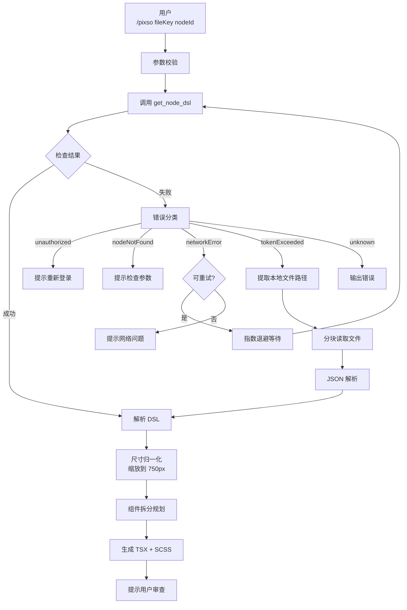

# Pixso 设计稿获取与代码生成命令

**触发方式**: `/pixso <fileKey> [nodeId]`

**功能**: 通过 Pixso MCP 服务获取设计稿 DSL，自动处理各种错误场景（包括大结果 token 超限），并生成符合项目规范的 React + TypeScript + SCSS 代码。

---

## 错误处理规则

本命令内置分类错误处理策略：

| 错误类型 | 触发条件 | 处理方式 | 重试 |
|----------|----------|----------|------|
| 未授权 | `Invalid token` / 认证失败 | 提示重新配置 Token | ❌ |
| 节点不存在 | `node not found` | 提示检查 nodeId | ❌ |
| 网络错误 | 超时/连接断开 | 指数退避重试 | ✅ 最多 3 次 |
| **Token 超限** | `exceeds maximum allowed tokens` | **自动读取本地文件** | ⭐ 特殊处理 |
| 限流 | 频率限制 | 退避重试 | ✅ 最多 2 次 |
| 服务端错误 | Pixso 内部错误 | 重试一次 | ✅ 最多 1 次 |
| 未知错误 | 其他 | 输出错误信息让用户排查 | ❌ |

---

## 完整工作流程



---

## 设计规范对齐

生成代码严格遵循项目规范：
- **设计稿基准**: 强制缩放到 750px 宽度，输出 `px` 单位由插件自动转 `vw`
- **TypeScript**: 所有类型显式声明，零 `any`
- **样式**: `index.module.scss` + `camelCase` 命名
- **目录结构**: 遵循 `pages/` 和 `components/` 约定
- **状态管理**: 遵循 MobX `useLocalObservable` 规范

---

## 使用示例

```
/pixso 6uC6uHMX_s0nCfPlWqo6A 2:341
```

获取 `fileKey=6uC6uHMX_s0nCfPlWqo6A` 中节点 `2:341` 的设计，并生成代码。

---

## 实现模块

- [error-handler.ts](./pixso-impl/error-handler.ts) - 错误分类与检测
- [large-file-reader.ts](./pixso-impl/large-file-reader.ts) - 大文件分块读取
- [dsl-parser.ts](./pixso-impl/dsl-parser.ts) - DSL 解析 + 尺寸缩放
- [index.ts](./pixso-impl/index.ts) - 入口整合
