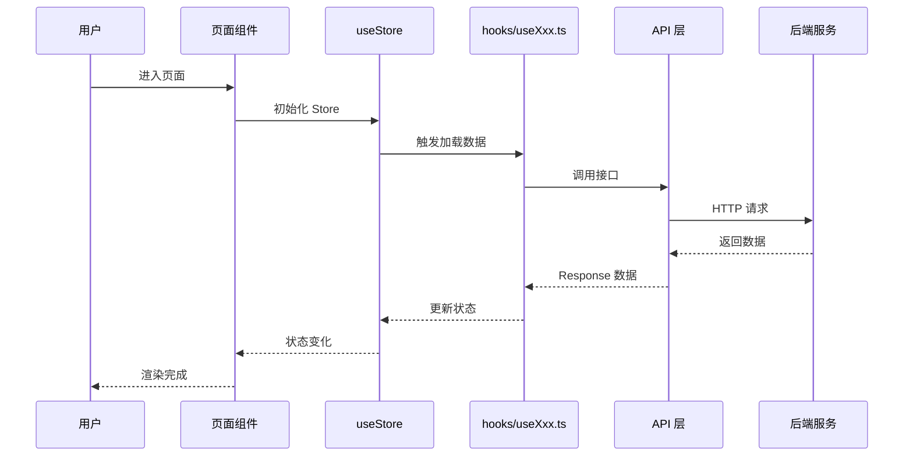
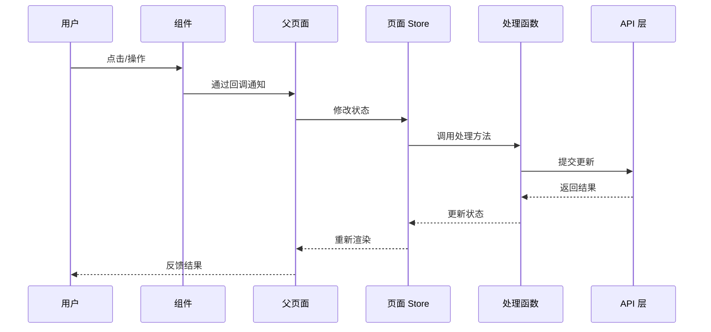

# Mermaid 图表模板

## 页面级模块组件结构图

```mermaid
flowchart TD
    subgraph "页面模块 - {ModuleName}"
        A[PageEntry<br/>index.tsx]:::entry
        S[Store<br/>useStore.ts]:::store
        H[Hooks<br/>hooks/useXxx.ts]:::logic
        C[Constants<br/>constant.ts]:::const
        T[Types<br/>types.ts]:::type
        SS[Styles<br/>index.module.scss]:::style
    end

    subgraph "内部子组件"
        SC1[Component1<br/>components/xxx]:::component
        SC2[Component2<br/>components/xxx]:::component
    end

    subgraph "外部依赖"
        API[API Layer<br/>apps/web/src/api/module]:::api
        G[Global Store]:::global
    end

    A --> S
    A --> H
    A --> C
    A --> SC1
    A --> SC2
    H --> API
    S --> API
    S --> G

    classDef entry fill:#fcc,stroke:#333,stroke-width:2px
    classDef store fill:#ccf,stroke:#333,stroke-width:2px
    classDef logic fill:#fcf,stroke:#333,stroke-width:2px
    classDef component fill:#cfc,stroke:#333,stroke-width:2px
    classDef api fill:#ff9,stroke:#333,stroke-width:2px
    classDef global fill:#f9f,stroke:#333,stroke-width:2px
    classDef const fill:#ddd,stroke:#333,stroke-width:2px
    classDef type fill:#ddd,stroke:#333,stroke-width:2px
    classDef style fill:#9cf,stroke:#333,stroke-width:2px
```

---

## 公共组件模块组件结构图

```mermaid
flowchart TD
    subgraph "公共组件 - {ComponentName}"
        C[Component<br/>index.tsx]:::component
        S[Styles<br/>index.module.scss]:::style
    end

    subgraph "Props 输入"
        P[Props<br/>接口定义]:::type
    end

    subgraph "外部依赖"
        A[antd-mobile<br/>基础组件]:::thirdparty
    end

    P --> C
    C --> S
    A --> C

    classDef component fill:#cfc,stroke:#333,stroke-width:2px
    classDef style fill:#9cf,stroke:#333,stroke-width:2px
    classDef type fill:#ddd,stroke:#333,stroke-width:2px
    classDef thirdparty fill:#ff9,stroke:#333,stroke-width:2px
```

---

## 页面加载数据序列图



---

## 用户交互序列图

