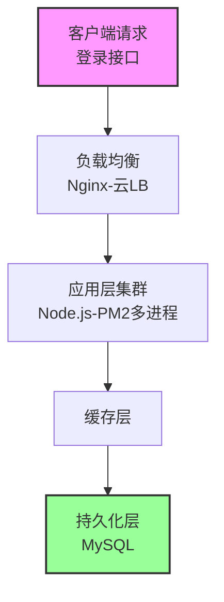

# 示例：整体架构层次

```mermaid
flowchart TD
    A[客户端请求<br/>登录接口] --> B[负载均衡<br/>Nginx-云LB]
    B --> C[应用层集群<br/>Node.js-PM2多进程]
    C --> D[缓存层]
    D --> E[持久化层<br/>MySQL]

    style A fill:#f9f,stroke:#333,stroke-width:2px
    style E fill:#9f9,stroke:#333,stroke-width:2px
```
