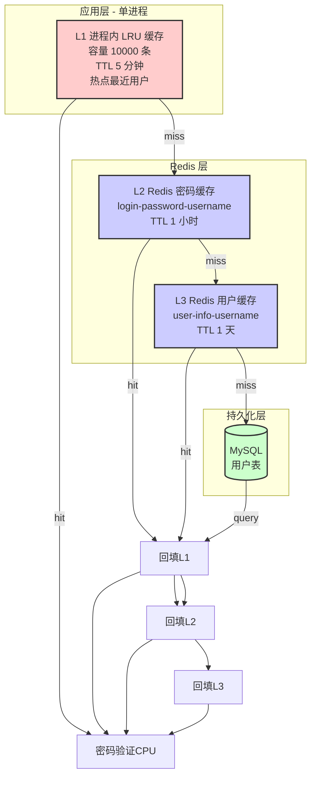

# 示例：方案一 缓存优化架构

```mermaid
flowchart TD
    subgraph "应用层 - 单进程"
        L1[L1 进程内 LRU 缓存<br/>容量 10000 条<br/>TTL 5 分钟<br/>热点最近用户]
    end

    subgraph "Redis 层"
        L2[L2 Redis 密码缓存<br/>login-password-username<br/>TTL 1 小时]
        L3[L3 Redis 用户缓存<br/>user-info-username<br/>TTL 1 天]
    end

    subgraph "持久化层"
        L4[(MySQL<br/>用户表)]
    end

    L1--hit-->密码验证CPU
    L1--miss-->L2
    L2--hit-->回填L1
    回填L1-->密码验证CPU
    L2--miss-->L3
    L3--hit-->回填L1
    回填L1-->回填L2
    回填L2-->密码验证CPU
    L3--miss-->L4
    L4--query-->回填L1
    回填L1-->回填L2
    回填L2-->回填L3
    回填L3-->密码验证CPU

    style L1 fill:#ffcccc,stroke:#333,stroke-width:2px
    style L2 fill:#ccf,stroke:#333,stroke-width:2px
    style L3 fill:#ccf,stroke:#333,stroke-width:2px
    style L4 fill:#cfc,stroke:#333,stroke-width:2px
```
