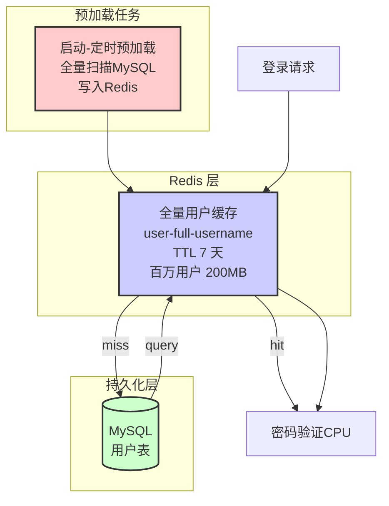

# 示例：方案二 纯 Redis 全缓存架构

```mermaid
flowchart TD
    subgraph "预加载任务"
        P[启动-定时预加载<br/>全量扫描MySQL<br/>写入Redis]
    end

    subgraph "Redis 层"
        L1[全量用户缓存<br/>user-full-username<br/>TTL 7 天<br/>百万用户 200MB]
    end

    subgraph "持久化层"
        L2[(MySQL<br/>用户表)]
    end

    P --> L1
    登录请求 --> L1
    L1--hit-->密码验证CPU
    L1--miss-->L2
    L2--query-->L1
    L1-->密码验证CPU

    style P fill:#ffcccc,stroke:#333,stroke-width:2px
    style L1 fill:#ccf,stroke:#333,stroke-width:2px
    style L2 fill:#cfc,stroke:#333,stroke-width:2px
```
