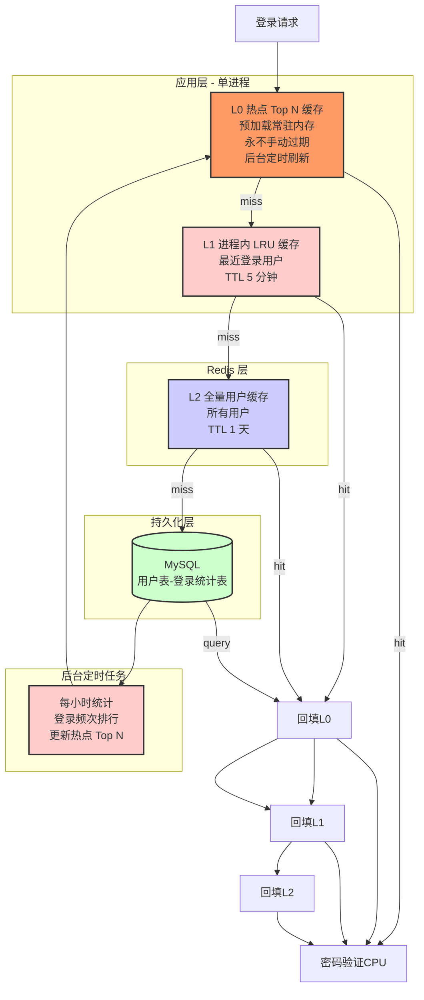

# 示例：方案三 分级缓存 热点预计算

```mermaid
flowchart TD
    subgraph "应用层 - 单进程"
        L0[L0 热点 Top N 缓存<br/>预加载常驻内存<br/>永不手动过期<br/>后台定时刷新]
        L1[L1 进程内 LRU 缓存<br/>最近登录用户<br/>TTL 5 分钟]
    end

    subgraph "Redis 层"
        L2[L2 全量用户缓存<br/>所有用户<br/>TTL 1 天]
    end

    subgraph "持久化层"
        L3[(MySQL<br/>用户表-登录统计表)]
    end

    subgraph "后台定时任务"
        T[每小时统计<br/>登录频次排行<br/>更新热点 Top N]
    end

    T --> L0
    L3 --> T

    登录请求 --> L0
    L0--hit-->密码验证CPU
    L0--miss-->L1
    L1--hit-->回填L0
    回填L0-->密码验证CPU
    L1--miss-->L2
    L2--hit-->回填L0
    回填L0-->回填L1
    回填L1-->密码验证CPU
    L2--miss-->L3
    L3--query-->回填L0
    回填L0-->回填L1
    回填L1-->回填L2
    回填L2-->密码验证CPU

    style L0 fill:#f96,stroke:#333,stroke-width:2px
    style L1 fill:#ffcccc,stroke:#333,stroke-width:2px
    style L2 fill:#ccf,stroke:#333,stroke-width:2px
    style L3 fill:#cfc,stroke:#333,stroke-width:2px
    style T fill:#fcc,stroke:#333,stroke-width:2px
```
