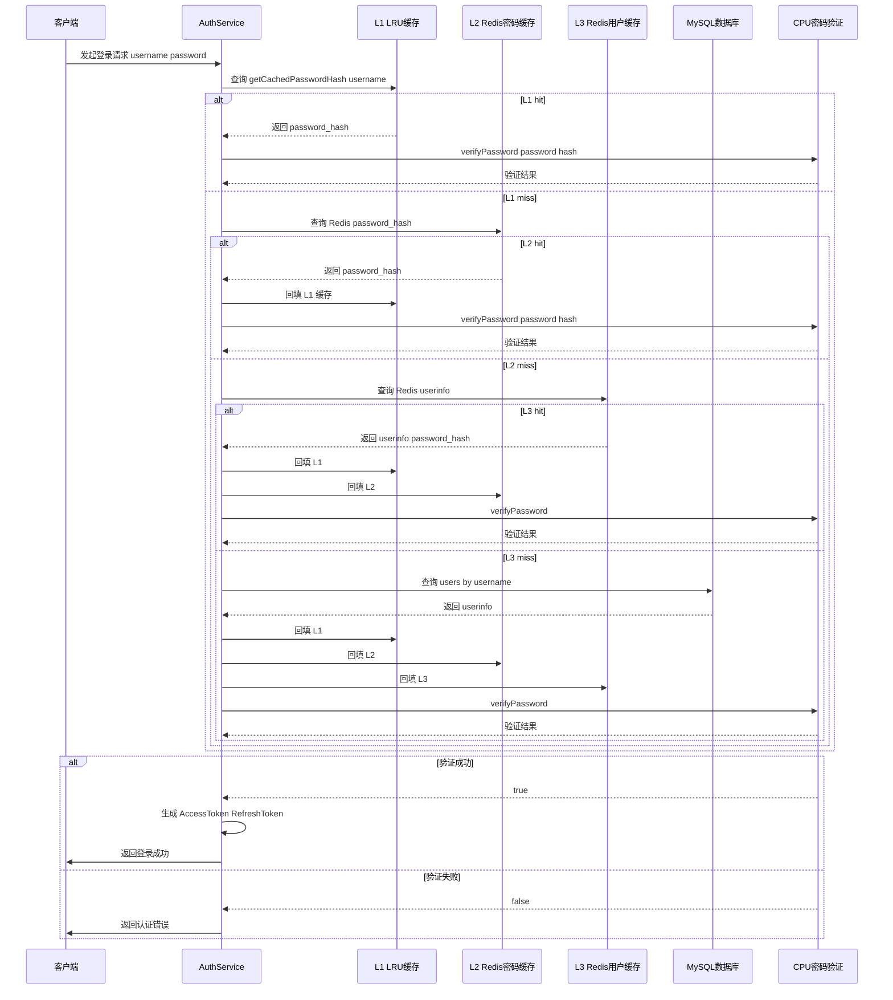

# 示例：登录流程序列图

序列图语法相对宽松，主要遵循通用规则。

```mermaid
sequenceDiagram
    participant C as 客户端
    participant A as AuthService
    participant L1 as L1 LRU缓存
    participant L2 as L2 Redis密码缓存
    participant L3 as L3 Redis用户缓存
    participant DB as MySQL数据库
    participant CPU as CPU密码验证

    C->>A: 发起登录请求 username password
    A->>L1: 查询 getCachedPasswordHash username

    alt L1 hit
        L1-->>A: 返回 password_hash
        A->>CPU: verifyPassword password hash
        CPU-->>A: 验证结果
    else L1 miss
        A->>L2: 查询 Redis password_hash

        alt L2 hit
            L2-->>A: 返回 password_hash
            A->>L1: 回填 L1 缓存
            A->>CPU: verifyPassword password hash
            CPU-->>A: 验证结果
        else L2 miss
            A->>L3: 查询 Redis userinfo

            alt L3 hit
                L3-->>A: 返回 userinfo password_hash
                A->>L1: 回填 L1
                A->>L2: 回填 L2
                A->>CPU: verifyPassword
                CPU-->>A: 验证结果
            else L3 miss
                A->>DB: 查询 users by username
                DB-->>A: 返回 userinfo
                A->>L1: 回填 L1
                A->>L2: 回填 L2
                A->>L3: 回填 L3
                A->>CPU: verifyPassword
                CPU-->>A: 验证结果
            end
        end
    end

    alt 验证成功
        CPU-->>A: true
        A->>A: 生成 AccessToken RefreshToken
        A->>C: 返回登录成功
    else 验证失败
        CPU-->>A: false
        A->>C: 返回认证错误
    end
```
