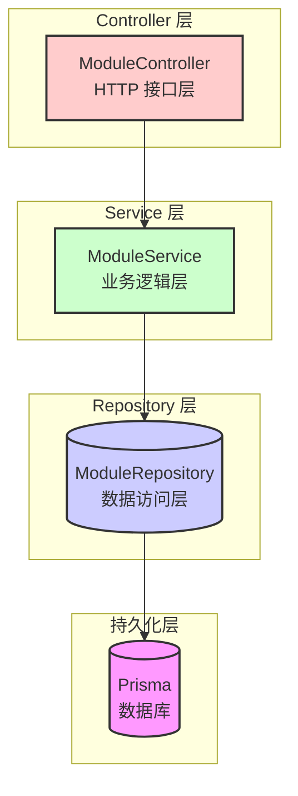
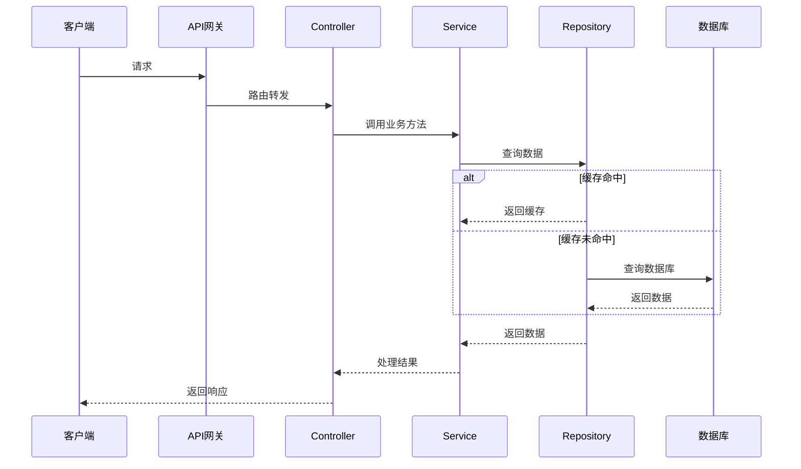
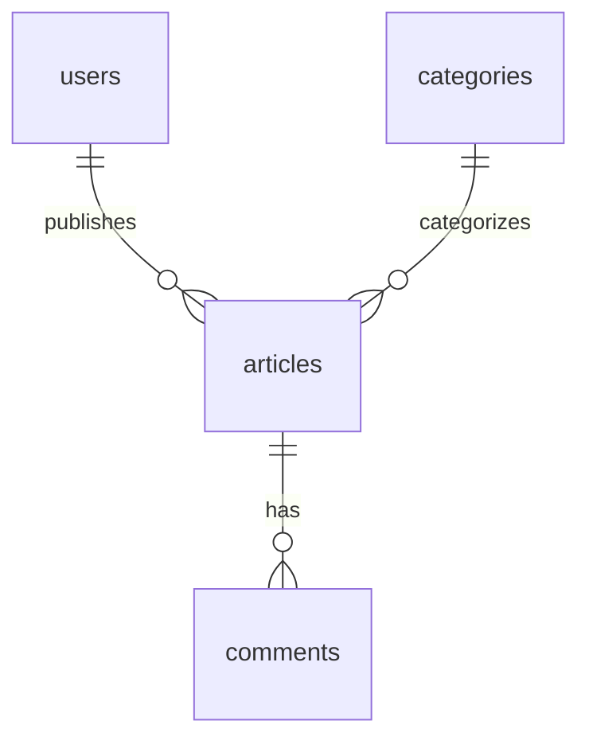

# 后端模块功能介绍文档生成规范

## 触发条件

当用户使用 `/backend-module-doc [模块路径]` 命令时触发，为指定的 NestJS 后端模块生成完整的设计文档，输出到 `backend/docs` 目录，用于日后回顾学习设计决策。

## 核心原则

1. **面向未来回顾** → 假设半年后看这份文档，能快速回忆起当时的设计思路和决策理由
2. **必须包含图形** → 生成 mermaid 图例可视化架构和流程
3. **决策必须可见** → 说明为什么选择这个方案，放弃了其他方案
4. **后端专属** → 专门针对 NestJS + Prisma 后端架构设计
5. **完整覆盖需求** → 必须覆盖：架构图、技术选型、方案详述、数据库性能、服务器配置

---

## 必选章节（严格按照顺序）

### 1. 文档信息

```markdown
# {模块名称} 模块 - 后端设计文档

> 本文档由 Claude Code 自动生成，记录模块设计决策，便于日后回顾学习。

| 文档信息 |  |
|----------|------|
| **生成日期** | YYYY-MM-DD |
| **模块路径** | {模块路径} |
| **项目版本** | {version from package.json} |
| **代码分支** | {current git branch} |
```

---

### 2. 模块概述

#### 模块职责
{一句话描述这个模块解决什么问题}

#### 模块位置
- 所属项目：{项目名称}
- 层级：{入口层/业务层/基础设施层}

#### 依赖关系
- 依赖模块：
  - {模块A} - 用途
  - {模块B} - 用途
- 被依赖：
  - {哪些上层模块依赖本模块}

---

### 3. 模块架构设计

必须生成 **mermaid 架构分层图**，展示 Controller → Service → Repository → DB 分层结构。

**模板示例**：



**规范要求**：
- 使用 `flowchart TD`
- 每个分层用颜色区分（按上面模板的类定义）
- 清晰展示调用方向
- 如果有多个 Service/Repository，都展示出来

---

### 4. 核心流程

必须生成 **mermaid 序列图**，展示一次核心请求的完整调用流程。

**模板示例**：



**规范要求**：
- 使用 `sequenceDiagram`
- 参与者按调用顺序排列
- 使用 `alt` 分支处理不同情况（如缓存命中/未命中）
- 只展示核心流程，不要太复杂

---

### 5. 技术选型对比

必须用表格对比关键技术选型，说明决策理由。

**模板**：

| 技术方案 | 选型结果 | 优点 | 缺点 | 决策理由 |
|----------|----------|------|------|----------|
| {方案A} | ✅ 选中 | {列举优点} | {列举缺点} | {为什么选中} |
| {方案B} | ❌ 放弃 | {列举优点} | {列举缺点} | {为什么放弃} |
| {方案C} | ❌ 放弃 | {列举优点} | {列举缺点} | {为什么放弃} |

**要求**：
- 至少对比 1-3 个关键技术选型点
- 必须说明**决策理由**，这是文档的核心价值
- 如果模块很小没有选型决策，说明"本模块较小，无关键技术选型决策"

---

### 6. 具体方案详述

#### 目录结构

```
{模块路径}/
├── *.module.ts         # 模块定义
├── *.controller.ts     # Controller 层
├── *.service.ts        # Service 层
├── *.repository.ts     # Repository 层（可选）
├── dto/                # 数据传输对象
├── entities/           # 实体定义（可选）
└── interfaces/         # 接口定义（可选）
```

#### 核心组件职责

| 组件 | 职责说明 |
|------|----------|
| `XxxController` | {说明 HTTP 接口职责} |
| `XxxService` | {说明业务逻辑职责} |
| `XxxRepository` | {说明数据访问职责} |

#### 关键设计决策

逐个说明关键设计决策：

**{决策点名称}**
- 问题：{遇到什么问题/需要做什么选择}
- 决定：{最终选择了什么方案}
- 原因：{为什么做这个决定}

---

### 7. 数据库设计与性能讲解

本章节**必填**，只要涉及数据库访问就必须填写。

#### 涉及表

列出本模块操作的核心表：
- `table_name1` - 用途说明
- `table_name2` - 用途说明

#### 表关系图（可选但推荐）

如果涉及多个表，生成 mermaid ER 图：



#### 索引设计

| 表名 | 索引字段 | 索引类型 | 用途 |
|------|----------|----------|------|
| `table_name` | `column1, column2` | 联合索引 | {什么查询场景} |
| `table_name` | `column` | 唯一索引 | {什么查询场景} |

#### 性能优化方案

- {优化点 1} - 说明为什么这么优化
- {优化点 2} - 说明为什么这么优化

#### N+1 查询防范

- 本模块是否存在 N+1 风险：{是/否}
- 防范措施：{如果有，说明采取了什么措施}

#### 容量预估

- **预估数据量**：{X} 万行
- **预估 QPS**：{Y}
- **瓶颈预期**：{哪里可能成为瓶颈}

---

### 8. 分布式架构服务器配置（如涉及）

如果本模块需要分布式部署或特殊基础设施配置，填写本章节。

**模板**：

| 服务角色 | CPU 核数 | 内存 | 数量 | 端口 | 备注 |
|----------|---------|------|------|------|------|
| 应用实例 | 2C | 4GB | N | 3000 | 本模块运行实例 |
| Redis | 1C | 2GB | 1 | 6379 | 缓存依赖 |
| MySQL | 2C | 4GB | 1主 | 3306 | 数据存储 |

如果不涉及分布式，说明：
> 本模块为单体应用部署，无需特殊分布式配置。

---

### 9. API 接口概览

列出本模块暴露的核心 HTTP 接口：

| 方法 | 路径 | 功能 | 权限 |
|------|------|------|------|
| GET | `/api/v1/xxx` | {功能说明} | {public/private} |
| POST | `/api/v1/xxx` | {功能说明} | {public/private} |

---

### 10. 测试策略

- **单元测试覆盖**：{哪些层需要单元测试}
- **集成测试覆盖**：{哪些接口需要集成测试}
- **测试命令**：`npm test` 运行模块测试

---

### 11. 已知问题和后续优化

#### 已知问题
- {问题 1}
- {问题 2}

#### 后续优化方向
- {优化方向 1}
- {优化方向 2}

---

## Mermaid 语法检查清单

生成 mermaid 图后，必须按照 `.claude/skills/common/mermaid.md` 检查：

- [ ] subgraph 标题包含空格时，必须用双引号包裹 `subgraph "标题文字"`
- [ ] 节点名称不能包含特殊字符 `&()[]|\/` 等
- [ ] 每个连接单独一行，不要挤在一起
- [ ] 箭头标签只用英文，不用中文
- [ ] 颜色类定义正确，符合本规范的颜色约定

---

## 输出位置

输出文件必须写入：
```
backend/docs/{module-name}-{YYYYMMDD}.md
```
- `module-name`: 从模块路径提取最后一级目录名作为模块名
- `YYYYMMDD`: 当前日期，便于版本追溯

---

## 执行流程

1. **解析参数**：获取用户指定的模块路径
2. **确认存在**：检查路径是否存在，是否是 NestJS 模块
3. **探索代码**：
   - 读取模块目录结构
   - 读取 Controller/Service/Repository 源码
   - 理解模块职责和设计决策
   - 识别数据库表访问情况
   - 识别是否需要分布式部署
4. **提取信息**：
   - 提取技术选型决策点
   - 提取数据库索引设计
   - 提取 API 接口定义
5. **填充模板**：按照上述章节顺序填充内容
6. **生成 mermaid 图**：按照本规范生成架构图和流程图，检查语法
7. **写入文件**：输出到 `backend/docs/{module-name}-YYYYMMDD.md`
8. **反馈结果**：输出生成的文件路径，告知用户完成

---

## 检查清单

生成完成后必须检查：

- [ ] 是否包含了所有 11 个必选章节？
- [ ] 是否生成了 mermaid 架构分层图？
- [ ] 是否生成了核心流程序列图？
- [ ] mermaid 语法是否通过检查清单？
- [ ] 是否完成了技术选型对比表格？
- [ ] 数据库章节是否完整（表、索引、性能、N+1）？
- [ ] 涉及分布式是否提供了服务器配置表格？
- [ ] 输出路径是否正确写入 `backend/docs/`？
- [ ] 文件名是否符合 `{module-name}-{YYYYMMDD}.md` 格式？
- [ ] 是否说明了每个设计决策的理由？

---

*end*
