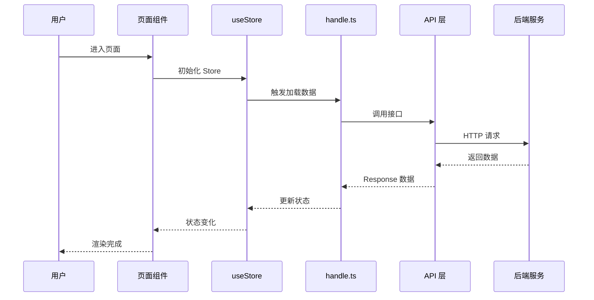
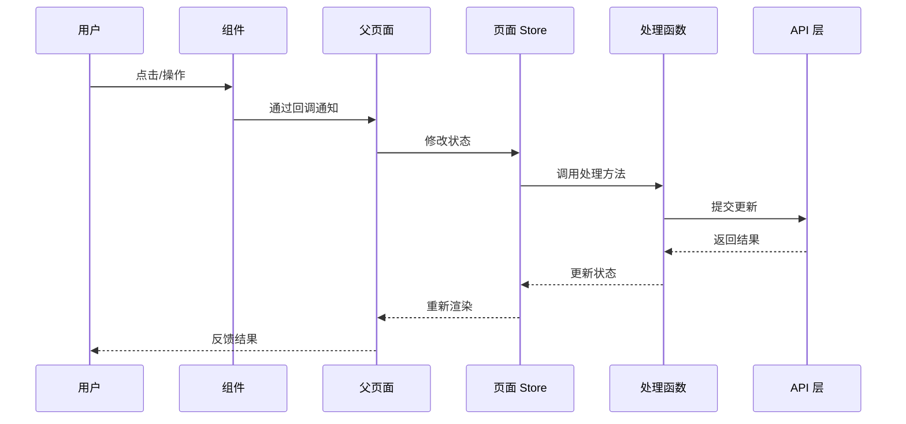

# 前端模块功能介绍文档生成规范

## 触发条件

当用户使用 `/frontend-module-doc [模块路径]` 命令时触发，为指定的前端模块生成完整的设计文档，输出到 `frontend/docs` 目录，用于日后回顾学习设计决策。

## 核心原则

1. **面向未来回顾** → 假设半年后看这份文档，能快速回忆起当时的设计思路和决策理由
2. **必须包含图形** → 生成 mermaid 图例可视化架构和数据流
3. **决策必须可见** → 说明为什么选择这个方案，放弃了其他方案
4. **前端专属** → 专门针对 React 19 + TypeScript + MobX + Ant Design Mobile 前端架构设计
5. **完整覆盖需求** → 必须覆盖：组件结构、状态管理、API 依赖、样式方案、技术选型、移动端交互

---

## 模块类型自动识别

根据路径自动判断模块类型：
- `apps/web/src/pages/**` → **页面级模块** - 完整页面功能
- `apps/web/src/components/**` → **公共组件** - 可复用UI组件

不同类型对应不同的章节结构。

---

## 必选章节（严格按照顺序）

### 1. 文档信息

```markdown
# {模块名称} - {模块类型}设计文档

> 本文档由 Claude Code 自动生成，记录模块设计决策，便于日后回顾学习。

| 文档信息 |  |
|----------|------|
| **生成日期** | YYYY-MM-DD |
| **模块类型** | 页面级模块 / 公共组件 |
| **模块路径** | {模块路径} |
| **项目版本** | {version from package.json} |
| **代码分支** | {current git branch} |
```

---

### 2. 模块概述

#### 模块职责
{一句话描述这个模块解决什么问题}

#### 模块位置
- 所属项目：{项目名称} - 前端 H5
- 类型：{页面级模块 / 公共组件}

#### 依赖关系

**外部依赖**（第三方库）：
- {React 19} - UI 框架
- {MobX} - 状态管理
- {Ant Design Mobile} - 基础组件库
- {其他第三方库} - 用途

**内部依赖**（项目内模块）：
- {API 模块} `apps/web/src/api/xxx` - 用途
- {公共组件} `@/components/xxx` - 用途
- {自定义 Hooks} `@/hooks/xxx` - 用途

**被依赖**：
- {哪些上层模块/路由依赖本模块}

---

### 3. 模块架构设计

必须生成 **mermaid 组件结构图**，根据模块类型使用不同模板。

---

#### 页面级模块模板示例

```mermaid
flowchart TD
    subgraph "页面模块 - {ModuleName}"
        A[PageEntry<br/>index.tsx]:::entry
        S[Store<br/>useStore.ts]:::store
        H[Handler<br/>handle.ts]:::logic
        C[Constants<br/>constant.ts]:::const
        T[Types<br/>types.ts]:::type
        SS[Styles<br/>index.module.scss]:::style
    end

    subgraph "内部子组件"
        SC1[Component1<br/>components/xxx]:::component
        SC2[Component2<br/>components/xxx]:::component
    end

    subgraph "外部依赖"
        API[API Layer<br/>apps/web/src/api/module]:::api
        G[Global Store]:::global
    end

    A --> S
    A --> H
    A --> C
    A --> SC1
    A --> SC2
    H --> API
    S --> API
    S --> G

    classDef entry fill:#fcc,stroke:#333,stroke-width:2px
    classDef store fill:#ccf,stroke:#333,stroke-width:2px
    classDef logic fill:#fcf,stroke:#333,stroke-width:2px
    classDef component fill:#cfc,stroke:#333,stroke-width:2px
    classDef api fill:#ff9,stroke:#333,stroke-width:2px
    classDef global fill:#f9f,stroke:#333,stroke-width:2px
    classDef const fill:#ddd,stroke:#333,stroke-width:2px
    classDef type fill:#ddd,stroke:#333,stroke-width:2px
    classDef style fill:#9cf,stroke:#333,stroke-width:2px
```

---

#### 公共组件模块模板示例

```mermaid
flowchart TD
    subgraph "公共组件 - {ComponentName}"
        C[Component<br/>index.tsx]:::component
        S[Styles<br/>index.module.scss]:::style
    end

    subgraph "Props 输入"
        P[Props<br/>接口定义]:::type
    end

    subgraph "外部依赖"
        A[antd-mobile<br/>基础组件]:::thirdparty
    end

    P --> C
    C --> S
    A --> C

    classDef component fill:#cfc,stroke:#333,stroke-width:2px
    classDef style fill:#9cf,stroke:#333,stroke-width:2px
    classDef type fill:#ddd,stroke:#333,stroke-width:2px
    classDef thirdparty fill:#ff9,stroke:#333,stroke-width:2px
```

**规范要求**：
- 使用 `flowchart TD`
- 不同种类元素用颜色区分（按模板中的类定义）
- 清晰展示组件依赖关系
- 如果有多个子组件，都展示出来

---

### 4. 数据流动流程

必须生成 **mermaid 序列图**，展示核心交互的数据流动过程。

---

#### 页面加载数据模板示例



---

#### 用户交互模板示例



**规范要求**：
- 使用 `sequenceDiagram`
- 参与者按调用顺序排列
- 使用 `alt` 分支处理成功/失败不同情况
- 只展示核心流程，不要太复杂

---

### 5. 技术选型对比

必须用表格对比关键技术选型，说明决策理由。

**模板**：

| 技术方案 | 选型结果 | 优点 | 缺点 | 决策理由 |
|----------|----------|------|------|----------|
| {方案A} | ✅ 选中 | {列举优点} | {列举缺点} | {为什么选中} |
| {方案B} | ❌ 放弃 | {列举优点} | {列举缺点} | {为什么放弃} |
| {方案C} | ❌ 放弃 | {列举优点} | {列举缺点} | {为什么放弃} |

**要求**：
- 常见选型点：CSS Modules vs 全局 CSS、MobX vs Redux vs Context、自定义组件 vs antd-mobile、懒加载 vs 直接加载
- 必须说明**决策理由**，这是文档的核心价值
- 如果模块很小没有选型决策，说明：`本模块较小，无关键技术选型决策`

---

### 6. 具体方案详述

#### 目录结构（按实际情况输出）

**页面级模块**：
```
{模块路径}/
├── index.tsx           # 页面入口（只做渲染和组合）
├── useStore.ts         # 页面局部状态（MobX）
├── handle.ts           # 页面事件处理/业务逻辑
├── constant.ts         # 页面常量定义
├── types.ts            # 类型定义
├── mock.ts             # Mock 数据（可选）
├── index.module.scss  # 页面样式
└── components/         # 页面内部分拆的子组件
    └── XxxComponent/
        ├── index.tsx
        └── index.module.scss
```

**公共组件**：
```
{模块路径}/
├── index.tsx           # 组件源码
├── index.module.scss  # 组件样式
└── README.md           # 组件使用说明（可选）
```

---

#### 核心文件职责

**页面级模块**：

| 文件 | 职责说明 |
|------|----------|
| `index.tsx` | {说明 UI 渲染和组件组合职责} |
| `useStore.ts` | {说明局部状态管理职责} |
| `handle.ts` | {说明业务逻辑和事件处理职责} |
| `constant.ts` | {说明常量定义职责} |
| `types.ts` | {说明类型定义职责} |
| `*.module.scss` | {说明样式方案} |

**公共组件**：

| 文件 | 职责说明 |
|------|----------|
| `index.tsx` | {组件 UI 渲染和交互处理} |
| `index.module.scss` | {组件样式} |

---

#### Props 接口（公共组件必填）

列出组件支持的所有 Props：

| Prop | 类型 | 是否必填 | 默认值 | 说明 |
|------|------|----------|--------|------|
| `xxx` | `string` | 是 | - | 说明用途 |
| `onChange` | `(value: string) => void` | 否 | - | 回调说明 |

---

#### 关键设计决策

逐个说明关键设计决策：

**{决策点名称}**
- 问题：{遇到什么问题/需要做什么选择}
- 决定：{最终选择了什么方案}
- 原因：{为什么做这个决定}

---

### 7. 状态管理设计

本章节**页面级模块必填**，公共组件根据情况填写。

#### 状态分类

| 状态类型 | 状态名称 | 说明 |
|----------|----------|------|
| 页面数据 | {dataList} | {列表数据} |
| 加载状态 | {loading} | {是否正在加载} |
| 交互状态 | {refreshing, loadingMore} | {下拉刷新、上拉加载更多} |
| 表单状态 | {formValues} | {用户输入表单值} |

#### 状态管理方案

- **状态管理方式**：{局部 MobX useLocalObservable / 全局 Store / React useState}
- **为什么选择该方案**：{说明理由}

#### 核心方法

列出修改状态的核心方法：

```typescript
// 方法签名（关键方法）
// 说明用途
```

---

### 8. API 依赖设计

本章节**必填**，只要涉及后端 API 调用就必须填写。

#### 依赖的 API 接口

列出本模块依赖的所有 API 接口：

| API 函数 | 方法 | 接口路径 | 功能 |
|----------|------|----------|------|
| `getArticleList` | GET | `/api/articles` | 获取文章列表 |
| `getArticleDetail` | GET | `/api/articles/:id` | 获取文章详情 |

#### 类型定义

- **请求类型**：列出核心 Request 类型定义
- **响应类型**：列出核心 Response 类型定义
- **数据结构**：说明核心业务实体结构

---

### 9. 样式方案设计

#### 样式方案

- **样式技术**：{SCSS + CSS Modules / 内联样式 / 第三方组件样式}
- **设计稿宽度**：{750px}
- **单位**：{px 自动转 vw}

#### 适配要点

- **移动端适配**：{是否适配安全区域 env(safe-area-inset-bottom)}
- **点击区域**：{可点击元素是否满足 ≥ 44px 最小尺寸要求}
- **响应式考虑**：{是否有特殊响应式处理}

#### 样式组织结构

- 根容器命名：是否符合规范 `.{moduleName}Container`
- 是否拆分多个样式文件
- 是否需要覆盖第三方组件样式

---

### 10. 移动端交互设计

（页面级模块必填，公共组件可选）

#### 交互要点

- **下拉刷新**：{是否支持 / 使用什么组件}
- **上拉加载更多**：{是否支持 / 使用什么组件}
- **懒加载**：{图片/列表是否懒加载}
- **错误处理**：{加载失败、空数据如何处理}
- **点击反馈**：{可点击元素是否添加 `:active` 透明度变化}

---

### 11. 性能优化考虑

- **React 优化**：{是否使用 React.memo / useCallback / useMemo}
- **打包优化**：{是否需要动态导入}
- **渲染优化**：{长列表是否需要虚拟滚动}
- **图片优化**：{是否使用懒加载 / 占位图}

---

### 12. 已知问题和后续优化

#### 已知问题
- {问题 1}
- {问题 2}

#### 后续优化方向
- {优化方向 1}
- {优化方向 2}

---

## Mermaid 颜色约定（前端专属）

| 元素类型 | 颜色值 | 类名 |
|----------|--------|------|
| 页面入口 | `#fcc` | `entry` |
| React 组件 | `#cfc` | `component` |
| MobX Store | `#ccf` | `store` |
| 业务逻辑 | `#fcf` | `logic` |
| API 层 | `#ff9` | `api` |
| 全局 Store | `#f9f` | `global` |
| 常量/类型 | `#ddd` | `const` / `type` |
| 样式文件 | `#9cf` | `style` |
| 第三方依赖 | `#ff9` | `thirdparty` |

---

## Mermaid 语法检查清单

生成 mermaid 图后，必须按照 `.claude/skills/common/mermaid.md` 检查：

- [ ] subgraph 标题包含空格时，必须用双引号包裹 `subgraph "标题文字"`
- [ ] 节点名称不能包含特殊字符 `&()[]|\/{}` 等
- [ ] 每个连接单独一行，不要挤在一起
- [ ] 箭头标签只用英文，不用中文
- [ ] 颜色类定义正确，符合本规范的颜色约定

---

## 输出位置

输出文件必须写入：
```
frontend/docs/{module-name}-{YYYYMMDD}.md
```
- `module-name`: 从模块路径提取最后一级目录名作为模块名
- `YYYYMMDD`: 当前日期，便于版本追溯

如果 `frontend/docs` 目录不存在，需要先创建目录。

---

## 执行流程

1. **解析参数**：获取用户指定的模块路径
2. **自动识别**：根据路径判断模块类型（`apps/web/src/pages/` → 页面，`apps/web/src/components/` → 组件）
3. **确认存在**：检查路径是否存在，是否是前端模块
4. **探索代码**：
   - 读取模块目录结构
   - 读取入口文件、Store、handle、types 等源码
   - 理解模块职责和设计决策
   - 识别 API 依赖情况
   - 识别状态管理方案
   - 识别样式组织结构
5. **提取信息**：
   - 提取技术选型决策点
   - 提取 Props 接口定义（公共组件）
   - 提取 API 接口定义
   - 提取状态定义和核心方法
6. **填充模板**：按照上述章节顺序填充内容
7. **生成 mermaid 图**：按照本规范生成组件结构图和数据流图，检查语法
8. **创建目录**：如果 `frontend/docs` 目录不存在，先创建
9. **写入文件**：输出到 `frontend/docs/{module-name}-YYYYMMDD.md`
10. **反馈结果**：输出生成的文件路径，告知用户完成

---

## 检查清单

生成完成后必须检查：

- [ ] 是否正确识别模块类型（页面/公共组件）？
- [ ] 是否包含了所有必选章节？
- [ ] 是否生成了 mermaid 组件结构图？
- [ ] 是否生成了核心数据流动序列图？
- [ ] mermaid 语法是否通过检查清单？
- [ ] 是否完成了技术选型对比表格？
- [ ] 状态管理章节是否完整（状态分类、方案、核心方法）？
- [ ] API 依赖章节是否完整列出接口？
- [ ] 样式方案章节是否完整？
- [ ] 移动端交互设计是否说明（页面模块）？
- [ ] 性能优化考虑是否说明？
- [ ] 是否排除了数据库、服务器配置等后端无关章节？
- [ ] 输出路径是否正确写入 `frontend/docs/`？
- [ ] 文件名是否符合 `{module-name}-{YYYYMMDD}.md` 格式？
- [ ] 是否说明了每个设计决策的理由？

---

*end*
