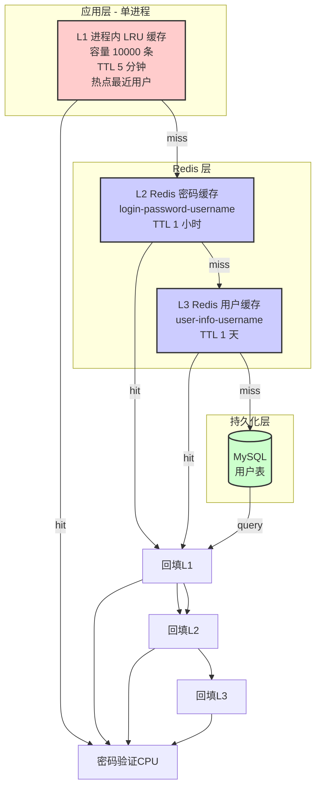
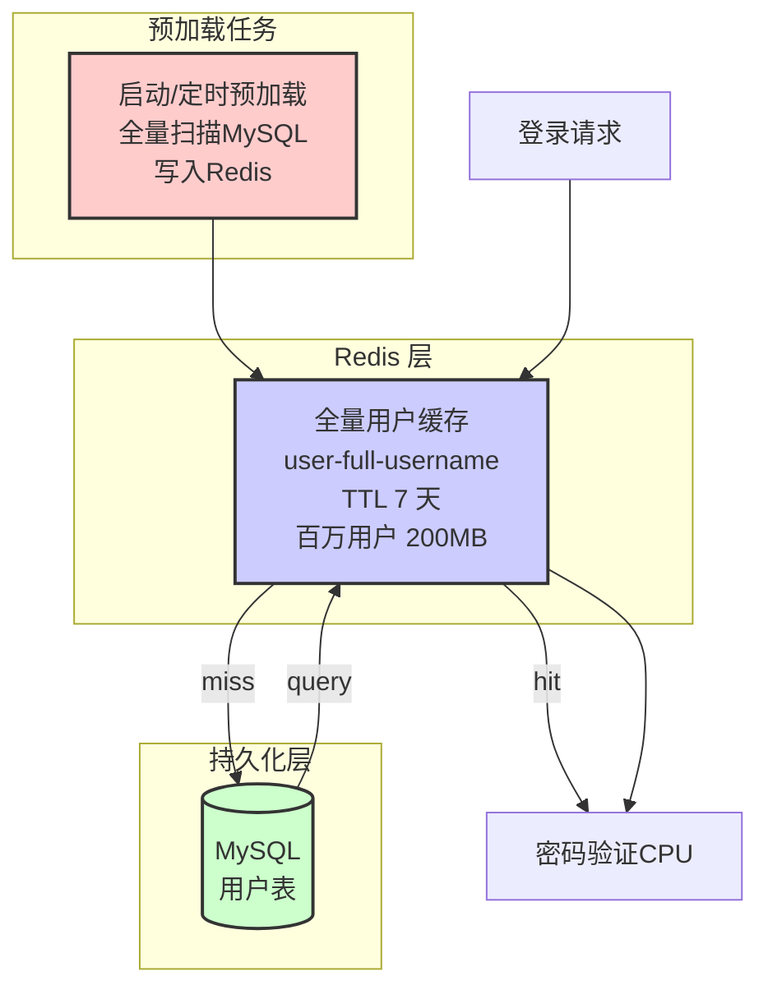
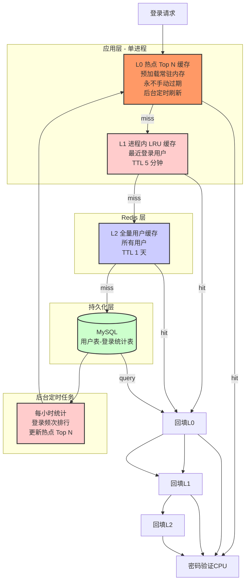
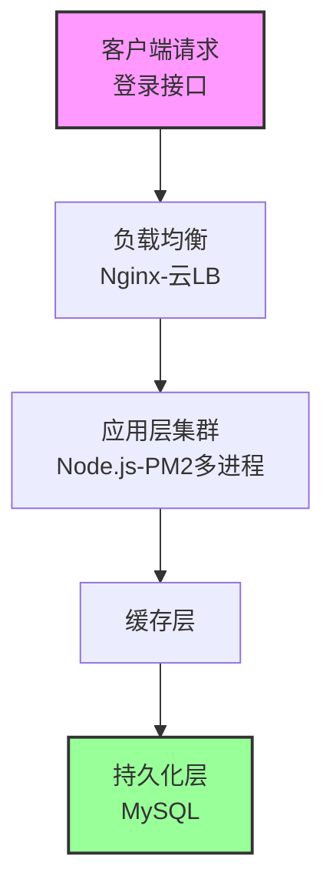
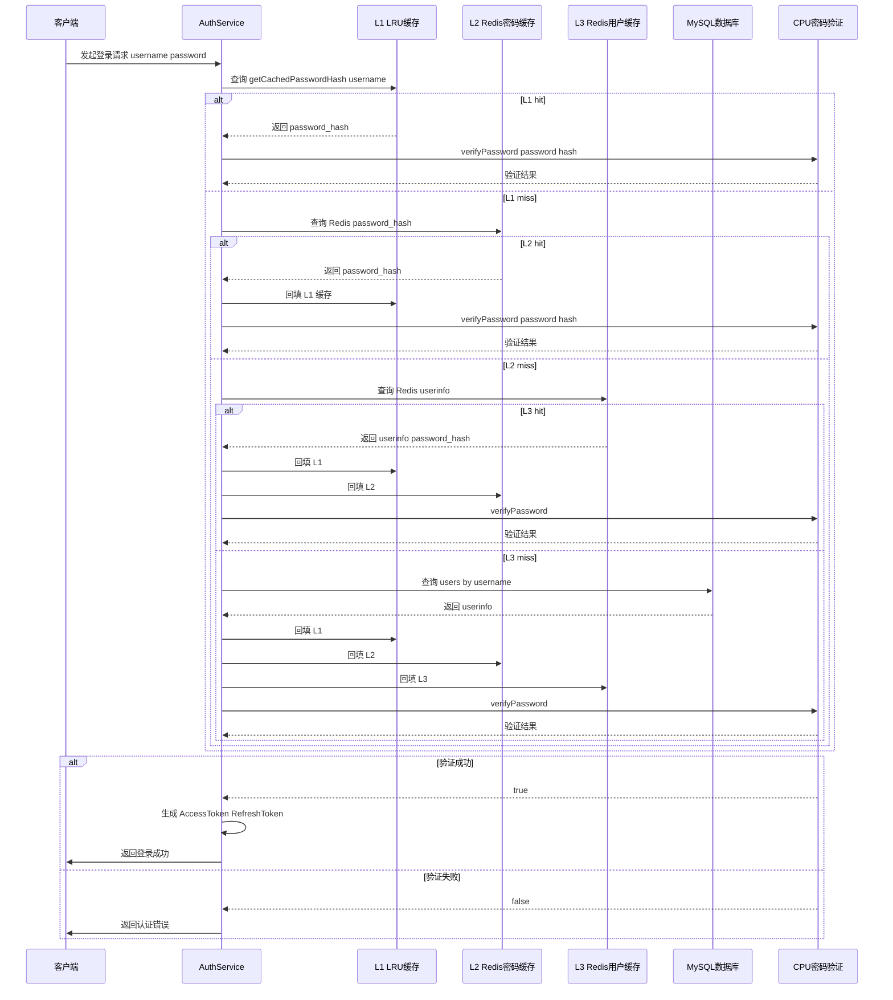

# Mermaid 流程图生成 Skill

## 触发条件
当用户要求生成 mermaid 流程图、架构图、序列图时触发。

## 语法规范（必须严格遵守）

### 1. Subgraph 规则
- **subgraph 名称包含空格必须用双引号包裹**
- 错误：`subgraph 应用层 - 单进程`
- 正确：`subgraph "应用层 - 单进程"`

### 2. 节点文字规则
- 节点文字**不能包含** `{ } ( ) < >` 这些特殊字符
- 遇到需要分隔的地方用 `-` 代替
- 错误：`user:full:{username}`
- 正确：`user-full-username`

### 3. 箭头标签规则
- **箭头标签不能包含中文**，有些解析器会报错
- 使用英文简写：`hit` 表示命中，`miss` 表示未命中，`query` 表示查询
- **箭头必须每个连接单独一行**
- 错误：
  ```
  L1--hit-->回填L1 密码验证CPU
  ```
- 正确：
  ```
  L1--hit-->回填L1
  回填L1-->密码验证CPU
  ```

### 4. 换行规则
- 每个箭头连接单独一行
- 不要在一行放多个连接
- 使用 `<br/>` 或 `\n` 在节点内换行，语法：`节点名[文字<br/>换行]`

### 5. 反引号
- mermaid 代码块整体用三个反引号包裹，**节点内部不要使用反引号**

## 正确示例 - 方案一 缓存优化架构



## 正确示例 - 方案二 纯 Redis 全缓存架构



## 正确示例 - 方案三 分级缓存 热点预计算



## 正确示例 - 整体架构层次



## 正确示例 - 序列图

序列图语法相对宽松，主要遵循：



## 检查清单（生成后必须检查）

- [ ] 所有含空格的 subgraph 都用双引号包裹了吗？
- [ ] 节点文字中没有 `{ } ( )` 这些特殊字符吗？
- [ ] 需要分隔的地方用 `-` 代替了特殊字符吗？
- [ ] 箭头标签只用了英文 hit/miss/query 没有中文吗？
- [ ] 每个箭头连接单独一行，没有一行放多个连接吗？
- [ ] 没有在节点文字内部使用反引号吗？

