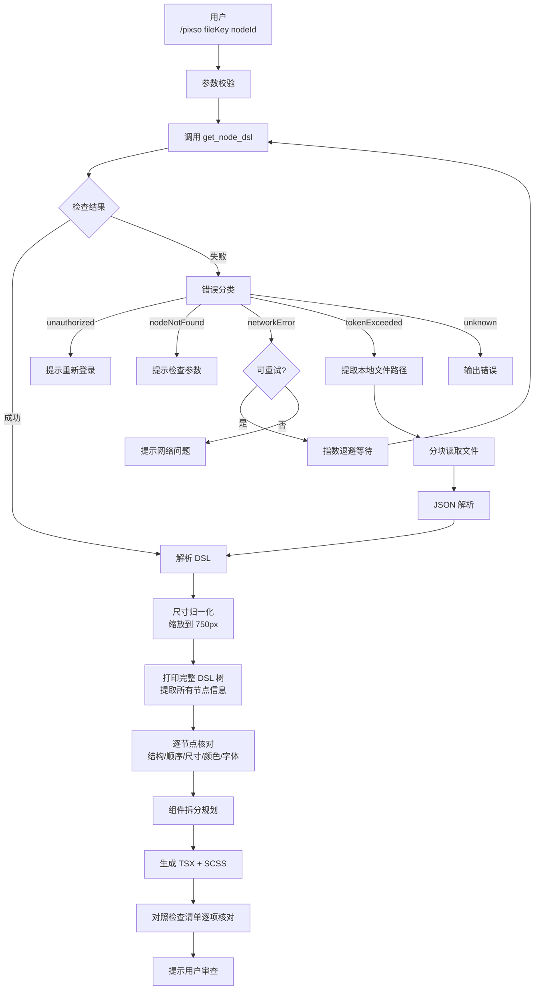

# 完整工作流程

```mermaid
flowchart TD
    U[用户<br/>/pixso fileKey nodeId] --> P[参数校验]
    P --> C[调用 get_node_dsl]
    C --> R{检查结果}
    R -->|成功| D[解析 DSL]
    R -->|失败| E[错误分类]
    E -->|unauthorized| H[提示重新登录]
    E -->|nodeNotFound| I[提示检查参数]
    E -->|networkError| R1{可重试?}
    R1 -->|是| W[指数退避等待] --> C
    R1 -->|否| E1[提示网络问题]
    E -->|tokenExceeded| F[提取本地文件路径]
    F --> G[分块读取文件]
    G --> J[JSON 解析]
    J --> D
    E -->|unknown| O[输出错误]
    D --> S[尺寸归一化<br/>缩放到 750px]
    S --> T[打印完整 DSL 树<br/>提取所有节点信息]
    T --> A[逐节点核对<br/>结构/顺序/尺寸/颜色/字体]
    A --> CMP[组件拆分规划]
    CMP --> CODE[生成 TSX + SCSS]
    CODE --> CHECK[对照检查清单逐项核对]
    CHECK --> END[提示用户审查]
```