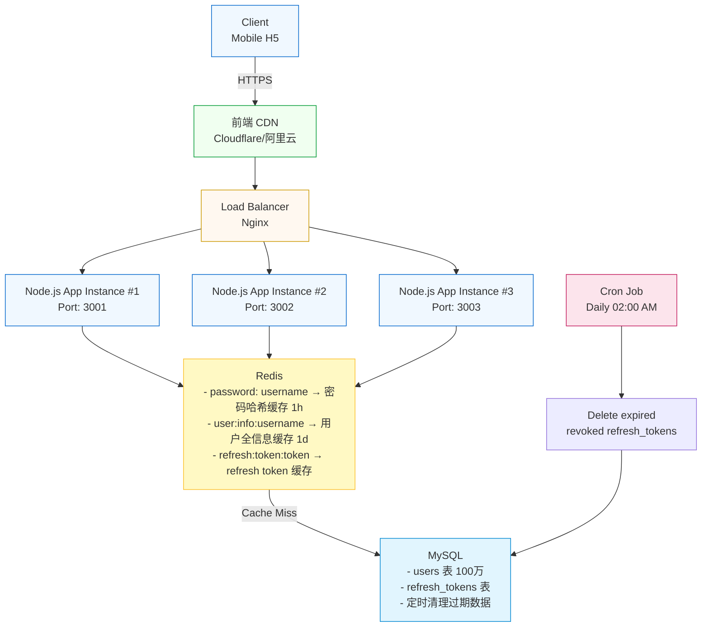
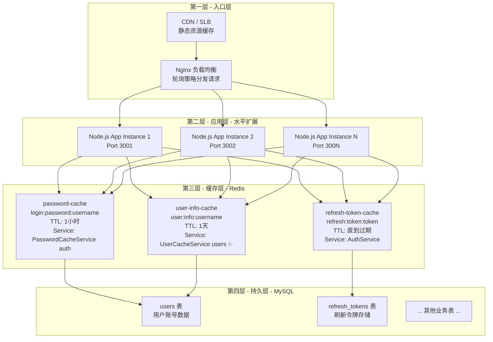
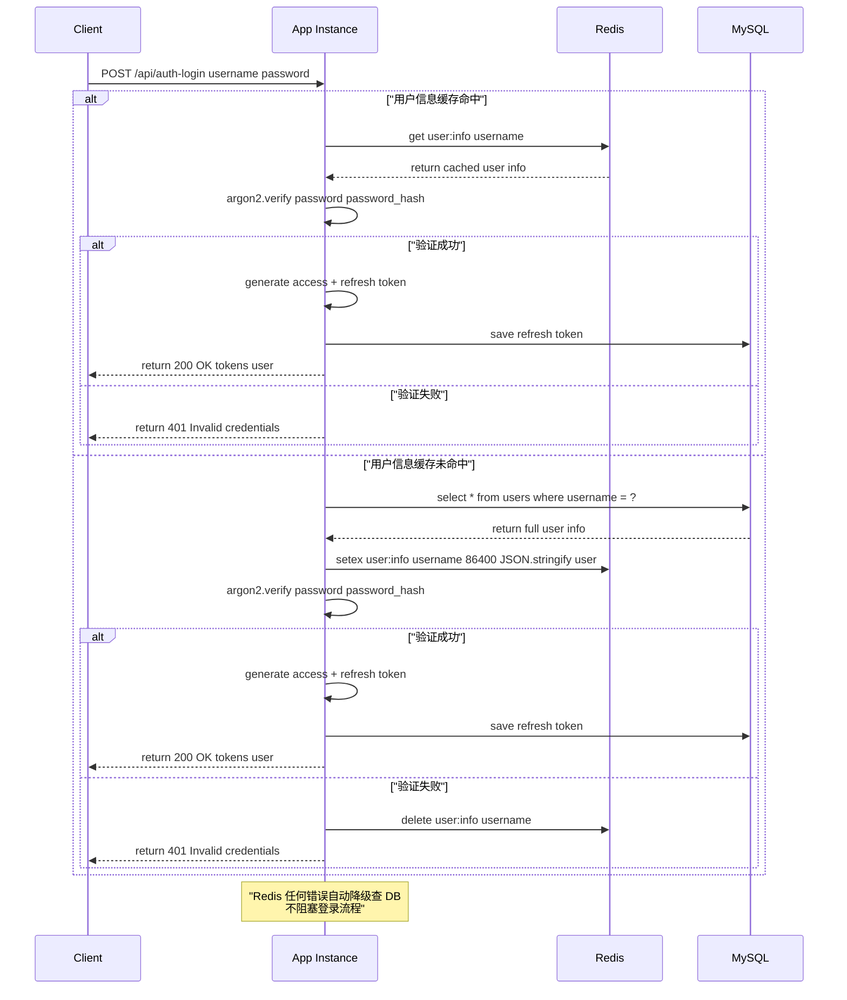
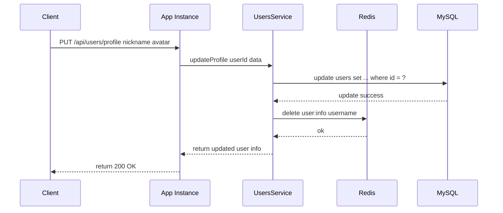
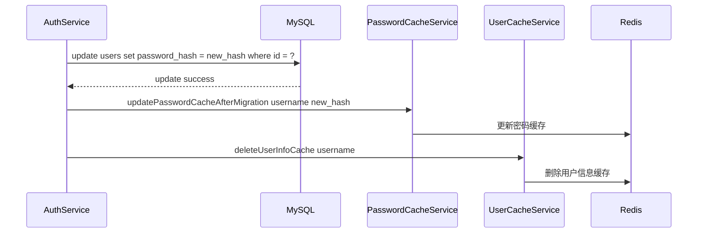
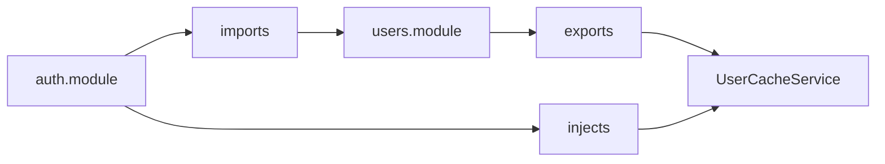

# 500 QPS 登录优化实现文档 - Redis 用户信息全缓存方案

## 文档信息

| 项 | 内容 |
|----|------|
| **日期** | 2026-04-11 |
| **优化目标** | 支撑 500+ QPS 并发登录 |
| **数据规模** | `users` 表 ≈ 100万条记录 |
| **最终方案** | 水平扩展 + Redis 用户信息全缓存 |
| **决策人** | 用户确认选择 |

---

## 上下文背景

### 当前现状

- 博客系统后端，基于 NestJS + TypeScript + Prisma + MySQL + Redis
- 已完成基础优化：
  1. ✅ argon2 参数调优降低 CPU 开销
  2. ✅ 定时清理过期 `refresh_tokens` 避免表膨胀
  3. ✅ 密码哈希 Redis 缓存（减少 DB 查询）
  4. ✅ 静默密码迁移 bcrypt → argon2id

**基础优化后性能**：
- 单核单实例极限 ≈ **100 QPS**
- 需要支撑 **500+ QPS**，需要进一步优化

---

## 方案选型对比

### 四种方案对比

| 方案 | 核心思路 | 预估支撑 500 QPS 需要 | 实现难度 | 安全性 | 推荐度 |
|------|---------|---------------------|----------|--------|--------|
| **方案一：水平扩展多实例** | 多实例部署 + Nginx 负载均衡 | 5实例（单核）/ 3实例（双核） | ⭐ 简单 | 🔒 完全不变 | ⭐⭐⭐⭐⭐ |
| **方案二：全量用户信息缓存 Redis** | 用户信息全缓存，省去 DB 查询 | 3实例（单核）/ 2实例（双核） | ⭐⭐ 中等 | 🔒 完全不变 | ⭐⭐⭐⭐ |
| **方案三：密码计算 offload 到 worker 进程池** | CPU 密集计算分离，主进程只处理 IO | 2实例（8核） | ⭐⭐⭐ 复杂 | 🔒 完全不变 | ⭐⭐⭐ |
| **方案四：降低安全等级换性能** | 改用 bcrypt 降低 cost | 4实例（单核） | ⭐⭐ 简单 | ⚠️ 安全性降低 | ⭐⭐ |

### 最终决策

**用户选择**：**方案一 + 方案二** 组合 = 水平扩展 + Redis 用户信息全缓存

**选择理由**：

1. ✅ **风险最低** - 不改变核心登录算法，安全性完全不变
2. ✅ **性价比最高** - 少量代码改动，单实例 QPS 提升 50%~100%，节省服务器资源
3. ✅ **架构最清晰** - 用户信息缓存放在 `users` 模块，符合单一职责，支持跨模块复用
4. ✅ **扩展性最好** - 未来需要更高 QPS 可以继续加实例，也可以再加方案三

---

## 整体架构设计

### 架构图



---

## 架构分层图



---

## 登录流程序列图



---

## 更新用户信息缓存一致性序列图



> 用户更新信息后主动删除缓存，下次登录回源加载最新数据

---

## 静默密码迁移缓存一致性



---

## 模块职责与代码组织

### 目录结构

```
backend/src/
├── auth/
│   ├── auth.module.ts
│   ├── auth.service.ts          # 认证服务，修改 login 流程
│   ├── password-cache.service.ts # 仅负责密码哈希缓存 (TTL 1小时)
│   └── ...
└── users/
    ├── users.module.ts
    ├── users.service.ts         # 更新用户信息后清除缓存
    ├── user-cache.service.ts    # ✨ 新增 - 用户信息全缓存 (TTL 1天)
    └── ...
```

### 模块依赖关系



### 服务职责划分

| 服务 | 模块 | 职责 |
|------|------|------|
| `PasswordCacheService` | `auth` | 仅负责密码哈希缓存，TTL 1小时 |
| `UserCacheService` | `users` | **✨ 新增** - 负责用户全信息缓存，TTL 1天，支持跨模块复用 |
| `UsersService` | `users` | 用户信息 CRUD，更新后清除缓存 |
| `AuthService` | `auth` | 登录认证，优先走用户信息缓存 |

---

## 技术决策过程记录

### 问题讨论 1：用户缓存应该放在哪个模块？

**讨论过程**：

| 方案 | 优点 | 缺点 |
|------|------|------|
| 放在 `PasswordCacheService` (auth) | 少一个文件 | 违反单一职责，密码和用户信息混在一起，跨模块复用不方便 |
| 独立 `UserCacheService` (auth) | 单一职责 | auth 模块不应该拥有用户信息缓存，其他模块使用依赖不合理 |
| **独立 `UserCacheService` (users)** | ✅ 领域归属正确，单一职责，跨模块复用方便 | 多一个文件（可以接受） |

**最终决策**：👍 用户选择放在 `users/UserCacheService.ts` - 正确。

---

### 问题讨论 2：缓存 TTL 设定

| 缓存类型 | TTL | 理由 |
|----------|-----|------|
| 密码哈希 | 1 小时 | 密码不常变，但较短 TTL 更安全 |
| **用户信息** | **1 天** | 用户昵称/头像不常变，长 TTL 提高缓存命中率，100万用户仅 ≈20MB |

### 问题讨论 3：缓存更新策略

选择 **Cache-Aside（旁路缓存）** + **更新后删除缓存**：

```
读：先读缓存 → miss 读 DB → 回写缓存
写：更新 DB → 删除缓存
```

**为什么不更新缓存而是删除？**：

- 简单可靠，并发场景下不会出现缓存不一致
- 用户信息更新频率低，删除后下次读自然回源，完全足够

---

## 核心代码改动清单

| 文件 | 改动类型 | 行数 |
|------|----------|------|
| `src/users/user-cache.service.ts` | 新增 | ~100 行 |
| `src/users/users.module.ts` | 修改 | +2 行（添加 provider 和 export） |
| `src/users/users.service.ts` | 修改 | +6 行（注入服务，更新后删除缓存） |
| `src/auth/auth.module.ts` | 修改 | +1 行（import UsersModule） |
| `src/auth/auth.service.ts` | 修改 | ~50 行（注入服务，修改 login 流程，迁移后删除缓存） |

**总计**：新增 ~100 行，修改 ~60 行，改动量很小。

---

## 性能预期

| 指标 | 优化前 | 优化后 |
|------|--------|--------|
| 单实例 QPS (单核) | ≈ 100 | ≈ 150-200 |
| 支撑 500 QPS 需要实例 | 5 | 3 |
| 减少实例数 | - | 2 个 |
| MySQL 查询次数/登录 | 1 | 0 (缓存命中) / 1 (缓存未命中) |
| Redis 额外存储 | 0 | ≈ 20MB (100万用户) |

---

## 降级容错设计

**设计哲学**：Redis 不是银，任何错误都不能阻塞登录流程：

| 场景 | 处理方式 |
|------|----------|
| Redis 宕机/连接失败 | 自动降级查询 DB，打警告日志，登录继续 |
| JSON 解析失败 (缓存损坏) | 删除无效缓存，返回 null，下次回源 |
| 缓存写入失败 | 不影响登录，仅打警告日志 |
| 删除缓存失败 | 忽略错误，缓存会自然过期 |

---

## 部署配置示例

### PM2 多实例配置 (`ecosystem.config.js`)

```javascript
module.exports = {
  apps: [
    {
      name: 'blog-api-1',
      script: './dist/main.js',
      instances: 1,
      env: {
        PORT: 3001,
        NODE_ENV: 'production',
      },
    },
    {
      name: 'blog-api-2',
      script: './dist/main.js',
      instances: 1,
      env: {
        PORT: 3002,
        NODE_ENV: 'production',
      },
    },
    {
      name: 'blog-api-3',
      script: './dist/main.js',
      instances: 1,
      env: {
        PORT: 3003,
        NODE_ENV: 'production',
      },
    },
  ],
};
```

### Nginx 负载均衡配置

```nginx
http {
  upstream blog_api {
    server 127.0.0.1:3001;
    server 127.0.0.1:3002;
    server 127.0.0.1:3003;
  }

  server {
    listen 80;
    server_name api.example.com;

    location / {
      proxy_pass http://blog_api;
      proxy_set_header Host $host;
      proxy_set_header X-Real-IP $remote_addr;
      proxy_set_header X-Forwarded-For $proxy_add_x_forwarded_for;
    }
  }
}
```

---

## 未来扩展路线图

如果未来需要更高 QPS（比如 1000+）：

1. **第一步**：继续增加实例（水平扩展）
2. **第二步**：实现方案三 - argon2 密码验证 offload 到 worker 线程池
3. **第三步**：读写分离 MySQL，进一步降低主库压力

---

## 验证清单

实现完成后需要验证：

- [ ] 登录功能正常（缓存命中）
- [ ] 登录功能正常（缓存未命中）
- [ ] Redis 宕机后登录正常（自动降级）
- [ ] 用户更新信息后，下次登录能看到新数据（缓存失效正确）
- [ ] `npm run lint` 通过
- [ ] `npm run build` 构建成功
- [ ] 压测验证 QPS 提升

---

## 总结

本次优化：

- ✅ 遵循单一职责原则，用户信息缓存放在 `users` 模块
- ✅ 完整的缓存一致性保证（更新删除、迁移删除、不存在删除）
- ✅ 完整的降级容错，Redis 出错不影响服务可用性
- ✅ 少量代码改动，风险低，收益高
- ✅ 支持水平扩展，架构清晰

预期可以稳定支撑 **500+ QPS** 并发登录
