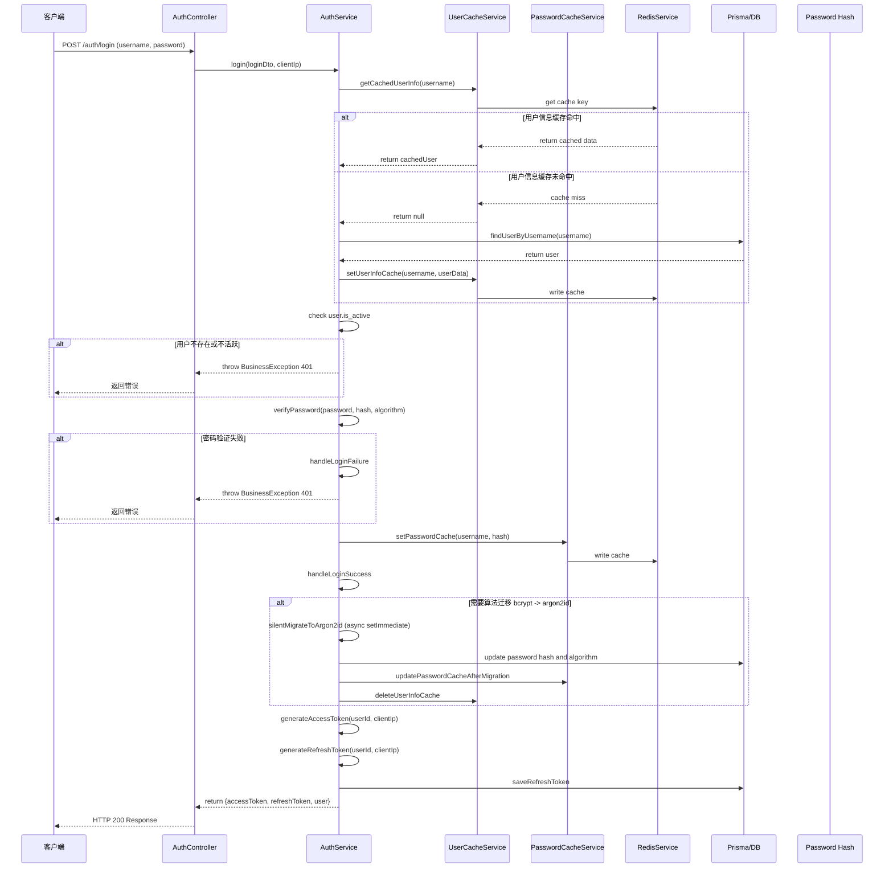

# Auth 认证模块 - Login 登录方法设计文档

> 本文档由 Claude Code 自动生成，记录模块设计决策，便于日后回顾学习。

| 文档信息 |  |
|----------|------|
| **生成日期** | 2026-04-14 |
| **模块路径** | backend/src/auth |
| **焦点方法** | AuthService.login - 用户登录 |
| **项目版本** | 1.0.0 |
| **代码分支** | main |

---

## 一、模块概述

### 模块职责
Auth 认证模块负责用户登录、注册、令牌刷新、登出等用户身份认证相关功能。`login` 方法是核心入口，处理用户凭证验证、令牌生成、缓存优化等核心逻辑。

### 模块位置
- 所属项目：全栈博客项目 - NestJS 后端
- 层级：业务入口层，直接暴露 HTTP 接口

### 依赖关系

**外部依赖**：
- `@nestjs/common` - NestJS 框架基础
- `@nestjs/config` - 配置管理
- `argon2` - 现代密码哈希算法
- `bcrypt` - 兼容旧密码哈希
- `jsonwebtoken` - JWT 令牌生成验证
- `uuid` - UUID 生成

**内部依赖**：
- `PrismaModule` `PrismaService` - 数据库访问
- `RedisModule` `RedisService` - Redis 缓存
- `UsersModule` `UserCacheService` - 用户信息缓存
- `CommonModule` - 通用异常处理、工具函数

---

## 二、模块架构设计

```mermaid
flowchart TD
    subgraph "Controller 层"
        C[AuthController<br/>HTTP 接口层]:::controller
    end

    subgraph "Service 层"
        AS[AuthService<br/>核心业务逻辑]:::service
        PCS[PasswordCacheService<br/>密码缓存]:::service
    end

    subgraph "Repository 层"
        PS[PrismaService<br/>数据访问]:::repository
        RS[RedisService<br/>缓存访问]:::repository
        UCS[UserCacheService<br/>用户缓存]:::repository
    end

    subgraph "持久化层"
        DB[(MySQL<br/>用户表 + 刷新令牌表)]:::database
        REDIS[(Redis<br/>用户信息 + 密码缓存)]:::database
    end

    C --> AS
    AS --> PCS
    AS --> PS
    AS --> RS
    AS --> UCS
    PCS --> RS
    UCS --> RS
    PS --> DB
    RS --> REDIS

    classDef controller fill:#fcc,stroke:#333,stroke-width:2px
    classDef service fill:#cfc,stroke:#333,stroke-width:2px
    classDef repository fill:#ccf,stroke:#333,stroke-width:2px
    classDef database fill:#f9f,stroke:#333,stroke-width:2px
```



---

## 三、核心登录流程



---

## 四、技术选型对比

| 技术方案 | 选型结果 | 优点 | 缺点 | 决策理由 |
|----------|----------|------|------|----------|
| Argon2id | ✅ 选中 | 现代算法，抗GPU破解，安全强度高 | 计算较慢，CPU占用较高 | 默认新用户使用 argon2id，提供最高安全性 |
| bcrypt | ✅ 兼容保留 | 计算比 argon2 快，生态成熟 | 安全强度低于 argon2id | 支持老用户平滑迁移，不强制重置密码 |
| 双缓存架构<br/>(用户信息 + 密码) | ✅ 选中 | 减少数据库查询，提升登录QPS | 需要额外缓存维护，增加复杂度 | 登录是热点入口，性能优化收益大于复杂度 |
| 静默迁移 | ✅ 选中 | 用户无感知，不阻塞登录响应 | 异步执行可能失败，需要重试 | 提供平滑升级，不影响用户体验 |
| JWT 存储刷新令牌到DB | ✅ 选中 | 可以主动撤销令牌，支持登出 | 需要数据库存储，验证需要查询 | 安全性高于纯JWT无存储方案，支持登出功能 |
| Redis 缓存刷新令牌 | ✅ 选中 | 加速验证，减少DB查询 | 缓存可能不一致，需要降级处理 | 保持性能，Redis 出错自动降级到DB查询 |

---

## 五、具体方案详述

### 5.1 目录结构

```
backend/src/auth/
├── auth.module.ts         # 模块定义
├── auth.controller.ts     # HTTP 接口控制器
├── auth.service.ts        # 核心业务服务（含 login 方法）
├── password-cache.service.ts  # 密码缓存服务
└── dto/                   # 数据传输对象
    ├── login.dto.ts           # 登录请求
    ├── login-response.dto.ts  # 登录响应
    ├── register.dto.ts        # 注册请求
    ├── refresh.dto.ts         # 刷新令牌请求
    └── ...
```

### 5.2 核心组件职责

| 组件 | 职责说明 |
|------|----------|
| `AuthModule` | 模块定义，声明依赖导入和提供者 |
| `AuthController` | 处理 HTTP 请求，参数绑定，调用 `AuthService.login` |
| `AuthService` | 核心业务逻辑：缓存查询 → 用户验证 → 密码验证 → 令牌生成 → 保存刷新令牌 |
| `PasswordCacheService` | 专注密码哈希缓存，减少数据库查询 |
| `UserCacheService` | 用户基础信息缓存 |
| `LoginDto` | 登录请求参数校验：用户名长度 2-20，密码长度 6-20 |

### 5.3 login 方法核心逻辑

**输入**：
```typescript
interface LoginDto {
  username: string;  // 用户名（手机号）
  password: string;  // 明文密码
}
```

**输出**：
```typescript
interface LoginResponseDto {
  accessToken: string;    // JWT 访问令牌
  refreshToken: string;   // JWT 刷新令牌
  expiresIn: number;      // 过期时间（秒）
  user: UserDto;          // 用户基础信息
}
```

### 5.4 关键设计决策

**1. 双缓存设计 - 用户信息缓存 + 密码缓存**
- 问题：登录是高频操作，每次都查数据库会成为瓶颈
- 决定：分层缓存，用户信息缓存 + 密码哈希缓存，都缓存到 Redis
- 原因：
  - 用户名是唯一索引，查询本身很快，但缓存能进一步提升 QPS
  - 密码哈希验证计算本身较慢，如果能命中缓存省去数据库IO，收益明显
  - 两级缓存都有降级，Redis 出错自动降级到数据库，不影响可用性

**2. 静默密码算法迁移 bcrypt → argon2id**
- 问题：项目初期使用 bcrypt，后来升级到 argon2id，如何平滑迁移？
- 决定：用户登录成功后异步检测，如果还是 bcrypt 就静默升级为 argon2id
- 原因：
  - 用户无感知，不需要提示用户修改密码
  - 不阻塞登录响应，异步执行不影响用户体验
  - 迁移失败只记日志不影响本次登录，下次登录再试
  - 可通过环境变量开关关闭迁移

**3. JWT 刷新令牌数据库存储**
- 问题：纯 JWT 无存储无法实现主动登出，令牌吊销不方便
- 决定：刷新令牌存储到数据库，验证时检查是否有效
- 原因：
  - 支持用户主动登出（删除所有令牌）
  - 支持管理员强制下线用户
  - 访问令牌短有效期（2小时），即使泄露也很快过期
  - 刷新令牌验证使用缓存（Redis）加速，不影响性能

---

## 六、数据库设计与性能讲解

### 6.1 涉及表

- `users` - 用户主表，存储用户基本信息、密码哈希、算法版本
- `refreshTokens` - 刷新令牌表，存储每个设备的刷新令牌

### 6.2 索引设计

| 表名 | 索引字段 | 索引类型 | 用途 |
|------|----------|----------|------|
| `users` | `username` | 唯一索引 | 通过用户名快速查找用户 |
| `refreshTokens` | `refresh_token` | 唯一索引 | 通过令牌快速查找验证 |
| `refreshTokens` | `user_id` | 普通索引 | 删除用户所有令牌时按用户查询 |

### 6.3 性能优化方案

1. **双层 Redis 缓存**：用户信息缓存 + 密码哈希缓存，命中时完全跳过数据库查询
2. **缓存降级**：Redis 出错自动降级到数据库查询，保证可用性
3. **异步迁移**：密码算法迁移异步执行，不阻塞登录响应
4. **刷新令牌缓存**：刷新令牌验证也走 Redis 缓存，减少数据库查询

### 6.4 N+1 查询防范

登录流程是单次查询，不存在 N+1 问题。用户信息单次查询，刷新令牌单次插入。

### 6.5 容量预估

- **预估用户量**：10万 用户
- **预估登录 QPS**：峰值 500 QPS
- **缓存命中率**：预计 80%+ 命中，实际数据库查询降低到 ~100 QPS
- **瓶颈预期**：密码哈希计算是 CPU 密集型，如果并发过高可能成为瓶颈，可以考虑把密码验证放到应用层是正确设计

---

## 七、分布式架构服务器配置

| 服务角色 | CPU 核数 | 内存 | 数量 | 端口 | 备注 |
|----------|---------|------|------|------|------|
| 应用实例 | 2C | 4GB | 2+ | 3000 | 密码哈希计算密集，可水平扩展 |
| Redis | 2C | 4GB | 1 | 6379 | 缓存数据量小，不需要太大内存 |
| MySQL | 4C | 8GB | 1主 | 3306 | 用户表和刷新令牌表数据量不大 |

---

## 八、API 接口概览

| 方法 | 路径 | 功能 | 权限 |
|------|------|------|------|
| POST | `/auth/login` | 用户登录 | 公开 |
| POST | `/auth/register` | 用户注册 | 公开 |
| POST | `/auth/refresh` | 刷新访问令牌 | 公开 |
| POST | `/auth/logout` | 用户登出 | 需要认证 |

**登录接口**：
- 请求体：`{ username: string, password: string }`
- 成功响应：`{ accessToken, refreshToken, expiresIn, user }`
- 失败响应：401 用户名或密码错误，403 用户被禁用

---

## 九、测试策略

- **单元测试**：需要覆盖 `AuthService.login` 主要路径：
  - 缓存命中登录成功
  - 缓存未命中登录成功
  - 用户不存在失败
  - 密码错误失败
  - 用户禁用失败
- **集成测试**：需要测试完整登录流程从 HTTP 入口到数据库
- **测试命令**：`npm test -- auth`

---

## 十、已知问题和后续优化

### 已知问题
- 登录失败计数和账户锁定功能尚未实现（数据库表缺少字段）
- 验证码功能尚未集成

### 后续优化方向
- 增加图形验证码防止暴力破解
- 实现登录失败计数和自动锁定
- 支持短信验证码登录
- 支持第三方登录（微信/Google）

---

*文档结束*
