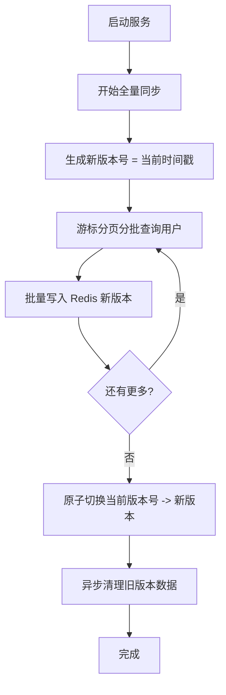
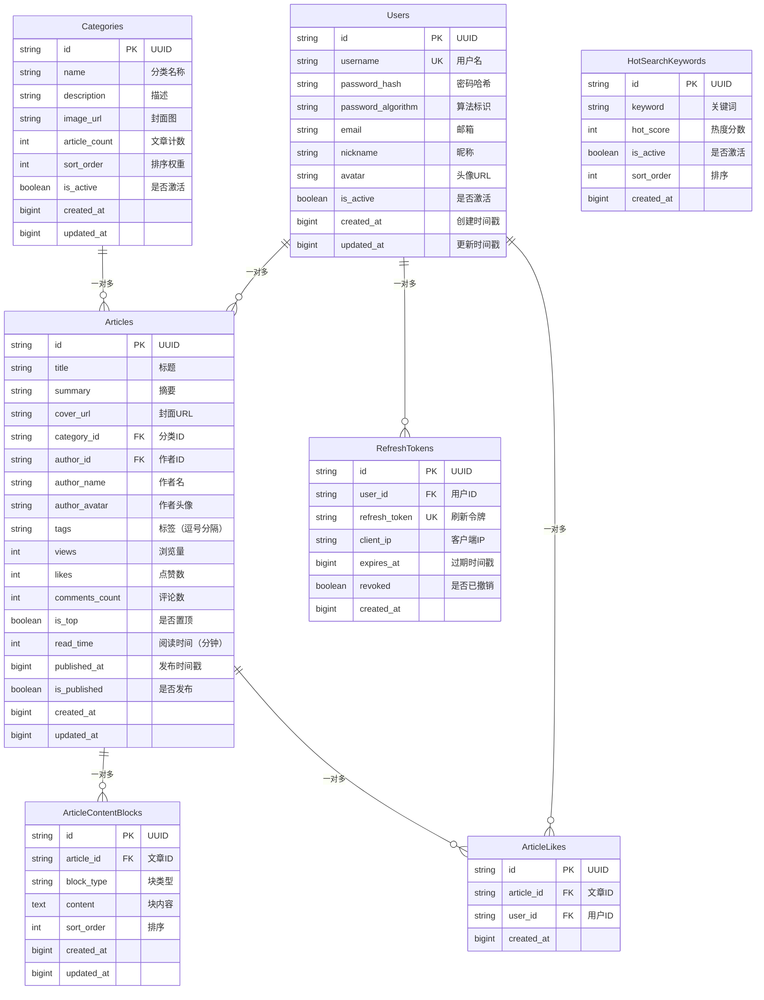
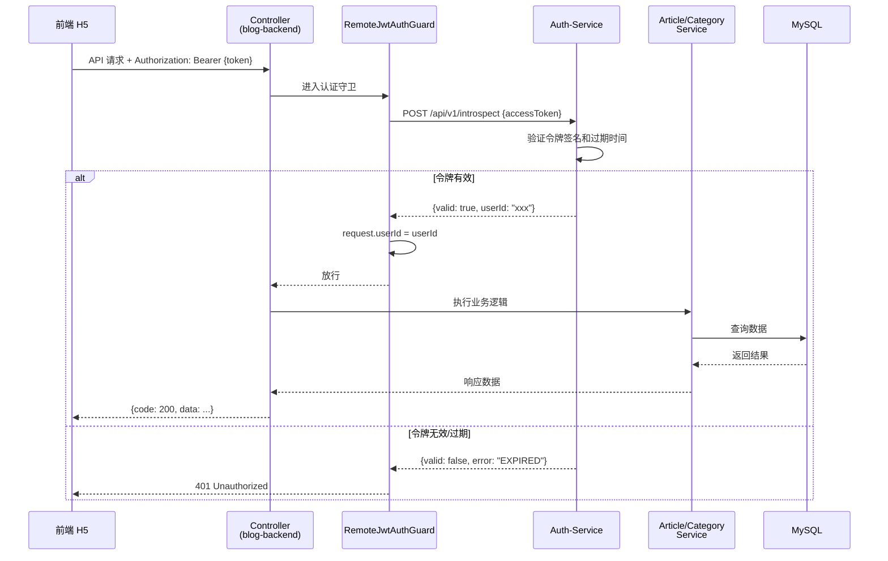

# 后端 NestJS 博客 API 服务 - 架构与模块说明

> 生成日期：2026-04-17
> 项目版本：1.0.0

---

## 1. 项目整体概述

### 1.1 项目背景

这是一个全栈个人博客项目的后端 API 服务，为前端移动端 H5 应用提供数据接口支持。项目采用了现代化的 NestJS 架构设计，完成了**认证服务分离**重构，将认证逻辑独立部署到单独的 `auth-service` 服务，本项目专注于博客业务功能（文章、分类、用户信息管理）。

### 1.2 技术栈版本

| 技术 | 版本 | 用途 |
|------|------|------|
| **NestJS** | 11.0.1 | Web 框架 |
| **TypeScript** | 5.7.3 | 编程语言 |
| **Prisma ORM** | 6.5.0 | 数据库 ORM |
| **MySQL** | - | 主数据库 |
| **Redis** | 5.10.1 (ioredis) | 缓存存储 |
| **Swagger** | 11.2.6 | API 文档自动生成 |
| **class-validator** | 0.14.4 | 请求参数验证 |

### 1.3 架构设计理念

- **模块化设计**：按业务领域划分模块，单一职责，高内聚低耦合
- **分层清晰**：Controller 处理 HTTP，Service 处理业务，ORM 处理数据访问
- **类型安全**：全程 TypeScript 严格模式，充分利用 Prisma 自动生成类型
- **可观测性**：慢查询监控、请求日志、结构化 JSON 日志
- **高可用**：连接重试、指数退避、健康检查
- **认证分离**：认证逻辑独立部署，业务服务专注业务

---

## 2. 整体架构

### 2.1 模块依赖关系架构图

```mermaid
C4Container
    title 后端博客服务 - 模块依赖架构

    Person(frontend) "前端 H5 应用"
    System_Boundary(backend) "后端 NestJS 服务" {
        Container(article) "article\n文章模块" "NestJS Module"
        Container(category) "category\n分类模块" "NestJS Module"
        Container(users) "users\n用户模块" "NestJS Module"
        Container(auth) "auth\n认证模块" "NestJS Module"
        Container(common) "common\n公共基础设施" "NestJS Module"
        Container(prisma) "prisma\nORM 模块" "NestJS Module"
        Container(redis) "redis\n缓存模块" "NestJS Module"
        Container(shared) "shared\n共享组件" "NestJS Module"
        Container(cleanup) "cleanup\n定时清理" "NestJS Module"
    }

    System_Boundary(external) "外部依赖" {
        SystemDb(mysql) "MySQL\n数据库"
        SystemDb(redisServer) "Redis\n缓存"
        System(authService) "auth-service\n独立认证服务"
    }

    Relation(frontend) --> auth "HTTP 请求"
    Relation(frontend) --> article "HTTP 请求"
    Relation(frontend) --> category "HTTP 请求"
    Relation(frontend) --> users "HTTP 请求"

    auth --> shared "使用"
    auth --> authService "转发请求"
    article --> shared "使用认证"
    article --> prisma "使用"
    category --> prisma "使用"
    users --> prisma "使用"
    users --> redis "使用"
    shared --> redis "使用"
    article --> common "异常处理"
    prisma --> mysql "查询"
    redis --> redisServer "缓存读写"
    cleanup --> prisma "定时清理"
```

### 2.2 分层架构说明

```
┌─────────────────────────────────────────────────────────┐
│                    前端 H5 应用                            │
└────────────────┬────────────────────────────────────────────┘
                 │ HTTP 请求
┌────────────────▼────────────────────────────────────────────┐
│                   Controller 层 (控制器)                      │
│  - 路由定义、参数验证、Swagger 文档                          │
│  - 提取请求参数，调用 Service 层                              │
└────────────────┬────────────────────────────────────────────┘
                 │
┌────────────────▼────────────────────────────────────────────┐
│                     Service 层 (业务逻辑)                     │
│  - 实现具体业务功能                                          │
│  - 事务处理、业务规则判断                                      │
└────────────────┬────────────────────────────────────────────┘
                 │
┌────────────────▼────────────────────────────────────────────┐
│                     Prisma ORM 层                            │
│  - 类型安全的数据库访问                                       │
│  - 自动生成 SQL                                              │
└────────────────┬────────────────────────────────────────────┘
                 │
┌────────────────▼────────────────────────────────────────────┐
│                     MySQL 数据库                              │
└──────────────────────────────────────────────────────────────┘
```

---

## 3. 业务模块详细说明

### 3.1 article - 文章模块

**职责**：文章 CRUD、列表查询、详情获取、点赞功能管理

**主要文件**：
- `article.controller.ts` - 控制器（9 个 API 接口）
- `article.service.ts` - 业务逻辑实现
- `dto/` - 数据传输对象定义
- `utils/` - 文章内容块转换工具

**API 接口清单**：

| 方法 | 路径 | 认证 | 功能说明 |
|------|------|------|----------|
| GET | `/article/list` | - | 分页查询文章列表（支持分类筛选、关键词搜索、多种排序） |
| GET | `/article/featured` | - | 获取置顶特色文章（轮播用，最多 5 篇） |
| POST | `/article/toggle-like` | 需要 | 切换文章点赞状态（点赞/取消点赞） |
| GET | `/article/my-likes` | 需要 | 获取当前用户点赞列表（分页） |
| GET | `/article/check-like` | 需要 | 检查当前用户是否已点赞某篇文章 |
| GET | `/article/detail` | - | 获取文章详情（含内容块） |
| POST | `/article/user-likes` | - | 根据用户ID查询该用户点赞的所有文章ID列表 |
| POST | `/article/list-by-user` | - | 根据用户ID分页查询该用户发布的文章 |

**设计决策说明**：

1. **文章内容分块存储**：
   - 使用 `ArticleContentBlocks` 表存储文章内容，每块对应编辑器的一个内容块
   - 支持多种块类型（文本、图片、标题等）
   - 方便后续扩展富文本编辑功能

2. **阅读量异步递增**：
   - 获取文章详情后，异步执行 `views + 1` 原子操作
   - 不等待数据库写入完成，提升接口响应速度
   - 使用原子操作保证计数正确

3. **点赞事务保护**：
   - 点赞/取消点赞使用事务保证数据一致性
   - 添加/删除点赞记录同时更新文章表 `likes` 冗余计数
   - 唯一约束 `(article_id, user_id)` 防止重复点赞

4. **多种排序方式**：
   - 支持按发布时间、浏览量、点赞数三种排序
   - 默认按发布时间倒序

5. **并行查询优化**：
   - 列表查询同时执行数据查询和计数查询（`Promise.all`）
   - 减少 overall 响应时间

---

### 3.2 category - 分类模块

**职责**：文章分类管理、热门搜索关键词提供

**主要文件**：
- `category.controller.ts` - 控制器（2 个 API）
- `category.service.ts` - 业务逻辑
- `dto/` - 数据传输对象

**API 接口清单**：

| 方法 | 路径 | 认证 | 功能说明 |
|------|------|------|----------|
| GET | `/category/list` | - | 获取全部分类列表（只返回激活状态） |
| GET | `/category/hot-keywords` | - | 获取热门搜索关键词列表 |

**设计决策说明**：
- 只查询 `is_active = true` 的分类，支持后台软删除
- 按 `sort_order` 降序排序，支持自定义排序权重
- 查询只选择需要的字段，优化查询性能

---

### 3.3 users - 用户模块

**职责**：用户信息查询、资料更新、用户数据同步到 Redis

**主要文件**：
- `users.controller.ts` - 控制器（2 个 API）
- `users.service.ts` - 用户信息业务逻辑
- `user-sync.service.ts` - 用户全量同步 Redis 服务
- `dto/` - 数据传输对象

**API 接口清单**：

| 方法 | 路径 | 认证 | 功能说明 |
|------|------|------|----------|
| GET | `/user/info` | 需要 | 获取当前登录用户信息 |
| PUT | `/user/info` | 需要 | 更新当前用户资料（昵称、头像、简介） |

**设计决策说明**：

#### 用户信息缓存同步设计

用户信息全量预加载到 Redis，供认证服务快速查询：

1. **版本化原子切换**：
   - 同步新版本时不删除旧版本
   - 所有数据写入完成后才原子切换当前版本号
   - 同步过程中服务始终可用，不中断认证服务

2. **分批加载**：
   - 使用游标分页每次加载 1000 个用户
   - 避免一次性查询所有用户阻塞数据库
   - 使用 Redis pipeline 批量写入，提升网络效率

3. **异步清理**：
   - 切换完成后异步清理旧版本数据
   - 使用 SCAN 分批删除，避免一次性删除阻塞 Redis
   - 删除过程中短暂休息给其他请求让路

4. **写穿透策略**：
   - 用户信息更新后，自动从 Redis 删除旧数据并同步新数据
   - 保证缓存和数据库一致性

**同步流程图**：



---

### 3.4 auth - 认证模块

**职责**：认证接口代理转发到独立认证服务（认证服务分离架构）

**主要文件**：
- `auth.controller.ts` - 控制器（4 个 API）
- `dto/` - 请求响应 DTO

**API 接口清单**：

| 方法 | 路径 | 认证 | 功能说明 |
|------|------|------|----------|
| POST | `/auth/login` | - | 用户登录 |
| POST | `/auth/register` | - | 用户注册 |
| POST | `/auth/refresh` | - | 刷新访问令牌 |
| POST | `/auth/logout` | 需要 | 用户登出 |

**架构背景：认证服务分离**

项目已完成**认证服务分离**重构：

- **过去**：认证逻辑（登录、注册、令牌签发）和业务逻辑在同一个服务
- **现在**：认证逻辑迁移到独立的 `auth-service` 服务独立部署
- **当前模块角色**：仅作为代理，将所有认证请求转发给 `auth-service`
- **开关控制**：环境变量 `REMOTE_AUTH_ENABLE` 控制，默认为 `true`（远程模式）

**优势**：
- 认证服务可以独立扩容，应对登录高峰期更高并发
- 认证逻辑可以独立升级，不影响业务 API 服务
- 可以被多个业务服务共享认证能力

---

## 4. 基础设施模块详细说明

### 4.1 prisma - 数据库 ORM 模块

**职责**：数据库连接管理、慢查询监控、连接重试、健康检查

**主要功能**：

1. **带重试连接策略**：
   - 连接失败自动重试，最多 5 次
   - 指数退避：每次重试间隔翻倍（1s → 2s → 4s...）
   - 避免惊群效应，提升启动稳定性

2. **慢查询监控**：
   - 阈值：超过 1000ms 的查询判定为慢查询
   - 自动记录警告日志，包含查询语句和耗时
   - 帮助开发及时定位性能问题

3. **连接池日志**：
   - 解析 `DATABASE_URL` 中的连接池配置
   - 启动时记录连接池参数（connection_limit、pool_timeout 等）
   - 方便运维排查连接池配置问题

4. **结构化日志**：
   - 所有事件（查询、错误、警告）都输出 JSON 格式日志
   - 方便后续日志分析系统采集和检索

5. **健康检查**：
   - 提供 `isConnected()` 方法检测数据库连接
   - 可供 k8s 就绪探针调用

**设计要点**：
- 继承 `PrismaClient`，扩展其功能
- 遵循 NestJS 生命周期，启动时连接，关闭时断开
- 所有异常都记录日志，便于问题排查

---

### 4.2 redis - Redis 缓存模块

**职责**：Redis 连接管理、操作日志、连接重试、安全检查、健康检查

**主要功能**：

1. **带重试连接策略**：同 Prisma 模块，指数退避最多 5 次重试

2. **安全检查**：
   - 生产环境检查是否配置了密码
   - 如果未配置密码输出警告日志

3. **操作日志**：
   - 重写 `get`/`set`/`del` 方法
   - 每次操作都记录日志（操作类型、Key）
   - 方便问题追踪

4. **健康检查**：
   - 提供 `isConnected()` 方法通过 PING 检测连接

**设计要点**：
- 继承 `ioredis` Redis 客户端，扩展日志和重试
- 遵循 NestJS 生命周期管理连接

---

### 4.3 common - 公共基础设施模块

**职责**：全局异常过滤器、响应拦截器、中间件、装饰器、工具函数

**主要组件**：

| 组件 | 功能 |
|------|------|
| `AllExceptionsFilter` | 全局捕获所有异常，统一格式化错误响应 |
| `BusinessExceptionFilter` | 业务异常特定处理，返回业务错误码 |
| `PrismaExceptionFilter` | Prisma 异常转换，处理常见数据库错误 |
| `TransformInterceptor` | 统一响应格式封装，所有接口返回格式一致 |
| `CorsMiddleware` | CORS 跨域处理，支持任意来源（开发环境） |
| `RequestLogMiddleware` | 请求日志记录，记录方法、路径、状态码、处理时间 |
| `CurrentUserId` | 自定义装饰器，从 request 提取当前用户ID |

**设计原则**：全局注册，所有路由统一处理

---

### 4.4 shared - 共享组件模块

**职责**：远程认证相关共享组件，供各业务模块使用

**主要组件**：

#### `RemoteJwtAuthGuard` - JWT 认证守卫（远程模式）

工作流程：
1. 从 `Authorization` 请求头提取 `Bearer <token>`
2. 调用 `auth-service` 的 `/introspect` 端点验证令牌
3. 验证通过：将 `userId` 挂载到 `request.userId`，放行请求
4. 验证失败：抛出 401 Unauthorized 异常，携带错误码

#### `AuthClientService` - 认证服务 HTTP 客户端

- `introspect(accessToken)` - 验证令牌合法性，返回 `{valid, userId, error}`
- `forwardRequest(path, body)` - 通用请求转发，用于登录/注册/刷新/登出
- `healthCheck()` - 健康检查，验证认证服务是否可用

#### `RemoteJwtParseMiddleware` - JWT 解析中间件
- 对所有请求解析令牌（如果有）
- 不拦截请求，只挂载用户信息供后续使用

---

### 4.5 cleanup - 定时清理模块

**职责**：定期清理数据库过期数据，保持数据库体积稳定

**主要任务**：

| 任务 | 调度时间 | 清理条件 |
|------|----------|----------|
| `cleanupExpiredRefreshTokens` | 每天凌晨 2 点 | `expires_at < 当前时间 AND revoked = true` |

**设计选择**：
- 选择凌晨 2 点执行：访问量最低，对业务影响最小
- 使用 NestJS `@Schedule` 装饰器声明定时任务

---

## 5. 数据库模型设计分析

### 5.1 模型关系图



### 5.2 各表说明

| 表名 | 用途 | 主要索引 |
|-----|------|---------|
| **Users** | 用户账户信息 | 唯一约束 `uk_username(username)`，索引 `idx_is_active(is_active)` |
| **Categories** | 文章分类 | 无额外索引（数据量小） |
| **Articles** | 文章主表 | `idx_author_id(author_id)`, `idx_category_id(category_id)`, `idx_is_published(is_published)`, `idx_is_top(is_top)`, `idx_published_at(published_at)` |
| **ArticleContentBlocks** | 文章内容块 | `idx_article_id(article_id)`, `idx_sort_order(article_id, sort_order)` |
| **ArticleLikes** | 文章点赞记录 | 唯一约束 `uk_article_user(article_id, user_id)`, `idx_user_id(user_id)` |
| **RefreshTokens** | 刷新令牌 | 唯一约束 `uk_refresh_token(refresh_token)`, `idx_expires_at(expires_at)`, `idx_user_id(user_id)` |
| **HotSearchKeywords** | 热门搜索关键词 | `idx_hot_score(hot_score)`, `idx_is_active(is_active)`, `idx_sort_order(sort_order)` |

### 5.3 设计要点分析

#### 1. 主键设计：全部使用 UUID

- **优点**：分布式生成ID，不暴露自增ID序列，安全性较好
- **代价**：占用更多存储空间，索引性能略低于整数自增
- **取舍**：博客项目数据量不大，可接受这点性能损失，换取安全性和分布式便利性

#### 2. 时间戳设计：使用 BigInt 存储毫秒时间戳

- **优点**：跨语言兼容，不需要考虑时区转换问题
- **应用层**：转换为 ISO 字符串返回给前端

#### 3. 文章内容分块设计

- 将文章内容从 `Articles` 主表拆分到 `ArticleContentBlocks`
- 支持富文本编辑器的多块内容结构（不同类型块）
- 避免大字段存储在主表影响主表查询性能

#### 4. 点赞设计：冗余计数 + 独立记录表

- `ArticleLikes` 记录表记录哪个用户点了哪篇文章，支持查询用户点赞列表
- `Articles` 表维护冗余 `likes` 计数，查询文章列表时直接返回不需要聚合
- 使用事务保证 `ArticleLikes` 和 `Articles` 计数同时更新，一致性有保障

#### 5. 用户同步缓存设计

- 全量用户预加载到 Redis，版本化管理
- 认证服务可以直接从 Redis 获取用户信息，不需要查询数据库
- 支撑更高的登录认证并发量

---

## 6. 核心流程详解

### 6.1 认证流程（远程模式）



**远程认证优势**：

- 认证逻辑独立，可以单独扩容
- 多业务服务共享一套认证
- 令牌验证逻辑升级不影响业务服务

---

## 7. 性能考虑与最佳实践

### 7.1 数据库性能优化

1. **慢查询监控**：Prisma 集成慢查询日志，超过 1000ms 自动报警
2. **合理索引**：常用查询字段都建立了索引，覆盖主要查询场景
3. **分页查询**：所有列表接口都支持分页，避免一次性加载大量数据
4. **原子计数**：点赞/阅读量计数使用 `increment` / `decrement` 原子操作
5. **事务保护**：点赞/取消点赞使用事务保证数据一致性
6. **并行查询**：列表查询同时查询数据和总数，减少响应时间

### 7.2 缓存策略

1. **用户全量预加载**：活跃用户全部预加载到 Redis，认证速度快
2. **版本原子切换**：同步过程不中断服务，零宕机同步
3. **异步清理**：旧版本异步清理，不阻塞主线程
4. **分批处理**：大数据量分批处理，避免一次性操作阻塞 Redis/MySQL

### 7.3 高可用性设计

1. **连接重试**：数据库和 Redis 连接都带重试策略（指数退避）
2. **健康检查**：提供健康检查端点支持监控系统探测
3. **连接池**：正确配置数据库连接池，支持配置调优
4. **安全检查**：生产环境强制检查 Redis 密码配置

### 7.4 代码组织最佳实践

1. **模块化**：按业务领域划分模块，单一职责
2. **分层清晰**：Controller 处理 HTTP，Service 处理业务
3. **依赖注入**：充分利用 NestJS 依赖注入系统，便于测试
4. **类型安全**：全程 TypeScript 严格模式，很少使用 `any`
5. **DTO 验证**：使用 `class-validator` 自动验证请求参数
6. **统一异常处理**：全局异常过滤器统一错误响应格式
7. **API 文档**：通过 Swagger 自动生成接口文档

### 7.5 可观测性

1. **结构化日志**：使用 JSON 格式日志，方便后续分析系统采集
2. **请求日志**：每个请求记录处理时间、状态码，便于性能分析
3. **慢查询日志**：自动记录慢查询帮助定位性能问题
4. **定时任务日志**：清理任务记录清理数量和耗时，便于审计

---

## 8. 部署与运维

### 8.1 环境变量

关键环境变量：

| 变量名 | 用途 | 默认值 |
|-------|------|--------|
| `DATABASE_URL` | MySQL 连接字符串 | - |
| `REDIS_HOST` | Redis 地址 | `localhost` |
| `REDIS_PORT` | Redis 端口 | `6379` |
| `REDIS_PASSWORD` | Redis 密码 | - |
| `REDIS_DB` | Redis 数据库编号 | `0` |
| `AUTH_SERVICE_URL` | 认证服务地址 | `http://localhost:8889` |
| `REMOTE_AUTH_ENABLE` | 是否启用远程认证 | `true` |
| `CLEANUP_ENABLED` | 是否启用定时清理 | `true` |
| `PORT` | 监听端口 | `8888` |
| `NODE_ENV` | 运行环境 | `development` |

### 8.2 访问地址

- API 基础路径: `http://host:port/api/`
- Swagger 文档: `http://host:port/docs`

---

## 9. 附录

### 9.1 开发命令

```bash
# 开发模式启动（热重载）
npm run start:dev

# 生产构建
npm run build

# 代码检查
npm run lint

# 代码格式化
npm run format

# 单元测试
npm run test
```

### 9.2 验证流程

开发完成后必须依次执行：

1. 代码风格检查：`npm run lint`
2. 代码格式化：`npm run format`
3. TypeScript 类型检查：`npx tsc --noEmit`
4. 单元测试：`npm run test`（如果有）
5. 生产构建：`npm run build`
6. 手动验证：启动服务并测试接口功能

### 9.3 版本信息

- 文档生成日期：**2026-04-17**
- 最后更新：**2026-04-17**
- 项目 git 分支：`main`

---

## 10. 总结

该后端项目采用了现代化的 NestJS 架构设计，遵循了良好的软件工程实践：

- ✅ 清晰的模块划分，按业务领域拆分
- ✅ 严格的类型安全，全程 TypeScript + Prisma
- ✅ 完善的监控，慢查询日志、请求日志、结构化日志
- ✅ 高可用设计，连接重试、健康检查、指数退避
- ✅ 认证分离架构，独立部署认证服务，业务专注业务
- ✅ 合理的数据库设计，索引完整，冗余计数优化查询

项目结构合理，职责分离，易于扩展和维护，能够支持高并发的移动端博客应用需求。
