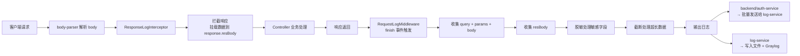
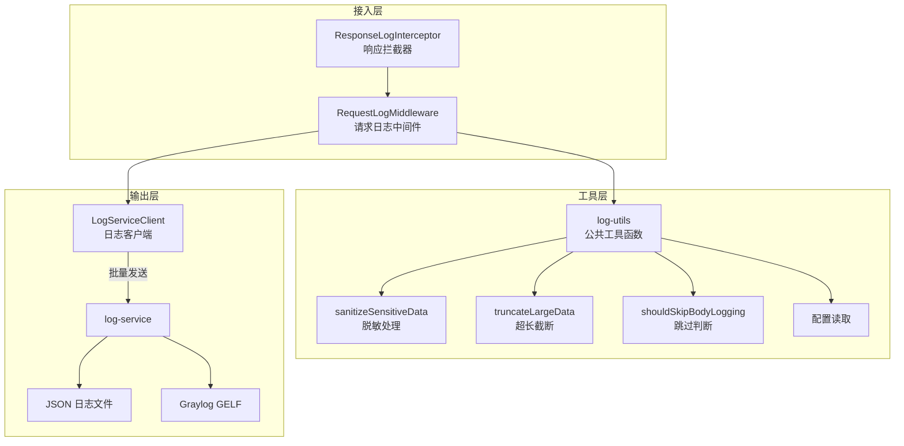
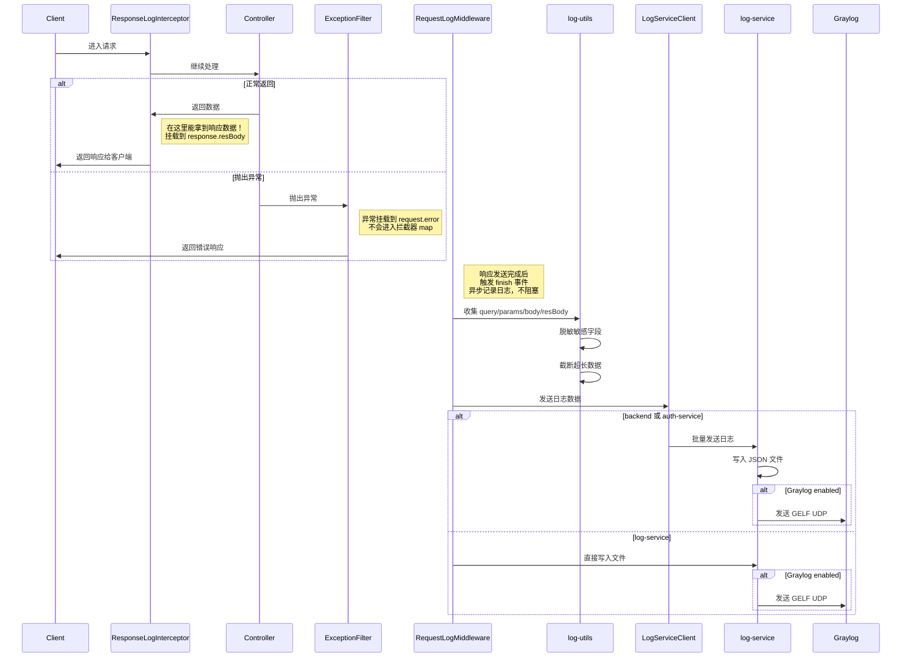

# HTTP 请求/响应日志增强改造文档

## 目录

- [背景](#背景)
- [需求分析](#需求分析)
- [整体架构设计](#整体架构设计)
- [架构分层图](#架构分层图)
- [请求处理序列图](#请求处理序列图)
- [技术选型对比](#技术选型对比)
- [具体方案详述](#具体方案详述)
- [决策记录](#决策记录)
- [语义改进：resBody 从 request 移到 response](#语义改进resbody-从-request-移到-response)
- [Graylog 兼容性设计](#graylog-兼容性设计)
- [错误情况分析](#错误情况分析)
- [数据库性能讲解](#数据库性能讲解)
- [分布式部署服务器配置](#分布式部署服务器配置)
- [改造完成总结](#改造完成总结)

---

## 背景

当前项目采用微服务架构拆分：
- **backend** - 主后端业务服务
- **auth-service** - 独立认证服务
- **log-service** - 独立日志收集服务

日志系统已具备基础请求日志记录能力，但**缺少对 HTTP 请求参数（query、params、body）和响应数据（response body）的记录**，导致线上问题排查困难。

## 需求分析

### 功能需求
- ✅ 在三个服务中统一增加请求参数打印能力（query params、route params、request body）
- ✅ 增加响应数据打印能力（response body）
- ✅ 保持统一的日志格式标准
- ✅ 正确处理敏感信息脱敏
- ✅ 正确处理大日志数据截断
- ✅ **兼容 Graylog GELF 格式**，确保能被正确索引和搜索

### 非功能需求
- ✅ 对业务代码零侵入
- ✅ 不影响现有请求处理性能
- ✅ 三个服务保持一致实现风格
- ✅ 可通过环境变量配置开关

---

## 整体架构设计

### 设计思路

延续现有架构，每个服务独立实现但保持完全相同的逻辑：

| 组件 | 职责 |
|------|------|
| **ResponseLogInterceptor** | 全局拦截器，捕获控制器返回的响应数据，挂载到 `response.resBody` |
| **RequestLogMiddleware** | 请求日志中间件，在 `finish` 事件中统一收集所有信息 |
| **log-utils** | 公共工具函数，处理脱敏、截断、类型判断 |

### 数据流



---

## 架构分层图



---

## 请求处理序列图



---

## 技术选型对比

### 方案 A：每个服务各自拷贝代码

| 特性 | 评价 |
|------|------|
| **改造量** | ✅ 极小，只新建 3 个文件 |
| **配置改动** | ✅ 无需要改构建配置 |
| **风险** | ✅ 低，对现有项目零侵入 |
| **维护成本** | ⚠️ 如果需要修改要改三处，但逻辑稳定不常改 |
| **符合微服务** | ✅ 独立部署，独立演进 |

### 方案 B：抽取为共享包（packages/logger）

| 特性 | 评价 |
|------|------|
| **改造量** | ❌ 大，需要改多个配置 |
| **配置改动** | ❌ 需要配置 workspace、添加依赖、更新 tsconfig |
| **风险** | ⚠️ 中等，可能影响 CI/CD 构建 |
| **维护成本** | ✅ DRY 原则，只维护一份 |
| **符合微服务** | ⚠️ 增加耦合，三个服务需要重新发布 |

### 最终决策

**选择方案 A**，原因：
1. 改造量最小，风险最低
2. 工具函数逻辑稳定（脱敏、截断），不太需要频繁变更
3. 三个服务是独立部署的微服务，各自拷贝符合微服务独立演进原则

---

## 具体方案详述

### 一、公共工具函数

三个服务分别创建：

| 服务 | 文件路径 |
|------|----------|
| backend | `backend/src/common/utils/log-utils.ts` |
| auth-service | `auth-service/src/common/utils/log-utils.ts` |
| log-service | `log-service/src/logger/log-utils.ts` |

提供的函数：

| 函数 | 功能 |
|------|------|
| `sanitizeSensitiveData()` | 递归脱敏对象中的敏感字段 |
| `truncateLargeData()` | 截断过长数据，适配 Graylog UDP 大小限制 |
| `shouldSkipBodyLogging()` | 判断是否跳过记录（二进制/媒体文件）|
| `getConfigBool()` | 读取环境配置布尔值 |
| `getConfigNumber()` | 读取环境配置数字 |
| `getConfigSensitiveFields()` | 读取自定义敏感字段列表 |

默认敏感字段：
```typescript
const DEFAULT_SENSITIVE_FIELDS = [
  'password', 'secret', 'token', 'apiKey', 'api_key',
  'creditCard', 'credit_card', 'cardNumber', 'card_number',
  'cvv', 'ssn', 'socialSecurity', 'privateKey', 'private_key',
  'accessToken', 'refreshToken',
];
```

### 二、扩展 Express 类型

每个服务都需要扩展 Express 类型增加 `resBody` 字段到 `Response`：

| 服务 | 文件路径 |
|------|----------|
| backend | `backend/src/common/extensions/request.d.ts` |
| auth-service | `auth-service/src/common/extensions/request.d.ts` |
| log-service | `log-service/src/logger/types.ts` |

```typescript
declare global {
  namespace Express {
    interface Request {
      // ... 原有字段
    }
    interface Response {
      /** 捕获到的响应数据，由 ResponseLogInterceptor 添加 */
      resBody?: unknown;
    }
  }
}
```

### 三、新增响应日志拦截器

每个服务分别创建，功能：
- 捕获控制器返回的响应数据
- 挂载到 `response.resBody` 供日志中间件使用
- 不改变原有响应流程

| 服务 | 文件路径 |
|------|----------|
| backend | `backend/src/common/interceptors/response-log.interceptor.ts` |
| auth-service | `auth-service/src/common/interceptors/response-log.interceptor.ts` |
| log-service | `log-service/src/logger/response-log.interceptor.ts` |

### 四、修改请求日志中间件

在现有基础上增加收集请求参数和响应体：

新增字段：

| 字段 | 说明 |
|------|------|
| `query` | URL 查询参数 `request.query` |
| `params` | 路由参数 `request.params` |
| `body` | 请求体（已脱敏、已截断） |
| `resBody` | 响应数据（已脱敏、已截断） |

处理流程：
1. 读取环境配置判断是否开启请求/响应日志
2. 根据 Content-Type 判断是否跳过记录（multipart、binary、image/video/audio 跳过）
3. 脱敏处理敏感字段（递归遍历所有嵌套字段）
4. 超长数据截断（默认最大 4096 字符）
5. 添加到日志数据输出

### 五、注册全局拦截器

在根模块注册 `ResponseLogInterceptor` 为全局拦截器：

```typescript
{
  provide: APP_INTERCEPTOR,
  useClass: ResponseLogInterceptor,
}
```

### 六、环境变量配置

三个服务都支持以下环境变量：

```env
# 请求/响应体日志开关（默认 true）
REQUEST_LOG_BODY_ENABLED=true
RESPONSE_LOG_BODY_ENABLED=true

# 最大日志长度（超过截断，默认 4096，适配 Graylog UDP 限制）
REQUEST_LOG_MAX_LENGTH=4096

# 额外自定义敏感字段（逗号分隔）
REQUEST_LOG_SENSITIVE_FIELDS=
```

---

## 决策记录

### 为什么响应体要用拦截器而不是中间件？

- 中间件阶段控制器还未执行，无法获取响应结果
- 拦截器可以在响应返回前捕获数据
- 对业务代码零侵入，不需要每个 Controller 手动记录

### 为什么三个服务都要实现？

- 因为三个服务都是独立的 HTTP 服务，都需要接收客户端请求
- 每个服务都有自己的请求日志中间件
- 保持一致性，每个服务都能完整记录自己的请求日志

### 为什么长度限制默认 4096？

- Graylog 使用 GELF over UDP 传输
- UDP 单消息最大推荐不超过 8192 字节
- 留有余量给其他字段，所以设置为 4096
- 避免 UDP 分片失败，保证日志能正确发送到 Graylog

### 为什么跳过二进制/媒体类型？

- 这些内容是二进制数据，记录到文本日志没有意义
- 文件上传等请求体很大，会占满日志空间
- 记录占位标记 `[SKIPPED: content-type ...]` 即可

### 为什么响应数据挂在 response 上？（语义改进）

**原始设计**挂在 `request.resBody`
**改进后**挂在 `response.resBody`

- ✅ 请求数据 → `request`，响应数据 → `response`，**语义更清晰**
- ✅ 符合直觉，更容易理解
- ✅ 不改变功能，只是代码可读性改进

---

## 语义改进：resBody 从 request 移到 response

### 改进前后对比

| 位置 | 语义 | 是否合理 |
|------|------|----------|
| `request.resBody` | 响应数据挂在请求对象上 | ❌ 语义不对 |
| `response.resBody` | 响应数据挂在响应对象上 | ✅ 语义正确 |

### 修改范围

三个服务都需要修改：
1. 类型定义：将 `resBody` 从 `Express.Request` 移到 `Express.Response`
2. 拦截器：从挂载到 `request` 改为挂载到 `response`
3. 日志中间件：从 `request.resBody` 读取改为 `response.resBody` 读取

### 对错误情况的影响

| 场景 | 修改后的行为 | 是否正常 |
|------|-------------|----------|
| 请求成功（正常返回） | `response.resBody` 有值 → 正确记录 | ✅ 正常 |
| 请求抛出异常 | 不会进入拦截器 `map` → `resBody` 是 `undefined` → 只记录 `request.error` | ✅ 正常（本来就没响应体） |
| ExceptionFilter 处理异常返回 | 异常响应不会经过拦截器 `map` → `resBody` 还是 `undefined`，但错误信息已经在 `request.error` 记录 | ✅ 正常，足够排查问题 |

---

## Graylog 兼容性设计

### 当前转换机制

`log-service/src/logger/graylog.ts` 中的 `buildGelfMessage()` 已经实现了正确的 GELF 转换：

1. 所有自定义字段会自动添加下划线前缀 (`_query`, `_params`, `_body`, `_resBody`)
2. 这符合 **GELF v1.1 规范**（自定义字段必须以下划线开头）
3. Graylog 会自动对这些字段建立索引，可以直接搜索过滤

### 兼容性保证

| 保证点 | 说明 |
|--------|------|
| ✅ 字段命名符合 GELF 规范 | 自动添加下划线前缀 |
| ✅ 长度限制适配 UDP | 默认 4096 避免分片失败 |
| ✅ JSON 结构保持平级 | 便于 Graylog 自动解析 |
| ✅ 所有新增字段可搜索 | Graylog 可以直接对 `_body` `_resBody` 做全文搜索 |

### 输出示例

原始 JSON 日志：
```json
{
  "timestamp": "2026-04-19T10:30:00.000Z",
  "level": "access",
  "method": "POST",
  "url": "/api/v1/auth/login",
  "body": {
    "username": "test",
    "password": "[REDACTED]"
  },
  "resBody": {
    "code": 200,
    "data": { "accessToken": "[REDACTED]" }
  }
}
```

转换为 GELF 后：
```json
{
  "version": "1.1",
  "host": "log-service-dev",
  "short_message": "POST /api/v1/auth/login",
  "level": 6,
  "timestamp": 1776680600.000,
  "_level": "access",
  "_method": "POST",
  "_url": "/api/v1/auth/login",
  "_body": { "username": "test", "password": "[REDACTED]" },
  "_resBody": { "code": 200, "data": { "accessToken": "[REDACTED]" } }
}
```

---

## 错误情况分析

### 请求抛出异常

- 异常不会进入拦截器的 `map` 操作
- 所以 `resBody` 不会被挂载，保持 `undefined`
- 但 `ExceptionFilter` 会把错误对象挂载到 `request.error`
- 我们的日志中间件已经会记录 `errorName` / `errorMessage` / `stack`
- **结论**：足够排查问题，不需要完整的错误响应体

### ExceptionFilter 格式化错误响应

- NestJS 的异常处理发生在拦截器外层
- 即使 ExceptionFilter 返回了格式化的错误响应，我们也拿不到那个响应体
- 但错误栈已经记录在 `request.error` 中
- **结论**：足够排查问题，不影响

---

## 数据库性能讲解

本次改造**不涉及数据库操作**：

- 所有处理都在请求处理流程的**最后阶段异步执行**
- 脱敏和截断都是 CPU 内存计算，不涉及 IO
- 日志输出后由 log-service 异步写入文件，不阻塞主请求
- 对数据库查询性能完全没有影响

### 未来建议

如果未来需要将日志存储到数据库：
1. 使用**批量插入**减少网络往返
2. 建立适当的索引（`timestamp`、`level`、`service`、`method` 常用于过滤）
3. 按日期分表，方便历史数据清理
4. 对于超大日志表，可以考虑时序数据库（ClickHouse、InfluxDB）优化存储和查询性能

---

## 分布式部署服务器配置

### 当前架构（三个独立微服务）

| 服务 | 默认端口 | 配置建议（4C8G 服务器） |
|------|----------|------------------------|
| backend | 8888 | 进程数 1-2，Node.js 不需要堆内存配置 |
| auth-service | 8889 | 进程数 1-2 |
| log-service | 8890 | 进程数 1 |
| Graylog | 12201 (UDP) | 独立部署，建议 4C8G 以上，存储使用 SSD |

### Nginx 反向代理配置示例

```nginx
# 网关层代理三个服务
server {
    listen 80;
    server_name api.example.com;

    # backend
    location /api/ {
        proxy_pass http://127.0.0.1:8888/api/;
        proxy_set_header X-Forwarded-For $remote_addr;
        proxy_set_header Host $host;
    }

    # auth-service
    location /auth-api/ {
        proxy_pass http://127.0.0.1:8889/api/;
        proxy_set_header X-Forwarded-For $remote_addr;
        proxy_set_header Host $host;
    }

    # log-service 只对内网开放
    location /log-api/ {
        allow 127.0.0.1;
        deny all;
        proxy_pass http://127.0.0.1:8890/api/;
    }
}
```

### Docker Compose 配置示例

```yaml
version: '3.8'
services:
  backend:
    build: ./backend
    ports:
      - "8888:8888"
    environment:
      - NODE_ENV=production
      - AUTH_SERVICE_URL=http://auth-service:8889
      - LOG_SERVICE_URL=http://log-service:8890
    depends_on:
      - auth-service
      - log-service
    restart: always

  auth-service:
    build: ./auth-service
    ports:
      - "8889:8889"
    environment:
      - NODE_ENV=production
      - LOG_SERVICE_URL=http://log-service:8890
    restart: always

  log-service:
    build: ./log-service
    ports:
      - "8890:8890"
    environment:
      - NODE_ENV=production
      - GRAYLOG_ENABLED=true
      - GRAYLOG_HOST=graylog
      - GRAYLOG_PORT=12201
    volumes:
      - ./logs:/app/logs
    restart: always

  graylog:
    image: graylog/graylog:5.2
    ports:
      - "9000:9000"
      - "12201:12201/udp"
    environment:
      - GRAYLOG_PASSWORD_SECRET=your-secret
      - GRAYLOG_ROOT_PASSWORD_SHA2=your-hash
    volumes:
      - graylog-data:/usr/share/graylog/data
    restart: always

volumes:
  graylog-data:
```

### 资源配置建议

| 服务 | CPU | 内存 | 磁盘 |
|------|-----|------|------|
| backend + auth-service | 2-4 core | 2-4 GB | - |
| log-service | 1-2 core | 1-2 GB | 50-100 GB（日志存储） |
| Graylog | 4-8 core | 8-16 GB | 200-500 GB SSD |

---

## 改造完成总结

### 所有改造完成情况

| 服务 | 新增文件 | 修改文件 | 状态 |
|------|----------|----------|------|
| backend | 2 | 3 | ✅ 完成 |
| auth-service | 2 | 3 | ✅ 完成 |
| log-service | 1 | 3 | ✅ 完成 |

> 总共：新增 5 个文件，修改 9 个文件

### 实现的功能
- ✅ 三个服务统一支持 HTTP 请求参数打印（query、params、body）
- ✅ 支持响应数据打印（resBody）
- ✅ 自动脱敏敏感字段，可自定义
- ✅ 自动截断超长数据，适配 Graylog UDP 限制
- ✅ 二进制/媒体类型自动跳过
- ✅ 完全兼容 Graylog GELF 格式，所有字段可索引搜索
- ✅ 通过环境变量配置开关，对业务代码零侵入
- ✅ 语义改进：响应数据挂在 `response.resBody`，更清晰

### 验证方式

1. 分别启动 backend、auth-service、log-service
2. 调用任意接口
3. 查看日志输出，确认包含 `query` / `params` / `body` / `resBody` 字段
4. 验证敏感字段（password、token）被替换为 `[REDACTED]`
5. 验证超过 4096 字符的大数据被正确截断
6. 验证 Graylog 能正确接收并搜索 `_body` 和 `_resBody` 字段

---

**文档生成日期**: 2026-04-19
**改造版本**: v1.0
