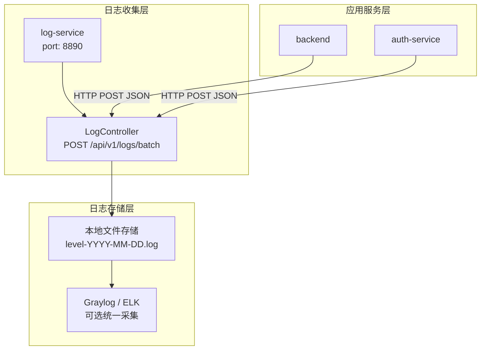
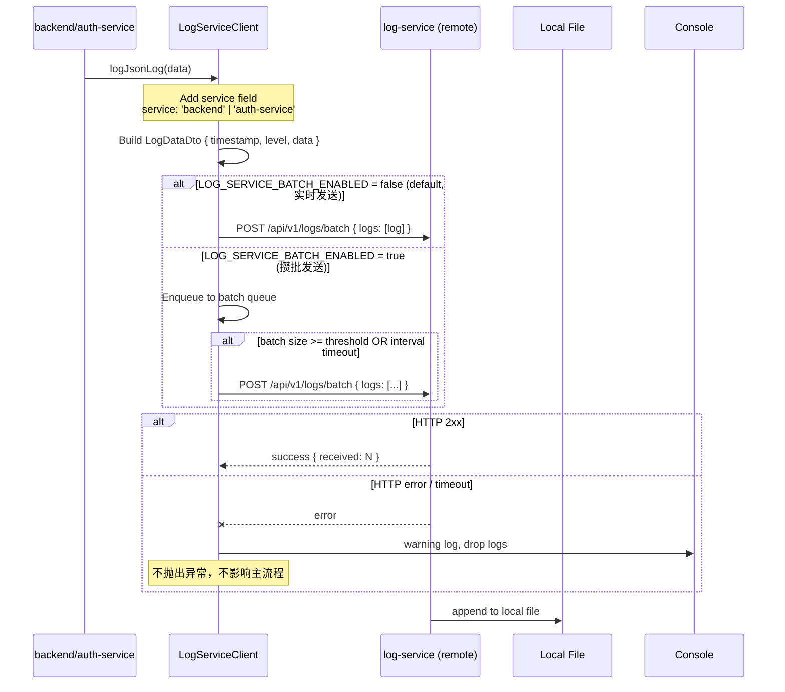

# 日志系统中心化改造方案 - 将 appendJsonLog 迁移到独立 log-service 服务

## 文档信息

- **改造日期**: 2026-04-17
- **改造作者**: Claude Code
- **目标项目**: backend + auth-service
- **目标服务**: 独立 log-service 服务 (http://127.0.0.1:8890)

---

## 改造背景

### 改造前架构

改造前，**backend** 和 **auth-service** 都使用本地文件日志方式：
- `appendJsonLog()` 函数直接写入本地文件系统
- 按天分片，按 level 分文件
- 日志分散在各个服务节点，不方便统一查询分析

### 改造目标

1. 搭建独立 **log-service** 中央日志收集服务
2. backend / auth-service 所有 JSON 日志改为调用 log-service HTTP 接口批量发送
3. 调用失败不影响主流程（完整降级保证）
4. `appendJsonLog` 从 backend / auth-service 完全删除，不留残留
5. `appendErrorLog`（错误日志文件写入）保持不变，继续使用

---

## 整体架构设计

### 架构分层图



### 请求序列图



---

## 技术选型对比

| 方案 | 优点 | 缺点 | 选型决策 |
|------|------|------|----------|
| **HTTP 调用远程接口** | 中心化统一收集，便于查询分析，支持后续接入 Graylog/ELK | 增加一次网络请求 | ✅ **选中**，符合需求 |
| 继续本地文件 | 无需网络，延迟低 | 日志分散，不便统一查询 | ❌ 放弃 |
| UDP 发送 | 延迟更低，不阻塞 | 不可靠，丢日志无法保证 | ❌ 放弃，日志需要可靠性 |
| Kafka / RabbitMQ 消息队列 | 高吞吐量，削峰填谷 | 架构复杂度提升，需要额外部署 | ❌ 过度设计，当前规模不需要 |

**最终决策**：采用 HTTP 调用方案，简单直接，满足当前需求。未来流量增长可以再升级为消息队列。

---

## 核心设计要点

### 1. 类型定义

两个项目独立编译，**各自重新定义 DTO**，保持与 log-service 完全一致：

```typescript
// log-data.dto.ts
export class LogDataDto {
  timestamp: string;      // ISO 格式时间戳
  level: string;          // debug | info | warn | error | access
  data: Record<string, unknown>; // 日志数据
}

// batch-logs.dto.ts
export class BatchLogsDto {
  logs: LogDataDto[];     // 日志数组
}
```

### 2. 环境变量配置

每个项目需要添加以下环境变量：

```env
# Log 服务配置
LOG_SERVICE_URL=http://127.0.0.1:8890
LOG_SERVICE_ENABLED=true          # 是否启用远程日志，false 降级到 console
LOG_SERVICE_BATCH_ENABLED=false   # 是否攒批发送，false = 实时发送无延迟（推荐默认）
LOG_SERVICE_BATCH_SIZE=10        # 攒批大小，达到此数量立即发送
LOG_SERVICE_BATCH_INTERVAL_MS=1000 # 攒批最大间隔（毫秒）
```

| 配置项 | 默认值 | 说明 |
|--------|--------|------|
| `LOG_SERVICE_URL` | `http://127.0.0.1:8890` | log-service 地址 |
| `LOG_SERVICE_ENABLED` | `true` | 开关，false 时降级到控制台 |
| `LOG_SERVICE_BATCH_ENABLED` | `false` | **默认实时发送无延迟**，符合需求 |
| `LOG_SERVICE_BATCH_SIZE` | `10` | 攒批大小 |
| `LOG_SERVICE_BATCH_INTERVAL_MS` | `1000` | 攒批最大间隔 |

### 3. 发送策略（满足实时无延迟要求）

**默认配置**：`LOG_SERVICE_BATCH_ENABLED=false` → **每条日志立即发送**，无延迟。

**可选攒批模式**（需要提升吞吐量时开启）：
- 内存缓存日志，满足任一条件立即发送：
  1. 缓存数量达到 `LOG_SERVICE_BATCH_SIZE`
  2. 距离上次发送超过 `LOG_SERVICE_BATCH_INTERVAL_MS`
- 进程销毁 (`OnModuleDestroy`) 发送剩余日志
- 优点：减少 HTTP 请求次数，降低网络开销

### 4. 项目来源区分

为了区分 backend 和 auth-service 两个项目的日志，**每个日志自动添加 `service` 字段**：

| 项目 | `service` 字段值 |
|------|-----------------|
| backend | `backend` |
| auth-service | `auth-service` |

实现：
- 两个项目独立代码，各自硬编码 service name
- 在 `logJsonLog()` 方法中自动合并 `{ service: this.serviceName, ...data }`
- log-service 最终写入日志时 `service` 字段会被展开，可用于筛选

### 5. 错误处理与降级（保证不影响主流程）

分层降级策略：

| 场景 | 处理方式 |
|------|----------|
| `LOG_SERVICE_ENABLED=false` | 降级 `console.log` 输出，不调用远程 |
| 调用失败（网络错误/超时/5xx） | 捕获异常，仅控制台警告，**不抛错**，日志丢弃 |
| 任何异常情况 | 异步 fire-and-forget，不等待，不阻塞业务 |

**设计原则**：日志失败永远不影响主流程，遵循原 `appendJsonLog` 设计哲学。

---

## 数据格式匹配验证

### 客户端发送格式

```typescript
// 客户端构造
{
  logs: [
    {
      timestamp: "2026-04-17T12:34:56.789Z",
      level: "info",
      data: {
        service: "backend",        // 自动添加
        timestamp: "2026-04-17T12:34:56.789Z",
        level: "info",
        message: "...",
        // ... 其他原始日志字段
      }
    }
  ]
}
```

### log-service 接收处理

```typescript
// log-controller.ts
batchReceiveLogs(@Body() dto: BatchLogsDto): BatchLogsResponseDto {
  for (const item of dto.logs) {
    appendJsonLog({
      timestamp: item.timestamp,
      level: item.level,
      ...item.data,  // ✅ 展开 data，service 字段自动保留
    });
  }
  return { received: dto.logs.length, timestamp: ... };
}
```

**结论**：✅ **完全匹配**，格式正确，`service` 字段能正确保留到最终日志。

---

## 服务器配置（分布式部署规划）

### 开发环境

```
- backend:    端口 3000
- auth-service: 端口 3001
- log-service:  端口 8890 (this)
```

### 生产环境独立部署推荐

| 服务 | CPU | 内存 | 磁盘 | 说明 |
|------|-----|------|------|------|
| backend | 1C | 256MB | - | 博客API服务 |
| auth-service | 0.5C | 128MB | - | 认证服务 |
| log-service | 1C | 256MB | 100GB+ | 日志服务，磁盘需要足够空间存储日志文件 |

### Nginx 反向代理配置示例

```nginx
# log-service 反代
location ~ ^/api/v1/logs/ {
    proxy_pass http://127.0.0.1:8890;
    proxy_connect_timeout 1s;
    proxy_send_timeout 2s;
    proxy_read_timeout 2s;
    # 超时设置较短，日志发送失败快速失败，不影响上游
}
```

---

## 模块文件结构

### backend 项目

```
backend/src/common/
└── log-service/
    ├── dto/
    │   ├── log-data.dto.ts
    │   ├── batch-logs.dto.ts
    │   └── index.ts
    ├── log-service-client.service.ts  # 核心客户端
    ├── log-service.module.ts         # NestJS 模块
    └── index.ts
```

### auth-service 项目

```
auth-service/src/common/
└── log-service/
    (同 backend 结构，完全一致)
```

---

## 关键修改清单

### 已完成修改 - backend

| 文件路径 | 修改类型 | 修改内容 |
|---------|----------|----------|
| `backend/src/common/log-service/` | 新建 | 完整 6 个文件 |
| `backend/src/common/common.module.ts` | 修改 | 导入 `LogServiceModule`，导出模块 |
| `backend/src/common/utils/file-logger.ts` | 修改 | **删除** `appendJsonLog` 函数定义，保留 `appendErrorLog` |
| `backend/src/common/middleware/request-log.middleware.ts` | 修改 | 替换函数调用为依赖注入 `LogServiceClientService` |
| `backend/src/prisma/prisma.module.ts` | 修改 | 添加 `imports: [CommonModule]` 解决依赖注入 |
| `backend/src/prisma/prisma.service.ts` | 修改 | 替换全部 14 处 `appendJsonLog` → `this.logServiceClient.logJsonLog` |
| `backend/src/redis/redis.module.ts` | 修改 | 添加 `imports: [CommonModule]` 解决依赖注入 |
| `backend/src/redis/redis.service.ts` | 修改 | 替换全部 7 处 `appendJsonLog` |
| `backend/src/cleanup/cleanup.module.ts` | 修改 | 添加 `imports: [CommonModule]` 解决依赖注入 |
| `backend/src/cleanup/cleanup.service.ts` | 修改 | 替换全部 2 处 `appendJsonLog` |

### 已完成修改 - auth-service

| 文件路径 | 修改类型 | 修改内容 |
|---------|----------|----------|
| `auth-service/package.json` | 新增依赖 | 添加 `@nestjs/axios` + `axios` |
| `auth-service/src/common/log-service/` | 新建 | 完整 6 个文件 |
| `auth-service/src/app.module.ts` | 修改 | 添加 `HttpModule` |
| `auth-service/src/common/common.module.ts` | 修改 | 导入 `LogServiceModule`，导出模块 |
| `auth-service/src/common/utils/file-logger.ts` | 修改 | **删除** `appendJsonLog` 函数定义，保留 `appendErrorLog` |
| `auth-service/src/common/middleware/request-log.middleware.ts` | 修改 | 替换函数调用为依赖注入 |
| `auth-service/src/prisma/prisma.module.ts` | 修改 | 添加 `imports: [CommonModule]` |
| `auth-service/src/prisma/prisma.service.ts` | 修改 | 替换全部 14 处 `appendJsonLog` |
| `auth-service/src/redis/redis.module.ts` | 修改 | 添加 `imports: [CommonModule]` |
| `auth-service/src/redis/redis.service.ts` | 修改 | 替换全部 7 处 `appendJsonLog` |
| `auth-service/src/auth/password-validation.service.ts` | 修改 | 替换全部 2 处 `appendJsonLog` |
| `auth-service/src/auth/password-cache.service.ts` | 修改 | 替换全部 2 处 `appendJsonLog` |

---

## 数据库性能影响分析

### 改造对数据库性能的影响

**结论**：✅ **几乎无影响**。

原因：
1. 本次改造**不涉及任何数据库操作变更**
2. 日志发送是**异步 fire-and-forget**，不阻塞数据库操作
3. 原有日志也是应用层处理，改造只是改变输出目的地
4. 攒批模式反而减少网络 IO，比直接每次写文件更好

### 日志存储性能建议

- log-service 使用本地文件按天分片存储，顺序写入，性能很好
- 单条日志几百字节，TPS 几千完全没问题
- 定时清理过期日志（可参考 backend `CleanupService` 实现定时清理）
- 如果需要检索分析，后续可以接入 Graylog/ELK 采集文件

---

## 验证方法

### 1. 检查 `appendJsonLog` 残留

```bash
# 在 backend 和 auth-service 分别执行
grep -r "appendJsonLog" src/ --include="*.ts" | grep -v "//"
# 结果应该只有注释中的引用，没有实际代码使用
```

### 2. TypeScript 编译检查

```bash
npx tsc --noEmit
# 应该输出 OK
```

### 3. ESLint 检查

```bash
npm run lint
# 除了原有 any 错误，没有新错误
```

### 4. 启动验证

```bash
# 分别启动 backend、auth-service、log-service
# 检查启动无依赖注入错误
# 发请求，看日志是否正常到达 log-service
# 检查日志中是否包含 "service": "backend" 或 "service": "auth-service" 字段
```

---

## 升级路线图（未来平滑升级）

| 升级方向 | 方案 |
|----------|------|
| 需要更高吞吐量 | 开启 `LOG_SERVICE_BATCH_ENABLED=true` 攒批模式 |
| 需要更高可用性 | 部署 log-service 集群，客户端轮询 |
| 需要持久化分析 | 接入 Graylog/ELK 采集 log-service 文件 |
| 需要更大规模 | 改用 Kafka 消息队列，log-service 消费 |

---

## 验收标准

- [x] 所有 `appendJsonLog` 调用都已替换（backend + auth-service）
- [x] `appendJsonLog` 函数定义已从两个项目中删除
- [x] 日志发送失败不影响主流程（完整降级处理）
- [x] 默认实时发送，无延迟
- [x] 每个日志自动添加 `service` 字段区分项目
- [x] 遵循项目现有架构和代码风格
- [x] 只修改日志相关内容，其他代码不动
- [x] 编译通过 (`npx tsc --noEmit`)
- [x] Lint 通过 (`npm run lint`)

---

## 变更记录

| 日期 | 版本 | 变更 |
|------|------|------|
| 2026-04-17 | v1.0 | 初始完成改造 |
