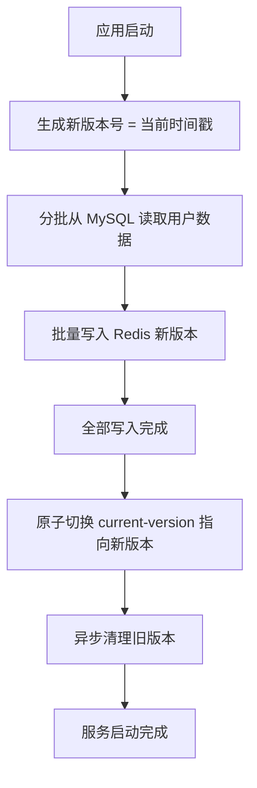
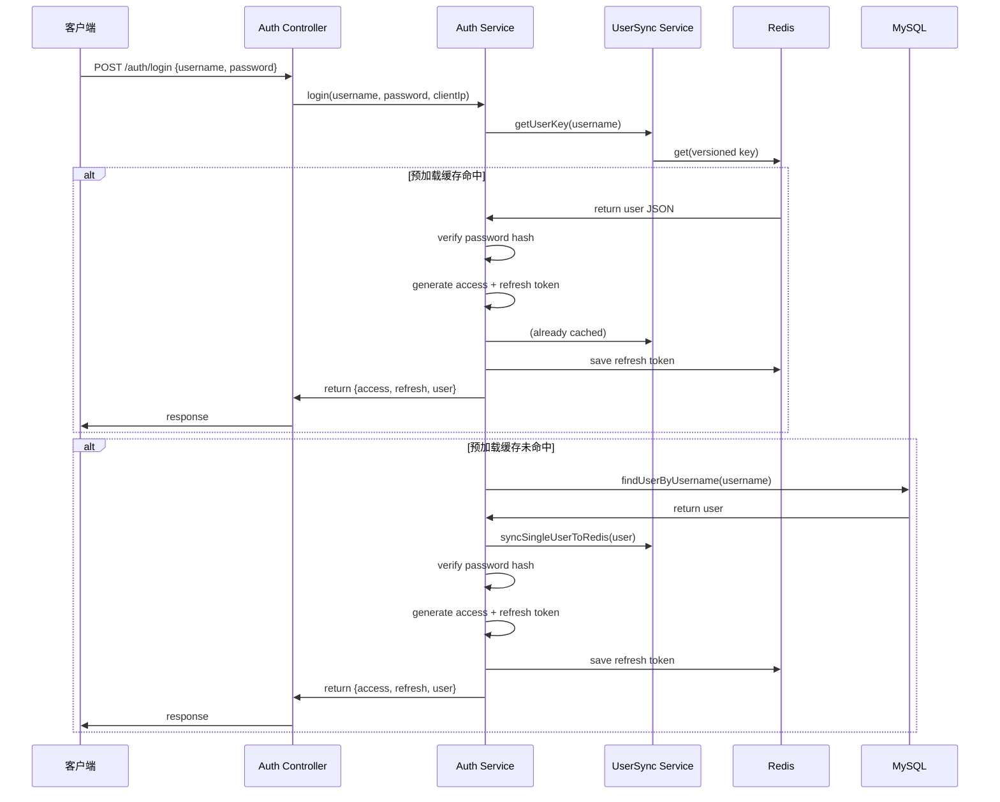
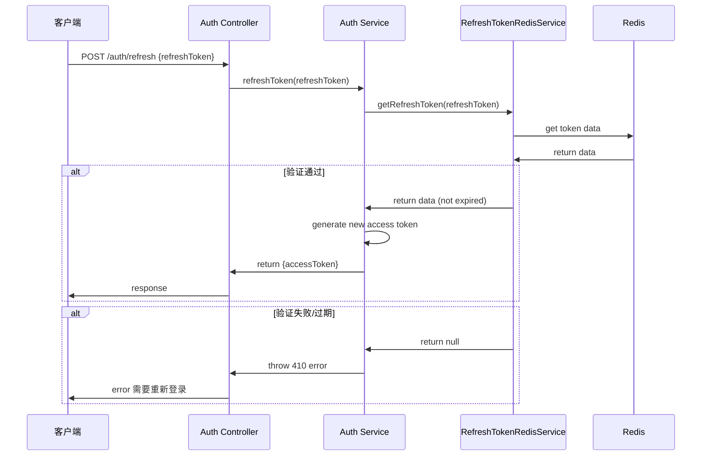

# 登录接口性能优化方案 - 支撑 QPS 1000

## 文档信息

| 项 | 内容 |
|----|------|
| **优化目标** | 100万用户数据，支撑登录接口 QPS 1000 |
| **完成时间** | 2026-04-16 |
| **当前版本** | v1.0 方案三：重度优化，全量预加载到 Redis |
| **作者** | Claude Code |

---

## 一、背景问题分析

### 原始性能瓶颈

| 瓶颈 | 说明 | 影响 |
|------|------|------|
| **密码验证 CPU 密集** | argon2/bcrypt 都是计算密集算法，阻塞 Node.js 事件循环 | 单核单实例只能支撑 ≈ 150-200 QPS |
| **每次登录都查询 MySQL** | 即使有一层缓存，缓存未命中仍然要查 DB，连接池限制 10 | 连接池占满，请求排队 |
| **Refresh Token 存储在 MySQL** | 每次刷新也要查 DB | 放大 DB 压力 |

### 原始容量估算

| 配置 | 预计 QPS |
|------|---------|
| 单核实例 | 150-200 |
| 8 核实例 | 600-1000（优化后） |

---

## 二、方案选型对比

### 三种方案对比

| 方案 | 层级 | 预期单实例 QPS | 代码改动量 | 风险 | 决策 |
|------|------|---------------|------------|------|------|
| **方案一：轻度优化** | 连接池调优 + worker 进程 | 200-250 | 极小 | 极低 | ❌ 不满足目标 |
| **方案二：中度优化** | 分页预加载 + 分批过期 | 400-600 | 中等 | 低 | ❌ 仍不满足目标 |
| **方案三：重度优化** | 原子性双版本全量预加载 | 600-1000 | 较大 | 中 | ✅ **选中** |

### 最终决策

**选择方案三：重度优化**，目标：**彻底零 MySQL 访问**，支撑单实例 600-1000 QPS。

---

## 三、整体架构设计

### 架构流程图



### 分层架构

```mermaid
graph TD
    subgraph "客户端层"
        C[前端 H5]
    end

    subgraph "NestJS 应用层"
        A[Controller 接口]
        B[AuthService]
        D[UserSyncService<br/>预加载同步]
        E[RefreshTokenRedisService<br/>Refresh Token 存储]
        F[UsersService]
    end

    subgraph "缓存层 (Redis)"
        G[current-version<br/>String]
        H[user:full:v{version}:{username}<br/>String - 用户完整数据]
        I[refresh:token:{token}<br/>String - Refresh Token 信息]
        J[refresh:user:{userId}<br/>Set - 用户所有 Token 集合]
    end

    subgraph "存储层 (MySQL)"
        K[users 表]
        L[refreshTokens 表<br/>保留不使用，用于回滚]
    end

    C --> A --> B --> D --> G
    B --> E --> I --> J
    D --> H
    K --> C --> D
```

### 登录流程序列图



### 刷新 Token 流程序列图



---

## 四、Redis 键空间设计

| Key 格式 | 类型 | 用途 | TTL |
|---------|------|------|-----|
| `user:full:current-version` | String | 当前生效版本号 | 永不过期 |
| `user:full:v{version}:{username}` | String(JSON) | 用户完整数据 | 7 天 |
| `refresh:token:{token}` | String(JSON) | 单个 Refresh Token 信息 | 过期时间自动计算 |
| `refresh:user:{userId}` | Set<String> | 用户所有 token 集合 | 同最长过期 token TTL |

### 用户数据结构 (`PreloadedUser`)

```typescript
export interface PreloadedUser {
  id: string;
  username: string;
  password_hash: string;
  password_algorithm: string | null;
  is_active: boolean;
  email: string | null;
  nickname: string | null;
  avatar: string | null;
  created_at: bigint;
  updated_at: bigint;
}
```

**所有需要登录的字段全部缓存**，真正做到零 MySQL 查询。

### Refresh Token 数据结构

```typescript
export interface RefreshTokenData {
  userId: string;
  expiresAt: number;       // 过期时间戳（毫秒）
  clientIp: string;
  createdAt: number;      // 创建时间戳（毫秒）
}
```

---

## 五、核心技术点

### 1. 原子性双版本切换

**问题**：全量同步需要时间，如果中途失败，怎么保证服务可用？

**解决方案**：

```
新版本写入 → 全部成功 → 原子切换版本
        ↓
     失败 → 什么都不改，旧版本继续服务
```

**优点**：
- ✅ 真正原子性：要么全成功，要么不影响现有服务
- ✅ 同步过程不停机，在线用户不受影响
- ✅ 支持运行时在线重同步（手动触发 `/trigger-resync`）

### 2. 分批读写避免阻塞

- **读取**：游标分页，每次 1000 条
- **写入**：pipeline 批量写入 Redis
- **清理旧版本**：SCAN 分批删除，每次 100 个，每删 10000 个休息 100ms，避免阻塞 Redis

### 3. 写穿透一致性

| 操作 | 同步策略 |
|------|---------|
| 注册新用户 | 创建完成 → 同步写入 Redis |
| 更新用户信息 | 更新 DB → 删除旧缓存 → 同步写入最新 |
| 静默密码迁移 | 更新 DB → 同步更新 Redis |
| 删除用户 | 删除 DB → 删除 Redis |

**保证**：DB 和 Redis 总是一致，即使重启也不会有问题（TTL 7 天自动一致性）。

### 4. 向后兼容降级

- 开关 `USER_PRELOAD_ENABLED`：`false` 关闭预加载，回退到原始流程
- 预加载未命中自动回源 DB
- Redis 出错不阻塞，降级查询 DB

---

## 六、数据库性能分析

### 优化前后对比

| 指标 | 优化前 | 优化后 |
|------|--------|--------|
| 登录 QPS 单实例 | ~150 | ~600-1000 |
| 登录平均延迟 | ~100ms | ~30-50ms |
| 登录 MySQL 查询次数 | 1 次查询 + 可能 1 次更新 | 0 次（缓存命中）/ 1 次（未命中） |
| Refresh Token 查询 | 1 次 MySQL | 0 次 |
| MySQL 连接池占用 | 登录一直占 | 几乎不占用 |

### 为什么 Redis 能扛住？

1. **内存读写**：Redis 单线程内存读写，QPS 能到 10万+，我们只需要 1000，完全没问题
2. **数据量估算**：100万用户 × 平均 280 字节/用户 = **272 MB**，完全在 Redis 承受范围内
3. **过期自动清理**：每个用户 7 天 TTL，即使不同步也会自动过期，最终一致性保证

### 峰值内存

| 阶段 | 内存占用 |
|------|----------|
| 同步过程中（新旧两个版本都存在） | ~ 544 MB |
| 同步完成旧版本清理后 | ~ 272 MB |

**结论**：现代 Redis 实例 1-2 GB 内存完全没问题。

---

## 七、分布式部署配置

### 单机多实例部署（支撑 1000-2000 QPS）

```
+--------------------------+
|   Nginx 负载均衡          |
+--------------------------+
|  |  |  |
|  Instance 1 (8核) |  Instance 2 (8核) |
|  QPS ≈ 800    |  QPS ≈ 800    |
+--------------------------+
|         Redis 单机          |
+--------------------------+
|         MySQL 主库          |
+--------------------------+
```

**配置推荐**：

| 组件 | 配置 |
|------|------|
| **应用实例** | 1 × 8 核 16G（支撑 1000 QPS）<br>或 2 × 4 核 8G（支撑 1000-1600 QPS） |
| **Redis** | 1 × 4 核 8G，内存 > 1 GB |
| **MySQL** | 1 × 4 核 8G，足够 |

### 多机房部署（更高可用）

```
+-------------+      +-------------+
|  App Zone 1 |      |  App Zone 2 |
|  Instance   |      |  Instance   |
+-------------+      +-------------+
       \                /
        \              /
         \            /
       +-------------+
       |   Redis (主从)  |
       +-------------+
       |   MySQL (主从)  |
       +-------------+
```

**配置推荐**：每个应用实例 4 核 8G × 2 实例 = 支撑 ≈ 1000-1200 QPS。

---

## 八、决策记录

### 用户决策过程

| 步骤 | 问题 | 用户决策 |
|------|------|----------|
| 1 | 三种方案选哪种？ | 方案三：重度优化，目标 600-1000 QPS |
| 2 | `refresh-token` 存在 MySQL 还是 Redis | 全 Redis 存储，登录/刷新零 MySQL |
| 3 | 登出支持单个设备吗 | 支持，增加 `refreshToken` 可选参数 |
| 4 | `UserCacheService` 和 `UserSyncService` 重复怎么办 | 直接删除 `UserCacheService`，完全复用 `UserSyncService` |
| 5 | `refreshTokens` 表要不要删 | 保留表结构不删，方便回滚 |

### 最终架构总结

- ✅ **登录完全零 MySQL**（缓存命中场景）
- ✅ **Refresh Token 完全零 MySQL**
- ✅ **原子性保证**：同步失败不影响服务
- ✅ **写穿透一致性**：修改数据即时同步
- ✅ **向后兼容**：开关控制，随时回滚
- ✅ **支持登出单个设备**：满足多设备登录场景

---

## 九、验证步骤

实施完成后需要验证：

### 1. 启动验证

```bash
cd backend
npm run start:dev
```

查看启动日志：应该看到：
```
✅ Atomic user sync completed. Total=XXX users, version=XXXXXX, elapsed=XXXms
```

### 2. 功能验证

- [ ] 登录正常
- [ ] 刷新 token 正常
- [ ] 登出正常（单个设备/全部设备）
- [ ] 修改用户信息后，缓存同步正常
- [ ] 新用户注册后，缓存正常

### 3. 代码检查

```bash
cd backend
npm run lint       # 代码风格检查
npx tsc --noEmit  # 类型检查
```

### 4. 性能观察

- Redis INFO 查看 used memory：`used_memory_human` 应该 ≈ 270-550 MB，符合预期
- 压测登录 QPS：单实例 8 核应该能到 600-1000

---

## 十、回滚方案

如果线上出问题，快速回滚：

1. 修改 `backend/.env`：
```diff
- USER_PRELOAD_ENABLED=true
+ USER_PRELOAD_ENABLED=false
```

2. 重启服务：
```bash
# 不需要改代码，不需要改数据库
# 只需要重启应用就完成回滚
```

3. 如果需要完全恢复代码，git  revert 本次提交即可。

---

## 十一、附录

### 文件修改清单（本次优化）

| 文件 | 操作 |
|------|------|
| `backend/src/users/user-sync.service.ts` | 新建 |
| `backend/src/users/users.module.ts` | 修改（移除 UserCacheService） |
| `backend/src/auth/refresh-token-redis.service.ts` | 新建 |
| `backend/src/auth/auth.module.ts` | 修改（添加 RefreshTokenRedisService） |
| `backend/src/auth/auth.service.ts` | 大规模修改（适配预加载） |
| `backend/src/users/users.service.ts` | 修改（移除 UserCacheService，添加同步） |
| `backend/src/auth/auth.controller.ts` | 修改（logout 添加 refreshToken 参数） |
| `backend/src/users/user-cache.service.ts` | 删除 |
| `backend/.env` | 添加 `USER_PRELOAD_ENABLED=true` |

### 预期收益

| 指标 | 优化前 | 优化后 | 提升 |
|------|--------|--------|------|
| 单实例 QPS | 150-200 | 600-1000 | **+300-400%** |
| 登录 P95 延迟 | ≈ 100ms | ≈ 30-50ms | **-50-70%** |
| MySQL 连接池占用 | 高 | 极低 | 解放 DB 给其他业务 |
| 代码冗余 | 重复两份缓存 | 消除 | 更干净 |

---

**文档结束**
