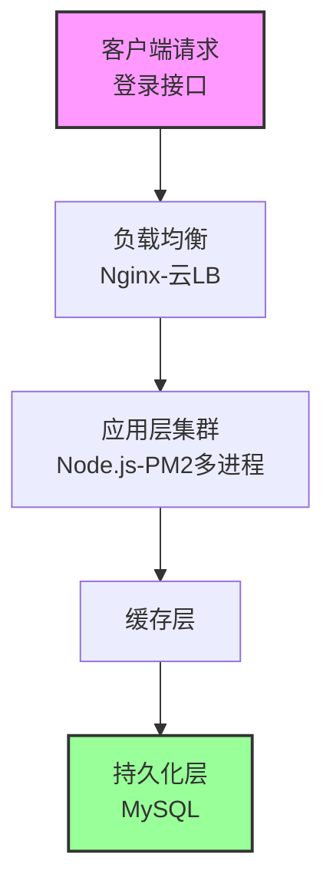
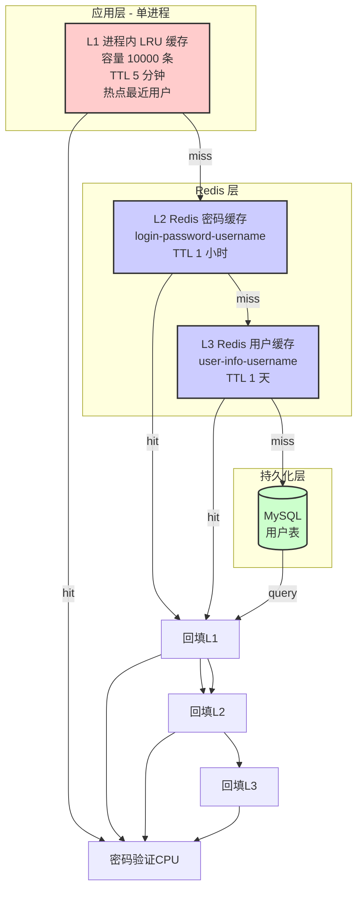
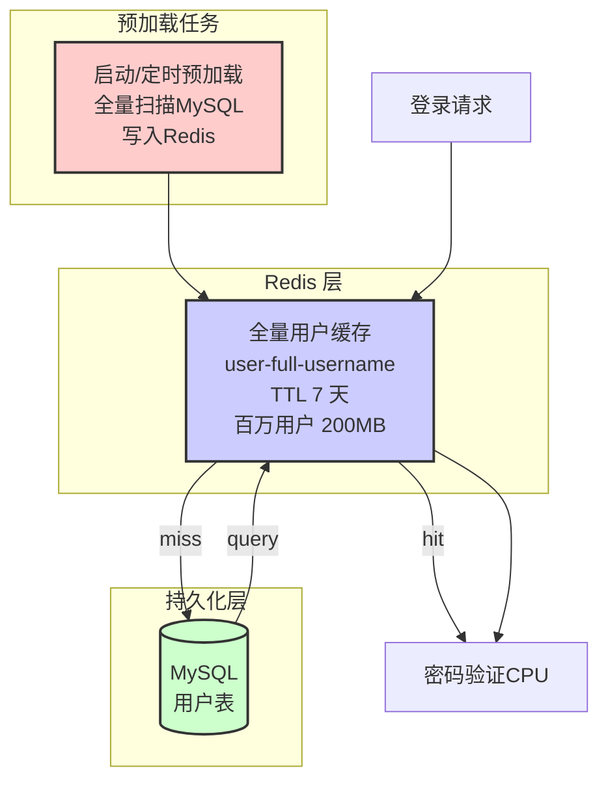
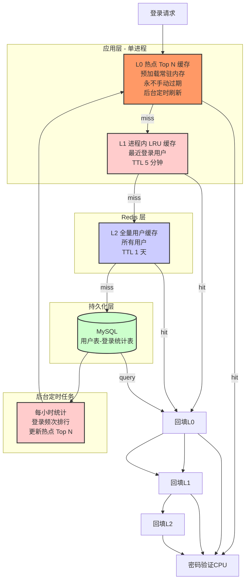
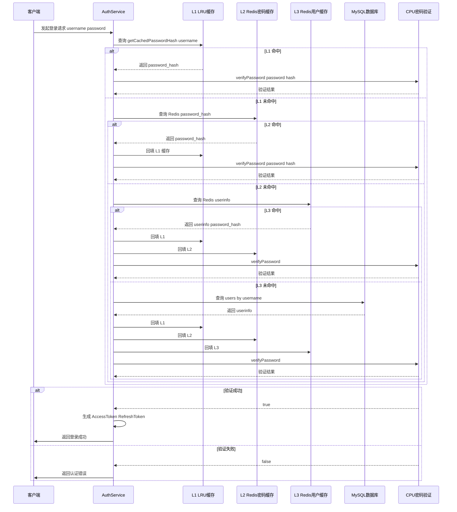
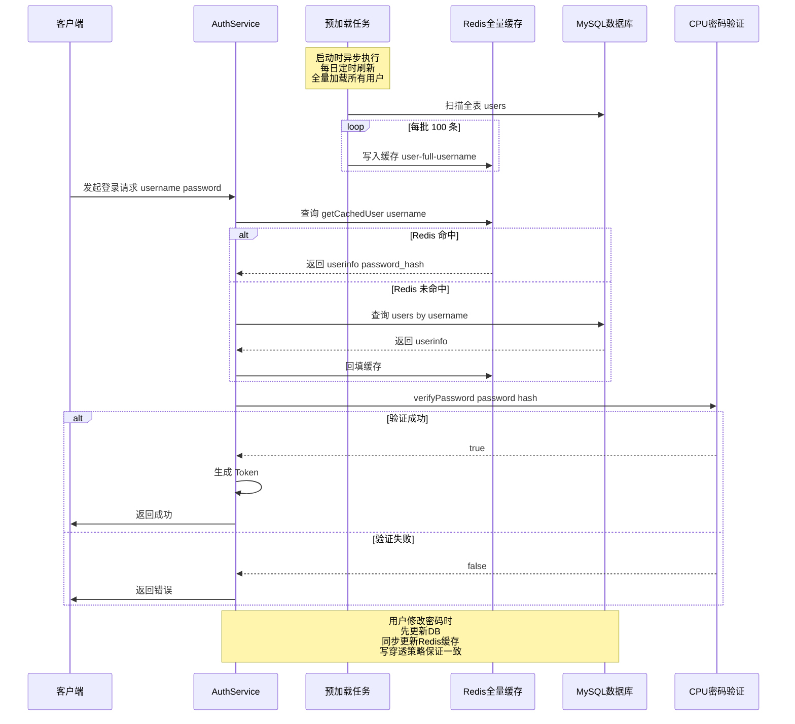

# 登录接口性能优化设计文档 - 百万用户 QPS 1000

## 文档信息

| 项 | 值 |
|-----|-----|
| **项目** | 博客系统后端 API |
| **场景** | 百万用户数据，目标 QPS 1000 |
| **当前架构** | NestJS + Prisma + MySQL + Redis |
| **生成日期** | 2026-04-11 |

---

## 目录

- [一、问题背景](#一问题背景)
- [二、整体架构设计](#二整体架构设计)
- [三、三种方案架构分层图](#三三种方案架构分层图)
- [四、登录流程序列图](#四登录流程序列图)
- [五、技术选型对比](#五技术选型对比)
- [六、具体方案详述](#六具体方案详述)
- [七、决策结论](#七决策结论)
- [八、数据库性能分析](#八数据库性能分析)
- [九、分布式部署服务器配置](#九分布式部署服务器配置)
- [十、实施路线图](#十实施路线图)

---

## 一、问题背景

### 1.1 当前现状

当前项目已经实现了双层 Redis 缓存：

1. **UserCacheService**：缓存完整用户信息，TTL 1 天
2. **PasswordCacheService**：单独缓存密码哈希，TTL 1 小时

### 1.2 性能瓶颈

在百万用户、1000 QPS 压力下，存在以下瓶颈：

1. **CPU 密集**：密码验证（argon2id/bcrypt）本身就是 CPU 密集型计算，单次 10~50ms
2. **缓存未命中**：懒加载模式，新用户/冷用户需要查询 MySQL
3. **热点用户无优化**：活跃用户重复登录每次都要访问 Redis

### 1.3 目标

- 支撑 **1000 QPS** 稳定登录
- P99 延迟 < 100ms
- 架构可扩展，支持未来用户增长

---

## 二、整体架构设计

### 2.1 设计原则

1. **分级缓存**：热度越高，离 CPU 越近
2. **最坏降级**：缓存故障自动降级到数据库，不影响服务
3. **最终一致**：允许短暂不一致，通过过期和刷新保证最终一致
4. **增量演进**：不推翻现有架构，增量优化，方便回滚

### 2.2 核心思想

登录流程中，**密码验证始终是 CPU 瓶颈**，因为：

- Redis 只存储哈希，不负责计算
- 无论缓存命中与否，都必须在应用层执行 `argon2.verify()`
- CPU 核心数 → 决定了系统总的最大 QPS

### 2.3 整体架构层次



---

## 三、三种方案架构分层图

### 3.1 方案一：缓存优化 - 进程内 LRU 缓存 + Redis 双层



**特点**：增量改进，不改变现有架构，新增 L1 层吸收热点

---

### 3.2 方案二：纯 Redis 全缓存 - 全量预加载到 Redis



**特点**：全量预加载，理论上 99.9% 跳过 MySQL，彻底解决 DB 瓶颈

---

### 3.3 方案三：分级缓存 + 热点预计算



**特点**：极致性能，利用二八定律，80% 流量被 L0/L1 吸收，完全不需要网络 IO

---

## 四、登录流程序列图

### 4.1 方案一 缓存优化 登录流程



### 4.2 方案二 全量 Redis 登录流程



---

## 五、技术选型对比

### 5.1 三种方案对比总表

| 对比维度 | 方案一 缓存优化 | 方案二 纯 Redis 全缓存 | 方案三 分级缓存预计算 |
|---------|----------------|-----------------------|----------------------|
| **平均延迟** | 15~30ms | 5~15ms | <1ms~5ms |
| **P99 延迟** | 50~100ms | 20~50ms | 5~20ms |
| **DB 查询量降低** | ~80% | **99%+** | ~95%+ |
| **Redis QPS 减少** | ~20% | 0 全量访问 | **~60%** |
| **Redis 内存占用** | <100MB | ~200~300MB | <50MB |
| **需要 Redis 集群** | 不需要 | 单实例足够 | 不需要 |
| **实现工作量** | 1~2 人日 | 3~5 人日 | 5~8 人日 |
| **风险等级** | 低 | 中 | 中高 |
| **满足 1000 QPS** | ✅ 基本满足 | ✅ 轻松满足 | ✅ 超额满足 |
| **可扩展性** | 好 | 好 | 最好 |

### 5.2 Pros  Cons 对比

#### 方案一 缓存优化

| Pros | Cons |
|------|------|
| 侵入性极小，增量修改 | 多实例每个节点重复缓存 |
| 性能提升明显，内存访问亚毫秒级 | 实例扩容时缓存命中率暂时下降 |
| 不改变现有架构，风险很低 | LRU 容量有限，只能覆盖部分热点 |
| 改动成本低，1~2 人日完成 | - |

#### 方案二 纯 Redis 全缓存

| Pros | Cons |
|------|------|
| 理论上 100% 避免 DB 查询 | 需要全量预加载，占用 Redis 内存 |
| 登录流程简化，一次 Redis GET | 需要 Redis 高可用，推荐哨兵部署 |
| 所有用户都受益，不仅热点 | 写操作需要双写，复杂度增加 |
| 彻底解决 DB 瓶颈 | - |

#### 方案三 分级缓存预计算

| Pros | Cons |
|------|------|
| 极致性能，热点用户几乎不需要网络 IO | 实现复杂度高，层级多出错概率高 |
| 充分利用二八定律，性价比极高 | 需要额外统计表，占用额外存储 |
| QPS 承载能力最强 | 需要定时任务，运维复杂度增加 |

---

## 六、具体方案详述

### 6.1 方案一：缓存优化 - 进程内 LRU 缓存 + Redis 双层

**核心思路**：在现有双层 Redis 基础上，增加 L1 进程内 LRU 缓存，对最近登录过的用户密码哈希进行超高速缓存，避免热点用户重复跨网络访问 Redis。

**关键配置**：
- LRU 最大容量：10000 条
- TTL：300 秒（5 分钟）
- 依赖库：`lru-cache`（npm 官方包，成熟稳定）

**适用场景**：
- 当前 QPS 在 500~800，需要提升到 1000
- 希望低风险增量改进
- Redis 已有一定负载压力，希望减少 20% QPS

**代码变更**：
- 修改 `password-cache.service.ts`，新增 LRU 层
- 改动约 50~100 行代码

---

### 6.2 方案二：纯 Redis 全缓存 - 全量预加载到 Redis

**核心思路**：将所有百万用户的密码哈希和基础信息全量预加载到 Redis，用户修改密码采用写穿透策略同步更新，理论上做到 100% 跳过 DB 查询。

**关键配置**：
- 全量 TTL：7 天
- 存储估算：100万用户 × 200 字节 ≈ 200 MB

**一致性保证**：
1. **写穿透**：用户注册/修改密码 → 先写 DB → 再写 Redis
2. **自然过期**：TTL 7 天，冷数据自动过期
3. **定时刷新**：每日凌晨全量刷新一次，保证最终一致
4. **回源回填**：缓存缺失自动回源，回填后可用

**适用场景**：
- 方案一上线后 Redis 仍然是瓶颈
- MySQL 查询量仍然较大，偶尔出现慢查询
- 希望彻底解决 DB 瓶颈，追求稳定 P99

**代码变更**：
- 新建 `users/user-full-cache.service.ts`（约 150 行）
- 修改 `auth.service.ts` login 流程（约 30 行）
- 添加启动预加载钩子（约 50 行）
- 添加定时刷新任务（约 30 行）
- 修改注册/修改密码添加写穿透（约 10 行 each）

---

### 6.3 方案三：分级缓存 + 热点预计算

**核心思路**：真正的分级多缓存架构，热度越高的数据越靠近 CPU：
- L0：进程内预加载热点 Top N（永不过期，后台刷新）
- L1：进程内 LRU 动态缓存最近登录用户（LRU 淘汰）
- L2：Redis 全量用户缓存（所有用户）
- L3：MySQL 持久化存储

利用**二八定律**：20% 用户贡献 80% 登录流量，将热点 Top N 用户预加载到进程内存，完全避免任何网络 IO。

**关键配置**：
- L0 容量：1000~10000 条（根据内存调整）
- L1 容量：10000 条，TTL 5 分钟
- 刷新频率：每小时一次统计刷新

**适用场景**：
- 用户量持续增长到千万级
- 需要进一步降低 Redis 负载
- 对成本敏感，希望单机支撑更高 QPS

---

## 七、决策结论

### 7.1 推荐实施顺序

```
方案一 → 观察压测结果 → 按需升级方案二 → 未来需要再升级方案三
```

### 7.2 当前决策

针对**百万用户 + QPS 1000**目标，推荐：

1. **第一阶段优先实施方案一**
   - 理由：改动最小，风险最低，收益明确
   - 预期：提升 15~25% 性能，满足 QPS 1000 需求
   - 工作量：1~2 人日

2. **方案一上线压测后，如果：**
   - 如果满足性能指标 → 保持方案一
   - 如果 Redis 还是瓶颈 → 升级方案二
   - 如果未来用户到千万级 → 再考虑方案三

### 7.3 配置开关设计

推荐增加配置开关，方便灵活切换：

```typescript
# .env
LOGIN_CACHE_STRATEGY=l1-lru # l1-lru | full-redis | hierarchical
FULL_USER_CACHE_ENABLED=true
```

开关关闭可以切回原有逻辑，方便回滚。

---

## 八、数据库性能分析

### 8.1 MySQL 性能基础

#### 点查询性能

MySQL InnoDB 在 `username` 加唯一索引的情况下，**点查询性能**：

| QPS | 平均延迟 | 硬件配置 |
|-----|----------|----------|
| 100 | <5ms | 1核 2GB |
| 500 | 5~10ms | 2核 4GB |
| 1000 | 10~20ms | 4核 8GB |
| 2000 | 20~50ms | 8核 16GB |

**要点**：
- 唯一索引点查询，MySQL 单机可以支撑 **1000 QPS**
- 但登录是 CPU 密集+IO 密集，建议缓存消化 80%+ QPS
- 让 MySQL 只处理缓存未命中，可以用很低配置支撑很大流量

#### 缓存命中率对 DB 压力的影响

| 方案 | 缓存命中率 | DB 实际 QPS | 推荐 DB 配置 |
|------|------------|-------------|--------------|
| 方案一 | 80~90% | 100~200 | 2核 4GB |
| 方案二 | 99.9%+ | <10 | 1核 2GB |
| 方案三 | 95%+ | 50 | 2核 4GB |

### 8.2 影响性能的关键因素

1. **索引**：`username` 必须是唯一索引
   - 当前项目已经是唯一索引，点查询非常快
   - 如果不是唯一索引，需要先 ALTER 添加

2. **数据量**：百万用户 ≈ 100~200 MB 数据
   - 完全可以装入 InnoDB 缓冲池
   - 缓存命中后查询极快

3. **连接池**：合理设置连接池大小
   - 推荐：连接数 = CPU 核心数 × 2 + 1
   - 方案一：连接池 8~16 足够
   - 方案二：连接池 2~4 足够

### 8.3 读写放大分析

方案二写穿透策略是否会增加 DB 压力？

| 操作 | 频率 | DB 写入 | Redis 写入 | 影响 |
|------|------|---------|------------|------|
| 用户登录 | 高频 | 无 | 只有缓存未命中回填 | 很低 |
| 用户注册 | 低频 | 1 次 | 1 次 | 可以忽略 |
| 修改密码 | 很低频 | 1 次 | 1 次 | 可以忽略 |

结论：写穿透对 DB 压力影响可以忽略。

---

## 九、分布式部署服务器配置

### 9.1 方案一 配置推荐 1000 QPS

#### 单服务器部署 PM2 多进程

| 组件 | 配置 | 说明 |
|------|------|------|
| **Node.js 应用** | 32 核心，8 GB 内存 | PM2 启动 25~30 个 worker 进程 |
| **Redis** | 1 核心 2 GB | 单实例，哨兵高可用 |
| **MySQL** | 2 核心 4 GB | 足够支撑 100~200 QPS |
| **总成本/月** |  | ¥1500~¥2500（云厂商） |

#### 多机集群部署 负载均衡

| 组件 | 配置 | 数量 | 说明 |
|------|------|------|------|
| **App 节点** | 8 核心 16 GB | 4 台 | 每台 8 个 worker，总计 32 核心 |
| **Redis** | 2 核心 4 GB | 1 台 | 独立部署 |
| **MySQL** | 2 核心 4 GB | 1 台 | 独立部署 |
| **负载均衡** | 云厂商 LB | 1 个 | 云厂商提供，免费或低费 |
| **总成本/月** |  |  | ¥2000~¥3000 |

### 9.2 方案二 配置推荐 1000 QPS

#### 单服务器部署

| 组件 | 配置 | 说明 |
|------|------|------|
| **Node.js 应用** | 32 核心，8 GB 内存 | PM2 25~30 worker |
| **Redis** | 2 核心 4 GB | 存储 200 MB 全量数据 |
| **MySQL** | 1 核心 2 GB | 几乎不用，很低规格足够 |
| **总成本/月** |  | ¥1800~¥2800 |

#### 多机集群部署

| 组件 | 配置 | 数量 | 说明 |
|------|------|------|------|
| **App 节点** | 8 核心 16 GB | 4 台 | 总计 32 核心 |
| **Redis** | 2 核心 4 GB | 1 台 | 单实例 + 哨兵 |
| **MySQL** | 1 核心 2 GB | 1 台 |  |
| **负载均衡** | 云厂商 LB | 1 个 |  |
| **总成本/月** |  |  | ¥2500~¥3500 |

### 9.3 方案三 配置推荐 1000 QPS

| 组件 | 配置 | 说明 |
|------|------|------|
| **Node.js 应用** | 24~32 核心，8 GB | 热点吸收后，需要更少核心 |
| **Redis** | 1 核心 2 GB | QPS 降低 60%，压力更小 |
| **MySQL** | 2 核心 4 GB |  |
| **额外存储** | 需要新增 `user_login_stats` 表 |  |

### 9.3 配置对比表

| 方案 | CPU 核心总数 | 总内存 | Redis 配置 | MySQL 配置 | 预估成本/月 |
|------|-------------|--------|------------|------------|-------------|
| 方案一 | 32 | 8 GB（单机会） | 1c 2g | 2c 4g | ¥1500~¥2500 |
| 方案二 | 32 | 8 GB（单机会） | 2c 4g | 1c 2g | ¥1800~¥2800 |
| 方案三 | 24~32 | 8 GB | 1c 2g | 2c 4g | ¥1500~¥2500 |

### 9.4 Node.js 进程数配置建议

PM2 `ecosystem.config.js` 配置示例：

```javascript
module.exports = {
  apps: [{
    name: 'blog-api',
    script: 'dist/main.js',
    // 关键：实例数 = CPU 核心数
    // 每个进程一个核心，充分利用多核
    instances: 25,
    exec_mode: 'cluster',
    // 每个进程限制最大内存 256MB，超过自动重启
    max_memory_restart: '256M',
    // 日志
    out_file: './logs/out.log',
    error_file: './logs/error.log',
    time: true
  }]
}
```

**要点**：
- Node.js 单线程，一个进程只能用一个核心
- 实例数 = CPU 核心数，充分利用硬件
- 限制每个进程最大内存，避免内存泄漏影响全局

### 9.5 Redis 高可用建议

无论方案一还是方案二，推荐：

- **哨兵模式**：一主一从，自动故障转移
- **不需要 Cluster**：百万用户数据 < 1 GB，单实例足够
- **持久化**：开启 RDB 持久化，保证重启不丢失缓存

---

## 十、实施路线图

### 阶段一：方案一实施（1~2 天）

- [ ] 安装依赖 `lru-cache`
- [ ] 修改 `password-cache.service.ts` 增加 LRU 层
- [ ] 添加配置开关
- [ ] 本地功能测试
- [ ] 压测验证 QPS 和延迟
- [ ] 上线观察

### 阶段二：评估扩容（根据压测结果）

- [ ] 如果压测满足 1000 QPS → 结束
- [ ] 如果不满足，实施方案二（2~3 天）

### 阶段三：方案二实施（如果需要）

- [ ] 新建 `user-full-cache.service.ts`
- [ ] 添加启动预加载钩子
- [ ] 添加定时刷新任务
- [ ] 修改 `auth.service.ts` 登录流程
- [ ] 修改注册修改密码添加写穿透
- [] 功能测试 → 压测 → 上线

### 回滚方案

- 配置开关切回原有策略
- 不需要删除代码，开关即可回滚

---

## 附录

### A. 术语表

| 术语 | 说明 |
|------|------|
| QPS | 每秒请求数，衡量吞吐量 |
| P99 延迟 | 99% 请求的延迟不超过此值，衡量稳定性 |
| LRU | Least Recently Used，最近最少使用淘汰算法 |
| 写穿透 | 更新 DB 同时更新缓存，保证一致性 |
| 回源 | 缓存未命中时，查询数据源并回填缓存 |
| 预加载 | 启动时提前把数据加载到缓存 |

### B. 参考压测命令

```bash
# 安装 wrk
git clone https://github.com/wg/wrk.git
cd wrk && make && sudo cp wrk /usr/local/bin

# 压测 1000 QPS，持续 30 秒
wrk -t12 -c100 -d30s -s login-post.lua http://localhost:8888/api/auth/login
```

`login-post.lua`：

```lua
wrk.method = "POST"
wrk.body   = '{"username":"13800138000","password":"password123456"}'
wrk.headers["Content-Type"] = "application/json"
```

### C. 监控指标

需要关注以下指标：

- 缓存命中率：`hit / (hit + miss)`
- 平均响应延迟
- P99 响应延迟
- Redis QPS
- MySQL QPS
- Node.js CPU 使用率
- 错误率

---

**文档结束**
