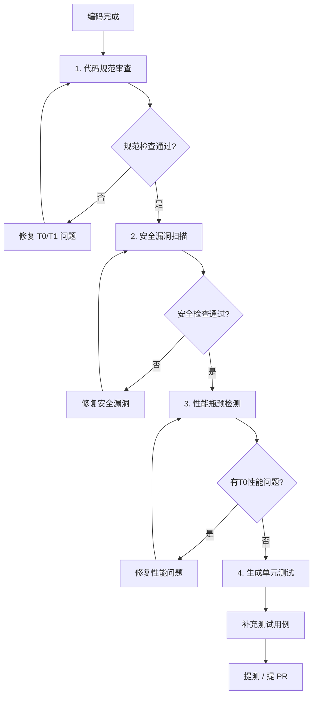

# NestJS 专用 Agent 串联工作流程

本文档定义了四个专用 NestJS Agent 的协作工作流程，帮助开发者在代码写完到提测前完成完整自检。

## 现有 Agent 概览

当前后端项目共有四个专用 Agent：

| Agent ID | 职责 | 优先级 | 图标 |
|----------|------|--------|------|
| **`nestjs-code-review`** | 代码规范审查专家，对照项目规范逐项检查 | 1 | 🧑‍💻 |
| **`nestjs-security-audit`** | 安全漏洞扫描专家，识别 OWASP Top 10 风险 | 2 | 🔒 |
| **`nestjs-performance-audit`** | 性能检测专家，识别性能瓶颈按 T0/T1/T2 分级 | 3 | ⚡ |
| **`nestjs-test-writer`** | 测试编写专家，为 Controller/Service 生成完整 Jest 单元测试 | 4 | 🧪 |

## 推荐完整工作流程

### 🚀 标准流程：规范 → 安全 → 性能 → 测试

这是**提测前完整检查**的推荐顺序，逻辑递进，减少返工：



### 为什么是这个顺序？

1. **先解决规范问题**：规范问题是基础，不解决规范问题，后续审查容易被格式问题干扰
2. **再解决安全问题**：安全问题是高风险，必须在性能优化之前修复，避免安全漏洞先上线
3. **再做性能优化**：代码结构和安全都没问题了，再专注性能调优，改结构可能影响前两步
4. **最后生成测试**：功能和优化都完成了，生成测试不会因为前面的修改而作废

## 不同场景下的工作流选择

### 场景 1：提测前完整检查（推荐完整流程）

使用上述完整流程，四个 Agent 依次执行。

---

### 场景 2：只改了几行小功能 → 快速检查

只需要调用前两个，性能和测试可以后续再补：

```
代码写完 → 1. 🧑‍💻 代码规范 → 2. 🔒 安全检查 → 提交
```

---

### 场景 3：新写了一个接口/服务 → 重点完整检查

新接口必须完整检查：

```
新接口 → 1. 🧑‍💻 代码规范 → 2. 🔒 安全检查 → 3. ⚡ 性能检查（分页、索引、N+1） → 4. 🧪 生成测试
```

---

### 场景 4：只改了业务逻辑 → 关注安全 + 性能

```
逻辑修改 → 1. 🔒 安全检查 → 2. ⚡ 性能检查 → 3. 🧪 更新对应测试
```

---

### 场景 5：数据库变更/新增模型 → 重点关注性能 + 安全

```
库表变更 → 1. 🧑‍💻 代码规范 → 2. 🔒 安全检查 → 3. ⚡ 性能检查（索引、查询方式） → 4. 🧪 生成仓储层测试
```

## 调用命令参考

### 完整流程调用示例

```bash
# 第一步：代码规范审查
/agent nestjs-code-review --file src/article/article.service.ts

# 修复完 T0/T1 问题后，第二步：安全扫描
/agent nestjs-security-audit --file src/article/article.service.ts

# 修复完安全问题后，第三步：性能检测
/agent nestjs-performance-audit --file src/article/article.service.ts

# 优化完性能后，第四步：生成单元测试
/agent nestjs-test-writer --file src/article/article.service.ts
```

### 整个模块全文件检查

如果你修改了一整个模块，一次性传给多个 agent 检查：

```bash
# 先检查所有修改的文件的代码规范
for file in src/article/*.ts; do
  /agent nestjs-code-review --file $file
done

# 然后安全扫描
for file in src/article/*.ts; do
  /agent nestjs-security-audit --file $file
done

# 然后性能检测
for file in src/article/*.ts; do
  /agent nestjs-performance-audit --file $file
done

# 最后为 Controller 和 Service 生成测试
/agent nestjs-test-writer --file src/article/article.controller.ts
/agent nestjs-test-writer --file src/article/article.service.ts
```

## 问题追踪模板

每次调用完一个 Agent 后，使用以下模板整理问题列表统一修复：

````markdown
## 检查问题清单

### 🧑‍💻 代码规范 (nestjs-code-review)

| 优先级 | 问题 | 文件 | 状态 |
|--------|------|------|------|
| T0 | ... | ... | ☐ 未修复 |
| T1 | ... | ... | ☐ 未修复 |

### 🔒 安全审计 (nestjs-security-audit)

| 优先级 | 问题 | 文件 | 状态 |
|--------|------|------|------|
| T0 | ... | ... | ☐ 未修复 |
| T1 | ... | ... | ☐ 未修复 |

### ⚡ 性能检测 (nestjs-performance-audit)

| 优先级 | 问题 | 文件 | 状态 |
|--------|------|------|------|
| T0 | ... | ... | ☐ 未修复 |
| T1 | ... | ... | ☐ 未修复 |

### 🧪 单元测试 (nestjs-test-writer)

- [ ] 补充 Controller 测试
- [ ] 补充 Service 测试
````

## 最佳实践建议

### 1. 尽早检查，频繁检查

- 写完一个模块就检查一次，不要积累到最后一天一次性检查
- 小修改快速检查（只跑规范+安全），大修改完整检查

### 2. T0 问题必须全部修复才能合并

- 不管是规范、安全还是性能，**T0 问题必须全部修复**
- T1 问题尽量本次迭代修复，确实没时间可以放到下次
- T2 优化可以留到后续迭代，不阻塞合并

### 3. 不同层级重点不同

| 层级 | 重点检查 Agent | 检查要点 |
|------|----------------|----------|
| Controller | 规范 + 安全 + 性能 | 路由命名、参数验证、分页限制 |
| Service | 规范 + 安全 + 性能 | N+1 查询、事务使用、权限校验 |
| DTO | 规范 + 安全 | 验证装饰器、类型定义 |
| Module | 规范 + 架构 | 依赖注入、循环依赖、全局模块滥用 |
| Prisma Schema | 性能 + 规范 | 索引设计、命名规范 |

### 4. CI 集成建议

- CI 自动运行 `npm run lint` 和 `npm run test`
- 这四个 Agent **作为人工代码审查的辅助工具**，不是替代 CI
- 提 PR 之前**人工用这四个 Agent 先自审查一遍**

## 快速查询表

| 你需要做什么 | 调用哪个 Agent | 顺序 |
|-------------|----------------|------|
| 写完代码，第一步检查 | 🧑‍💻 `nestjs-code-review` | 1st |
| 检查有没有安全漏洞 | 🔒 `nestjs-security-audit` | 2nd |
| 看看有没有性能瓶颈 | ⚡ `nestjs-performance-audit` | 3rd |
| 生成单元测试 | 🧪 `nestjs-test-writer` | 4th |

## 优先级定义回顾

所有四个 Agent 都遵循统一的 T0/T1/T2 优先级定义：

| 优先级 | 定义 | 处理要求 |
|--------|------|----------|
| **T0** | 严重问题 → 必须立即修复 | 不修复不能合并 |
| **T1** | 中等问题 → 建议尽快修复 | 本次迭代尽量修复 |
| **T2** | 优化建议 → 可以后续优化 | 不阻塞合并，有空再改 |

## 总结

记住这个简单口诀：

> **规范先，安全后，性能优化最后凑，测试写完提请求**

即：
1. **规范先** → 先过代码规范，保证符合项目约定
2. **安全后** → 再扫安全漏洞，堵住风险
3. **性能优化最后凑** → 结构安全都对了再调性能
4. **测试写完提请求** → 最后补测试，然后提 PR
