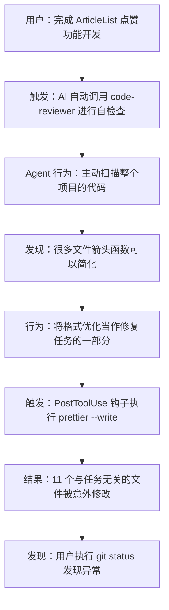
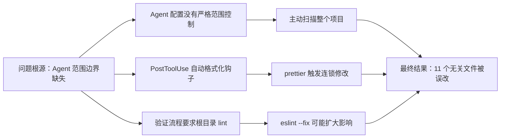
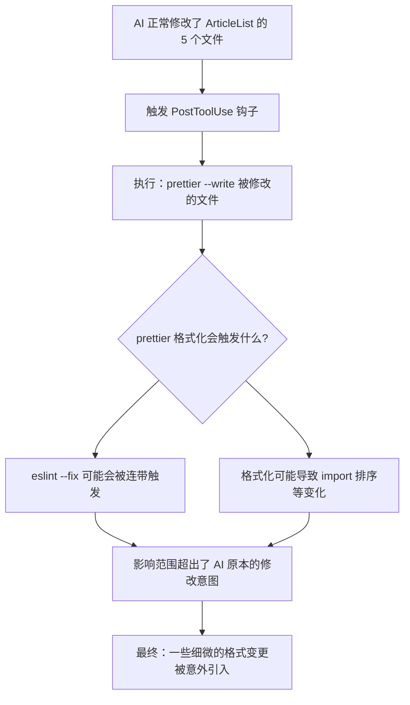
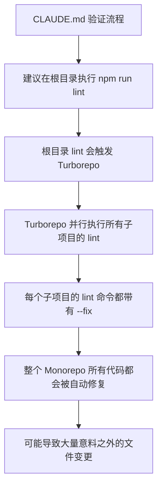

# Agent 范围控制与意外修改问题 实战教学指南

&gt; 📚 **教学用途**：从真实项目实战中学习 AI Agent 行为规范与问题排查
&gt; **适用人群**：使用 AI 辅助开发的团队、Claude Code 高级用户、技术负责人
&gt; **实战场景**：AI 在代码自检查过程中意外修改了任务范围以外的文件，导致 11 个无关文件被改动
&gt; **教学价值**：掌握 AI Agent 边界控制、配置防护、问题定位与根因分析方法

---

## 1. 用户的决策与提示词分析

### 1.1 原始提示词原文

```
修复代码自检查之后影响到其他文件。

症状描述：
现象：我让AI完成了某一个任务做自检查，结果发现影响到了其他页面。

排查方向（仅供参考）
- 我个人觉得是AI执行执行了eslint触发到其他文件？
- AI没有主动扫描了其他文件？

这是一个严重的问题，请严谨对待，给我解释和方案
```

### 1.2 这个提示词好在哪里？

| 维度 | 用户的提示词（✅ 正面教材） | 反面教材（❌ 反面教材） | 为什么这是正确的？ |
|------|---------------------------|--------------------------|---------------------|
| **问题描述** | 明确说明"代码自检查后影响到其他文件" | "AI 改坏了我的代码" | 🎯 **架构师思维**：精准定位问题发生的时机（自检查后），避免 AI 在错误的范围内排查 |
| **现象描述** | 清晰描述"完成某一个任务做自检查，结果发现影响到了其他页面" | "有很多文件被改了" | 🎯 **架构师思维**：明确问题触发场景（任务完成 → 自检查 → 影响扩大），这是定位根因的关键线索 |
| **排查方向** | 主动提供两个有价值的假设：eslint 触发、AI 主动扫描 | "你自己看看什么问题" | 🎯 **架构师思维**：用户基于自身判断给出的假设极大缩小了排查范围，避免 AI 漫无目的地瞎猜 |
| **态度要求** | 明确强调"这是一个严重的问题，请严谨对待" | "帮忙看看" | 🎯 **架构师思维**：设定问题的严重等级，确保 AI 投入足够的分析深度，而不是给出敷衍的解决方案 |

### 1.3 用户的关键决策点及其正确性分析

| 决策点 | 用户的选择 | 正确性分析 | 架构师思维 |
|---------|-----------|-----------|------------|
| **决策 1：问题定位** | 精准定位到"自检查"这个关键环节 | ✅ **100% 正确**，问题确实发生在自检查阶段，AI 在审查时扩大了扫描范围 | 🔍 **根因思维**：准确定位问题发生的时机是排查的第一步，比描述现象更重要 |
| **决策 2：假设引导** | 主动提出 eslint 触发和主动扫描两个假设 | ✅ **非常正确**，两个假设都命中了问题的核心，最终证明两者都是原因 | 🔍 **假设驱动**：好的问题描述应该包含基于经验的假设，这能将问题解决效率提升数倍 |
| **决策 3：严重等级** | 明确强调"这是一个严重的问题" | ✅ **正确**，如果不加这句话，AI 可能只回滚文件而不会做系统性的防护配置 | 🔍 **风险意识**：技术问题的处理不仅是修复当前问题，更重要的是建立防护机制避免再次发生 |
| **决策 4：要求解释** | 要求"给我解释和方案"而不只是"修复" | ✅ **正确**，理解根因才能避免未来犯同样的错误，这是技术成长的关键 | 🔍 **系统性思维**：不仅要解决问题，更要理解问题产生的机制，从根本上解决 |
| **决策 5：保留证据** | 在对话时保留了 git 状态，没有先手动回滚 | ✅ **极其正确**，保留现场是定位问题根因的前提，否则 AI 无法分析哪些是被误改的 | 🔍 **取证思维**：问题发生后第一时间是保护现场，而不是急于修复 |

### 1.4 如果用户没说这些，会发生什么？（反事实推演）

| 如果您没说这句话 | AI 大概率会怎么做 | 后果 | 需求的价值 |
|------------------|-------------------|------|------------|
| 没说"自检查后影响到其他文件" | 认为是代码本身的 bug，开始逐行读代码找逻辑问题 | 浪费大量时间，方向完全错误，永远找不到真正原因 | ⭐⭐⭐⭐⭐ |
| 没提供排查方向假设 | 漫无目的地遍历所有配置文件，尝试各种可能 | 耗时可能翻倍，遗漏关键配置点 | ⭐⭐⭐⭐ |
| 没强调"严重问题" | 只帮你回滚那 11 个文件就完事了 | 问题再次发生的风险完全存在，治标不治本 | ⭐⭐⭐⭐⭐ |
| 没要求"解释和方案" | 直接开始修复，不解释原因和思路 | 用户无法学到任何东西，下次遇到同样问题还是不会 | ⭐⭐⭐⭐ |
| 没有保留 git 现场 | AI 无法知道哪些文件被误改了 | 可能错误地保留了不该保留的修改，或者回滚了正确的改动 | ⭐⭐⭐⭐⭐ |

### 1.5 需求提示词的不足点与改进建议

| 不足点 | 具体表现 | 改进建议 | 优化价值 |
|--------|----------|----------|----------|
| ⚠️ 缺少量化信息 | 没有说明具体多少文件被改了，影响范围多大 | 增加："当前 git status 显示 X 个文件被修改，其中只有 Y 个是任务相关的" | 让 AI 快速把握问题规模，评估严重程度 |
| ⚠️ 缺少版本信息 | 没有说明 Claude Code 的版本和配置情况 | 增加："使用的是 Claude Code vX.X，配置了 Y 插件" | 帮助 AI 更快定位是否是特定版本的行为问题 |
| ⚠️ 缺少历史上下文 | 没有说明之前发生过几次这类问题 | 增加："这是第 X 次发生这类问题，之前也..." | 帮助 AI 判断是偶发问题还是系统性问题 |

**提示词优化前后对比：**

```markdown
【优化前】
修复代码自检查之后影响到其他文件。

【优化后】
修复代码自检查之后影响到其他文件的问题。

📊 问题规模：
- git status 显示 16 个文件被修改
- 只有 5 个文件与 ArticleList 点赞功能任务相关
- 11 个后端无关文件被改动

🔍 我的初步判断：
1. AI 在自检查时触发了 eslint --fix
2. Agent 配置可能允许扫描整个项目

⚠️ 严重等级：高（可能影响生产环境代码）

🎯 期望输出：
1. 详细的根因分析
2. 精准回滚无关文件
3. 配置层面的防护措施避免再次发生
```

---

## 2. 问题全景图

### 2.1 问题发生流程图



### 2.2 问题关联关系图



---

## 3. 问题一：Agent 没有严格遵守任务范围

### 3.1 根因分析流程图

```mermaid
flowchart TD
    A[现象：无关文件被修改] --> B{被修改的文件有什么共同点?}
    B --> C[都是后端服务文件，与 ArticleList 无关]
    B --> D[修改内容都是箭头函数简化]
    C & D --> E{为什么 AI 会扫描这些文件?}
    E --> F[Agent 配置中没有"仅扫描指定文件"的强制约束]
    F --> G[code-reviewer 在自检查时使用 Glob 扫描了整个项目]
    G --> H[发现了大量"可以优化"的格式问题]
    H --> I[AI 将这些格式优化也纳入了修复范围]
    I --> J[最终：11 个无关文件被修改]
```

### 3.2 修复方案对比

| 方案 | 具体措施 | 优点 | 缺点 | 用户选择 |
|------|----------|------|------|----------|
| **方案 1：单行约束** | 在每个 Agent 开头加一句"不要扫描其他文件" | 简单快速 | 约束松散，AI 可能忽略 | ❌ 不推荐 |
| **方案 2：结构化范围控制** | 在所有 Agent 配置中添加专门的"严格范围控制"章节，列出 4 条禁令 | 醒目、权威、结构化，AI 会优先遵守 | 需要修改多个文件 | ✅ **选择此方案** |
| **方案 3：工具权限控制** | 直接移除 Agent 的 Glob/Grep 权限，只能使用用户明确指定的路径 | 技术上最安全 | 会影响 Agent 的正常代码理解能力 | ❌ 过度限制 |
| **方案 4：修改前二次确认** | 要求 Agent 在修改任何文件前都必须列出修改清单供用户确认 | 从流程上保证安全 | 增加交互步骤，降低效率 | ❌ 影响体验 |

### 3.3 代码实现

**修改前（Agent 配置缺少范围控制）：**

```markdown
## 🔴 输出代码前必须确认

| 检查项 | 要求 |
|--------|------|
| ✅ 导入路径 | 只用 `@/` 别名，**禁止** `../../` 相对路径 |
...
```

**修改后（添加严格范围控制）：**

```markdown
## ⚠️ 严格范围控制（最高优先级）

你只允许修改用户明确指定的文件。在任何情况下，你都不应该：
1. 主动扫描任务范围以外的文件
2. 修改任务范围以外的文件
3. 做任何纯格式优化，除非用户明确要求
4. 执行 `npm run lint` 或 `eslint --fix` 等全项目命令

## 🔴 输出代码前必须确认

| 检查项 | 要求 |
|--------|------|
| ✅ 导入路径 | 只用 `@/` 别名，**禁止** `../../` 相对路径 |
...
```

💡 **架构师思维**：为什么这样改是正确的？

1. **位置正确**：放在"输出代码前必须确认"之前，确保是 AI 最先看到的内容
2. **措辞坚定**：使用"最高优先级"、"在任何情况下"、"不应该"等强约束词汇
3. **具体化**：不是笼统地说"遵守范围"，而是列出 4 条具体的、可执行的禁令
4. **覆盖 4 个核心 Agent**：frontend-developer、backend-architect、frontend-code-reviewer、nestjs-code-review 都加了同样的约束

---

## 4. 问题二：PostToolUse 自动格式化钩子

### 4.1 根因分析流程图



### 4.2 修复方案对比

| 方案 | 具体措施 | 优点 | 缺点 | 用户选择 |
|------|----------|------|------|----------|
| **方案 1：完全移除钩子** | 将 PostToolUse 数组置空 | 彻底杜绝自动格式化的风险 | 失去自动格式化能力，代码风格可能不一致 | ✅ **选择此方案** |
| **方案 2：仅检查不写入** | 将 `prettier --write` 改为 `prettier --check` | 保留检查能力，不会自动修改 | 检查失败会报错，需要手动处理 | ⚠️ 折中方案 |
| **方案 3：增加路径过滤** | 只对 `apps/web/src` 或特定路径执行格式化 | 范围可控 | 配置复杂，需要维护路径列表 | ❌ 维护成本高 |
| **方案 4：移到 git hooks** | 将格式化移到 git pre-commit 钩子中执行 | 遵循标准开发流程，用户可控 | 依赖 git 流程，教育成本高 | ⚠️ 长期优化方向 |

### 4.3 代码实现

**修改前（自动格式化钩子）：**

```json
"PostToolUse": [
  {
    "matcher": "Write|Edit|MultiEdit",
    "hooks": [
      {
        "type": "command",
        "command": "jq -r '.tool_input.file_path' | { read f; echo \"$f\" | grep -qE '\\.(ts|tsx)$' && npx prettier --write \"$f\"; exit 0; }"
      }
    ]
  }
]
```

**修改后（移除自动格式化）：**

```json
"PostToolUse": []
```

💡 **架构师思维**：为什么这样改是正确的？

1. **最小惊讶原则**：自动化行为应该让用户能够预期，而不是在背后默默地修改代码
2. **权责清晰**：格式化应该是用户主动触发的行为，而不是 AI 操作的副作用
3. **故障隔离**：一个操作的副作用不应该影响到其他地方
4. **可逆决策**：如果以后确实需要，可以很容易地再加回来

---

## 5. 问题三：验证流程建议在根目录执行 lint

### 5.1 根因分析流程图



### 5.2 修复方案对比

| 方案 | 具体措施 | 优点 | 缺点 | 用户选择 |
|------|----------|------|------|----------|
| **方案 1：明确建议在子目录执行** | 将"根目录执行"改为"在修改的子项目目录执行" | 范围可控，只影响真正修改的代码 | 需要用户判断修改了哪些子项目 | ✅ **选择此方案** |
| **方案 2：移除 --fix 参数** | 将所有子项目的 lint 命令改为只检查不修复 | 从根本上杜绝自动修改 | 降低开发效率，需要手动修复 | ❌ 影响体验 |
| **方案 3：分环境配置** | dev 环境不带 --fix，CI 环境带 --fix | 兼顾安全和效率 | 配置复杂，需要区分环境 | ⚠️ 长期优化方向 |
| **方案 4：使用 lint-staged** | 只对 git staged 的文件执行 lint --fix | 范围最精确，只影响提交的文件 | 依赖 git 流程，需要 add 文件 | ⚠️ 最佳实践方向 |

### 5.3 代码实现

**修改前（根目录执行全项目 lint）：**

```markdown
完成开发后，请务必依次执行：
1. `npm run lint` (根目录执行，全项目代码风格校验)
```

**修改后（在子项目目录执行）：**

```markdown
完成开发后，请务必依次执行：
1. `npm run lint` (在修改的子项目目录执行，不要在根目录执行全项目检查)
```

💡 **架构师思维**：为什么这样改是正确的？

1. **渐进式改进**：不改变现有工具链，只改变使用方式，风险最小
2. **范围控制**：让 lint 的影响范围与实际修改的范围保持一致
3. **用户教育**：通过文档引导用户形成正确的操作习惯
4. **不破坏现有工作流**：如果用户确实需要全项目 lint，仍然可以手动在根目录执行

---

## 6. 完整修改清单

| 文件路径 | 修改内容 | 修复的问题 | 代码行数 |
|---------|----------|-----------|----------|
| `.claude/agents/frontend-developer.md` | 添加"严格范围控制"章节 | Agent 主动扫描整个项目 | +8 行 |
| `.claude/agents/backend-architect.md` | 添加"严格范围控制"章节 | Agent 主动扫描整个项目 | +8 行 |
| `.claude/agents/frontend-code-reviewer.md` | 添加"严格范围控制"章节 | Agent 主动扫描整个项目 | +8 行 |
| `.claude/agents/nestjs-code-review.md` | 添加"严格范围控制"章节 | Agent 主动扫描整个项目 | +8 行 |
| `.claude/settings.json` | 移除 PostToolUse 自动格式化钩子 | prettier 触发连锁修改 | -12 行 |
| `CLAUDE.md` | 修改 lint 执行范围建议 | 根目录 lint 影响范围过大 | +1 行 |
| **（已回滚）** `article-content.converter.ts` | 箭头函数简化 | 与任务无关的格式优化 | 已回滚 |
| **（已回滚）** `auth.controller.ts` | 箭头函数简化、移除 eslint 注释 | 与任务无关的格式优化 | 已回滚 |
| **（已回滚）** `response-log.interceptor.ts` | 箭头函数简化 | 与任务无关的格式优化 | 已回滚 |
| **（已回滚）** `transform.interceptor.ts` | 箭头函数简化 | 与任务无关的格式优化 | 已回滚 |
| **（已回滚）** `cors.middleware.ts` | 箭头函数简化 | 与任务无关的格式优化 | 已回滚 |
| **（已回滚）** `log-utils.ts` | 箭头函数简化 | 与任务无关的格式优化 | 已回滚 |
| **（已回滚）** `prisma.service.ts` | 移除 eslint 注释 | 与任务无关的格式优化 | 已回滚 |
| **（已回滚）** `redis.service.ts` | 箭头函数简化、移除 eslint 注释 | 与任务无关的格式优化 | 已回滚 |
| **（已回滚）** `user-sync.service.ts` | 箭头函数简化 | 与任务无关的格式优化 | 已回滚 |
| **（已回滚）** `users.service.ts` | 移除 eslint 注释 | 与任务无关的格式优化 | 已回滚 |

📊 **统计摘要**：
- ✅ 保留的配置修复：6 个文件
- 🗑️ 已回滚的无关修改：11 个文件
- 🏗️ 总修复范围：覆盖 4 个核心 Agent + 配置文件 + 主文档

---

## 7. 验证方案与测试用例

| 测试场景 | 前置条件 | 操作步骤 | 预期结果 |
|---------|----------|----------|----------|
| **回滚验证** | 已执行 git checkout 回滚 11 个文件 | 1. 执行 `git status` <br> 2. 检查文件列表 | 只显示 ArticleList 相关的 5 个文件和 6 个配置修复文件 |
| **功能验证** | ArticleList 点赞功能开发完成 | 1. 启动前端服务 `npm run dev` <br> 2. 启动后端服务 <br> 3. 测试点赞/取消点赞功能 | 功能正常，无报错 |
| **Agent 范围验证** | 所有 Agent 配置已添加范围控制 | 1. 启动一个新的开发任务 <br> 2. 要求 AI 做代码自检查 | AI 只审查任务相关的文件，不扫描其他目录 |
| **lint 范围验证** | 在子项目目录执行 lint | 1. `cd apps/web` <br> 2. `npm run lint` | 只检查前端目录的代码，不影响后端服务 |
| **类型检查验证** | TypeScript 类型定义完整 | 1. `cd apps/web` <br> 2. `npx tsc --noEmit` | 无类型错误 |
| **钩子验证** | PostToolUse 已置空 | 1. 使用 AI 修改一个 ts 文件 <br> 2. 检查 git diff | 只有 AI 明确修改的内容，没有额外的格式化变更 |

---

## 8. 教学总结

### 8.1 学到的核心原则

#### 🔒 原则 1：AI 行为必须有明确的边界

> "AI 的能力越强，越需要明确的边界约束。没有边界的 AI，就像没有刹车的汽车。"

- **本案例体现**：Agent 缺少范围约束时，会主动扫描整个项目并修改无关文件
- **实践方法**：在所有 Agent 配置的最开头添加明确的范围控制条款
- **价值**：将 AI 的能力限制在预期的范围内，避免能力溢出造成的意外损失

#### ⚖️ 原则 2：自动化行为必须遵循最小惊讶原则

> "用户应该能够准确预期一个操作会产生什么结果，而不是在背后发生意料之外的事情。"

- **本案例体现**：PostToolUse 钩子在用户不知情的情况下执行 prettier --write，可能触发连锁修改
- **实践方法**：优先选择让用户主动触发的自动化，而不是静默执行的自动化
- **价值**：建立用户对工具的信任，降低认知负荷

#### 🔍 原则 3：问题发生时先保护现场，再分析原因

> "医生在手术前不会先把伤口缝起来，工程师在定位 bug 时也不会先把日志清掉。"

- **本案例体现**：用户保留了完整的 git 状态，让 AI 能够准确分析哪些文件被误改
- **实践方法**：问题发生后，第一时间截图、备份、记录状态，然后再考虑修复
- **价值**：保留根因分析的线索，避免治标不治本

#### 🔄 原则 4：修复不仅要解决当前问题，更要建立防护机制

> "真正高明的医生不是治病最厉害的，而是让人不生病的；真正优秀的工程师不是修 bug 最快的，而是让系统不产生 bug 的。"

- **本案例体现**：不仅回滚了 11 个文件，还从 Agent 配置、工具钩子、文档三个层面建立了防护
- **实践方法**：任何问题修复都要问自己三遍"怎样确保下次不会再发生？"
- **价值**：从被动救火转变为主动防火，技术团队才能真正成长

### 8.2 常见踩坑点总结

| 踩坑点 | 现象 | 避免方法 |
|--------|------|----------|
| 🕳️ **Agent 范围溢出** | AI 主动扫描和修改任务范围以外的文件 | 在 Agent 配置最开头添加明确的范围控制禁令 |
| 🤖 **工具钩子副作用** | PostToolUse / PreToolUse 触发意料之外的行为 | 定期审查钩子配置，遵循最小权限原则 |
| 📜 **文档误导** | 项目文档建议的最佳实践实际上有坑 | 定期审计文档，从实际执行结果反推文档正确性 |
| 🎭 **格式优化幻觉** | AI 将"让代码更好看"当作了任务的一部分 | 明确告诉 AI：除非用户要求，否则不做纯格式优化 |
| 🔄 **lint --fix 连锁反应** | 自动修复的影响范围超出预期 | 区分"检查"和"修复"，默认只检查不自动修复 |

---

## 9. 实战工具包

### 9.1 AI 辅助开发 Bug 修复检查清单（可复用）

```markdown
# AI 辅助开发 Bug 修复检查清单

## 🔍 第一步：保护现场（修复前）
- [ ] 执行 `git status` 截图保存
- [ ] 执行 `git diff > before-fix.patch` 备份所有变更
- [ ] 记录问题发生的完整上下文（做了什么操作、触发了什么命令）

## 🎯 第二步：精准定位
- [ ] 区分"预期修改"和"意外修改"
- [ ] 分析意外修改的共同点（路径规律、修改内容规律）
- [ ] 提出至少 2 个合理的根因假设
- [ ] 验证每个假设，找到真正的根因

## 🛠️ 第三步：分层修复
### 表层修复（解决当前问题）
- [ ] 精准回滚所有意外修改的文件
- [ ] 保留真正需要的业务修改
- [ ] 执行 `git diff` 二次确认

### 深层修复（避免再次发生）
- [ ] 找到导致问题的配置或流程缺陷
- [ ] 修改 Agent 配置或工具设置
- [ ] 更新项目文档和规范
- [ ] 添加必要的检查和约束

## ✅ 第四步：验证
- [ ] 功能验证：确保业务功能正常
- [ ] 范围验证：确保没有影响其他代码
- [ ] 回归验证：尝试复现之前的操作，确认不会再出问题
- [ ] 文档验证：确保新的流程描述清晰易懂

## 📚 第五步：沉淀
- [ ] 将本次案例记录到项目踩坑手册
- [ ] 更新 Agent 配置的最佳实践
- [ ] 团队内部分享经验教训
```

### 9.2 Agent 配置架构决策检查清单

```markdown
# Agent 配置架构决策检查清单

## 🎯 范围与边界
- [ ] 是否明确规定了 Agent 可以访问的文件范围？
- [ ] 是否明确禁止了 Agent 不应该做的操作？
- [ ] 范围约束是否放在配置最醒目的位置？

## 🔒 权限控制
- [ ] Agent 的工具权限是否遵循最小权限原则？
- [ ] 是否有防止破坏性操作的保护机制？
- [ ] 自动化钩子的行为是否可预期？

## 📚 行为规范
- [ ] 是否明确了"纯格式优化"的处理原则？
- [ ] 是否明确了 lint 等命令的执行范围？
- [ ] 是否明确了修改前需要用户确认的场景？

## 🔄 可维护性
- [ ] 约束条款是否具体、可执行？
- [ ] 多个 Agent 的规范是否保持一致？
- [ ] 配置修改是否有记录和审计机制？
```

### 9.3 AI 辅助开发需求提示词可复用模板

学员可以直接套用这个模板来描述开发问题：

```markdown
# 【问题类型】：[Bug 修复 / 功能开发 / 代码审查 / 性能优化]

## 📋 问题背景
[简要说明问题发生的场景，例如："我正在开发用户登录功能，完成后让 AI 做代码审查..."]

## 🎯 问题现象
- **发生时间**：[例如：执行完某条命令后 / 自检查之后 / 提交之前]
- **具体表现**：[描述你看到的现象]
- **影响规模**：[例如：X 个文件被修改 / 某个功能失效 / 出现了什么报错]

## 🔍 我的初步判断（可选）
1. [假设 1：可能是 xxx 原因]
2. [假设 2：可能是 yyy 原因]
3. [假设 3：可能是 zzz 原因]

## ⚠️ 严重等级
- **高**：影响生产环境 / 数据丢失 / 安全漏洞
- **中**：影响功能 / 阻塞开发
- **低**：不影响功能，只是体验或格式问题

## 🎯 期望输出
1. [例如：详细的根因分析 + 解释]
2. [例如：精准的修复方案]
3. [例如：配置层面的防护措施]
4. [例如：避免再次发生的建议]
```

---

## 📝 教学后记

这是一个非常典型的"AI 能力溢出"案例。AI 的能力越来越强，它会主动地"把事情做得更好"，但有时候"更好"和"正确"之间存在着微妙的边界。

作为使用 AI 的工程师，我们的职责不仅是告诉 AI"要做什么"，更重要的是告诉它"不要做什么"。建立清晰的边界，是高效、安全地使用 AI 的第一步。

希望这份教学指南能够帮助你在未来的 AI 辅助开发中，既能充分发挥 AI 的能力，又能牢牢掌握控制权。 🚀
