# 01 - 认证模块核心类

---

## 📊 类图

```mermaid
classDiagram
    direction TB

    class AuthController {
        -isProduction: boolean
        +login(LoginDto, clientIp, res): Promise~LoginResponseDto~
        +refreshToken(refreshToken, req, res): Promise~RefreshResponseDto~
        +logout(userId, res, refreshToken?): Promise~void~
        +register(RegisterDto, clientIp, res): Promise~RegisterResponseDto~
    }

    class AuthService {
        -argon2Options: Options
        +register(registerDto, clientIp): Promise~RegisterResponseDto~
        +login(loginDto, clientIp): Promise~LoginResponseDto~
        +refreshToken(refreshToken): Promise~RefreshResponseDto~
        +logout(userId, refreshToken?): Promise~void~
    }

    class TokenGeneratorService {
        -jwtSecret: string
        -jwtRefreshSecret: string
        -tokenExpiresIn: number
        -refreshExpiresIn: number
        +generateAndSaveTokens(userId, clientIp): Promise~TokenResult~
        +generateAccessToken(userId, deviceId): string
        +buildUserDto(user): UserDto
        +getTokenExpiresIn(): number
        +getJwtRefreshSecret(): string
    }

    class UserLoaderService {
        +loadUser(username): Promise~LoadUserResult~
        -findUserByUsername(username): Promise~LoadedUser~
    }

    class PasswordValidationService {
        -argon2Options: Options
        +validatePassword(plainPassword, user): Promise~boolean~
        +processValidPassword(user, userFromDb, clientIp): Promise~void~
        +handleLoginFailure(user): Promise~void~
        +startSilentMigration(user, plainPassword): void
    }

    class RefreshTokenRedisService {
        +saveRefreshToken(token, userId, expiresAt, clientIp): Promise~void~
        +getRefreshToken(token): Promise~RefreshTokenData~
        +deleteRefreshToken(userId, token): Promise~void~
        +deleteAllUserRefreshTokens(userId): Promise~number~
        +cleanupExpiredTokens(): Promise~number~
    }

    class JwtAuthGuard {
        -jwtSecret: string
        +canActivate(context): boolean
        -extractTokenFromHeader(request): string
        -extractTokenFromCookie(request): string
    }

    class LoginDto {
        +username: string
        +password: string
    }

    class LoginResponseDto {
        +accessToken: string
        +refreshToken: string
        +expiresIn: number
        +user: UserDto
    }

    class RegisterDto {
        +mobile: string
        +password: string
    }

    class RegisterResponseDto {
        +accessToken: string
        +refreshToken: string
        +expiresIn: number
        +user: UserDto
    }

    class RefreshDto {
        +refreshToken: string
    }

    class RefreshResponseDto {
        +accessToken: string
        +expiresIn: number
    }

    class UserDto {
        +id: string
        +username: string
        +email: string
        +nickname: string
        +avatar: string
    }

    class RedisService {
        +get(key): Promise~string~
        +set(key, value, ...args): Promise~void~
        +del(key): Promise~void~
        +exists(key): Promise~number~
        +sadd(key, member): Promise~number~
        +srem(key, member): Promise~number~
        +smembers(key): Promise~string[]~
        +expire(key, seconds): Promise~number~
        +pipeline(): Pipeline
    }

    class PrismaService {
        +onModuleInit(): Promise~void~
        +onModuleDestroy(): Promise~void~
        +users: UsersDelegate
    }

    AuthController --> AuthService : 使用
    AuthController ..> LoginDto : 接收
    AuthController ..> RegisterDto : 接收
    AuthController ..> RefreshDto : 接收
    AuthController ..> LoginResponseDto : 返回
    AuthController ..> RegisterResponseDto : 返回
    AuthController ..> RefreshResponseDto : 返回

    AuthService --> TokenGeneratorService : 生成 Token
    AuthService --> UserLoaderService : 加载用户
    AuthService --> PasswordValidationService : 验证密码
    AuthService --> RefreshTokenRedisService : 管理刷新令牌

    TokenGeneratorService --> RefreshTokenRedisService : 保存令牌
    UserLoaderService --> PrismaService : 数据库访问
    UserLoaderService --> RedisService : 缓存访问
    PasswordValidationService --> PrismaService : 数据库访问
    PasswordValidationService --> RedisService : 缓存访问
    RefreshTokenRedisService --> RedisService : 存储

    JwtAuthGuard ..|> CanActivate : 实现

    note for AuthService "核心协调服务：
    1. 注册：创建用户 → 生成 Token → 同步缓存
    2. 登录：加载用户 → 验证密码 → 生成 Token
    3. 刷新：验证刷新令牌 → 生成新访问令牌
    4. 登出：删除刷新令牌（支持单设备/全设备）
    5. 密码迁移：bcrypt → argon2id（异步静默）"

    note for TokenGeneratorService "Token 生成服务：
    1. 生成 JWT 访问令牌（Access Token）
    2. 生成 JWT 刷新令牌（Refresh Token）
    3. 保存刷新令牌到 Redis
    4. 组装用户响应 DTO"

    note for UserLoaderService "用户加载服务：
    1. 优先从 Redis 预加载缓存获取
    2. 缓存未命中回源数据库
    3. 查询成功后回填缓存
    4. 返回用户信息和来源标记"

    note for PasswordValidationService "密码验证服务：
    1. 支持多种算法（argon2id/bcrypt）
    2. 验证成功后写入密码缓存
    3. 处理登录失败（预留锁定功能）
    4. 异步静默迁移（bcrypt → argon2id）"

    note for RefreshTokenRedisService "刷新令牌 Redis 服务：
    1. 保存刷新令牌（Hash + Set 结构）
    2. 获取刷新令牌信息
    3. 删除单个/所有刷新令牌
    4. 使用 Redis TTL 自动过期"
```



---

## 🧠 复刻时的思考

### 1. 为什么 AuthService 要依赖这么多细粒度服务？不能放在一个类里吗？

```
✅ 服务拆分的业务背景：

1. TokenGeneratorService - Token 生成职责单一
   → 负责 JWT 生成、刷新令牌存储
   → 便于未来替换 Token 策略（如改用 OAuth）

2. UserLoaderService - 用户加载逻辑复杂
   → 缓存优先、数据库回源、缓存回填
   → 独立出来便于测试和复用

3. PasswordValidationService - 密码验证逻辑独立
   → 验证、迁移、失败处理
   → 算法细节封装，避免 AuthService 膨胀

4. RefreshTokenRedisService - Redis 操作封装
   → 刷新令牌的 CRUD
   → 数据结构设计（Hash + Set）

✅ 为什么不放在一个类里？
- 单一职责原则：每个服务只做一件事
- 可测试性：每个服务可以独立测试
- 可维护性：修改密码策略不影响 Token 生成
- 可复用性：UserLoaderService 可能在其他场景复用

💡 这是 NestJS 的最佳实践：
Controller 只处理 HTTP，Service 协调多个领域服务
```

### 2. 为什么用户加载要分"缓存优先"和"数据库回源"两层？

```
✅ 用户加载的缓存策略：

1. 优先从 Redis 预加载缓存获取
   → 系统启动时或定时任务预加载活跃用户
   → 缓存命中率 > 95%
   → 登录响应时间 P95 < 50ms

2. 缓存未命中时回源数据库
   → 新用户或缓存失效
   → 查询成功后回填缓存
   → 保证数据最终一致

✅ 为什么不直接查数据库？
- 性能：Redis 读取 < 1ms，数据库 5-10ms
- 数据库保护：减少数据库查询压力
- 用户体验：登录更快

✅ 为什么不用缓存完全替代数据库？
- 缓存可能失效（过期、淘汰）
- 新用户不在缓存中
- 数据库是唯一真实来源

💡 这是典型的 Cache-Aside 模式：
读：缓存 → 未命中 → 数据库 → 回填缓存
写：更新数据库 → 删除缓存
```

### 3. 密码验证为什么要支持多种算法？直接都用 argon2id 不行吗？

```
✅ 多算法支持的业务背景：

1. 老系统用的是 bcrypt
2. 新系统要升级到 argon2id（更安全）
3. 但不能让所有用户立刻改密码
4. 需要平滑迁移

✅ 验证流程：

用户登录
   → 根据 password_algorithm 字段判断算法
   → argon2id → 用 argon2.verify()
   → bcrypt/null → 用 bcrypt.compare()
   → 验证成功
   → 异步启动静默迁移（bcrypt → argon2id）
   → 下次登录用 argon2id 验证

✅ 为什么不直接更新数据库所有用户？
- 批量更新会锁表
- 密码哈希是 CPU 密集型操作
- 渐进式迁移，活跃用户先升级
- 用户完全感知不到

💡 这是生产环境的最佳实践：
千万不用写个脚本批量重算所有用户密码
锁库锁到你怀疑人生
```

### 4. 刷新令牌为什么要存在 Redis？不能用 JWT 自包含吗？

```
✅ Refresh Token 存储方案对比：

方案 1：JWT 自包含（不存数据库/Redis）
→ 优点：无状态，易扩展
→ 缺点：无法主动吊销，用户登出后 Token 仍然有效

方案 2：存在数据库（MySQL）
→ 优点：持久化，支持复杂查询
→ 缺点：性能差，高并发下成瓶颈

方案 3：存在 Redis（当前方案）✅
→ 优点：性能高，原生 TTL 支持自动过期
→ 缺点：需要维护 Redis 连接

✅ 为什么选择 Redis？
1. 刷新令牌是短期会话数据（7 天），Redis 适合
2. 需要频繁查询和删除（登出、刷新）
3. 需要自动过期（TTL）
4. 支持用户维度索引（Set 结构），便于全设备登出

✅ Redis 数据结构设计：
- refresh:token:{token} → Hash（存储令牌信息）
- refresh:user:{userId} → Set（存储用户所有令牌）

💡 架构原则：
选择合适的数据存储方案
会话数据用 Redis，持久化数据用数据库
```

### 5. JwtAuthGuard 为什么要从 Cookie 和 Header 两处提取 Token？

```
✅ Token 提取策略：

优先级：Cookie > Header

1. Cookie 优先（主要场景）
   → 浏览器自动携带 HttpOnly Cookie
   → 防范 XSS 攻击
   → 前端无需手动设置

2. Header 次之（兼容场景）
   → 移动端 App 可能不支持 Cookie
   → 第三方服务调用
   → 开发调试方便

✅ 为什么不直接用一种？
- 浏览器场景：Cookie 更安全
- App/API 场景：Header 更灵活
- 兼容两种，适应更多场景

✅ 安全考虑：
- Cookie 必须 HttpOnly + Secure + SameSite
- Header 需要 HTTPS 传输
- 两种方式的 Token 验证逻辑相同

💡 这是渐进式安全策略：
优先使用最安全的方式（Cookie）
同时兼容其他场景（Header）
```

### 6. 为什么 AuthController 要自己设置 Cookie？不能放在 AuthService 吗？

```
✅ Controller 和 Service 的职责边界：

AuthController（HTTP 层）：
→ 处理 HTTP 请求（提取参数、Cookie、IP）
→ 设置/清除 Cookie（需要 Response 对象）
→ 调用 Service 处理业务逻辑
→ 返回响应

AuthService（业务层）：
→ 处理核心业务逻辑（登录、注册、刷新）
→ 不依赖 HTTP 对象（Request/Response）
→ 可被其他场景复用（如命令行工具、测试）

✅ 为什么 Cookie 操作不能在 Service？
- Service 不应该依赖 HTTP 上下文
- Response 对象是 HTTP 层的概念
- 保持 Service 的纯净性和可测试性

✅ 类似的例子：
- Controller：处理文件上传（multipart/form-data）
- Service：处理文件内容（不关心 HTTP）

💡 这是 NestJS 的分层架构原则：
Controller 处理 HTTP，Service 处理业务
不要把 HTTP 细节泄漏到 Service
```

---

## 🔗 对应代码位置

| 类名                      | 路径                                                              |
| ------------------------- | ----------------------------------------------------------------- |
| AuthController            | `services/auth-service/src/auth/auth.controller.ts`                  |
| AuthService               | `services/auth-service/src/auth/auth.service.ts`                   |
| TokenGeneratorService     | `services/auth-service/src/auth/token-generator.service.ts`         |
| UserLoaderService         | `services/auth-service/src/auth/user-loader.service.ts`             |
| PasswordValidationService | `services/auth-service/src/auth/password-validation.service.ts`     |
| RefreshTokenRedisService  | `services/auth-service/src/auth/refresh-token-redis.service.ts`     |
| JwtAuthGuard             | `services/auth-service/src/authorization/guards/jwt-auth.guard.ts` |
| PrismaService             | `services/*/src/prisma/prisma.service.ts`                         |
| RedisService              | `services/*/src/redis/redis.service.ts`                           |

---

## 🎯 复刻完成检查清单

- [ ] 能解释为什么 AuthService 要依赖多个细粒度服务
- [ ] 能说出用户加载的缓存策略（缓存优先 + 数据库回源）
- [ ] 能解释为什么密码验证要支持多种算法
- [ ] 能解释刷新令牌为什么要存在 Redis
- [ ] 能解释 JwtAuthGuard 为什么要从 Cookie 和 Header 两处提取 Token
- [ ] 能解释为什么 Cookie 操作要放在 Controller 而不是 Service
- [ ] 能说出 AuthService 的核心流程（注册、登录、刷新、登出）
- [ ] 能解释静默密码迁移的流程和好处

