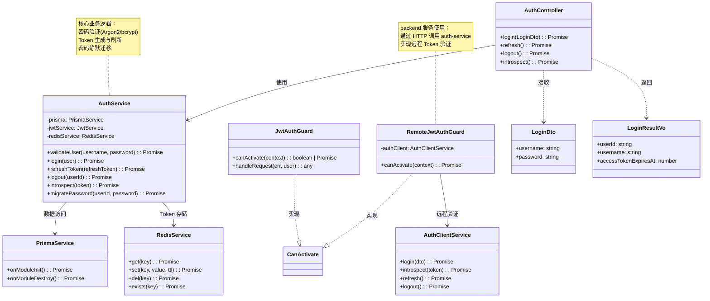

# 01 - 认证模块核心类

---

## 📊 类图



---

## 🧠 复刻时的思考

### 1. 为什么 AuthService 里有 migratePassword 方法？密码不是只需要验证吗？

```
✅ 密码迁移的业务背景：

1. 老系统用的是 bcrypt
2. 新系统要升级到 argon2（更安全）
3. 但不能让所有用户立刻改密码
4. 需要平滑迁移

✅ 迁移流程：

用户登录
   → 验证 bcrypt 成功
   → 用 argon2 重新哈希这个密码
   → 更新数据库里的密码哈希
   → 下次登录用 argon2 验证
   → 用户完全感知不到

✅ 好处：
- 不需要用户操作
- 不需要跑批量脚本（跑批量会锁表）
- 渐进式迁移，活跃用户先升级
- 可以随时回滚

💡 这是生产环境的最佳实践
千万不要写个脚本把所有用户密码批量重算
锁库锁到你怀疑人生
```

### 2. 为什么要分 JwtAuthGuard 和 RemoteJwtAuthGuard？不能合并吗？

```
✅ 两个 Guard 的职责边界：

JwtAuthGuard（auth-service 自己用）：
→ 本地 JWT.verify 验签
→ 不需要网络调用
→ <1ms 完成
→ auth-service 自己的接口用这个

RemoteJwtAuthGuard（backend 等其他服务用）：
→ 调 auth-service 的 /introspect 接口
→ 需要网络调用
→ ~1-2ms 完成
→ 所有其他服务用这个

✅ 为什么不合并？
- 职责不同
- 性能不同
- 依赖不同
- 放在一起会变成上帝类

💡 架构原则：
接口是有边界的
服务内部的接口和对外提供的接口
不是一回事
要分开设计
```

### 3. AuthClientService 为什么不放在 shared-logging 包？要每个服务自己写吗？

```
✅ 为什么不放到共享包：

1. 共享包应该是通用的
   → 日志是所有服务都需要的
   → 认证客户端不是所有服务都需要
   → 把特定领域的东西塞到通用包里，会让通用包越来越重

2. 每个服务的认证方式可能不一样
   → 有的用 Cookie，有的用 Header
   → 有的需要加额外的 Header
   → 硬塞到共享包里反而不灵活

✅ 更好的做法：
- shared-logging 包放纯工具类
- 认证相关的代码在 auth-service 里写好
- 其他服务需要用时复制一份或者生成 SDK
- 每个服务可以按需修改

💡 共享包的设计原则：
只放 100% 所有服务都需要的东西
只要有一个服务不需要，就不应该放进去
宁肯多复制一点代码，也不要让共享包变成垃圾场
```

### 4. DTO 和 VO 有什么区别？为什么要分开定义？

```
✅ DTO = Data Transfer Object
= 接收前端传过来的数据
= 做输入验证

DTO 是"不安全"的，来自外部
需要做严格验证
@IsString()
@MinLength(6)
username: string

✅ VO = Value Object
= 返回给前端的数据
= 做输出裁剪

VO 是"安全"的，我们自己生成
只暴露该暴露的字段
不包含 passwordHash 等敏感字段

✅ 为什么分开？
输入和输出是两个不同的生命周期
输入需要验证，输出需要裁剪
混在一起会出问题
比如前端传个 userId 进来，你不小心用了

💡 类比前端：
组件 Props（输入）和 State（内部）
不要把 Props 直接当 State 用
分清楚输入和输出
```

### 5. PrismaService 为什么要继承 PrismaClient？还要自己写 onModuleInit？

```
✅ NestJS 和 Prisma 的生命周期集成：

@Injectable()
export class PrismaService
  extends PrismaClient
  implements OnModuleInit, OnModuleDestroy {

  async onModuleInit() {
    await this.$connect()
  }

  async onModuleDestroy() {
    await this.$disconnect()
  }
}

✅ 为什么要这么做：
1. 让 Prisma 的连接生命周期和 NestJS 的模块生命周期对齐
2. 模块启动时连接数据库
3. 模块销毁时断开连接（优雅退出）
4. 可以在这个地方加统一的中间件、日志、慢查询监控等

💡 类比前端：
React 组件的 useEffect(() => {
  connect()
  return () => disconnect()
}, [])
在 mount 时连接，在 unmount 时断开
```

---

## 🔗 对应代码位置

| 类名               | 路径                                                        |
| ------------------ | ----------------------------------------------------------- |
| AuthController     | `services/auth-service/src/auth/auth.controller.ts`         |
| AuthService        | `services/auth-service/src/auth/auth.service.ts`            |
| JwtAuthGuard       | `services/auth-service/src/auth/guards/jwt-auth.guard.ts`   |
| RemoteJwtAuthGuard | `services/backend/src/auth/guards/remote-jwt-auth.guard.ts` |
| AuthClientService  | `services/backend/src/common/auth-client.service.ts`        |
| PrismaService      | `services/*/src/prisma/prisma.service.ts`                   |
| RedisService       | `services/*/src/redis/redis.service.ts`                     |

---

## 🎯 复刻完成检查清单

- [ ] 能解释密码静默迁移的流程和好处
- [ ] 能说出 JwtAuthGuard 和 RemoteJwtAuthGuard 的区别
- [ ] 能解释为什么 AuthClientService 不放在共享包
- [ ] 能说出 DTO 和 VO 的区别
- [ ] 能解释 PrismaService 继承 + 生命周期集成的意义
