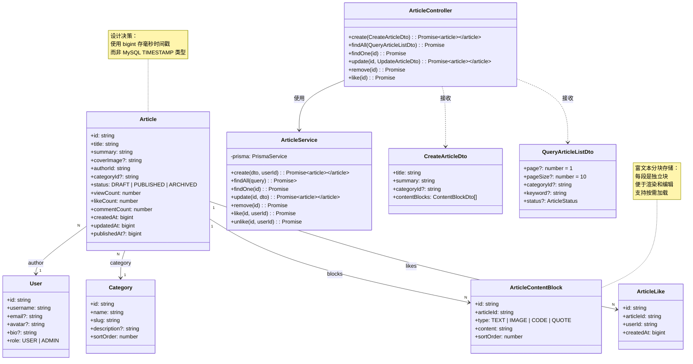

# 02 - 文章模块领域模型

---

## 📊 类图



---

## 🧠 复刻时的思考

### 1. 为什么文章内容要分块存储？存一个大的 content 字段不行吗？

```
✅ 内容分块存储的好处：

1. 便于编辑
   → 改第一段只更新第一个块
   → 不用把整篇文章读出来再写回去
   → 减少冲突的概率

2. 便于渲染
   → 不同类型的块用不同的组件渲染
   → 图片块懒加载
   → 代码块高亮

3. 性能优化
   → 列表页只需要标题和摘要，不需要加载内容
   → 内容很长时可以分段加载

4. 扩展性好
   → 以后加视频块、音频块、投票块
   → 不需要改数据库表结构

💡 类比前端：
组件化思想
整篇文章 = 一堆组件拼起来
每个组件有自己的类型和 props
渲染时根据 type 选组件
```

### 2. 为什么 Article 里要有冗余的 count 字段？COUNT(\*) 不行吗？

```
❌ 每次 COUNT(*) 的问题：
文章列表页显示 10 篇文章
→ 10 次 COUNT(*) 查询点赞数
→ 10 次 COUNT(*) 查询评论数
→ O(N) 次查询，N 越大越慢

✅ 冗余字段的好处：
SELECT id, title, likeCount, commentCount FROM articles
→ 一次查询，全出来了
→ O(1) 时间复杂度
→ 列表页性能提升 10-100 倍

✅ 一致性保证：
用户点赞
1. 插入 article_likes 表
2. UPDATE articles SET likeCount = likeCount + 1 WHERE id = ?

用户取消点赞
1. DELETE FROM article_likes
2. UPDATE articles SET likeCount = likeCount - 1 WHERE id = ?

用数据库事务保证原子性
要么都成功，要么都失败

💡 经典的空间换时间
多存一个 int 字段（4 字节）
每次查询省几十毫秒
太值了
```

### 3. 为什么要有 status 字段？直接 publishedAt 为 null 表示未发布不行吗？

```
✅ 状态机思想：

DRAFT → 草稿，编辑中
PUBLISHED → 已发布，所有人可见
ARCHIVED → 已归档，只有作者可见

❌ 只用 publishedAt 的问题：
只有"已发布"和"未发布"两种状态
无法表示"归档"这种中间状态
以后要加新状态（审核中、已下线）根本加不了

✅ 状态字段的扩展性：
现在 3 种，以后可以加到 N 种
每个状态可以有自己的业务逻辑
每个状态可以有自己的权限控制

💡 设计模式：状态模式
不要用多个布尔字段表示状态
不要用时间是否为空表示状态
用一个枚举字段表示明确的状态
```

### 4. 为什么 ArticleLike 是独立的一张表？不能在 articles 表存一个 userId 数组吗？

```
❌ 数组存储的问题：
1. 查询谁点赞了这篇文章？要把数组解析出来
2. 查询这个人点赞了哪些文章？全表扫描
3. 去数据库查一下，字符串包含查询
4. 无法加索引，性能极差
5. 不能加唯一约束，可能重复点赞

✅ 独立中间表的好处：
1. 关系型数据库就是用来存关系的
2. 可以加联合唯一索引，防止重复点赞
3. 两个方向都可以查
   - 这篇文章有哪些人点赞了
   - 这个人点赞了哪些文章
4. 可以加额外字段（点赞时间、取消点赞时间等）

💡 数据库设计基本原则：
一对多 → 外键
多对多 → 中间表
永远不要用数组存一对多关系
```

### 5. 为什么 Service 层和 Controller 层要分开？所有逻辑写在 Controller 里不行吗？

```
✅ 分层的好处：

1. 职责单一
   Controller：处理 HTTP 层的事情
   → 接收参数
   → 调用 Service
   → 返回响应

   Service：处理业务逻辑
   → 不关心是 HTTP 还是 RPC
   → 不关心参数是 Query 还是 Body
   → 纯业务

2. 可复用
   多个 Controller 可以调用同一个 Service 方法
   比如：创建文章接口、批量导入文章接口
   → 都调用 ArticleService.create()

3. 可测试
   Service 层不需要启动整个 HTTP 服务
   → 直接 new ArticleService() 就能测
   → 写单元测试非常方便

💡 类比前端：
不要把所有逻辑都写在组件里
组件只管渲染和事件绑定
业务逻辑抽成 hooks
数据请求抽成 api 层
```

---

## 🔗 对应代码位置

| 类名                | 路径                                                         |
| ------------------- | ------------------------------------------------------------ |
| ArticleController   | `services/backend/src/article/article.controller.ts`         |
| ArticleService      | `services/backend/src/article/article.service.ts`            |
| Prisma Schema       | `services/backend/prisma/schema.prisma`                      |
| CreateArticleDto    | `services/backend/src/article/dto/create-article.dto.ts`     |
| QueryArticleListDto | `services/backend/src/article/dto/query-article-list.dto.ts` |

---

## 🎯 复刻完成检查清单

- [ ] 能解释文章内容分块存储的 4 个好处
- [ ] 能解释冗余 count 字段带来的性能提升和一致性保证
- [ ] 能解释为什么用 status 枚举而不是 publishedAt is null
- [ ] 能解释为什么点赞关系需要独立的中间表
- [ ] 能解释 Service 层和 Controller 层分离的 3 个好处
