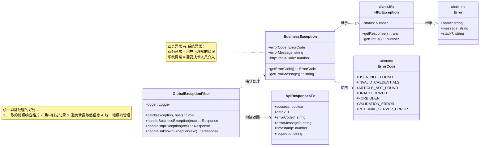

# 03 - 异常处理体系

---

## 📊 类图



---

## 🧠 复刻时的思考

### 1. 为什么要自定义 BusinessException？直接 throw new Error() 不行吗？

```
✅ 直接 throw Error 的问题：
1. 没有错误码，前端没法做分支处理
2. 没有 HTTP 状态码，返回的都是 500
3. 没有业务语义，日志里不好排查
4. 没法区分"用户输错了"和"系统真的挂了"

✅ BusinessException 的价值：

throw new BusinessException(
  ErrorCode.USER_NOT_FOUND,
  '用户不存在',
  HttpStatus.NOT_FOUND
)

三层信息：
→ 错误码（前端判断逻辑）
→ 用户可理解的错误信息
→ HTTP 状态码（语义化）

💡 类比前端：
throw new Error('登录失败')
  vs
throw new BusinessError(CODE.AUTH_FAILED, '密码错误', 401)

有了错误码，前端可以做很多事情：
- 401 → 清 Token 跳登录
- 403 → 提示无权限
- 429 → 稍后再试
```

### 2. 为什么要用 Enum 定义 ErrorCode？直接用字符串不行吗？

```
✅ 枚举的好处：

1. 类型安全
   → 写错了编辑器直接报错
   → 不会出现 'USER_NOT_FOND' 这种拼写错误

2. 自动补全
   → 打 ErrorCode. 就自动列出所有错误码
   → 不用去查文档

3. 统一管理
   → 所有错误码在一个文件里
   → 方便加注释，方便统计

4. 前端可以共用
   → 把这个 enum 生成一份 TS 定义给前端
   → 前端也能拿到完整的错误码列表

❌ 用字符串的问题：
- 'user_not_found' vs 'USER_NOT_FOUND'
- 大小写不统一
- 拼写错了运行时才发现
- 改个错误码要搜遍整个项目
```

### 3. GlobalExceptionFilter 为什么要实现 ExceptionFilter 接口？

```
✅ NestJS 的过滤器机制：

@Catch(BusinessException)
export class BusinessExceptionFilter
  implements ExceptionFilter {

  catch(exception: BusinessException, host: ArgumentsHost) {
    // 处理异常
  }
}

✅ 为什么要这么设计：

1. 可以按异常类型分别处理
   → BusinessExceptionFilter 只处理业务异常
   → PrismaExceptionFilter 只处理数据库异常
   → AllExceptionsFilter 兜底处理其他异常

2. 可以按模块注册
   → 某些模块的异常可以有特殊处理逻辑
   → 比如支付模块的异常需要额外告警

3. 可以加优先级
   → 先匹配最具体的异常类型
   → 最后匹配最通用的 Exception

💡 设计模式：责任链模式
每个过滤器只处理自己负责的异常
处理不了就传给下一个
最后一个兜底
```

### 4. 为什么未知异常不返回堆栈信息给前端？

```
❌ 返回堆栈的安全风险：

Error: Connection refused to mysql at 10.0.0.1:3306
    at /app/src/prisma/prisma.service.ts:42:15
    at ...

暴露了：
- 数据库内网 IP
- 服务器目录结构
- 使用的技术栈和版本
- 源代码路径和文件名

攻击者拿到这些信息，可以发起更精准的攻击

✅ 正确的做法：

开发环境：
→ 返回完整堆栈（方便调试）
→ 可以通过环境变量控制

生产环境：
→ 只返回 '服务器开小差了，请稍后重试'
→ 完整堆栈记录到日志里
→ 日志里带 requestId，前端只显示 requestId

💡 安全原则：
对外最小暴露
对内完整记录
```

### 5. 每个异常都要定义一个新的错误码吗？

```
✅ 错误码设计原则：

1. 粒度适中
   → 太粗：所有认证错误都是 401，前端没法区分
   → 太细：每个可能的错误都有一个码，维护不起

2. 按领域分类
   AUTH_xxx → 认证相关
   USER_xxx → 用户相关
   ARTICLE_xxx → 文章相关

3. 前端需要区分的才给不同的码
   前端不需要区分的，就用通用码

✅ 示例：

AUTH_INVALID_CREDENTIALS = 'AUTH_001'  // 用户名或密码错误
AUTH_TOKEN_EXPIRED = 'AUTH_002'       // Token 过期
AUTH_TOKEN_INVALID = 'AUTH_003'       // Token 无效

ARTICLE_NOT_FOUND = 'ARTICLE_001'     // 文章不存在
ARTICLE_NOT_PUBLISHED = 'ARTICLE_002' // 文章未发布

💡 关键：
错误码是给"代码"看的，不是给人看的
人看 errorMessage 就够了
代码才需要根据 errorCode 做分支逻辑
如果代码不需要区分，就不要造新的错误码
```

---

## 🔗 对应代码位置

| 类名                    | 路径                                                          |
| ----------------------- | ------------------------------------------------------------- |
| BusinessException       | `services/*/src/common/exceptions/business.exception.ts`      |
| ErrorCode               | `services/*/src/common/enums/error-code.enum.ts`              |
| BusinessExceptionFilter | `services/*/src/common/filters/business-exception.filter.ts`  |
| AllExceptionsFilter     | `services/*/src/common/filters/all-exceptions.filter.ts`      |
| PrismaExceptionFilter   | `services/*/src/common/filters/prisma-exception.filter.ts`    |
| ApiResponse             | `services/*/src/common/interceptors/transform.interceptor.ts` |

---

## 🎯 复刻完成检查清单

- [ ] 能解释为什么要自定义 BusinessException 而不是 throw Error
- [ ] 能说出用 Enum 定义错误码的 4 个好处
- [ ] 能解释异常过滤器的责任链模式
- [ ] 能解释为什么生产环境不能返回堆栈信息
- [ ] 能说出错误码的设计原则（粒度、分类）
