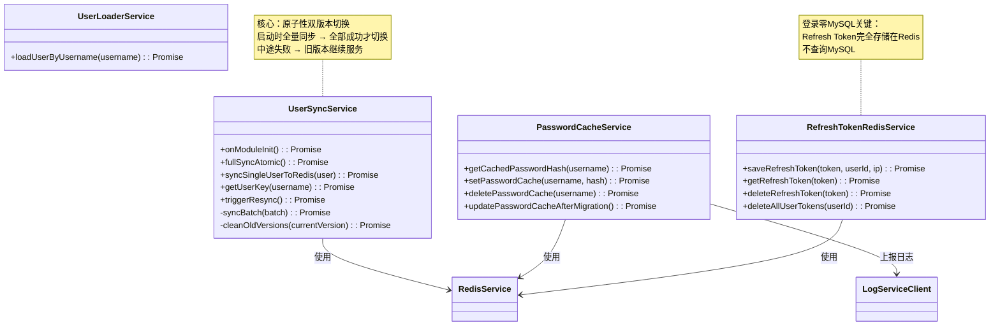

# 04 - 用户预加载服务

---

## 📊 类图



---

## 🧠 复刻时的思考

### 1. 为什么 UserSyncService 要实现 OnModuleInit 接口？不能手动调用吗？

```
✅ OnModuleInit 的好处：

1. 自动执行
   → 服务启动时自动开始同步
   → 不需要外部触发
   → 不会忘记调用

2. 生命周期对齐
   → 在 NestJS 模块初始化完成后执行
   → 所有依赖都已经注入完成
   → Redis、Prisma 都已经连接好了

3. 可以控制启动顺序
   → 依赖 UserSyncService 的其他服务
   → 会等它初始化完成后再启动

❌ 手动调用的问题：
→ 什么时候调？
→ 调早了依赖还没准备好
→ 调晚了有一段时间是冷启动
→ 多实例部署时每个实例都要调一次

💡 类比前端：
useEffect(() => { init() }, [])
组件挂载时自动执行初始化
不需要父组件调用
```

### 2. 为什么叫 fullSyncAtomic？"原子性"体现在哪里？

```
✅ 原子性的核心：要么全成功，要么全失败

传统同步方案的问题：
1. 删旧 Key
2. 写新 Key
3. 写到一半服务重启了
→ 结果：部分新，部分旧，服务不可用

本项目的双版本方案：
1. 生成新版本号 v1715000000
2. 所有新数据写到 v1715000000 空间
3. 全部写完 → 原子 SET current-version = v1715000000
4. 异步删除旧版本

关键：
写新版本的过程中，读请求还是走旧版本
切换是一瞬间的原子操作
要么全读旧版本，要么全读新版本
没有中间状态

💡 类比前端：
蓝绿部署
新版本全量推给一小部分用户
没问题再全量切
出问题随时回滚到旧版本
用户无感知
```

### 3. PasswordCacheService 为什么还要有？UserSyncService 不是已经预加载了吗？

```
✅ 两个不同的缓存层级：

UserSyncService → 全量预加载
→ 服务启动时加载所有用户
→ 服务运行期间持续提供

PasswordCacheService → 补漏 + 兜底
→ 新注册的用户，UserSyncService 还没来得及重跑
→ 预加载失败，回源查询后补缓存
→ 密码迁移后更新缓存

✅ 缓存设计的多层级思想：
L1 缓存 → 最快，命中率最高（全量预加载）
L2 缓存 → 兜底，处理边界情况
数据库 → 最终数据源

💡 类比 CPU 缓存架构：
L1 缓存 → 最快，容量小，命中 95%
L2 缓存 → 次快，容量中等，命中 4%
内存 → 最慢，命中 1%
分层设计，层层兜底
```

### 4. 为什么 RefreshTokenRedisService 完全不碰 MySQL？不怕数据丢失吗？

```
✅ 为什么完全在 Redis：

1. 性能第一
   → 每次刷新 Token 都要查一次
   → Redis <1ms，MySQL 10ms+
   → 高并发场景下差 10 倍

2. 可以丢
   → RefreshToken 丢了会怎样？
   → 用户需要重新登录
   → 7 天有效期，最多影响 7 天
   → 不是核心数据，可以接受偶尔丢失

3. 有兜底
   → Redis 开持久化
   → 主从部署
   → 真丢了用户重登就行，不会造成数据不一致

✅ 什么数据必须落库，什么可以放 Redis？

必须落库：用户信息、文章内容、交易记录
→ 丢了就真没了
→ 法律要求保留
→ 一致性要求高

可以放 Redis：Token、缓存、会话、排行榜
→ 丢了不影响核心数据
→ 可以重建
→ 性能优先

💡 架构决策的本质：
在性能和可靠性之间权衡
没有绝对的对与错
只有适合不适合当前业务场景
```

### 5. cleanOldVersions 为什么是异步的？不能同步删完再启动服务吗？

```
❌ 同步删除的问题：
100 万用户，每个用户 1 个 Key
→ SCAN + DEL 需要 5-10 秒
→ 服务启动要等 10 秒
→ 这 10 秒服务不可用

✅ 异步删除的好处：
1. 切换到新版本后立刻开始服务
2. 后台慢慢删旧版本
3. 删的过程中不影响新请求
4. 就算删失败了也没关系，旧 Key 有 TTL，7 天后自动过期

✅ 优雅清理策略：
1. SCAN 游标分批遍历，每次 100 个 Key
2. 每删 1000 个 Key 休息 100ms
3. 不要阻塞 Redis 主进程
4. 不要影响正常请求

💡 关键洞察：
清理旧版本不是关键路径
用户不在乎旧版本什么时候删完
用户在乎服务什么时候能启动
能异步的都异步
能延后的都延后
```

---

## 🔗 对应代码位置

| 类名                     | 路径                                                       |
| ------------------------ | ---------------------------------------------------------- |
| UserSyncService          | `services/backend/src/users/user-sync.service.ts`          |
| PasswordCacheService     | `services/backend/src/users/password-cache.service.ts`     |
| RefreshTokenRedisService | `services/backend/src/auth/refresh-token-redis.service.ts` |
| UserLoaderService        | `services/backend/src/users/user-loader.service.ts`        |

---

## 🎯 复刻完成检查清单

- [ ] 能解释为什么要实现 OnModuleInit 接口
- [ ] 能画出双版本原子切换的完整流程
- [ ] 能解释两层缓存架构（UserSyncService + PasswordCacheService）
- [ ] 能说出什么数据适合放 Redis，什么必须落库
- [ ] 能解释为什么旧版本清理要异步执行
