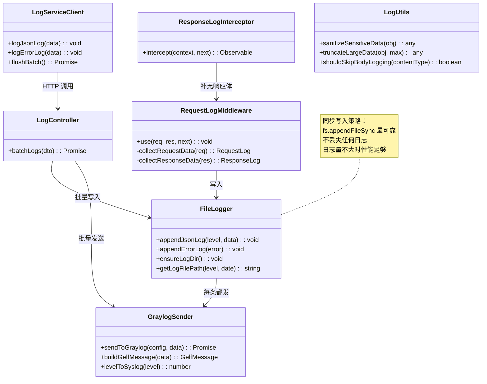

# 05 - 日志模块核心类

---

## 📊 类图



---

## 🧠 复刻时的思考

### 1. 为什么要分 RequestLogMiddleware 和 ResponseLogInterceptor？不能一个搞定吗？

```
✅ NestJS 的洋葱圈模型限制：

Middleware 在最外层：
→ 能拿到 Request
→ 能拿到 Response finish 事件
→ 但是拿不到 Controller 返回的响应体

Interceptor 在中间层：
→ 能拿到 Controller 返回的响应体
→ 能修改响应
→ 但是没有 Request 的完整生命周期

✅ 配合工作：
1. RequestLogMiddleware 记录请求开始时间
2. ResponseLogInterceptor 拿到响应体，存在 res 上
3. 请求结束时，Middleware 的 finish 事件触发
4. Middleware 把请求和响应拼起来，写日志

💡 系统设计的技巧：
当一个组件做不到时
就把信息存在公共上下文里
两个组件配合完成
```

### 2. LogServiceClient 为什么要用内存队列攒批？直接打日志不行吗？

```
✅ 攒批的性能优势：

1000 QPS 不攒批：
→ 1000 次 HTTP 请求
→ 1000 次 TCP 握手
→ 1000 次 Header 传输
→ 日志服务 1000 QPS 压力

100ms 攒批，满 10 条触发：
→ 100 次 HTTP 请求
→ 减少 10 倍请求数
→ 日志服务 QPS 压力降 10 倍

✅ 权衡：
增加最多 100ms 延迟
换来 10 倍吞吐量提升
日志不需要实时，完全可接受

💡 经典的吞吐量优化手段：
批量 + 缓冲
数据库批量插入
消息队列批量消费
都是同一个思路
```

### 3. GraylogSender 为什么用 UDP？TCP 不可靠吗？

```
✅ UDP vs TCP 对比：

TCP：
✅ 可靠，不丢包
❌ 需要握手，需要保活
❌ 需要等待 ACK
❌ 对端挂了会阻塞

UDP：
✅ 发完就忘，不等待
✅ 不需要连接
✅ 对端挂了不影响自己
❌ 可能丢包

✅ 为什么日志适合 UDP：
1. 日志可以丢（本地文件有备份）
2. 日志不需要对方确认收到
3. 日志服务挂了不能影响业务服务
4. 日志对延迟非常敏感，越快返回越好

💡 架构原则：
不同的数据有不同的可靠性要求
关键数据：TCP，强一致，不丢
非关键数据：UDP，最终一致，可以丢
```

### 4. LogUtils.sanitizeSensitiveData 为什么要递归遍历？不能只检查第一层吗？

```
✅ 敏感数据可能藏在任何地方：

请求体可能是嵌套的：
{
  user: {
    password: '123456',  // 藏在第二层
    profile: {
      idCard: '110101...'  // 藏在第三层
    }
  }
}

只检查第一层的话，这些就泄露了

✅ 正确的做法：
递归遍历整个对象
遇到 key 是 password/token/secret/idCard 等
就把 value 替换成 '***'

✅ 安全原则：
宁杀错，不放过
只要是敏感字段名
不管藏在哪一层，都给脱敏了
```

### 5. 为什么日志要按级别分文件？所有日志放一个文件不行吗？

```
✅ 分级存储的好处：

文件结构：
logs/
  access-2024-05-01.log  # 正常请求日志
  info-2024-05-01.log    # 一般信息
  warn-2024-05-01.log    # 警告
  error-2024-05-01.log   # 错误

排查问题时：
→ 想看错误？直接 tail error-xxx.log
→ 不用 grep 过滤几十万条正常日志
→ 节省大量时间

性能好处：
→ error 日志量小，可以一直保留
→ access 日志量大，7 天后就删
→ 不同级别可以设不同的保留策略

💡 类比前端：
console.log vs console.error
开发环境都显示
生产环境只上报 error
分级处理，按需取用
```

---

## 🔗 对应代码位置

| 类名                   | 路径                                                             |
| ---------------------- | ---------------------------------------------------------------- |
| RequestLogMiddleware   | `services/*/src/common/middleware/request-log.middleware.ts`     |
| ResponseLogInterceptor | `services/*/src/common/interceptors/response-log.interceptor.ts` |
| LogController          | `services/log-service/src/log/log.controller.ts`                 |
| LogServiceClient       | `packages/shared-logging/src/log-service.client.ts`              |
| FileLogger             | `services/log-service/src/logger/file-logger.ts`                 |
| GraylogSender          | `services/log-service/src/logger/graylog.ts`                     |
| LogUtils               | `services/log-service/src/logger/utils.ts`                       |

---

## 🎯 复刻完成检查清单

- [ ] 能解释为什么需要 Middleware + Interceptor 配合才能记完整日志
- [ ] 能说出攒批带来的性能提升和权衡
- [ ] 能解释为什么日志发送用 UDP 而不是 TCP
- [ ] 能解释为什么敏感数据脱敏需要递归遍历
- [ ] 能说出日志按级别分文件存储的 3 个好处
