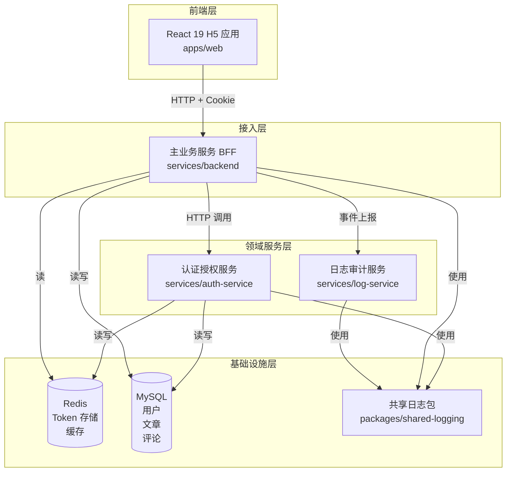

# 01 - 微服务整体架构

---

## 📊 架构图



---

## 🧠 复刻时的思考

### 1. 为什么认证服务要独立？而不是放在 backend 里？

```
✅ 理由：
- 认证是通用能力，可以被多个服务复用
- 安全级别高，独立部署便于做安全隔离
- 认证服务变更频率低，和业务服务解耦
- 万一认证出问题，不影响业务核心功能

❌ 如果放在一起：
- 修改业务代码可能影响认证逻辑
- 安全边界模糊
- 无法独立扩缩容
```

### 2. 为什么是 backend 调用 auth-service，而不是前端直接调？

```
✅ 理由：
- 前端不需要知道认证服务的地址，降低复杂度
- backend 可以做统一的错误处理、重试、降级
- 便于将来加 API Gateway
- 所有请求入口统一，便于监控和日志

❌ 前端直接调的问题：
- 前端要维护两个服务地址
- CORS 配置更复杂
- 错误处理分散在前端
```

### 3. 日志服务为什么不直接被所有服务调用？而是走 backend 转发？

```
✅ 当前设计的权衡：
- 业务日志先统一到 backend，再上报 log-service
- 减少直接调用 log-service 的服务数量
- 实际上 log-service 应该是所有服务直接调用
- 本项目中用 LogServiceClient 做了客户端封装

💡 真实生产环境：
所有服务（auth + backend + ...）直接调用 log-service
或通过消息队列（Kafka/RabbitMQ）异步投递
```

### 4. 共享包为什么只做日志？不做更多？

```
✅ 共享包设计原则：
- 只放稳定的、不常变的能力
- 只放纯技术工具，不放业务逻辑
- 单向依赖，共享包不能依赖任何业务服务

❌ 不要在共享包放什么：
- 业务常量
- DTO 定义
- 业务工具函数
- 任何可能经常变的东西

💡 共享包一变，所有使用方都要更新，成本很高
```

### 5. 这个架构的单点故障在哪里？

```
🔴 认证服务是单点
- auth-service 挂了，所有需要登录的接口都不能用
- 解决方案：多实例部署 + 健康检查 + 自动重启

🔴 Redis 是单点
- Redis 挂了，登录性能骤降（回源 MySQL）
- 解决方案：主从 + 哨兵

🔴 MySQL 是单点
- 这个没办法，所有读最后都落库
- 解决方案：主从复制 + 读写分离
```

---

## 🔗 对应代码位置

| 服务       | 路径                       |
| ---------- | -------------------------- |
| 前端       | `apps/web/`                |
| 主业务服务 | `services/backend/`        |
| 认证服务   | `services/auth-service/`   |
| 日志服务   | `services/log-service/`    |
| 共享日志包 | `packages/shared-logging/` |

---

## 🎯 复刻完成检查清单

- [ ] 能清晰说明 4 层架构的职责
- [ ] 能解释认证服务独立的 3 个理由
- [ ] 能说出这个架构的 3 个单点故障和解决方案
- [ ] 能解释共享包的设计原则
