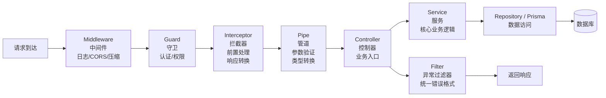

# 02 - NestJS 请求流水线（简化版）

---

## 📊 架构图



---

## 🧠 复刻时的思考

### 1. 为什么 Middleware 在最外层？而不是 Controller 里面？

```
✅ 中间件的定位：
- 处理和业务无关的横切关注点
- 对所有请求生效
- 不需要知道具体是哪个 Controller

✅ 典型场景：
- CORS 跨域处理
- 请求日志记录
- 请求体压缩/解压
- 请求 ID 生成
- 限流熔断

💡 类比前端：
Middleware = axios 请求/响应拦截器
（在所有请求发出/返回之前统一处理）
```

### 2. Guard 和 Pipe 的执行顺序为什么是 Guard 先？

```
✅ 顺序理由：
1. 先认证（Guard），再验证参数（Pipe）
2. 认证不通过的请求，不需要浪费资源做参数验证
3. 认证可以拿到用户信息，传给后续的 Pipe/Controller

✅ 请求处理顺序口诀：
"中 → 守 → 拦 → 管 → 控 → 业 → 滤"
中间件 → 守卫 → 拦截器 → 管道 → 控制器 → 业务 → 过滤器

💡 类比前端：
Guard = 路由守卫（进入页面前先检查登录）
Pipe = props 类型检查（进入组件前先验证参数）
```

### 3. Interceptor 可以做什么？为什么不放在 Controller 里？

```
✅ 拦截器的典型用途：

1. 响应统一包装
   { data: ..., code: 200, message: 'ok' }

2. 响应日志记录
   记录 Controller 返回了什么

3. 缓存响应
   相同参数的请求直接返回缓存

4. 性能埋点
   记录 Controller 执行耗时

💡 类比前端：
Interceptor = 高阶组件（HOC）
包裹业务组件，在前后加统一逻辑
```

### 4. Filter 为什么在最后一层？异常是怎么到达 Filter 的？

```
✅ 异常冒泡机制：
NestJS 全局过滤器捕获
 → Controller 抛出异常
  → Service 抛出异常
      

✅ 洋葱圈模型：
请求 → Middleware → Guard → Interceptor → Pipe → Controller
响应 ← Interceptor ← Filter ← 异常
                    ↓
                正常响应

💡 类比前端：
Filter = window.onerror / React ErrorBoundary
在最外层兜底捕获所有异常
```

### 5. 为什么要分这么多层？全部写在 Controller 里不行吗？

```
❌ 全部写在 Controller 的问题：
- 每加一个接口都要重复写认证、日志、验证
- 代码冗余，容易遗漏
- 修改一个逻辑要改 N 个地方
- 新人容易忘（忘了记录日志，忘了处理异常）

✅ 分层的好处：
- 横切关注点分离
- 写一次，所有接口都生效
- 强制统一，不会遗漏
- 新人写 Controller 不需要关心这些

💡 类比前端：
为什么要有：
  路由守卫 → axios 拦截器 → 错误边界 → 组件
而不是都写在组件里？
```

---

## 🔗 对应代码位置

| 层          | 路径                                  |
| ----------- | ------------------------------------- |
| Middleware  | `services/*/src/common/middleware/`   |
| Guard       | `services/*/src/auth/guards/`         |
| Interceptor | `services/*/src/common/interceptors/` |
| Pipe        | NestJS 内置 ValidationPipe            |
| Filter      | `services/*/src/common/filters/`      |
| Controller  | `services/*/src/*/*.controller.ts`    |
| Service     | `services/*/src/*/*.service.ts`       |

---

## 🎯 复刻完成检查清单

- [ ] 能背出完整的执行顺序口诀
- [ ] 能说出每一层的 2-3 个典型用途
- [ ] 能类比前端的对应概念
- [ ] 能解释为什么 Middleware 在最外层
- [ ] 能解释异常是怎么冒泡到 Filter 的
