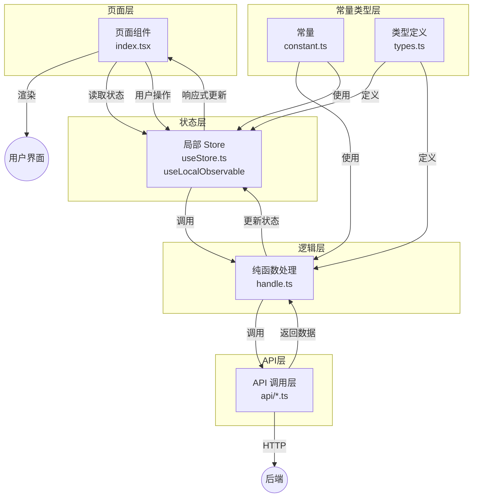

# 03 - 前端状态管理流程

---

## 📊 架构图



---

## 🧠 复刻时的思考

### 1. 为什么页面要拆成 5 个文件？所有代码放 index.tsx 不行吗？

```
✅ 5 文件拆分规范：

┌──────────────────┐
│ 1. types.ts     │ 类型定义（零成本，不会产生运行时代码）
├──────────────────┤
│ 2. constant.ts  │ 常量（枚举、配置、固定值）
├──────────────────┤
│ 3. handle.ts    │ 纯函数处理（不依赖 React）
├──────────────────┤
│ 4. useStore.ts  │ MobX 状态（不依赖 React 生命周期）
├──────────────────┤
│ 5. index.tsx    │ React 组件（只做渲染和事件绑定）
└──────────────────┘

❌ 放一起的问题：
- 一个文件上千行，难以阅读和维护
- 纯函数混在 React 组件里，难以单测
- 状态逻辑和渲染逻辑耦合，难以复用

💡 类比后端：
types    = DTO 定义
constant = 常量枚举
handle   = 工具函数 / 纯逻辑
useStore = Service 层
index    = Controller 层
```

### 2. handle.ts 为什么必须是纯函数？不能调用 API 吗？

```
✅ handle.ts 严格规范：
1. 不能有副作用
   ✅ 不能调 API
   ✅ 不能改全局变量
   ✅ 不能访问 localStorage / Cookie

2. 相同输入永远返回相同输出
   function calculateTotal(items: Item[]): number { ... }

3. 可以很方便地写单元测试
   不需要 Mock 任何东西

❌ 如果 handle.ts 里有 API 调用：
- 测试需要 mock axios
- 逻辑变得不可预测
- 状态更新路径不清晰

💡 状态更新路径：
React 事件 → useStore action → 调 API →
  API 返回 → 更新 Store → 页面响应式更新
      ↑
    handle.ts 在这里做纯数据转换
```

### 3. MobX useLocalObservable vs Redux？

```
✅ MobX 的优势（本项目）：
1. 响应式编程，自动追踪依赖
   store.count++ → 页面自动更新

2. 样板代码极少
   不需要写 action.type / reducer / dispatch

3. 适合复杂的领域模型
   class UserStore { @observable users = [] }

❌ MobX 的注意点：
1. 不要在组件外改 Store
   必须通过 action 方法修改
2. 不要把所有状态都放全局
   能用局部 useLocalObservable 就别放 RootStore

💡 类比后端：
MobX = 可变状态 + 观察者模式
Redux = 不可变状态 + 纯函数 reducer
→ 就像 MySQL（事务） vs Redis（内存）
```

### 4. API 层为什么要独立？不能在 Store 里直接 axios.get？

```
✅ API 层的价值：

1. 统一封装 baseURL、拦截器、错误处理
   api/user.ts 里统一处理 Token、超时、错误码

2. 类型定义集中管理
   interface LoginResponse { ... }
   所有调用方复用这个类型

3. 方便 Mock
   开发环境可以用 Mock API，不用改调用方代码

4. 复用
   多个页面调同一个 API 不用写两遍

❌ Store 里直接调 axios 的问题：
- baseURL 散落在各处
- 错误处理每个地方写一遍
- 改接口要搜所有文件

💡 类比后端：
API 层 = Service 层调用外部 HTTP 接口
统一封装，集中管理
```

### 5. 这个架构和后端分层架构有什么对应关系？

```
前端 5 文件拆分  ↔  后端 NestJS 分层

types.ts       ↔  DTO / VO 定义
constant.ts    ↔  枚举常量定义
handle.ts      ↔  Utils / 纯工具函数
useStore.ts    ↔  Service 层（业务逻辑）
index.tsx      ↔  Controller 层（请求响应）

API 层         ↔  Repository / Prisma 层

✅ 惊人的一致！
分层架构的思想是通用的，和语言/框架无关
只要是复杂系统，都应该做关注点分离
```

---

## 🆚 前后端分层对比

| 关注点       | 前端             | 后端                 |
| ------------ | ---------------- | -------------------- |
| **输入验证** | Zod / Yup        | Class-Validator      |
| **状态管理** | MobX / Redux     | Service 类实例       |
| **数据访问** | API 层           | Prisma / Repository  |
| **统一响应** | axios 响应拦截器 | TransformInterceptor |
| **错误捕获** | ErrorBoundary    | ExceptionFilter      |
| **路由守卫** | 路由前置守卫     | AuthGuard            |

---

## 🔗 对应代码位置

| 层         | 示例路径                                  |
| ---------- | ----------------------------------------- |
| 页面组件   | `apps/web/src/pages/Discover/index.tsx`   |
| 状态管理   | `apps/web/src/pages/Discover/useStore.ts` |
| 纯函数处理 | `apps/web/src/pages/*/handle.ts`          |
| API 层     | `apps/web/src/api/`                       |
| 类型定义   | `apps/web/src/pages/*/types.ts`           |

---

## 🎯 复刻完成检查清单

- [ ] 能背出 5 文件拆分的每一层的职责
- [ ] 能解释 handle.ts 为什么必须是纯函数
- [ ] 能说出 API 层独立的 3 个理由
- [ ] 能把每一层对应到后端 NestJS 的分层
- [ ] 能解释 MobX 和 Redux 的核心区别
