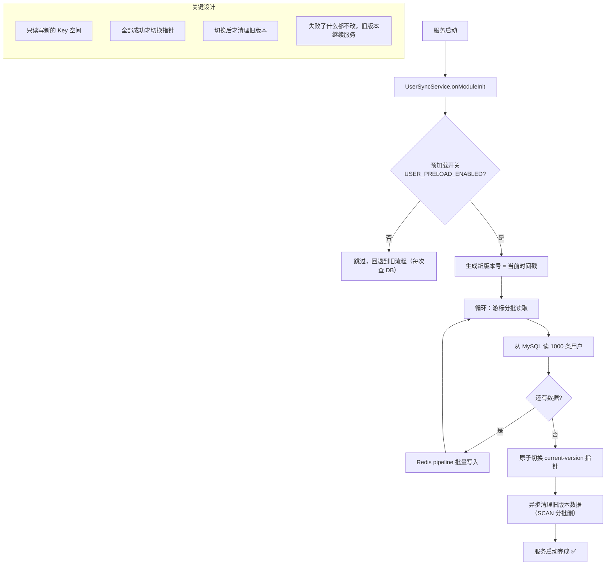

# 04 - 用户预加载启动流程

---

## 📊 架构图



---

## 🧠 复刻时的思考

### 1. 为什么要分批读取？一次读所有用户不行吗？

```
❌ 一次读全量的问题：
- 100 万用户，一次性读到内存 → OOM 内存溢出
- 数据库连接长时间被占用，影响其他请求
- 传输数据量大，网络超时

✅ 分批读取（cursor 游标分页）：
- 每次读 1000 条，内存占用可控
- 读一批，写一批，流式处理
- 数据库压力均匀，不会瞬间打满

💡 类比前端：
无限滚动列表，不是一次性加载 10000 条，
而是每次滑到底部加载下一页
```

### 2. 为什么要用 Redis pipeline？一条条 set 不行吗？

```
❌ 逐条 set 的问题：
100 万用户 × 1 RTT = 100 万次网络往返
假设一次 RTT = 1ms
→ 光写 Redis 就要 1000 秒 = 16 分钟！

✅ pipeline 批量写：
一次 pipeline 发 1000 条命令
→ 减少 1000 倍网络往返
→ 时间从 16 分钟降到 10 秒内

💡 类比前端：
1000 个 DOM 操作，不是每次 appendChild
而是创建 DocumentFragment，插好后一次性 append
减少 1000 次浏览器重排（reflow）
```

### 3. 为什么要"原子切换"？直接覆盖旧 Key 不行吗？

```
❌ 直接覆盖的问题：
写到一半服务重启了
→ 一部分是新数据，一部分是旧数据
→ 服务不可用，数据不一致

✅ 双版本原子切换方案：

        新版本 Key 空间：user:full:v1715000000:*
          → 完整写完
          → 所有数据都 ready
          → 原子执行 SET current-version = v1715000000
          → 后续所有读请求都走新版本

        旧版本 Key 空间：user:full:v1714000000:*
          → 在切换瞬间还在服务
          → 切换后异步慢慢清理

💡 类比前端：
蓝绿部署 / AB Test
新版本全量推给一部分用户
没问题了再切全量
出问题随时切回旧版本
```

### 4. 为什么旧版本要异步清理？等不及吗？

```
✅ 异步清理的理由：

1. 服务启动是关键路径
   → 先让服务可用是第一位
   → 清理旧数据可以慢慢来

2. SCAN + 批量删除不能太急
   → 一次删 100 个 key，删完休息 100ms
   → 避免阻塞 Redis 主进程
   → 避免影响正常的登录请求

3. 就算不清理也没事
   → 旧版本 Key 带 TTL，7 天后自动过期
   → 不清理最多多占一点内存，不影响正确性

💡 类比前端：
路由切换时，新页面先渲染
旧页面的资源清理（定时器、事件监听）
可以放在 requestIdleCallback 里慢慢做
不要阻塞用户交互
```

### 5. 这个方案的降级策略是什么？如果 Redis 挂了怎么办？

```
✅ 三级降级方案：

第 1 级：Redis 正常
→ 走预加载，0 DB 查询
→ QPS = 600-1000

第 2 级：Redis 挂了 / 预加载开关关闭
→ 自动回退到每次查 MySQL
→ QPS = 100-150（虽然慢，但服务可用）
→ 不会因为缓存挂了导致全站挂了

第 3 级：降级开关
→ 环境变量 USER_PRELOAD_ENABLED=false
→ 重启服务即可回到原始方案
→ 一键回滚，不需要改代码

💡 架构设计原则：
任何优化都必须有降级方案
优化可以不上线，上线不能挂
性能可以降，可用性不能降
```

---

## 🔗 对应代码位置

| 组件                 | 路径                                                   |
| -------------------- | ------------------------------------------------------ |
| UserSyncService      | `services/backend/src/users/user-sync.service.ts`      |
| 预加载开关           | `services/backend/.env` USER_PRELOAD_ENABLED           |
| PasswordCacheService | `services/backend/src/users/password-cache.service.ts` |

---

## 🎯 复刻完成检查清单

- [ ] 能解释为什么要分批读取，而不是一次读全量
- [ ] 能解释 Redis pipeline 带来的性能提升倍数
- [ ] 能画出完整的双版本 Key 空间切换流程
- [ ] 能说出 3 级降级方案分别是什么
- [ ] 能解释为什么旧版本要异步清理，而不是同步删
