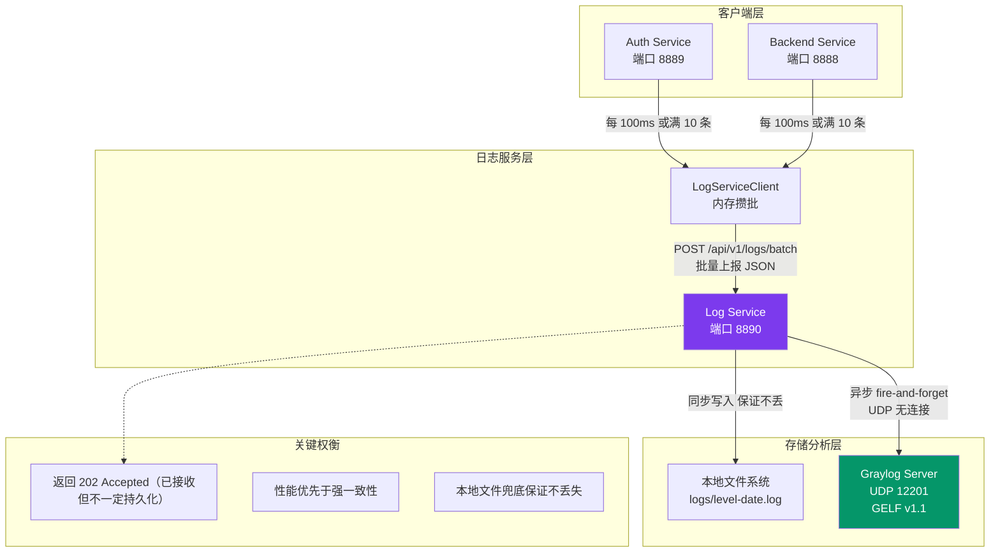

# 05 - 集中式日志服务架构

---

## 📊 架构图



---

## 🧠 复刻时的思考

### 1. 为什么日志要批量上报？一条条发不行吗？

```
❌ 逐条上报的问题：
- 产生大量 HTTP 请求，网络开销大
- 每条请求都有握手、Header 等开销
- 日志服务 QPS 压力大
- 打满 TCP 连接数

✅ 批量攒批的好处：
10ms 内打了 100 条日志 → 一次上报
→ 网络开销减少 100 倍
→ 日志服务 QPS 降低 100 倍
→ 每条日志的 CPU 消耗大幅降低

💡 权衡：
增加了最多 100ms 的延迟
换来百倍的吞吐量提升
日志不要求实时性，完全可以接受

💡 类比前端：
React setState 不是每次都渲染
而是批量合并，宏任务执行时一次更新
```

### 2. 为什么 Graylog 要用 UDP？TCP 不行吗？

```
❌ TCP 的问题：
- TCP 需要三次握手建立连接
- 连接断开需要重连
- 对端挂了会一直重试，阻塞主流程
- Graylog 挂了 → 业务服务也被拖挂

✅ UDP 的好处：
- 无连接，发完就忘（fire-and-forget）
- Graylog 挂了不影响业务服务
- 不需要握手，不需要保活
- 丢了就丢了，日志允许少量丢失

💡 关键权衡：
可靠性 ↔ 性能 ↔ 业务影响
日志可以丢（本地文件有备份）
但业务服务绝对不能因为日志挂了

💡 类比前端：
埋点上报用什么？
→ 发送 beacon，页面关了也能发
→ 不要求响应，不阻塞主流程
和 UDP 思路一模一样
```

### 3. 为什么要双写？只写 Graylog 不行吗？

```
✅ 双写策略：
同步写本地文件 + 异步发 Graylog

1. 本地文件是黄金备份
   - Graylog 挂了 → 还能 SSH 上服务器 grep
   - 网络断了 → 日志不丢
   - 磁盘满了 → 至少能看到出错前的日志

2. Graylog 是分析平台
   - 方便搜索、聚合、可视化
   - 跨服务日志关联
   - 告警配置

💡 架构原则：
任何分布式系统
都必须有一个最终可靠的兜底
不能所有环节都"可能丢"
本地文件系统就是这个兜底

💡 类比前端：
用户输入 → 立刻存 localStorage
然后再异步发 API 同步到服务端
API 挂了也没事，下次打开还能读到本地
```

### 4. 为什么日志服务返回 202 Accepted？而不是 200 OK？

```
HTTP 状态码语义：
200 OK = 处理完成，结果返回
202 Accepted = 已接收，处理中，不保证完成

✅ 为什么日志用 202？
- 收到日志就可以返回了
- 不需要等写完文件
- 不需要等 Graylog 确认收到
- 客户端不需要等结果

💡 更深层次的设计思想：
日志是非关键路径
不应该让客户端等日志写完
能丢，能异步，越快返回越好

💡 类比前端：
用户上传文件
后端不是等文件存到 OSS 才返回
而是先存本地，返回 202
然后后台异步传 OSS
传完再回调通知
```

### 5. 这个架构的演进路径是什么？从简单到复杂？

```
阶段 1：单机日志
每个服务各自写本地文件
→ 查日志要一台一台 SSH 上去

阶段 2：集中采集（本项目当前）
log-service 统一收集
本地文件 + Graylog 双写
→ 一个地方查所有服务的日志

阶段 3：消息队列缓冲
Kafka / RabbitMQ 做缓冲
服务写 Kafka，Logstash 消费
→ 日志服务挂了也不丢日志
→ 可以扛住峰值流量

阶段 4：ELK / Loki 现代方案
ElasticSearch 做存储和搜索
Grafana 做可视化
→ 全文检索，性能更好
```

---

## 🔗 对应代码位置

| 组件             | 路径                                         |
| ---------------- | -------------------------------------------- |
| LogServiceClient | `packages/shared-logging/src/`               |
| Log Service      | `services/log-service/`                      |
| 日志中间件       | `services/log-service/src/logger/`           |
| Graylog 发送     | `services/log-service/src/logger/graylog.ts` |

---

## 🎯 复刻完成检查清单

- [ ] 能解释批量上报带来的性能提升倍数
- [ ] 能解释为什么用 UDP 而不是 TCP 发 Graylog
- [ ] 能说出双写策略的可靠性保障
- [ ] 能解释为什么返回 202 而不是 200
- [ ] 能说出日志架构的 4 个演进阶段
