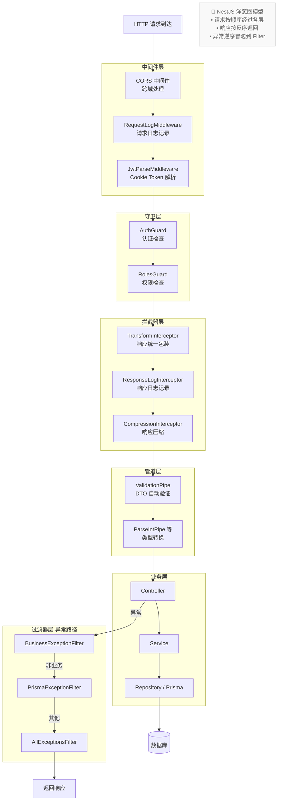

# 07 - NestJS 完整请求流水线

---

## 📊 架构图



---

## 🧠 复刻时的思考

### 1. 中间件层的 3 个组件顺序为什么是这样？

```
CORS → RequestLog → JwtParse

✅ 理由：

1. CORS 必须是第一个
   - 跨域预检请求（OPTIONS）不需要走后面的逻辑
   - 直接返回，不浪费资源
   - 不记录日志，不解析 Token

2. RequestLog 第二个
   - 尽可能早地记录请求
   - 就算后面的中间件出错了，也有日志

3. JwtParse 第三个
   - 提取 Cookie 里的 Token
   - 解析出用户信息，挂在 request 对象上
   - 给后面的 Guard 用

💡 类比前端：
页面渲染前的执行顺序：
1. 路由守卫（是不是能进）
2. 埋点上报（来了就记录）
3. 权限检查（能不能看）
```

### 2. 守卫层为什么是 AuthGuard 然后 RolesGuard？

```
先认证 → 再鉴权

✅ 理由：
- 都没登录的用户，不需要检查权限
- 减少不必要的权限计算
- 错误信息更准确：
  → 没登录：返回 401 请登录
  → 登录了但没权限：返回 403 无权访问

❌ 如果反过来（先检查权限，再认证）：
- 没登录的用户，先检查了一遍权限（浪费）
- 最后返回 401，用户不知道到底是没登录还是没权限

💡 类比前端：
路由守卫的顺序也应该是：
1. 检查是否登录（AuthGuard）
2. 检查是否有权限（RolesGuard）
```

### 3. 拦截器层的顺序为什么是这样？

```
Transform → ResponseLog → Compression

✅ 理由：
1. Transform 第一个
   - 把 Controller 返回的任意数据
   - 包装成统一格式 { success, data, ... }
   - 后面的拦截器看到的都是标准格式

2. ResponseLog 第二个
   - 在响应发出去之前，记录完整的响应体
   - 要在压缩之前记录（压缩后是二进制，看不懂）

3. Compression 最后一个
   - 压缩是最后一步处理
   - 压缩后的数据直接发出去
   - 不再做任何处理

💡 类比前端 axios 响应拦截器顺序：
1. 统一响应格式转换
2. 响应日志记录
3. 响应数据解密（最后一步）
```

### 4. 管道层的 ValidationPipe 原理是什么？

```
✅ ValidationPipe 做了什么：

1. 接收前端传过来的 JSON（都是字符串）
2. 根据 DTO 的 class-validator 装饰器
   @IsString()
   @MinLength(6)
   username: string

3. 自动验证
   - 类型不对？自动转换
   - 验证不通过？自动抛 400 错误
   - 不需要在 Controller 里写 if 判断

💡 关键价值：
每个接口的参数校验都是重复工作
把重复的工作抽象成装饰器
写一次，所有接口生效

💡 类比前端：
表单验证库（Formik / React Hook Form）
   <input name="username" rules={{ required: true, minLength: 6 }} />
声明式验证，不需要写一堆 if
```

### 5. 洋葱圈模型的核心思想是什么？

```
              响应流（反方向）
  ┌───────────────────────────────────┐
  │  ←   ←   ←   ←   ←   ←   ←        │

Middleware → Guard → Interceptor → Pipe
                                      ↓
                                  Controller
                                  Service
                                  Repository
                                      ↓
Exception Filter ← ← ← ← ← ← ← ← ← ←

  ↑                                       ↑
  │            请求流（正方向）           │
  └───────────────────────────────────────┘

✅ 核心思想：
- 横切关注点和业务逻辑完全分离
- Controller / Service 只写纯业务
- 日志、认证、权限、验证全部在外层做
- 任何一层都可以提前终止请求（比如 Guard 返回 401）

💡 类比前端：
洋葱圈模型 = React 组件生命周期
渲染：父 → 子 → 孙
卸载：孙 → 子 → 父
每一层都可以做自己的事情
```

---

## 🔗 对应代码位置

| 层                   | 路径                                                          |
| -------------------- | ------------------------------------------------------------- |
| CORS Middleware      | NestJS 内置 + 配置                                            |
| RequestLogMiddleware | `services/*/src/common/middleware/request-log.middleware.ts`  |
| JwtParseMiddleware   | `services/*/src/common/middleware/jwt-parse.middleware.ts`    |
| AuthGuard            | `services/*/src/auth/guards/jwt-auth.guard.ts`                |
| RolesGuard           | `services/*/src/auth/guards/roles.guard.ts`                   |
| TransformInterceptor | `services/*/src/common/interceptors/transform.interceptor.ts` |
| ValidationPipe       | NestJS 内置，main.ts 配置                                     |
| ExceptionFilter      | `services/*/src/common/filters/*.filter.ts`                   |

---

## 🎯 复刻完成检查清单

- [ ] 能背出中间件层的 3 个组件及其顺序理由
- [ ] 能解释为什么先认证再鉴权
- [ ] 能背出拦截器层的 3 个组件及其顺序理由
- [ ] 能解释 ValidationPipe 的工作原理
- [ ] 能画出洋葱圈模型的完整请求和响应流向
