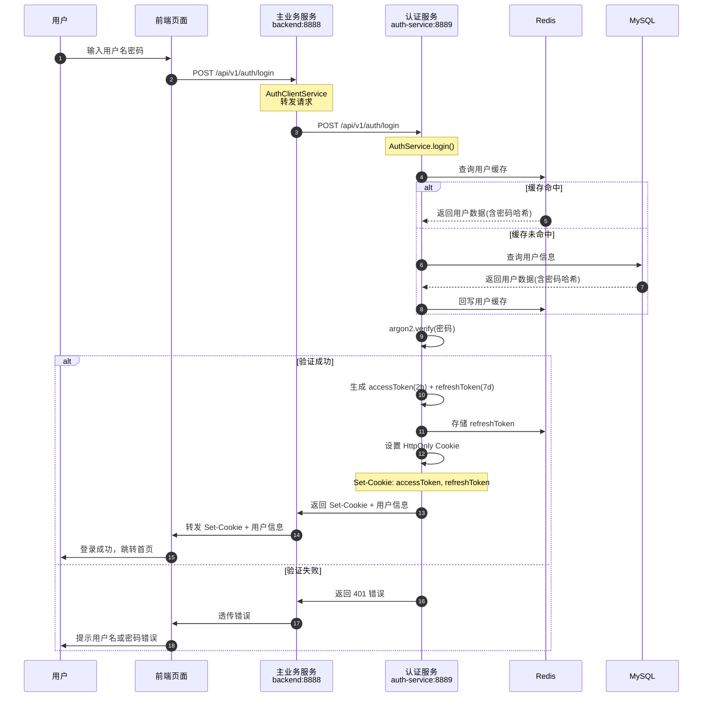

# 01 - 用户登录完整流程

---

## 📊 时序图



---

## 🧠 复刻时的思考

### 1. 为什么登录请求要经过 backend 转发？前端直接调 auth-service 不行吗？

```
✅ 转发的好处：

1. 统一入口
   - 前端只需要知道 backend 一个地址
   - 不需要配置第二个服务的 baseURL
   - CORS 只需要配一个地方

2. 便于加中间层逻辑
   - 可以在 backend 做登录限流
   - 可以做登录日志审计
   - 可以做二次校验（比如验证码）

3. 便于将来演进
   - 加 API Gateway
   - 做灰度发布
   - 做多认证源（手机、微信、SSO）

❌ 前端直接调的问题：
- 前端要维护两个服务地址
- 两个服务的 CORS 都要配
- auth-service 要直接暴露给公网，安全风险高
```

### 2. 为什么密码验证是在 auth-service 做？而不是 backend？

```
✅ 职责边界清晰：

auth-service 管所有和认证相关的事：
- 密码验证
- Token 签发
- 登出处理
- Token 刷新

backend 只需要：
- 转发认证请求
- 验证 Token（通过 Guard）
- 不需要知道密码加密算法是什么
- 不需要接触密码哈希

💡 架构原则：
高内聚，低耦合
认证领域的所有逻辑都内聚在 auth-service
其他服务不需要知道实现细节
```

### 3. 为什么 refreshToken 存在 Redis？和 accessToken 有什么区别？

```
Token 类型对比：

┌──────────────────────────────┐
│ accessToken (JWT)           │
├──────────────────────────────┤
│ 存储：HttpOnly Cookie        │
│ 有效期：2 小时               │
│ 特点：自包含，不需要查库     │
│ 验证：JWT.verify 本地验签    │
└──────────────────────────────┘

┌──────────────────────────────┐
│ refreshToken                │
├──────────────────────────────┤
│ 存储：Redis                 │
│ 有效期：7 天                 │
│ 特点：可以吊销                │
│ 验证：必须查 Redis 是否存在  │
└──────────────────────────────┘

✅ 为什么 refreshToken 要查库？
- 用户改密码了 → 所有旧 refreshToken 失效
- 用户登出了 → 这个 refreshToken 立刻失效
- 需要可以"立刻吊销"的能力
- JWT 做不到立刻吊销（除非维护黑名单）
```

### 4. 登录失败为什么不区分"用户名不存在"和"密码错误"？

```
✅ 安全最佳实践：

永远返回统一的错误信息：
"用户名或密码错误"

❌ 区分的安全风险：
- 攻击者可以枚举用户名
- "这个用户名不存在" → 换下一个
- "密码错误" → 这个用户名存在，开始爆密码

💡 所有涉及账号的接口都要注意：
- 登录
- 注册
- 找回密码
- 发送验证码

永远不要告诉攻击者"这个账号存在/不存在"
```

### 5. 这个流程的性能瓶颈在哪里？怎么优化？

```
原始流程：
每次登录都查 MySQL → 验证密码 → 写 Redis
→ 单实例 QPS ≈ 100-150

✅ 本项目的优化（零 MySQL 登录）：
所有用户数据预加载到 Redis
→ 登录流程不需要查 MySQL
→ 单实例 QPS ≈ 600-1000

优化后的瓶颈：
1. argon2 密码哈希验证（CPU 密集）
   → 可以用 worker_threads 异步处理
   → 可以限制最大并发数

2. Redis 读写
   → 单实例 Redis 很容易到 10k QPS
   → 不是瓶颈

3. 网络往返次数
   → 前端 → backend → auth-service → Redis
   → 减少不必要的调用
```

---

## 🔗 对应代码位置

| 组件              | 路径                                                            |
| ----------------- | --------------------------------------------------------------- |
| 前端登录页        | `apps/web/src/pages/Login/index.tsx`                            |
| 前端登录 API      | `apps/web/src/api/auth/index.ts`                                |
| 登录接口(backend) | `services/backend/src/auth/auth.controller.ts`                  |
| AuthClientService | `services/backend/src/shared/auth-client.service.ts`            |
| 登录接口(auth)   | `services/auth-service/src/auth/auth.controller.ts`              |
| AuthService       | `services/auth-service/src/auth/auth.service.ts`                |
| 密码验证          | `services/auth-service/src/auth/password-validation.service.ts` |
| RefreshToken 存储 | `services/auth-service/src/auth/refresh-token-redis.service.ts` |
| Token 生成       | `services/auth-service/src/auth/token-generator.service.ts`      |
| 用户加载          | `services/auth-service/src/auth/user-loader.service.ts`         |

---

## 🎯 复刻完成检查清单

- [ ] 能解释为什么登录请求要经过 backend 转发
- [ ] 能说出 accessToken 和 refreshToken 的 3 个核心区别
- [ ] 能解释为什么 refreshToken 必须查 Redis 验证
- [ ] 能解释登录失败不区分具体原因的安全考量
- [ ] 能说出零 MySQL 登录优化的性能提升倍数
