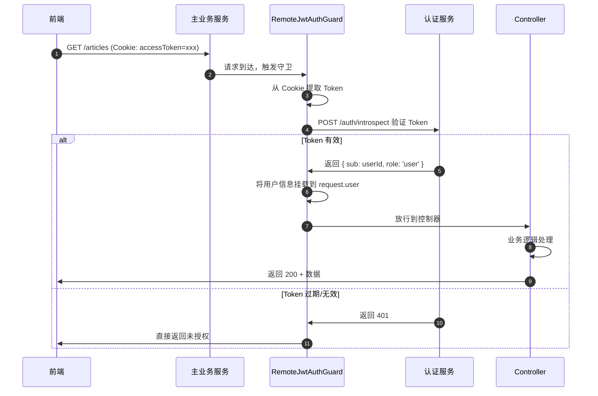

# 02 - API 请求认证流程

---

## 📊 时序图



---

## 🧠 复刻时的思考

### 1. 为什么要远程调用 introspect 接口？本地 JWT.verify 不行吗？

```
✅ 两种方案对比：

方案 A：本地 JWT.verify（简单）
├─ 优点：零网络开销，快
└─ 缺点：
   - auth-service 吊销了 Token，backend 不知道
   - 改 JWT 签名密钥，所有服务都要同步配置
   - 所有服务都要有 JWT 验证逻辑，代码重复

方案 B：远程 introspect 验证（当前方案）
├─ 优点：
   - Token 状态是强一致的
   - 立刻吊销，立刻生效
   - 验证逻辑只在 auth-service 一份
   - 可以加更多逻辑（封禁用户、设备检查）
└─ 缺点：
   - 多了一次 HTTP 调用
   - 增加了约 1-2ms 延迟

✅ 本项目的权衡：
加一层缓存
→ 第一次调用 introspect
→ 把结果缓存到 Redis，缓存时间 1 分钟
→ 1 分钟内的相同 Token 不用再调 auth-service
→ 延迟从 2ms 降到 <1ms
→ Token 吊销最多有 1 分钟的窗口（业务可接受）
```

### 2. Guard 为什么能拦截所有请求？是怎么工作的？

```
✅ NestJS Guard 的工作原理：

1. 装饰器声明
   @UseGuards(RemoteJwtAuthGuard)
   @Get('articles')
   getArticles() { ... }

2. NestJS 在路由注册时
   → 把 Guard 挂到这个路由的元数据上

3. 请求到达时
   → 按顺序执行 Middleware
   → 然后执行所有注册的 Guard
   → 任何一个 Guard 返回 false，立刻终止请求

4. Guard 执行 canActivate(context) 方法
   → 返回 true：继续
   → 返回 false：抛 403 Forbidden
   → 抛异常：直接返回错误

💡 类比前端：
路由守卫（beforeEach）
在进入路由之前执行
不满足条件就重定向到登录页
```

### 3. 用户信息为什么要挂在 request.user 上？而不是每个 Controller 自己查？

```
✅ 统一挂载的好处：

1. Controller 不需要关心认证
   → 直接用 @GetUser() user: UserDto 就能拿到
   → 不需要重复写查用户的代码

2. 所有接口都能拿到用户信息
   → 日志记录
   → 权限检查
   → 数据隔离（只能看自己的数据）

3. 易于测试
   → 测试时可以 mock request.user
   → 不需要真的走认证流程

💡 类比前端：
全局状态管理 store
把登录用户信息存在 store.user
所有组件都能拿，不需要每个组件调一次 getUser()
```

### 4. Token 存在 HttpOnly Cookie 里，前端是怎么传的？

```
✅ Cookie 的自动携带机制：

1. 后端登录成功
   Set-Cookie: accessToken=xxx; HttpOnly; Secure; SameSite=Strict; MaxAge=7200

2. 浏览器收到 Set-Cookie
   → 自动存到 Cookie 管理器
   → JS 代码读不到（HttpOnly 保护）

3. 后续所有请求
   → 浏览器自动把 Cookie 带在请求头里
   → axios / fetch 不需要做任何事
   → 前端代码完全感知不到

✅ 对比 Authorization Header 方案：
Header: 前端要存 Token → 每次请求手动加 header
Cookie: 浏览器自动处理，前端代码零感知

💡 安全优势：
就算有 XSS 漏洞
攻击者也拿不到 Token
因为 JS 读不到 HttpOnly Cookie
```

### 5. 这个流程的性能瓶颈在哪里？怎么优化？

```
原始流程：
每个 API 请求 → 调一次 auth-service introspect
→ 假设 1000 QPS → auth-service 被打 1000 次/秒

✅ 优化方案：加缓存层

   第一次请求 Token = abc
      → 调 auth-service
      → 缓存结果到 Redis，expire = 60s

   后续 60 秒内的所有 abc Token 请求
      → 直接从 Redis 拿
      → 零网络调用，<1ms 返回

✅ 效果：
99% 的请求命中缓存
→ auth-service QPS 从 1000 降到 10
→ 整体延迟从 2ms 降到 <1ms

💡 权衡：
牺牲了最多 1 分钟的吊销延迟
换来了 10 倍的性能提升
业务可接受的前提下，非常划算
```

---

## 🔗 对应代码位置

| 组件               | 路径                                                         |
| ------------------ | ------------------------------------------------------------ |
| RemoteJwtAuthGuard | `services/backend/src/auth/guards/remote-jwt-auth.guard.ts`  |
| AuthClientService  | `services/backend/src/common/auth-client.service.ts`         |
| Introspect 接口    | `services/auth-service/src/auth/auth.controller.ts`          |
| 用户装饰器         | `services/backend/src/auth/decorators/get-user.decorator.ts` |

---

## 🎯 复刻完成检查清单

- [ ] 能解释为什么要远程 introspect 而不是本地 JWT.verify
- [ ] 能说出加缓存后的性能提升和权衡
- [ ] 能解释 Guard 的工作原理和执行时机
- [ ] 能解释 HttpOnly Cookie 的自动携带机制
- [ ] 能解释为什么把用户信息挂在 request.user 上
