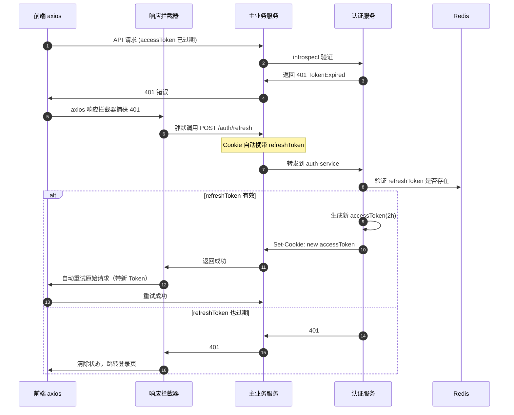

# 03 - Token 自动刷新流程

---

## 📊 时序图



---

## 🧠 复刻时的思考

### 1. 为什么要静默刷新？让用户重新登录不行吗？

```
✅ 用户体验差异：

方案 A：accessToken 2 小时，过期让用户重登
→ 用着用着突然跳转登录页
→ 输入的内容可能丢失
→ 用户体验很差，流失率高

方案 B：静默刷新（本项目）
→ accessToken 2 小时过期
→ refreshToken 7 天有效期
→ 过期了自动在后台刷新
→ 用户完全感知不到
→ 只要 7 天内来过一次，就永远不用重登

✅ 刷新的触发时机：
1. 接口返回 401 TokenExpired
2. axios 拦截器捕获到这个错误
3. 调 refresh 接口拿新 Token
4. 自动重试失败的请求
5. 业务代码完全感知不到
```

### 2. 为什么 axios 拦截器要自动重试？业务代码自己处理不行吗？

```
✅ 拦截器自动重试的好处：

1. 业务代码零感知
   const res = await getArticles()
   → 不需要在每个调用处判断 401
   → 不需要写刷新逻辑
   → 业务代码只关心成功/失败

2. 统一处理，不会遗漏
   → 100 个接口，每个都要写？
   → 新人写代码忘了怎么办？
   → 拦截器一次处理，所有接口生效

3. 可以控制重试次数
   → 最多重试 1 次
   → 避免死循环

💡 类比前端：
网络状态变化
→ 不是每个组件都监听网络变化
→ 统一在 axios 拦截器里处理
→ 断网了提示，联网了自动重试
→ 业务代码完全不用关心
```

### 3. 为什么 refreshToken 也要有过期时间？永久有效不行吗？

```
✅ 安全考量：

1. refreshToken 泄露风险
   → 用户在公用电脑登录，忘了关页面
   → refreshToken 被人偷了
   → 永久有效 = 攻击者可以一直用这个账号
   → 7 天有效期 = 最多只能用 7 天

2. 定期重新认证
   → 强制用户每 7 天至少输一次密码
   → 确认用户还是账号所有者
   → 密码改了，旧 refreshToken 全部失效

✅ 双层 Token 安全设计：

    ┌──────────────────────────────┐
    │ accessToken                  │
    │ 有效期短：2 小时             │
    │ 泄露了，最多能用 2 小时      │
    └──────────────────────────────┘

    ┌──────────────────────────────┐
    │ refreshToken                 │
    │ 有效期长：7 天               │
    │ 泄露了，可以立刻手动吊销     │
    └──────────────────────────────┘

💡 架构原则：
权限越大的 Token，有效期越短
可以不用每次都输密码，但也不能永远不用
```

### 4. 刷新接口为什么不需要传参数？refreshToken 在哪？

```
✅ refreshToken 也在 HttpOnly Cookie 里：

1. 登录成功
   Set-Cookie: accessToken=xxx; MaxAge=7200
   Set-Cookie: refreshToken=yyy; MaxAge=604800

2. 调 /auth/refresh 接口
   → Cookie 自动带上去了
   → 前端不需要知道 refreshToken 存在
   → 前端不需要传任何参数

✅ 安全优势：
- refreshToken 也是 HttpOnly
- JS 代码拿不到
- XSS 攻击也偷不到
- 只能通过浏览器自动发送

💡 类比：
你进小区，门禁卡自动识别
你不需要把卡拿出来给保安
门禁自动读取，自动放行
你完全感知不到这个过程
```

### 5. 这个流程有什么安全隐患？怎么防范？

```
🔴 潜在风险 1：重放攻击
攻击者截获 refresh 接口的请求
→ 反复调用，拿新的 accessToken
→ 解决方案：每次刷新都生成新的 refreshToken
→ 旧 refreshToken 立刻失效（one-time use）

🔴 潜在风险 2：并发刷新
两个请求同时 401
→ 同时调 refresh 接口
→ 第一个成功了，第二个用的旧 refreshToken 就失败
→ 解决方案：加锁，同一时间只允许一个 refresh 请求
→ 其他请求等待，刷新完成后一起重试

🔴 潜在风险 3：刷新失败死循环
refresh 接口也返回 401
→ 拦截器又调 refresh
→ 又 401，又调 refresh
→ 死循环
→ 解决方案：最多重试 1 次，失败就跳转登录
```

---

## 🔗 对应代码位置

| 组件                | 路径                                                            |
| ------------------- | --------------------------------------------------------------- |
| axios 响应拦截器    | `apps/web/src/api/interceptors/response.interceptor.ts`         |
| refresh 接口        | `services/backend/src/auth/auth.controller.ts`                  |
| RefreshTokenService | `services/auth-service/src/auth/refresh-token-redis.service.ts` |

---

## 🎯 复刻完成检查清单

- [ ] 能解释静默刷新带来的用户体验提升
- [ ] 能说出拦截器自动重试的 3 个好处
- [ ] 能解释为什么 refreshToken 不能永久有效
- [ ] 能解释为什么 refresh 接口不需要传参数
- [ ] 能说出这个流程的 3 个安全隐患和对应防范措施
