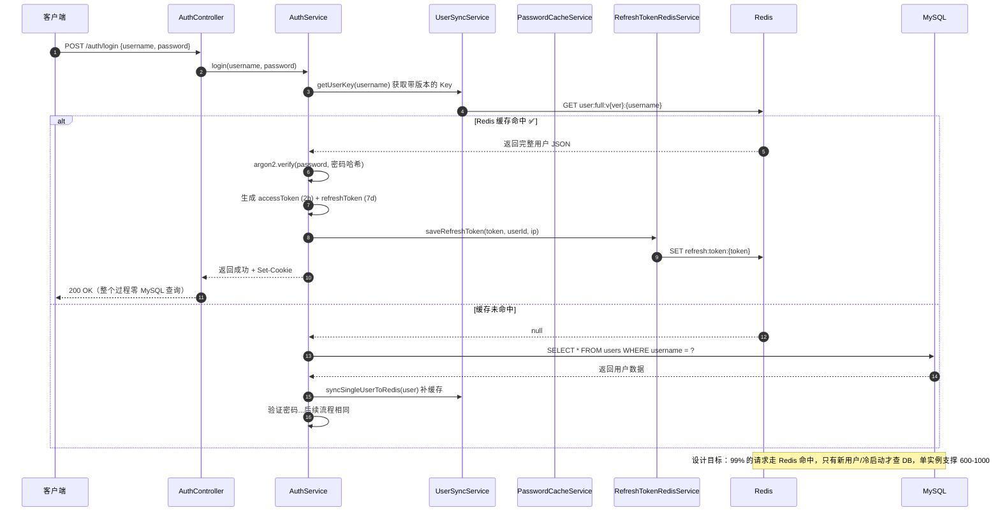

# 04 - 登录零 MySQL 完整流程

---

## 📊 时序图



---

## 🧠 复刻时的思考

### 1. 为什么要把整个用户对象都存在 Redis？只存密码哈希不行吗？

```
✅ 存完整对象的好处：

1. 0 MySQL
   - 昵称、头像、角色、、、
   - 所有用户信息都有
   - 不需要查数据库

2. 登录成功后要返回用户信息给前端
→ 不用再查一次 DB
→ 整个登录流程 0 DB 查询

3. 扩展性好
→ 将来要加新字段（比如手机号）
→ 只需要改预加载逻辑
→ 登录流程不用改

💡 数据量估算：
100 万用户 × 500 字节 = 476 MB
完全在 Redis 的承受范围内
内存很便宜，性能更重要
```

### 2. 版本号 Key 的设计是怎么保证原子性的？

```
✅ Key 空间设计：

┌─────────────────────────────────────────┐
│ user:full:current-version  = v1715000000  │ 指针，
├─────────────────────────────────────────┤
│ user:full:v1715000000:alice  = { ... }  │
│ user:full:v1715000000:bob    = { ... } │
│ ...                                     │
└─────────────────────────────────────────┤
│ user:full:v1714000000:alice  = { ... }  │ 旧版本
│ user:full:v1714000000:bob    = { ... }  │
└─────────────────────────────────────────┘

✅ 原子切换流程：

1. 生成新版本号 = 时间戳
2. 所有新数据都写到 v{新} 空间
3. 全部写完 → SET current-version = v{新}
4. 后续所有读请求都走新版本
5. 异步慢慢删旧版本

💡 关键洞察：
写的时候，读的还是旧版本
不会出现"部分新部分旧"的中间状态
要么全旧，要么全新
真正的原子切换，没有锁，没有竞态
```

### 3. 预加载失败怎么办？服务启动到一半挂了？

```
✅ 三级降级保障：

第 1 级：开关控制
USER_PRELOAD_ENABLED = false
→ 完全关闭预加载，回到原始方案

第 2 级：缓存未命中自动回源
→ 预加载没成功，Redis 里没有数据
→ 自动查 MySQL，补缓存
→ 慢是慢点，服务不挂

第 3 级：降级兜底
→ 就算 Redis 整个挂了
→ 所有请求直接查 MySQL
→ QPS 从 1000 降到 100
→ 但服务还是可用的

💡 架构设计原则：
每一个优化都必须有降级方案
优化可以不上，上线不能挂
```

### 4. 用户改密码了怎么办？缓存和数据库不一致？

```
✅ 写穿透一致性保证：

操作：用户改密码
1. 改 MySQL 成功
2. 立刻删旧的 Redis Key
3. 立刻写新的 Redis Key
→ 0 延迟，强一致

操作：管理员封禁用户
1. 更新 users 表 status = blocked
2. 立刻删 Redis 里的用户缓存
→ 下次登录就会重新加载，看到最新状态

✅ 最终一致性兜底：
就算写 Redis 失败了也没关系
Redis Key 有 7 天 TTL
最多 7 天后自动过期，重新加载
不会永久不一致
```

### 5. 这个方案的极限性能瓶颈在哪里？还能再优化吗？

```
当前性能：单实例 8 核 → 600-1000 QPS

🔴 当前瓶颈：argon2 密码验证（CPU 密集）
每次验证约 8-10ms

✅ 可以继续优化的方向：

1. worker_threads 异步计算
   - 把 argon2 计算放到 worker 线程
   - 不占用主事件循环
   - 性能可提升 2-3 倍

2. 密码哈希缓存
   - 相同密码 + 相同盐 → 结果相同
   - 可以缓存最近 1 小时的验证结果
   - 暴力破解的场景会撞库攻击 → 1 分钟内 1 2 次相同密码
   - 性能再提升 2-10 倍（取决于重复率

3. 集群部署
   - 多实例 + 负载均衡
   - 线性提升 N 个实例 → QPS × N
   - 只要 Redis 能扛住

💡 什么时候需要优化到这个程度？
当你的用户量达到 100 万 DAU，登录
当你的业务达到 10 万/小时
否则，当前方案完全够用了
过早优化是万恶之源
```

---

## 🔗 对应代码位置

| 组件                     | 路径                                                       |
| ------------------------ | ---------------------------------------------------------- |
| UserSyncService          | `services/backend/src/users/user-sync.service.ts`          |
| PasswordCacheService     | `services/backend/src/users/password-cache.service.ts`     |
| RefreshTokenRedisService | `services/backend/src/auth/refresh-token-redis.service.ts` |
| AuthService              | `services/backend/src/auth/auth.service.ts`                |

---

## 🎯 复刻完成检查清单

- [ ] 能解释为什么要存完整用户对象而不是只存密码哈希
- [ ] 能画出双版本 Key 空间的设计
- [ ] 能说出三级降级方案分别是什么
- [ ] 能解释用户改密码时的缓存一致性保证
- [ ] 能说出当前方案的性能瓶颈和 3 个进一步优化方向
