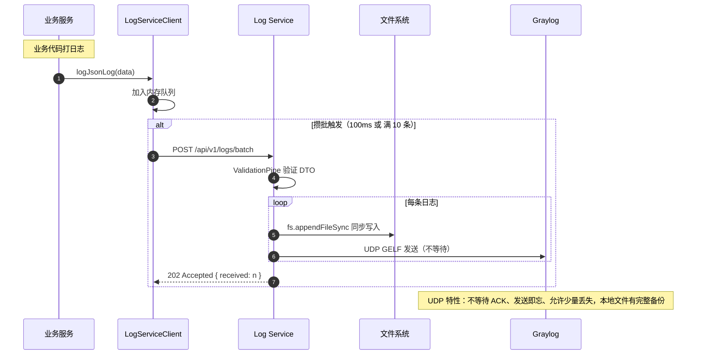

# 05 - 日志上报完整流程

---

## 📊 时序图



---

## 🧠 复刻时的思考

### 1. 为什么要用内存队列攒批？每条立刻发不行吗？

```
❌ 每条立刻发的问题：
1000 QPS → 1000 次 HTTP 请求
   → 1000 次 TCP 握手
   → 1000 次 HTTP Header 传输
   → 日志服务 1000 QPS 压力

✅ 攒批 100ms + 满 10 条触发：
1000 QPS → 平均 100 次/秒
   → 减少 10 倍请求数
   → 减少 10 倍网络开销
   → 日志服务 QPS 压力降 10 倍

💡 权衡：
增加最多 100ms 延迟
换来 10 倍吞吐量提升
日志不是实时消息，完全可接受
```

### 2. 为什么文件写入要用同步 appendFileSync？异步写入不行吗？

```
✅ 同步写入的好处：

1. 绝对可靠
   → appendFileSync 成功返回 = 数据一定在磁盘上
   → 进程崩溃也不会丢日志
   → 操作系统会保证写入完成

2. 顺序写入
   → 不会出现"先打的日志后到磁盘"
   → 日志顺序和发生顺序完全一致
   → 排查问题更方便

3. 性能足够
   → 现代磁盘顺序写入 ≈ 50-100MB/s
   → 一条日志 500 字节 → 10 万条/秒
   → 绝大多数场景完全够用

❌ 异步写入的问题：
异步写入的回调还没执行，进程崩了
→ 日志就丢了
→ 排查问题时发现最后关键的日志没了
→ 非常难受

💡 关键洞察：
日志是用来排查问题的
如果丢了，问题就没法排查了
宁可慢一点，也不能丢
```

### 3. 为什么 Graylog 要用 UDP 发送？TCP 不可靠吗？

```
✅ UDP 的优势（对于日志）：

1. 发送即忘
   → 不需要等 Graylog 返回 ACK
   → 不阻塞主流程
   → Graylog 挂了不影响业务服务

2. 没有连接开销
   → 不需要三次握手
   → 不需要保活
   → 不需要重连

3. 背压保护
   → Graylog 处理不过来 → 丢包
   → 不会反向压垮业务服务

✅ 可靠性兜底：
本地文件已经有完整备份
→ 丢了就丢了，不影响
→ 大不了去服务器上查本地文件

💡 架构哲学：
日志是"非关键路径"
业务服务的可用性 > 日志 100% 不丢
宁愿丢 1% 的日志，也不能让业务服务被日志拖挂
```

### 4. 为什么返回 202 Accepted？为什么不返回 200 OK？

```
HTTP 状态码语义：

200 OK = 处理完成，结果返回
202 Accepted = 已接收，正在处理，不保证完成

✅ 日志用 202 的理由：

1. 不需要等 Graylog 确认收到
2. 不需要等文件刷盘（虽然 appendFileSync 是同步的
3. 告诉客户端："我收到了，后续你不用管了"
4. 客户端不需要等待，立刻可以继续干活

💡 更深层次的设计思想：
非关键路径的操作
不要阻塞关键路径
能异步就异步
能早返回就早返回
```

### 5. 这个架构的演进路径是什么？还能怎么优化？

```
阶段 1：单体日志（最简单）
每个服务写自己的本地文件
→ 查日志要一台一台 SSH 上去

阶段 2：本项目当前架构
集中式 log-service + 批量上报 + UDP Graylog
→ 一个地方查所有服务的日志
→ 适合 10 个服务以内

阶段 3：消息队列缓冲
Kafka / Pulsar 做中间层
服务写 Kafka，Logstash 消费
→ log-service 挂了也不丢日志
→ 可以扛住峰值流量
→ 适合 100+ 服务规模

阶段 4：Sidecar 模式
每个 Pod 旁边跑一个 Filebeat Sidecar
应用写本地文件，Sidecar 负责上报
→ 应用代码零侵入
→ 不需要改代码就能接入
→ K8s 环境的标准方案

💡 什么时候演进？
能简单就简单
不要为了演进而演进
当前架构完全够用
等真的遇到瓶颈了再升级
```

---

## 🔗 对应代码位置

| 组件             | 路径                                                |
| ---------------- | --------------------------------------------------- |
| LogServiceClient | `packages/shared-logging/src/log-service.client.ts` |
| LogController    | `services/log-service/src/log/log.controller.ts`    |
| appendJsonLog    | `services/log-service/src/logger/file-logger.ts`    |
| sendToGraylog    | `services/log-service/src/logger/graylog.ts`        |

---

## 🎯 复刻完成检查清单

- [ ] 能解释攒批带来的性能提升倍数
- [ ] 能解释为什么日志写入要用同步而不是异步
- [ ] 能解释为什么 Graylog 发送用 UDP 而不是 TCP
- [ ] 能解释为什么返回 202 而不是 200
- [ ] 能说出日志架构的 4 个演进阶段和适用场景
