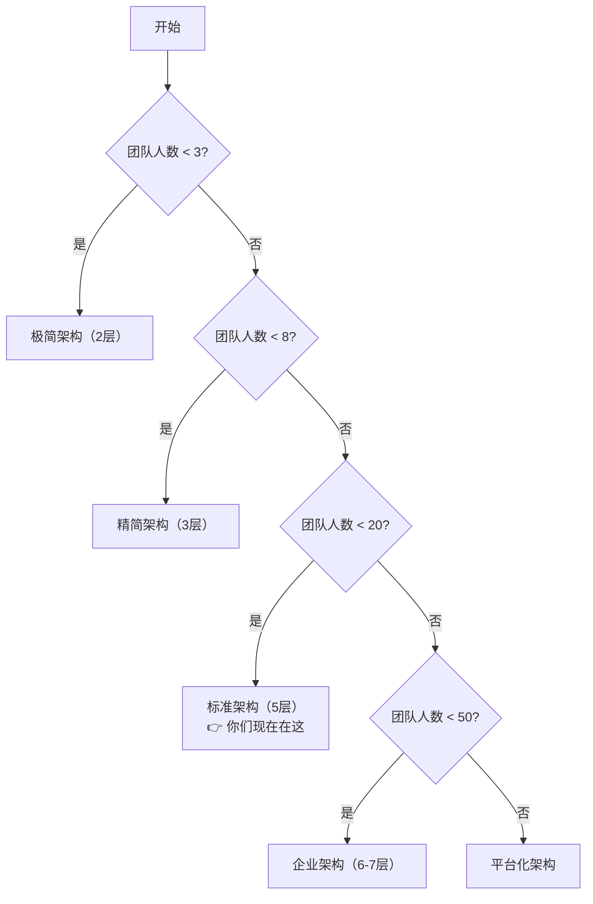

# 📋 团队规模 vs 架构适配矩阵

**归档日期**: 2026-05-07
**适用项目**: claude - AI 协同开发治理体系

---

## 🔍 快速对照表

| 团队规模     | 适配架构          | 配置文件数 | 维护成本 | 核心收益            | ROI  |
| ------------ | ----------------- | ---------- | -------- | ------------------- | ---- |
| **1-3 人**   | 极简架构（2层）   | 1-3 个     | 极低     | 基础规范            | 低   |
| **3-8 人**   | 精简架构（3层）   | 5-12 个    | 低       | 决策固化 + 规则复用 | 中高 |
| **8-20 人**  | 标准架构（5层）   | 20-40 个   | 中       | 完整治理体系        | 最高 |
| **20-50 人** | 企业架构（6-7层） | 50-100 个  | 高       | 多团队协同          | 高   |
| **50+ 人**   | 平台化架构        | 100+ 个    | 很高     | 企业级治理          | 中   |

---

## 1️⃣ 1-3 人团队：极简架构

### 适用场景

- 个人项目 / 小工具 / 原型验证
- 项目生命周期 < 6 个月
- 团队成员都是资深工程师，默契度高

### 配置结构

```
.claude/
├── CLAUDE.md          # 所有规则都写在这里，不超过 500 行
└── settings.json      # 基础权限配置
```

### 核心原则

> **能不用就不用，能少写就少写**

- ❌ 不要搞什么分层、什么治理
- ✅ 只写最核心的 3-5 条规则：用什么技术栈、代码风格是什么、安全底线是什么
- ✅ 有什么问题直接改 CLAUDE.md

### 优缺点对比

| ✅ 优点        | ❌ 缺点                      |
| -------------- | ---------------------------- |
| 零维护成本     | 文件会越来越长，后期不好找   |
| 上手最快       | 规则之间可能冲突，没有优先级 |
| 怎么方便怎么来 | 新人接手看不懂               |

---

## 2️⃣ 3-8 人团队：精简架构

### 适用场景

- 中小团队 / 创业团队
- 项目生命周期 1-2 年
- 前端 + 后端技术栈
- 对代码质量有一定要求

### 配置结构（3 层核心架构）

```
.claude/
├── CLAUDE.md              # 根入口
├── DECISIONS.md           # 👉 核心：架构决策（宪法）
│                           # 只写 5-10 条最关键的决策
│                           # 每条决策必须有：为什么选 + 边界约束
│
├── rules/                 # 👉 核心：通用规则（法律）
│   ├── typescript.md      # TypeScript 规范
│   ├── security.md        # 安全规范
│   └── format.md          # 代码格式规范
│
├── agents/                # 3-5 个最核心的 Agent（行政机关）
│   ├── frontend-dev.md    # 前端开发
│   ├── backend-dev.md     # 后端开发
│   └── code-review.md     # 代码审查
│
└── settings.json          # 权限配置
```

### 核心原则

> **只保留真正有价值的两层：决策层 + 规则层**

- ✅ **DECISIONS.md 必须有** —— 这是团队认知对齐的核心，避免"为什么用这个不用那个"的无休止讨论
- ✅ **rules/ 必须有** —— 通用规则一处修改，所有 Agent 生效，复用价值最高
- ⚠️ **agents 精简到 3-5 个** —— 不要搞 16 个 Agent，很多永远用不上
- ❌ **删掉 skills、commands、workflows** —— 这些带来的收益抵不上维护成本

### 维护成本 vs 收益

| 指标              | 数值          |
| ----------------- | ------------- |
| 月维护成本        | 1-2 小时      |
| 年人均节省        | 50-80 小时/人 |
| ROI（投入产出比） | ~25:1         |

> 投入 1 小时，赚回 25 小时

### 优缺点对比

| ✅ 优点                              | ❌ 缺点                                        |
| ------------------------------------ | ---------------------------------------------- |
| 维护成本低，一个人就能搞定           | 没有场景化步骤，复杂场景 AI 可能不知道具体步骤 |
| 核心收益都拿到了：决策固化、规则复用 | 没有快捷命令，用户要自己记用哪个 Agent         |
| 新人上手也快，看两个文件就懂         | 没有自动化流程                                 |

---

## 3️⃣ 8-20 人团队：标准架构（你们现在的方案）

### 适用场景

- 中型团队 / 成熟产品团队
- 项目生命周期 2 年以上
- 多技术栈（前端 + 后端 + 移动端）
- 对代码质量、安全、性能都有要求
- 有新人持续加入

### 配置结构（5 层标准架构）

```
.claude/
├── CLAUDE.md
├── DECISIONS.md           # 宪法：架构决策 10-20 条
│   └── FRONTEND-DECISIONS.md  # 前端专项决策
│
├── rules/                 # 法律：通用规则 5-8 个
│   ├── typescript-common.md
│   ├── security-common.md
│   ├── code-format-common.md
│   ├── project-behavior.md
│   └── frontend-components.md
│
├── agents/                # 行政机关：5-8 个专用 Agent
│   ├── frontend-developer.md
│   ├── frontend-code-reviewer.md
│   ├── frontend-test-writer.md
│   ├── backend-architect.md
│   ├── nestjs-code-review.md
│   ├── debug-assistant.md
│   └── git-helper.md
│
├── skills/                # 办事指南：2-3 个技术栈技能包
│   ├── h5-frontend-developer/  # 前端开发标准流程
│   └── nestjs-backend-developer/ # 后端开发标准流程
│
├── project-memory.md      # 历史经验：踩坑记录
└── settings.json          # 行政许可：权限配置
```

### 核心原则

> **完整治理体系，规模效应最大化**

- ✅ **决策层 + 规则层** 是基础，必须有
- ✅ **Agent 层** 扩展到 5-8 个，覆盖主要开发场景
- ✅ **Skill 层** 保留，场景化步骤标准化，代码风格统一
- ✅ **记忆层** 保留，避免重复踩坑
- ❌ **删掉 commands 层** —— 本质就是触发 Agent，用户直接用 Agent 也一样，维护 20 个命令文件不值得
- ❌ **workflows 只保留真正在用的 1-2 个** —— 大多数 workflow 都是"看起来很美"，实际很少用

### 维护成本 vs 收益

| 指标              | 数值                     |
| ----------------- | ------------------------ |
| 月维护成本        | 4-8 小时（0.1-0.2 人力） |
| 年人均节省        | 80-120 小时/人           |
| ROI（投入产出比） | ~15:1                    |

> 投入 1 小时，赚回 15 小时

### 优缺点对比

| ✅ 优点                                  | ❌ 缺点                                  |
| ---------------------------------------- | ---------------------------------------- |
| 80% 的收益都拿到了                       | 维护成本中等，加一个规则要考虑更新到哪里 |
| 场景化步骤标准化，代码风格高度统一       | 学习曲线有点陡，新人第一次看会懵         |
| 新人上手快，第一天就能写出符合规范的代码 | 可能出现"为了分层而分层"的形式主义       |
| 零架构债务，代码质量可控                 |                                          |

---

## 4️⃣ 20-50 人团队：企业架构

### 适用场景

- 大型团队 / 多产品线
- 多个微服务 / 多个系统
- 有专门的架构组 / 工程效能组
- 有严格的合规和审计要求

### 配置结构（6-7 层企业级架构）

```
.claude/
├── DECISIONS/             # 决策分组
│   ├── architecture.md    # 全局架构决策
│   ├── frontend.md        # 前端专项决策
│   ├── backend.md         # 后端专项决策
│   ├── security.md        # 安全专项决策
│   └── database.md        # 数据库专项决策
│
├── rules/                 # 规则分组
│   ├── common/            # 通用规则
│   ├── frontend/          # 前端规则组
│   ├── backend/           # 后端规则组
│   └── security/          # 安全规则组
│
├── agents/                # Agent 分组 10-15 个
│   ├── frontend/          # 前端 Agent 组
│   ├── backend/           # 后端 Agent 组
│   ├── devops/            # DevOps Agent 组
│   └── security/          # 安全 Agent 组
│
├── skills/                # 技能分组
│   ├── by-team/           # 按团队划分的技能
│   └── by-scenario/       # 按场景划分的技能
│
├── commands/              # 高频快捷命令
├── governance/            # 新增：治理层
│   ├── change-log.md      # 变更日志：谁改了什么、什么时候、为什么
│   ├── review-cycle.md    # 复审周期
│   └── metrics.md         # 度量指标：这套体系到底有没有用
│
└── settings.json
```

### 新增的核心机制

1. **变更审批流程**：修改决策需要架构组审批
2. **度量和反馈**：统计代码质量、Bug 率、开发效率的变化
3. **分级权限**：不同团队只能改自己那部分的规则
4. **培训体系**：新人培训文档、最佳实践、FAQ

### 维护成本 vs 收益

| 指标              | 数值                     |
| ----------------- | ------------------------ |
| 月维护成本        | 20-40 小时（0.5-1 人力） |
| 年人均节省        | 100-150 小时/人          |
| ROI（投入产出比） | ~10:1                    |

---

## 5️⃣ 50+ 人团队：平台化架构

### 适用场景

- 超大型团队 / 企业级
- 多地域、多部门协作
- 需要合规审计、安全认证

### 核心特征

- ❌ 不是一套 markdown 文件了，需要**真正的平台**
- ✅ 有 Web 界面管理规则、Agent、权限
- ✅ 有 API 可以和其他系统集成
- ✅ 有完整的审计日志
- ✅ 有数据看板看效果

---

## 🎯 决策树：你的团队该用什么架构？



---

## 💡 最后三条黄金建议

### 1. 从简入手，逐步加层

不要一开始就搞 8 层 68 个文件。先从 3 层开始，用着用着发现"这个场景确实需要再加一层"，再加。

### 2. 用数据说话

每加一层，问自己三个问题：

1. 这层上个月真的帮我们省时间了吗？
2. 有没有具体的例子？
3. 维护它的成本是多少？

### 3. 避免形式主义

> **分层是手段，不是目的。**
>
> 如果一个分层没有真的解决问题，只是"看起来很专业"，那就删掉它。

---

## 📌 针对你们团队的具体优化建议

你们现在是 **8-20 人** 区间，建议做如下精简优化：

| 层级                 | 当前状态 | 建议动作           | 预期效果                       |
| -------------------- | -------- | ------------------ | ------------------------------ |
| \*\*DECISIONS 决策层 | 2 个文件 | ✅ 保留            | 这是核心价值                   |
| \*\*rules 通用规则层 | 5 个文件 | ✅ 保留            | 复用价值最高                   |
| \*\*agents Agent 层  | 16 个    | ⚠️ 精简到 5-8 个   | 删除没用过的 Agent             |
| \*\*skills 技能层    | 25 个    | ⚠️ 保留核心 2-3 个 | 其他合并到 agents              |
| \*\*commands 命令层  | 20 个    | ❌ 全部删除        | 直接用 agents 就行，不用绕一层 |
| \*\*workflows 工作流 | 4 个     | ❌ 删除没用的      | 只保留真正跑过的 1-2 个        |
| \*\*memory 记忆层    | 有       | ✅ 保留            | 只记真踩过的坑                 |

**最终效果**：

- 配置文件从 \*\*68 个 → 20-30 个
- 维护成本降低 **50-60%**
- 核心收益保留 **95% 以上**

---

## 🔗 相关参考文档

- `docs/claude-config-architecture-summary.md` - 配置体系架构总结
- `docs/architecture-governance-depth-analysis.md` - 架构治理深度分析
- `.claude/DECISIONS.md` - 后端架构决策
