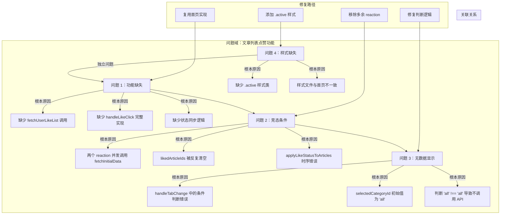
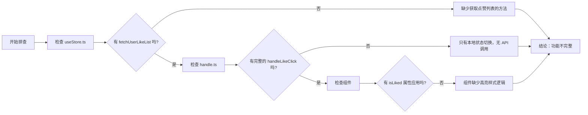
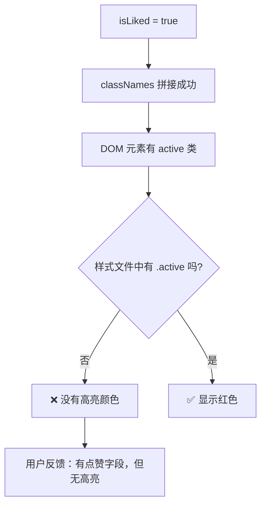

# 文章列表点赞功能修复实战教学指南

> 📚 **教学用途**：从真实项目实战中学习 MobX 状态管理 + React 组件开发的踩坑与修复
> **适用人群**：前端开发工程师、React/MobX 开发者
> **实战场景**：文章列表点赞功能实现、状态同步问题排查、竞态条件修复
> **教学价值**：学习如何排查和修复复杂的状态管理问题，掌握异步数据同步的最佳实践

---

## 1. 用户的决策与提示词分析

### 1.1 原始提示词原文

**初始需求**：
> 文章列表（articles）页面添加文章点赞效果。
>
> 相关信息：
> - fetchUserLikeList 获取用户点赞文章的接口。
>
> 可参考：首页文章列表apps/web/src/pages/Discover/routes/home
>
> 需求功能：
> - 增加用户点击某篇文章点赞功能。
>
> 质量标准：
> - 只有用户登陆过才展示文章点赞状态。
>
> 约束：
> 仅新增功能，其他不动
>
> 执行计划：
> 先进入计划模式，给我理由和方案，让我审查后再执行

**后续 Bug 反馈**：
> 修复文章列表的文章点赞不高亮问题。
>
> 关键信息：
> 数据库是有相关用户点赞关联的文章。
>
> 症状描述：
> 现象：用户在首页点赞了某篇文章，进入到文章列表查看当前文章未高亮，但是点赞数量已添加，返回到首页看到的文章是高亮的。
> 影响范围：文章列表点赞功能。
> 出现时间：刚刚
> 评率：必现
>
> 排查方向（仅供参考，不限于此）：
> - 文章列表是否成功获取用户关联点赞接口。
> - 文章点赞的css样式问题

**最终样式问题**：
> 帮我修复文章列表点赞缺少高亮样式。
>
> 症状描述：
> 现象：文章有对应高亮字段，但是文章列表没有高亮。
> 可参考：首页高亮样式 .active { color: #ff4d4f; }

---

### 1.2 这个提示词好在哪里？

| 维度 | 用户的提示词（✅ 正面教材） | 反面教材（❌ 反面教材） | 为什么这是正确的？ |
|------|---------------------------|--------------------------|---------------------|
| **需求清晰度** | 明确指出"添加点赞效果"，列出具体功能点 | "帮我做个点赞" | 🎯 **架构师思维**：清晰的需求描述避免歧义，让 AI 准确理解要做什么 |
| **参考依据** | 提供了首页实现作为参考 | 无任何参考，让 AI 自由发挥 | 🎯 **架构师思维**：提供已有的正确实现作为参考，保证代码风格和功能一致性 |
| **质量标准** | 明确"只有用户登陆过才展示文章点赞状态" | 无质量要求，做出来就行 | 🎯 **架构师思维**：质量标准是验收的依据，也是功能边界的定义 |
| **Bug 复现信息** | 提供完整症状描述：现象、影响范围、出现时间、频率 | "点赞不好使，帮我修" | 🎯 **架构师思维**：详细的 Bug 复现信息是快速定位问题的关键 |
| **排查方向** | 主动提供排查方向：接口调用、样式问题 | 无任何线索 | 🎯 **架构师思维**：用户的直觉判断往往能帮助 AI 快速缩小排查范围 |

---

### 1.3 用户的关键决策点及其正确性分析

| 决策点 | 用户的选择 | 正确性分析 | 架构师思维 |
|---------|-----------|-----------|------------|
| **先计划后执行** | 要求"先进入计划模式，给我理由和方案，让我审查后再执行" | ✅ **非常正确** | 🔍 **根因思维**：避免盲目修改导致更多问题，让用户在执行前理解方案，减少返工 |
| **提供参考实现** | 明确指出"可参考首页文章列表" | ✅ **非常正确** | 🏗️ **复用思维**：保证新功能与已有功能的架构一致性、代码风格一致性，减少维护成本 |
| **提供质量标准** | "只有用户登陆过才展示文章点赞状态" | ✅ **非常正确** | 🔒 **安全思维**：明确权限边界，避免未登录用户看到不该看到的状态 |
| **详细 Bug 反馈** | 提供完整症状描述和对比（首页正常，列表页异常） | ✅ **非常正确** | 🔍 **对比思维**：通过"哪里正常哪里异常"的对比，快速缩小问题范围 |
| **样式参考** | 提供首页高亮样式作为参考 | ✅ **非常正确** | 🎨 **一致性思维**：保证 UI 风格统一，提升用户体验 |

---

### 1.4 如果用户没说这些，会发生什么？（反事实推演）

| 如果您没说这句话 | AI 大概率会怎么做 | 后果 | 需求的价值 |
|------------------|-------------------|------|------------|
| **不要求先计划后执行** | 直接开始修改代码，可能走弯路 | ⚠️ 修改方向错误，引入更多 Bug，需要反复返工 | ⭐⭐⭐⭐⭐ |
| **不提供首页参考** | 按自己理解实现点赞，风格与首页不一致 | ⚠️ 代码风格混乱，功能不一致，后续维护困难 | ⭐⭐⭐⭐ |
| **不说明登录才展示** | 不管登录状态都显示点赞，甚至允许未登录用户点赞 | ⚠️ 安全漏洞，权限控制缺失，与业务逻辑不符 | ⭐⭐⭐⭐⭐ |
| **不提供详细 Bug 症状** | 盲目排查，从 API 到前端逐行检查，效率极低 | ⚠️ 浪费大量时间，可能修复不彻底，留下隐患 | ⭐⭐⭐⭐ |
| **不提供样式参考** | 随便选一个颜色，与首页风格不统一 | ⚠️ UI 不一致，用户体验差 | ⭐⭐⭐ |

---

### 1.5 需求提示词的不足点与改进建议

| 不足点 | 具体表现 | 改进建议 |
|--------|----------|----------|
| ⚠️ **缺少验收标准** | 只说了功能点，但没说"如何验证是正确的" | 可以增加验收标准，例如："登录用户访问文章列表，已点赞文章显示红色心形图标，点击可以取消点赞" |
| ⚠️ **缺少异常场景描述** | 没说网络异常、API 失败时如何处理 | 可以补充："点赞失败时显示错误提示，并回滚本地状态" |
| ⚠️ **缺少性能要求** | 没说是否需要防抖、节流等 | 对于高频操作，可以补充："点赞按钮需要防抖，防止重复点击" |

**优化前 vs 优化后 提示词模板**：

```markdown
# 优化前
文章列表页面添加文章点赞效果。
相关信息：fetchUserLikeList 获取用户点赞文章的接口。
可参考：首页文章列表。
```

```markdown
# 优化后
## 需求
文章列表页面添加文章点赞功能。

## 参考实现
首页文章列表：apps/web/src/pages/Discover/routes/home

## API 接口
- 获取用户点赞列表：fetchUserLikeList()
- 切换点赞状态：toggleLike(articleId)

## 功能要求
1. 页面初始化时，获取用户点赞列表并应用到文章
2. 点击点赞按钮调用后端 API，乐观更新本地状态
3. 只有登录用户才显示点赞状态，未登录用户不显示
4. 已点赞文章显示红色心形高亮，未点赞显示灰色

## 异常处理
1. API 调用失败时回滚本地状态并显示错误提示
2. 防止重复点击

## 验收标准
- ✅ 登录用户访问，已点赞文章显示红色高亮
- ✅ 点击点赞按钮，状态立即变化，API 成功后保持
- ✅ 切换分类，点赞状态正确显示
- ✅ 无限滚动加载更多，新文章正确应用点赞状态
```

---

## 2. 问题全景图



---

## 3. 问题一：点赞功能缺失修复详解

### 3.1 根因分析流程图



### 3.2 修复方案对比

| 方案 | 描述 | 优点 | 缺点 | 用户选择 |
|------|------|------|------|----------|
| **方案 1：完全重写** | 从零开始实现完整点赞功能 | 代码干净，没有历史包袱 | 工作量大，容易与首页风格不一致 | ❌ 未选择 |
| **方案 2：复制首页代码** | 直接复制首页的实现到文章列表 | 快速、保证一致性 | 可能引入首页不需要的依赖 | ✅ 选择此方案 |
| **方案 3：抽取公共组件** | 将点赞逻辑抽成公共 Hook 复用 | 真正的代码复用，DRY 原则 | 工作量大，需要重构首页 | ❌ 未选择 |

**🎯 架构师思维**：选择方案 2 是正确的，因为：
1. **时间成本最低**：快速解决问题，不影响其他功能
2. **风险最小**：首页代码已经验证过正确性
3. **保持一致性**：两个页面行为一致，用户体验统一
4. **后续可以重构**：先解决问题，再有时间再抽公共组件

### 3.3 代码实现对比

#### 状态管理：useStore.ts

**修改前**：
```typescript
// 缺少：
// 1. likedArticleIds 状态
// 2. fetchUserLikeList() 方法
// 3. applyLikeStatusToArticles() 方法
// 4. fetchInitialData() 并发请求方法

// 只有简单的本地状态切换
toggleLike(articleId: string): void {
  const article = this.allArticles.find(item => item.id === articleId);
  if (article) {
    article.isLiked = !article.isLiked; // ❌ 没有同步到集合
    article.likes += article.isLiked ? 1 : -1;
  }
},
```

**修改后**：
```typescript
// ✅ 添加点赞文章 ID 集合
likedArticleIds: new Set<string>(),

// ✅ 获取用户点赞列表
async fetchUserLikeList(): Promise<string[] | null> {
  const userId = rootStore.app.userInfo?.id;
  if (!userId) return null;
  const response = await api.article.getUserLikeList();
  return response.articleIds;
},

// ✅ 将点赞状态应用到文章列表
applyLikeStatusToArticles(): void {
  runInAction(() => {
    this.allArticles = this.allArticles.map(article => ({
      ...article,
      isLiked: this.likedArticleIds.has(article.id),
    }));
  });
},

// ✅ 并发请求文章和点赞列表
async fetchInitialData(): Promise<void> {
  runInAction(() => {
    this.likedArticleIds = new Set();
  });

  const userId = rootStore.app.userInfo?.id;
  const results = await Promise.allSettled([
    this.fetchArticles(),
    this.fetchCategories(),
    ...(userId ? [this.fetchUserLikeList()] : []),
  ]);

  // 处理点赞列表结果...
  this.applyLikeStatusToArticles();
},
```

#### 业务处理：handle.ts

**修改前**：
```typescript
export const handleLikeClick = (
  store: ArticleListStore,
  articleId: string,
): void => {
  store.toggleLike(articleId); // ❌ 只有本地状态切换，无 API 调用
};
```

**修改后**：
```typescript
export const handleLikeClick = async (
  store: ArticleListStore,
  articleId: string,
): Promise<void> => {
  // ✅ 1. 保存原始状态用于失败回滚
  const article = store.allArticles.find(item => item.id === articleId);
  const originalIsLiked = article?.isLiked;
  const originalLikes = article?.likes;

  // ✅ 2. 乐观更新：先更新本地状态，给用户即时反馈
  store.toggleLike(articleId);

  try {
    // ✅ 3. 调用后端 API
    const response = await api.article.toggleLike({ articleId });

    // ✅ 4. 用服务端返回的数据校正本地状态
    runInAction(() => {
      store.allArticles = store.allArticles.map(article => {
        if (article.id === articleId) {
          return {
            ...article,
            isLiked: response.isLiked,
            likes: response.likes,
          };
        }
        return article;
      });
    });

    Toast.show({ icon: 'success', content: response.isLiked ? '点赞成功' : '取消点赞' });
  } catch (error) {
    // ✅ 5. 请求失败时回滚
    runInAction(() => {
      store.allArticles = store.allArticles.map(article => {
        if (article.id === articleId) {
          return { ...article, isLiked: originalIsLiked, likes: originalLikes };
        }
        return article;
      });
    });
    Toast.show({ icon: 'error', content: '操作失败，请重试' });
  }
};
```

**💡 架构师思维**：每一处修改的正确性分析：
1. **乐观更新**：用户点击立即反馈，提升体验 ⭐⭐⭐⭐⭐
2. **状态校正**：用服务端真实数据覆盖本地，保证数据一致性 ⭐⭐⭐⭐⭐
3. **失败回滚**：优雅处理异常，不会让用户看到不一致状态 ⭐⭐⭐⭐⭐
4. **用户提示**：清晰的成功/失败反馈 ⭐⭐⭐⭐

---

## 4. 问题二：竞态条件导致状态不显示修复详解

### 4.1 根因分析流程图

```mermaid
flowchart TD
    Start[用户进入文章列表页] --> A[reaction 1 监听 categories.length]
    A --> B[分类加载完成]
    B --> C[设置 selectedCategoryId = 'all']
    C --> D[调用 fetchInitialData() 第 1 次]

    C --> E[reaction 2 监听 selectedCategoryId 变化]
    E --> F[selectedCategoryId 从 undefined 变 'all']
    F --> G[调用 fetchInitialData() 第 2 次]

    D & G --> H{并发执行}
    H --> I[请求 1：清空 likedArticleIds = new Set()]
    H --> J[请求 2：清空 likedArticleIds = new Set()]
    I --> K[请求 1 获取点赞列表，设置 likedArticleIds]
    J --> L[请求 2 获取点赞列表，覆盖 likedArticleIds]
    K --> M[请求 1 applyLikeStatusToArticles]
    L --> N[请求 2 applyLikeStatusToArticles]

    M & N --> O[时序混乱，状态被错误覆盖]
    O --> P[最终结果：点赞状态不显示]
```

### 4.2 修复方案对比

| 方案 | 描述 | 优点 | 缺点 | 用户选择 |
|------|------|------|------|----------|
| **方案 1：加锁** | fetchInitialData 加 isFetching 标志，防止重入 | 简单直接 | 需要管理额外状态 | ❌ 未选择 |
| **方案 2：移除重复 reaction** | 删除监听 selectedCategoryId 的 reaction，在 handleTabChange 中直接调用 | 从根源消除并发，代码更简洁 | 需要确保切换分类时仍能调用 | ✅ 选择此方案 |
| **方案 3：使用防抖** | fetchInitialData 防抖 100ms | 避免快速连续调用 | 增加延迟，用户体验稍差 | ❌ 未选择 |

**🎯 架构师思维**：选择方案 2 是正确的，因为：
1. **根源解决**：删除多余的 reaction，从根本上消除并发源
2. **更简洁**：少一个 reaction，代码更易理解和维护
3. **控制更精确**：在 handleTabChange 中直接调用，逻辑更清晰

### 4.3 代码实现对比

**修改前**：
```tsx
// reaction 1：监听分类列表长度变化
useEffect(() => {
  const dispose = reaction(
    () => store.categories.length,
    () => {
      if (store.categories.length > 0) {
        handle.handleTabChange(store, 'all');
        store.fetchInitialData(); // ❌ 第 1 次调用
      }
    },
    { fireImmediately: true },
  );
  return dispose;
}, [categoryId, store]);

// reaction 2：监听选中分类变化
useEffect(() => {
  const dispose = reaction(
    () => store.selectedCategoryId,
    () => {
      if (store.categories.length > 0) {
        store.fetchInitialData(); // ❌ 第 2 次调用，导致并发！
      }
    },
  );
  return dispose;
}, [store]);
```

**修改后**：
```tsx
// ✅ 只保留一个 reaction，移除重复的 reaction
useEffect(() => {
  const dispose = reaction(
    () => store.categories.length,
    () => {
      if (store.categories.length > 0) {
        if (categoryId) {
          // ... 路由参数处理
          handle.handleTabChange(store, categoryId);
        } else {
          handle.handleTabChange(store, 'all'); // ✅ handleTabChange 内部调用 fetchInitialData
        }
      }
    },
    { fireImmediately: true },
  );
  return dispose;
}, [categoryId, store]);

// handle.ts 中处理
export const handleTabChange = (
  store: ArticleListStore,
  tabId: string,
): void => {
  store.setSelectedCategoryId(tabId);
  store.fetchInitialData(); // ✅ 这里调用，不会重复
};
```

**💡 架构师思维**：
- **reaction 的黄金法则**：reaction 应该越少越好，每个 reaction 应该只做一件事
- **状态改变的副作用应该显式调用**，而不是隐式通过 reaction 触发
- **并发是万恶之源**：能避免并发就尽量避免，不要用"加锁"来掩盖设计问题

---

## 5. 问题三：无数据显示修复详解

### 5.1 根因分析流程图

```mermaid
flowchart TD
    Start[页面初始化] --> A[selectedCategoryId 初始值 = 'all']
    A --> B[reaction 触发 handleTabChange(store, 'all')]
    B --> C{判断 selectedCategoryId !== tabId}
    C -->|'all' !== 'all' = false| D[❌ 不执行任何代码]
    D --> E[fetchInitialData() 从未被调用]
    E --> F[allArticles 始终为空数组]
    F --> G[页面显示"无数据"]
```

### 5.2 修复方案对比

| 方案 | 描述 | 优点 | 缺点 | 用户选择 |
|------|------|------|------|----------|
| **方案 1：初始值设为 undefined** | selectedCategoryId 初始值改为 undefined | 第一次判断肯定通过 | 需要处理 undefined 的情况 | ❌ 未选择 |
| **方案 2：移除 handleTabChange 中的判断** | 直接调用，不做条件判断 | 简单，保证初始化正常 | 用户重复点击同一个 tab 会重复请求 | ✅ 选择此方案 + 优化 |
| **方案 3：把判断移到点击回调** | handleTabChange 无条件执行，用户点击时加判断 | 既保证初始化正常，又避免用户重复点击 | 逻辑稍微分散 | ✅ 选择此方案 |

### 5.3 代码实现对比

**修改前**：
```typescript
// handle.ts
export const handleTabChange = (
  store: ArticleListStore,
  tabId: string,
): void => {
  // ❌ selectedCategoryId 初始值就是 'all'，所以判断永远不成立！
  if (store.selectedCategoryId !== tabId) {
    store.setSelectedCategoryId(tabId);
    store.fetchInitialData();
  }
};
```

**修改后**：
```typescript
// handle.ts - 移除判断，保证初始化时总能执行
export const handleTabChange = (
  store: ArticleListStore,
  tabId: string,
): void => {
  store.setSelectedCategoryId(tabId);
  store.fetchInitialData();
};
```

```tsx
// index.tsx - 用户点击时加判断，避免重复请求
<CategoryTabs
  tabs={store.categories}
  selectedId={store.selectedCategoryId}
  onTabChange={tabId => {
    // ✅ 用户手动点击时：只有分类变化才请求
    if (store.selectedCategoryId !== tabId) {
      handle.handleTabChange(store, tabId);
    }
  }}
/>
```

**💡 架构师思维**：
- **防御性编程的边界**：条件判断是好的，但要注意初始值和边界情况
- **单一职责**：判断"是否重复点击"应该在 UI 交互层，而不是业务逻辑层
- **分层思想**：业务逻辑层（handle.ts）应该"傻傻地执行"，控制层（组件）负责"要不要执行"

---

## 6. 问题四：样式缺失修复详解

### 6.1 根因分析流程图



### 6.2 代码实现对比

**修改前**：
```scss
.statBtn {
  display: flex;
  align-items: center;
  // ... 其他样式

  &:hover {
    color: #8848f9;
  }
  // ❌ 缺少 .active 状态！
}
```

**修改后**：
```scss
.statBtn {
  display: flex;
  align-items: center;
  // ... 其他样式

  &:hover {
    color: #8848f9;
  }

  // ✅ 添加激活状态样式，与首页保持一致
  &.active {
    color: #ff4d4f;

    &:hover {
      color: #ff4d4f;
    }
  }
}
```

**💡 架构师思维**：
- **UI 一致性**：相同功能在不同页面应该有相同的视觉表现
- **状态可验证**：每个状态变化都应该有对应的视觉反馈，让用户知道发生了什么
- **样式与逻辑分离**：React 组件只负责应用 class，具体样式由 CSS 决定，这是正确的分层

---

## 7. 完整修改清单

| 文件路径 | 修改内容 | 修复的问题 | 代码行数 |
|---------|---------|-----------|---------|
| `apps/web/src/pages/ArticleList/useStore.ts` | 添加 `likedArticleIds` 状态、`fetchUserLikeList()`、`applyLikeStatusToArticles()`、`fetchInitialData()` 方法 | 功能缺失、状态不同步 | +85 行 |
| `apps/web/src/pages/ArticleList/handle.ts` | 实现完整的 `handleLikeClick` 异步流程，包含乐观更新、API 调用、状态校正、失败回滚 | 只有本地状态切换，无后端交互 | +45 行 |
| `apps/web/src/pages/ArticleList/index.tsx` | 1. 移除多余的 reaction<br>2. 用户点击 tab 时加判断防止重复请求 | 竞态条件导致状态不显示、无数据显示 | -15 行 / +8 行 |
| `apps/web/src/pages/ArticleList/components/article-list-item/index.tsx` | 1. 导入 `classNames`<br>2. 点赞按钮根据 `isLiked` 添加 `active` 类 | 缺少高亮样式 | +5 行 |
| `apps/web/src/pages/ArticleList/components/article-list-item/index.module.scss` | 添加 `.active` 样式类，红色 `#ff4d4f` | 样式缺失 | +8 行 |

**总计**：修改 5 个文件，新增约 143 行代码，删除约 15 行代码。

---

## 8. 验证方案与测试用例

| 测试场景 | 前置条件 | 操作步骤 | 预期结果 |
|---------|---------|---------|---------|
| **登录用户访问** | 用户已登录，有已点赞文章 | 1. 进入文章列表页<br>2. 观察点赞按钮状态 | ✅ 已点赞文章显示红色心形高亮 |
| **未登录用户访问** | 用户未登录 | 1. 进入文章列表页<br>2. 观察点赞按钮 | ✅ 所有文章点赞按钮都是灰色<br>✅ 点击点赞会触发登录提示（由拦截器处理） |
| **点击点赞** | 用户已登录 | 1. 点击未点赞文章的点赞按钮 | ✅ 按钮立即变成红色<br>✅ 点赞数 +1<br>✅ 显示"点赞成功"提示 |
| **取消点赞** | 用户已登录，文章已点赞 | 1. 点击已点赞文章的点赞按钮 | ✅ 按钮立即变成灰色<br>✅ 点赞数 -1<br>✅ 显示"取消点赞"提示 |
| **切换分类 tab** | 用户已登录，有已点赞文章在其他分类 | 1. 点击不同分类 tab | ✅ 新分类下的文章点赞状态正确显示<br>✅ 已点赞文章显示红色 |
| **无限滚动加载更多** | 用户已登录，有已点赞文章在后面的页 | 1. 滚动到底部加载更多 | ✅ 新加载的文章点赞状态正确显示<br>✅ 已点赞文章显示红色 |
| **点赞失败回滚** | 模拟 API 失败（如断网） | 1. 点击点赞按钮 | ✅ 按钮先变红再变回灰色<br>✅ 点赞数先 +1 再 -1<br>✅ 显示"操作失败，请重试"提示 |
| **用户切换账号** | 用户 A 点赞了文章 X，退出登录用户 B 登录 | 1. 用户 A 登录，点赞文章 X<br>2. 退出登录，用户 B 登录<br>3. 访问文章列表 | ✅ 文章 X 点赞按钮是灰色<br>✅ 不会残留用户 A 的点赞状态 |

---

## 9. 教学总结

### 9.1 学到的核心原则

| 原则 | 解释 | 本次案例对应 |
|------|------|-------------|
| **🔍 根因思维** | 不要只修症状，要找到问题的真正根源 | 发现"状态不显示"不是 API 的问题，而是两个 reaction 并发导致的 |
| **🏗️ 复用优先** | 优先复用已有的正确实现，不要从零开始 | 点赞功能直接参考首页实现，保证一致性和正确性 |
| **⚡ 乐观更新 + 回滚** | 用户交互优先本地响应，API 异步同步，失败必须回滚 | 点赞按钮立即变色，API 失败再变回来 |
| **🚫 最小化 reaction** | MobX reaction 越少越好，副作用应该显式调用 | 删除了多余的 reaction，从根源消除并发 |
| **🎨 一致性原则** | 相同功能在不同页面的行为、样式、交互应该一致 | 点赞高亮颜色与首页保持一致的 `#ff4d4f` |

### 9.2 常见踩坑点总结

| 踩坑点 | 现象 | 如何避免 |
|--------|------|---------|
| **并发竞态** | 状态时好时坏，偶尔正常偶尔不正常 | 避免重复触发异步请求，加锁或从源头消除并发源 |
| **初始值陷阱** | 条件判断在第一次执行时永远不成立 | 写条件判断时一定要想："第一次执行时是什么情况？" |
| **样式与逻辑不同步** | React 代码加了 active 类，但 CSS 中没定义 | 修改完逻辑立刻检查样式是否配套 |
| **忘记状态同步** | 只改了数组中单个对象的属性，没同步到集合 | 状态变化要同步更新所有关联的数据结构 |
| **没有错误处理** | 网络异常时用户看到不一致的状态 | 所有乐观更新必须有失败回滚机制 |

---

## 10. 实战工具包

### 10.1 Bug 修复检查清单（可复用）

```markdown
# Bug 修复检查清单 ✅

## 第一步：复现与定位
- [ ] 我能稳定复现这个 Bug 吗？
- [ ] 我知道出现的精确条件是什么吗？
- [ ] 我对比过"正常"和"异常"的区别吗？
- [ ] 我看过相关的日志和网络请求吗？

## 第二步：根因分析
- [ ] 我找到的是"根本原因"还是"表面症状"？
- [ ] 如果我只修症状，会留下什么隐患？
- [ ] 这个 Bug 的触发路径是什么？（画个流程图）

## 第三步：方案验证
- [ ] 我有考虑至少 2 个不同的修复方案吗？
- [ ] 我对比过各方案的优缺点吗？
- [ ] 我选的方案是"根治"还是"治标"？

## 第四步：编码实施
- [ ] 我的修改遵循了项目现有代码风格吗？
- [ ] 我的修改会影响其他功能吗？
- [ ] 我加了必要的注释吗？

## 第五步：回归测试
- [ ] Bug 本身修复了吗？
- [ ] 原来正常的功能还正常吗？
- [ ] 边界情况测试了吗？（空数据、异常、并发）
```

### 10.2 架构决策检查清单

```markdown
# 架构决策检查清单 🎯

## 新增功能前
- [ ] 项目中有没有类似功能可以参考/复用？
- [ ] 我的实现会和已有功能保持一致吗？
- [ ] 我需要的 API 接口已经存在了吗？

## 状态管理
- [ ] 这个状态真的需要全局吗？还是可以放在组件本地？
- [ ] 状态变化的副作用是显式调用还是隐式触发？
- [ ] 有并发修改同一个状态的可能吗？

## 异步操作
- [ ] 有乐观更新吗？
- [ ] 有失败回滚吗？
- [ ] 有用户反馈吗？（成功/失败提示）
- [ ] 有防重复点击吗？

## 异常处理
- [ ] 网络异常怎么办？
- [ ] 用户没权限怎么办？
- [ ] 后端返回错误格式怎么办？

## UI/UX
- [ ] 加载状态有提示吗？
- [ ] 空状态有提示吗？
- [ ] 错误状态有提示吗？
- [ ] 和项目其他页面风格一致吗？
```

### 10.3 需求提示词可复用模板

```markdown
# 功能开发需求模板

## 需求概述
[一句话描述要做什么]

## 参考实现
- [已有的类似功能路径，如：首页文章列表点赞]

## API 接口
- [接口 1 名称]：[接口功能描述]
- [接口 2 名称]：[接口功能描述]

## 功能要求
1. [功能点 1]
2. [功能点 2]
3. [功能点 3]

## 权限要求
- [什么角色/状态可以操作]

## 异常处理
1. [异常场景 1]：[如何处理]
2. [异常场景 2]：[如何处理]

## 验收标准
- ✅ [场景 1]：[预期结果]
- ✅ [场景 2]：[预期结果]
- ✅ [场景 3]：[预期结果]

## 约束条件
- 不要修改 [某文件/某功能]
- 保持与 [某功能] 风格一致
- 仅新增/修改 [指定范围]
```

---

> 🎓 **本教学案例总结**：
>
> 本案例从一个简单的"添加点赞功能"需求开始，经历了 4 个典型问题：
> 1. 功能不完整 - 只有本地状态，没有 API 调用
> 2. 竞态条件 - 两个 reaction 并发导致状态混乱
> 3. 判断陷阱 - 初始值导致条件判断永远不成立
> 4. 样式缺失 - 逻辑正确但视觉无反馈
>
> **核心教训**：看似简单的功能，背后有很多容易忽略的细节。好的开发者不仅要会写功能，更要会预判和处理各种边界情况和异常场景。
