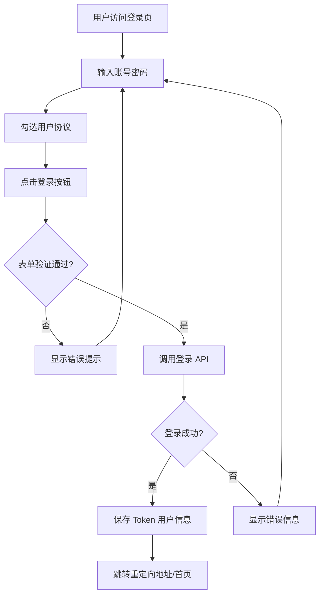
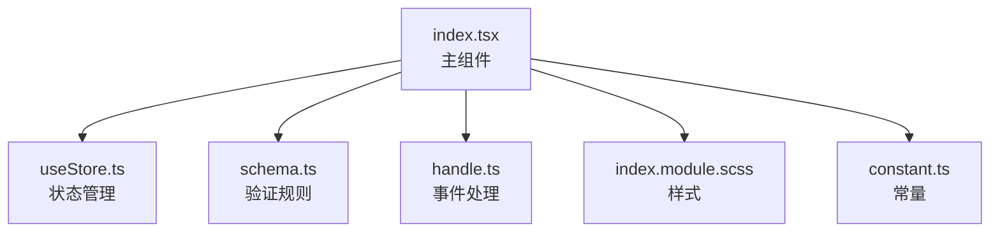
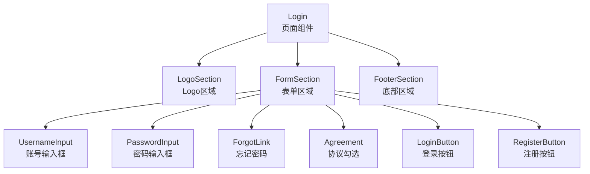
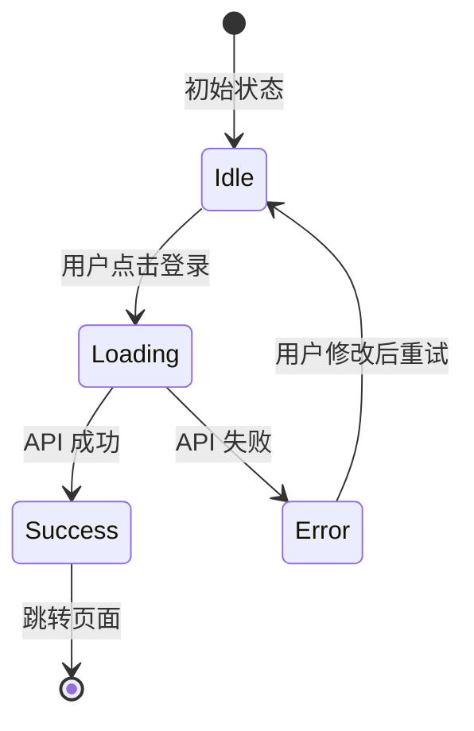
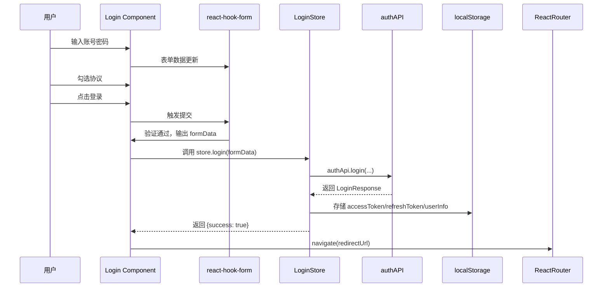

# 登录页面模块 (Login) 设计文档

**生成日期**: 2026-04-14
**模块路径**: `src/pages/Login`
**模块类型**: 页面级模块（移动端 H5）

---

## 1. 模块概述

登录页面是博客系统的入口认证页面，负责处理用户身份验证。支持用户名/手机号登录，包含密码可见性切换、表单验证、用户协议勾选等功能。

### 核心功能
- 用户账号密码登录认证
- 密码明文/密文切换显示
- 基于 Zod 的表单验证
- 跳转到注册页面
- 跳转到忘记密码页面
- 用户协议和隐私政策链接
- 登录成功后自动跳转（支持自定义重定向地址）

### 业务流程图



---

## 2. 模块结构

### 文件组织结构



### 文件说明

| 文件 | 职责 | 说明 |
|------|------|------|
| `index.tsx` | 主组件 | 页面渲染、表单绑定、用户交互 |
| `useStore.ts` | 状态管理 | MobX Store，存放登录状态和业务逻辑 |
| `schema.ts` | 验证规则 | Zod schema 定义表单验证规则 |
| `handle.ts` | 事件处理 | 独立抽离的简单点击事件处理函数 |
| `constant.ts` | 常量定义 | 存放非展示性常量（当前为空） |
| `index.module.scss` | 样式 | CSS Modules 样式定义 |

---

## 3. 组件结构

### 组件树



### Props 说明

Login 页面组件不需要 Props，因为它是路由一级页面，所有数据通过 Store 和 URL 参数获取。

---

## 4. 状态管理

### Store 结构

```typescript
interface LoginStoreType {
  // 状态
  isLoading: boolean;      // 登录请求加载中
  showPassword: boolean;   // 密码是否可见

  // Setter 方法
  setLoading: (loading: boolean) => void;
  togglePasswordVisibility: () => void;

  // 业务方法
  login: (formData: LoginFormData) => Promise<LoginApiResponse>;
}
```

### 状态流转



### 设计决策

- **遵循项目规范**: 使用 `useLocalObservable` + 对象字面量写法，不使用 class
- **this 绑定**: 使用常规方法语法，不使用箭头函数避免 this 绑定问题
- **API 配置**: 登录接口标记 `skipAuth: true`（不需要认证）和 `skipErrorToast: true`（自己处理错误）
- **持久化**: 登录成功后将 `accessToken`、`refreshToken`、`userInfo` 存储到 `localStorage`

---

## 5. 表单验证

### 验证规则 (schema.ts)

| 字段 | 规则 |
|------|------|
| `username` | 必填，至少 1 个字符 |
| `password` | 必填，长度 6-20 个字符 |
| `agreeTerms` | 必须为 `true`（必须勾选同意协议） |

### 技术选型

- **react-hook-form**: 表单状态管理，性能优秀
- **zod**: 声明式 schema 验证，类型推断友好
- **@hookform/resolvers**: 桥接 zod 到 react-hook-form

---

## 6. API 依赖

| API | 位置 | 配置 | 说明 |
|-----|------|------|------|
| `authApi.login` | `@/api/auth` | `skipAuth: true`<br>`skipErrorToast: true` | 登录接口，凭证认证 |

### 响应格式

```typescript
interface LoginResponse {
  accessToken: string;
  refreshToken: string;
  user: UserInfo;
}
```

---

## 7. 样式设计

### 设计要点

- **移动端适配**: 基于 750px 设计稿，使用 px 单位，插件自动转 vw
- **渐变主题**: 紫蓝色渐变 `linear-gradient(135deg, #667eea 0%, #764ba2 100%)`
- **点击反馈**: 可点击元素添加 `:active` 透明度/缩放变化
- **点击区域**: 按钮高度 88px（设计稿），满足 44px 最小点击区域要求
- **CSS Modules**: 样式隔离，避免命名冲突

### 布局结构

```scss
.loginRoot        // 根容器，min-height: 100vh，flex 布局
  ├─ logoSection  // Logo 区域，顶部 padding 120px
  │   └─ logo + appName
  ├─ formSection  // 表单区域，flex: 1 自适应
  │   ├─ formGroup × 2  // 账号、密码输入框组
  │   ├─ forgotRow      // 忘记密码链接
  │   ├─ agreementRow   // 协议勾选框
  │   ├─ loginButton    // 登录按钮（渐变背景）
  │   └─ registerButton // 注册按钮（边框样式）
  └─ footerSection // 底部提示，安全区域适配
```

---

## 8. 数据流



---

## 9. 技术选型说明

| 技术 | 选型理由 |
|------|----------|
| **MobX (useLocalObservable)** | 页面级状态管理，符合项目架构，响应式更新简洁 |
| **react-hook-form** | 非受控表单方案，性能更好，代码更简洁 |
| **Zod** | TypeScript 友好的验证库，类型自动推断 |
| **CSS Modules** | 样式隔离，避免全局样式污染 |
| **Ant Design Mobile** | 使用 Checkbox/Toast 组件，保持 UI 一致性 |

---

## 10. 功能点详情

### 10.1 密码可见性切换
- 通过 `showPassword` 状态控制 input `type` 为 `text` 或 `password`
- 点击眼睛图标切换状态，提供即时反馈

### 10.2 重定向支持
- 从 URL query 参数 `redirect` 获取目标地址
- 登录成功后自动跳转到目标地址，默认为首页
- 使用场景: 未登录用户访问需要认证的页面，登录后回到原页面

### 10.3 用户协议勾选
- 使用 Zod `z.literal<boolean>(true)` 强制必须勾选
- 未勾选无法提交，显示错误提示

### 10.4 错误处理
- 表单验证错误: 在输入框下方显示红色错误文本
- API 错误: 使用 Toast 显示错误信息
- 网络异常: 兜底提示 "Login failed, please try again later"

### 10.5 加载状态
- 登录请求过程中禁用所有输入和按钮，防止重复提交
- 按钮文字变为 "Logging in..." 提示用户

---

## 11. 项目规范符合性检查

| 检查项 | 是否符合 | 说明 |
|--------|----------|------|
| 页面级 Store 写法 | ✅ | 使用 `useLocalObservable` + 对象字面量，正确使用方法语法避免 this 问题 |
| TypeScript 类型 | ✅ | 所有接口都有明确类型定义，使用 Zod 推断表单类型 |
| 代码拆分 | ✅ | 按职责拆分到多个文件（组件/store/schema/handle/styles） |
| 移动端适配 | ✅ | 基于 750 设计稿，点击尺寸满足要求，有:active 反馈 |
| CSS Modules | ✅ | 使用 CSS Modules，class 命名规范 |
| 纯组件原则 | 不适用 | 页面级组件允许使用 Store 和 API |
| 命名规范 | ✅ | 文件/变量/类名符合项目规范 |

---

## 12. 待改进点

1. **handle.ts** 中的 `handleForgotPassword`、`handleRegister` 等函数目前只打日志，需要接入实际路由跳转
2. **用户协议/隐私政策**目前只是占位提示，需要打开实际页面弹窗或跳转
3. **记住密码**功能尚未实现，可后续迭代添加

---

*本文档由 Claude Code 自动生成*
