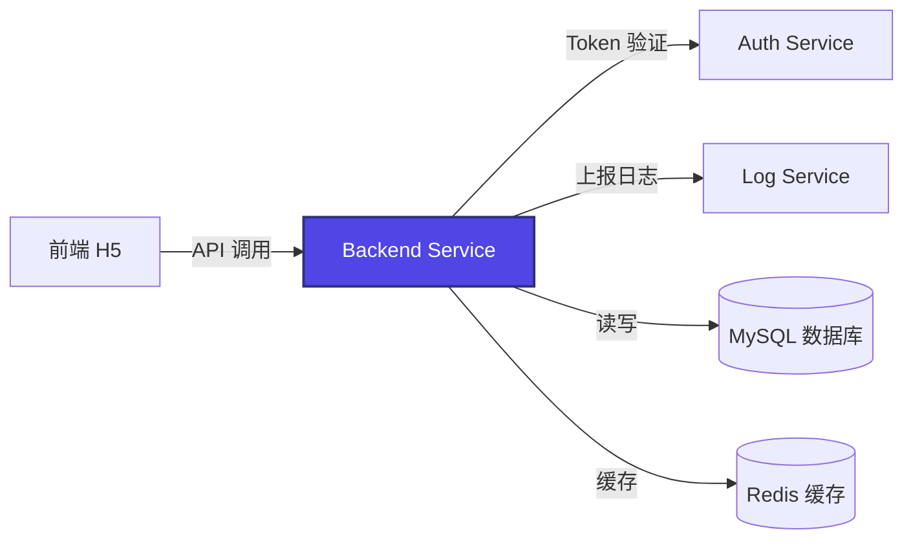
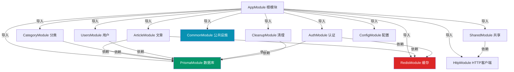
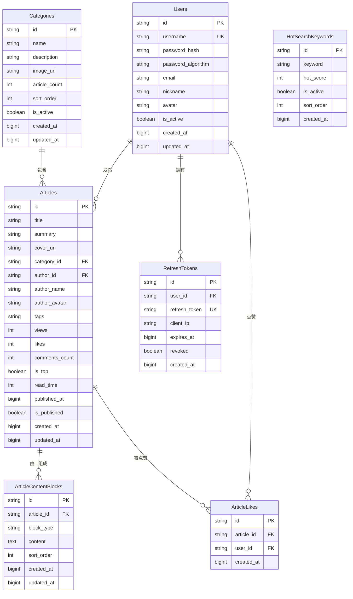
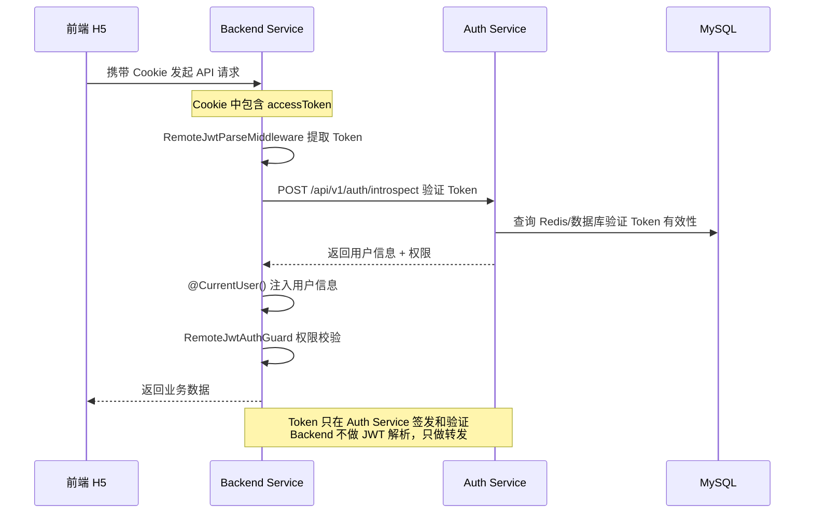
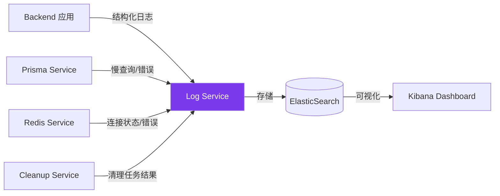
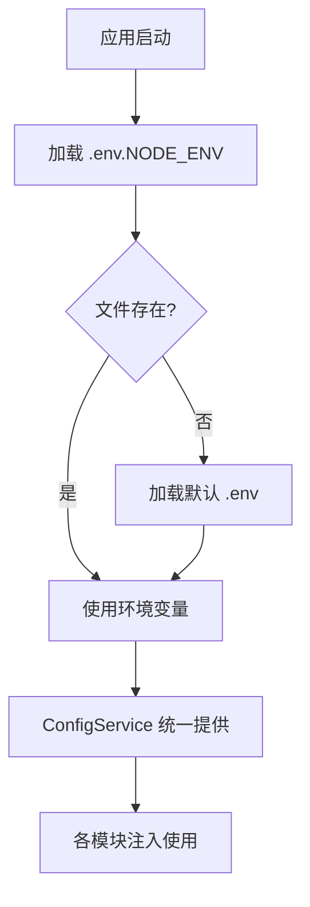
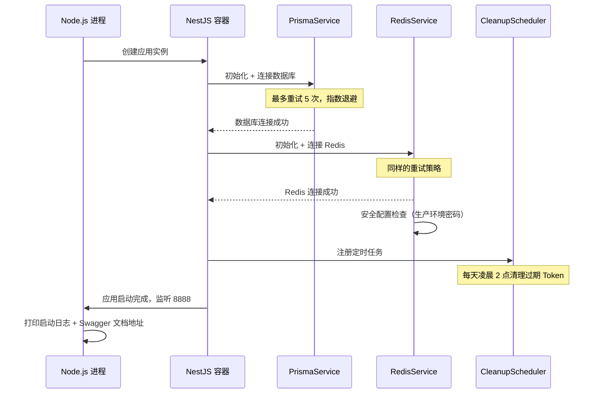

# 后端主业务服务 - 架构设计文档

## 📋 文档信息

| 项           | 内容                                   |
| ------------ | -------------------------------------- |
| **服务名称** | Backend Service (主业务服务)           |
| **生成日期** | 2026-05-02                             |
| **技术栈**   | NestJS 11 + Prisma ORM + MySQL + Redis |
| **服务端口** | 8888 (默认)                            |
| **文档版本** | v1.0                                   |

---

## 🎯 服务定位与职责

### 核心职责

Backend Service 是 Monorepo 架构中的**主业务微服务**，负责博客系统的核心业务逻辑：

| 领域         | 职责                                        |
| ------------ | ------------------------------------------- |
| **文章管理** | 文章 CRUD、分类、标签、内容块管理           |
| **用户管理** | 用户信息查询、更新、权限管理                |
| **分类系统** | 文章分类、热门搜索关键词                    |
| **数据清理** | 定时清理过期冗余数据                        |
| **认证集成** | 通过 HTTP 调用 Auth Service 进行 Token 验证 |

### 在 Monorepo 中的位置

```
claude (Monorepo Root)
├── apps/web/                  # 前端 H5 应用
├── services/
│   ├── auth-service/         # 认证授权服务 (8889) ← Token 签发
│   ├── backend/              # 主业务服务 (8888)    ← 本文档
│   │   ├── src/
│   │   │   ├── auth/         # 认证模块（调用 Auth Service）
│   │   │   ├── article/      # 文章模块
│   │   │   ├── category/     # 分类模块
│   │   │   ├── users/        # 用户模块
│   │   │   ├── prisma/       # 数据库 ORM
│   │   │   ├── redis/        # 缓存服务
│   │   │   ├── common/       # 公共基础设施
│   │   │   ├── cleanup/      # 定时清理服务
│   │   │   └── shared/       # 远程认证集成
│   │   └── prisma/
│   │       └── schema.prisma # 数据库模型
│   └── log-service/          # 日志服务 (8890) ← 操作日志
└── packages/
    └── shared-logging/       # 统一日志 SDK
```

### 微服务间调用关系



---

## 🛠️ 核心技术栈详解

### 1. NestJS 框架特性

| 特性           | 使用情况                   | 说明                                   |
| -------------- | -------------------------- | -------------------------------------- |
| **模块化架构** | ✅ 完整使用                | Module → Controller → Service 三层架构 |
| **依赖注入**   | ✅ 完整使用                | 所有 Service 均通过 DI 容器管理        |
| **中间件**     | ✅ CORS + RequestLog       | 全局中间件配置在 AppModule             |
| **全局管道**   | ✅ ValidationPipe          | DTO 自动验证 + 类型转换                |
| **全局拦截器** | ✅ Transform + ResponseLog | 统一响应格式 + 响应日志                |
| **全局过滤器** | ✅ 3个异常过滤器           | 业务异常 + Prisma 异常 + 兜底异常      |
| **定时任务**   | ✅ @nestjs/schedule        | Cron 表达式定时清理数据                |
| **API 版本**   | ✅ URI 版本控制            | /api/v1/\*                             |
| **Swagger**    | ✅ 自动文档                | @nestjs/swagger 生成 API 文档          |

### 2. 数据库技术栈

| 技术           | 版本  | 用途         | 关键配置                 |
| -------------- | ----- | ------------ | ------------------------ |
| **MySQL**      | 8.0+  | 主数据库     | 关系型数据持久化         |
| **Prisma ORM** | 6.5.0 | 数据库访问层 | 类型安全、自动生成客户端 |
| **Redis**      | 6.0+  | 缓存层       | Token 缓存、热点数据     |

### 3. 安全与认证

| 技术                   | 用途       | 说明                                   |
| ---------------------- | ---------- | -------------------------------------- |
| **HttpOnly Cookie**    | Token 存储 | 防止 XSS 攻击，Cookie 自动携带         |
| **Argon2**             | 密码哈希   | 抗 GPU 攻击的安全算法                  |
| **RemoteJwtAuthGuard** | 权限验证   | 通过 HTTP 调用 Auth Service 验证 Token |

### 4. 开发工具链

| 工具               | 用途         |
| ------------------ | ------------ |
| **TypeScript 5.7** | 类型安全     |
| **ESLint 9**       | 代码质量检查 |
| **Prettier**       | 代码格式化   |
| **Jest**           | 单元测试     |
| **Supertest**      | E2E 测试     |

---

## 📦 模块架构设计

### 模块依赖关系图



### 模块详细说明

#### 1. PrismaModule - 数据库核心模块

**文件位置**：`src/prisma/`

**核心职责**：

- 数据库连接管理
- 连接池配置
- 慢查询检测与告警
- 连接失败自动重试（指数退避）

**关键特性**：

```typescript
// 重试策略：最多 5 次，指数退避 1s → 2s → 4s → 8s → 16s
private readonly maxRetries = 5;
private readonly initialRetryDelay = 1000;

// 慢查询阈值：超过 1 秒记录警告日志
private readonly slowQueryThreshold = 1000;
```

**数据库连接池配置**：

- 默认连接数：10
- 连接超时：配置在 DATABASE_URL 中
- 健康检查：提供 `isConnected()` 方法

---

#### 2. RedisModule - 缓存模块

**文件位置**：`src/redis/`

**核心职责**：

- Redis 连接管理
- 基础操作封装（get/set/del）
- 安全配置检查
- 操作日志记录

**安全检查**：

```typescript
// 生产环境强制要求密码
if (isProduction && (!password || password.trim().length === 0)) {
  // 记录安全警告日志
}
```

**重试策略**：与 Prisma 相同的指数退避策略

---

#### 3. CommonModule - 公共基础设施模块

**文件位置**：`src/common/`

**这是架构的核心！所有横切关注点统一在这里管理**

| 组件类型   | 组件名称                  | 职责                                     |
| ---------- | ------------------------- | ---------------------------------------- |
| **过滤器** | `AllExceptionsFilter`     | 兜底异常处理，捕获所有未处理异常         |
| **过滤器** | `BusinessExceptionFilter` | 业务异常统一处理，返回友好错误码         |
| **过滤器** | `PrismaExceptionFilter`   | Prisma 数据库异常转换，防止 SQL 信息泄露 |
| **拦截器** | `TransformInterceptor`    | 统一响应格式包装 `{code, message, data}` |
| **拦截器** | `ResponseLogInterceptor`  | 捕获响应数据供日志中间件记录             |
| **中间件** | `CorsMiddleware`          | 跨域处理，优先处理 OPTIONS 预检请求      |
| **中间件** | `RequestLogMiddleware`    | 请求日志、耗时统计、链路追踪             |
| **装饰器** | `@CurrentUser()`          | 从请求中注入当前用户信息                 |
| **装饰器** | `@ApiResponse()`          | Swagger 响应格式统一                     |
| **工具**   | `LogServiceClientService` | 日志服务 HTTP 客户端                     |

**响应格式标准化**：

```typescript
// TransformInterceptor 统一包装
{
  code: 200,
  message: 'Success',
  data: T // 实际业务数据
}
```

**异常处理分层设计**：

```
业务异常 (BusinessException)
    → BusinessExceptionFilter → 友好错误码 + 消息

数据库异常 (Prisma.PrismaClientKnownRequestError)
    → PrismaExceptionFilter → 脱敏处理，不泄露表名/字段

其他所有异常
    → AllExceptionsFilter → 兜底，记录完整堆栈
```

---

#### 4. CleanupModule - 定时数据清理模块

**文件位置**：`src/cleanup/`

**设计理念**：

> **主动清理优于被动膨胀** - 定期清理过期数据，保持数据库性能稳定

**定时任务配置**：

| 任务                       | Cron 表达式   | 执行时间      | 清理内容                           |
| -------------------------- | ------------- | ------------- | ---------------------------------- |
| **清理过期 Refresh Token** | `0 0 2 * * *` | 每天凌晨 2 点 | 删除已过期且已撤销的 refresh_token |

**为什么选择凌晨 2 点？**

1. ✅ 访问量最低，对在线业务影响最小
2. ✅ 删除操作会锁表，避开高峰时段
3. ✅ 清理后 Optimize 表可以在低峰执行

**配置开关**：

```bash
# .env 中可以禁用
CLEANUP_ENABLED=false
```

---

#### 5. AuthModule - 认证模块

**文件位置**：`src/auth/`

**核心职责**：

- 登录/登出接口
- Token 刷新
- 注册流程（如果支持）

**注意**：JWT 解析和 Token 签发已迁移到 `auth-service`，本模块只做转发和远程验证。

---

#### 6. ArticleModule - 文章模块

**文件位置**：`src/article/`

**核心功能**：

- 文章列表查询（分页、分类筛选）
- 文章详情（包含内容块）
- 文章创建/编辑/删除
- 点赞统计
- 阅读数统计

**数据模型设计**：文章内容采用**内容块 (ArticleContentBlocks)** 存储，支持富文本分块渲染。

---

#### 7. CategoryModule - 分类模块

**文件位置**：`src/category/`

**核心功能**：

- 分类列表查询
- 热门搜索关键词管理
- 分类下文章数统计

---

#### 8. SharedModule - 远程认证集成模块

**文件位置**：`src/shared/`

**核心组件**：

| 组件                       | 用途                                          |
| -------------------------- | --------------------------------------------- |
| `RemoteJwtAuthGuard`       | 守卫 - 通过 HTTP 调用 Auth Service 验证 Token |
| `AuthClientService`        | HTTP 客户端 - 封装对 Auth Service 的所有调用  |
| `RemoteJwtParseMiddleware` | 中间件 - 在请求早期解析 Token                 |

**设计模式**：**防腐层 (Anti-Corruption Layer)**

- 后端服务不直接依赖 Auth Service 的内部实现
- 所有调用通过 `AuthClientService` 统一封装
- 未来认证服务架构变更时，只需要修改这个类

---

## 🗄️ 数据库设计

### ER 关系图



### 数据库表清单

| 表名                       | 用途       | 行数预估 | 核心索引                                                             |
| -------------------------- | ---------- | -------- | -------------------------------------------------------------------- |
| **users**                  | 用户表     | 中小     | `username` (唯一索引)                                                |
| **categories**             | 分类表     | 小       | 无额外索引                                                           |
| **articles**               | 文章表     | 中       | `category_id`, `author_id`, `is_published`, `is_top`, `published_at` |
| **article_content_blocks** | 文章内容块 | 大       | `article_id`, `(article_id, sort_order)` 联合索引                    |
| **article_likes**          | 点赞关联表 | 中       | `user_id`, `(article_id, user_id)` 唯一索引                          |
| **refresh_tokens**         | 刷新令牌   | 中~大    | `user_id`, `expires_at`, `refresh_token` 唯一索引                    |
| **hot_search_keywords**    | 热门搜索   | 小       | `hot_score`, `is_active`, `sort_order`                               |

### 性能设计要点

#### 1. 索引设计原则

- ✅ **外键必须建索引**：所有 `_id` 字段都有索引（Prisma 自动创建）
- ✅ **查询条件建索引**：`is_published`, `is_top`, `is_active` 等常用过滤字段
- ✅ **排序字段建索引**：`published_at`, `sort_order`, `hot_score`
- ✅ **联合索引覆盖查询**：`(article_id, sort_order)` 支持内容块排序查询

#### 2. 时间字段设计

- ✅ 全部使用 `bigint` 存储时间戳（毫秒）
- ✅ 避免时区问题，统一 UTC 时间
- ✅ 数据库层面不做时间函数计算，全部在应用层处理

#### 3. 软删除 vs 硬删除

- 本项目采用**硬删除**策略（直接 DELETE）
- 原因：业务数据不需要保留删除记录
- 例外：用户删除可以考虑软删除，目前是物理删除

---

## 🔐 安全架构设计

### 1. 认证流程（远程验证模式）



### 2. 密码安全

| 安全措施     | 实现                                                   |
| ------------ | ------------------------------------------------------ |
| **哈希算法** | Argon2id（优先），兼容 bcrypt 迁移                     |
| **加盐方式** | Argon2 自动加盐                                        |
| **存储字段** | `password_hash` + `password_algorithm`（支持算法迁移） |

### 3. 错误信息安全

**PrismaExceptionFilter 核心作用**：

```typescript
// ❌ 原始错误（泄露表名、字段名）
Prisma error: Unique constraint failed on the constraint: `uk_username`

// ✅ 过滤后错误（对用户友好，不泄露信息）
{
  code: 40001,
  message: "用户名已存在"
}
```

**安全原则**：

- 生产环境绝不返回数据库错误详情
- 所有错误码统一管理在 `business-error-codes.ts`
- 开发环境可以返回详细错误（方便调试）

---

## 📊 性能优化策略

### 1. 数据库层面

| 优化点         | 实现                                                  | 效果                   |
| -------------- | ----------------------------------------------------- | ---------------------- |
| **慢查询检测** | Prisma 监听 query 事件，> 1s 记录警告                 | 及时发现性能问题       |
| **连接池管理** | Prisma 内置连接池，可通过 URL 配置 `connection_limit` | 控制并发连接数         |
| **索引覆盖**   | 所有查询条件、排序字段都有对应索引                    | 避免全表扫描           |
| **分页查询**   | 列表接口全部支持分页                                  | 避免一次性返回大量数据 |

### 2. 缓存层设计

| 缓存类型           | 存储位置 | 过期时间              | 用途                      |
| ------------------ | -------- | --------------------- | ------------------------- |
| **Token 验证结果** | Redis    | TTL 跟随 Token 有效期 | 减少重复调用 Auth Service |
| **热门文章列表**   | Redis    | 5-10 分钟             | 高访问量首页数据          |
| **分类列表**       | Redis    | 30 分钟               | 基本不变的配置数据        |

### 3. 应用层优化

| 优化点       | 实现                                               |
| ------------ | -------------------------------------------------- |
| **响应压缩** | `compression` 中间件，> 1KB 的 JSON 自动 gzip 压缩 |
| **请求日志** | 异步写入日志服务，不阻塞主流程                     |
| **DTO 验证** | class-validator 管道，提前拦截非法请求             |
| **分层验证** | Guard → Pipe → Controller → Service，越早失败越好  |

---

## 📝 日志与可观测性

### 日志架构



### 日志标准字段

所有上报到 Log Service 的日志都包含以下字段：

| 字段        | 说明                                          |
| ----------- | --------------------------------------------- |
| `timestamp` | ISO 8601 时间戳                               |
| `level`     | 日志级别：`debug` / `info` / `warn` / `error` |
| `context`   | 来源类名，如 `PrismaService`                  |
| `message`   | 日志消息                                      |
| `env`       | 环境：`development` / `production`            |
| `error`     | 错误消息（仅 error 级别）                     |
| `stack`     | 错误堆栈（仅 error 级别）                     |

### 关键日志埋点

| 组件                     | 日志点                             |
| ------------------------ | ---------------------------------- |
| **PrismaService**        | 连接成功/失败、慢查询、断开连接    |
| **RedisService**         | 连接成功/失败、安全警告、操作错误  |
| **CleanupService**       | 任务开始/结束、删除数量、耗时      |
| **RequestLogMiddleware** | 每个请求的 URL、方法、耗时、状态码 |
| **AuthClientService**    | 远程认证调用结果、失败重试         |

---

## ⚙️ 配置管理

### 配置加载流程



### 关键配置项

| 配置项           | 环境变量          | 默认值        | 说明                         |
| ---------------- | ----------------- | ------------- | ---------------------------- |
| **服务端口**     | `PORT`            | `8888`        | HTTP 监听端口                |
| **数据库连接**   | `DATABASE_URL`    | -             | MySQL 连接串，包含连接池配置 |
| **Redis 主机**   | `REDIS_HOST`      | `localhost`   | Redis 地址                   |
| **Redis 端口**   | `REDIS_PORT`      | `6379`        | Redis 端口                   |
| **Redis 密码**   | `REDIS_PASSWORD`  | -             | 生产环境必填                 |
| **Redis 数据库** | `REDIS_DB`        | `0`           | 隔离不同环境                 |
| **清理开关**     | `CLEANUP_ENABLED` | `true`        | 定时任务开关                 |
| **节点环境**     | `NODE_ENV`        | `development` | 环境标识                     |

---

## 🚀 部署与运维

### 健康检查端点

| URL                 | 方法 | 说明                                |
| ------------------- | ---- | ----------------------------------- |
| `/api/health`       | GET  | 基础健康检查，返回 200 表示服务启动 |
| `/api/health/db`    | GET  | 数据库连接健康检查                  |
| `/api/health/redis` | GET  | Redis 连接健康检查                  |

### 启动流程



### 关键运维指标

| 指标                 | 告警阈值      | 说明                  |
| -------------------- | ------------- | --------------------- |
| **Prisma 连接失败**  | 连续 3 次重试 | 数据库连接异常        |
| **慢查询**           | > 1 秒        | SQL 优化告警          |
| **Redis 连接失败**   | 连续 3 次重试 | 缓存服务异常          |
| **清理任务失败**     | 任何一次失败  | 定时任务异常          |
| **Token 验证失败率** | > 5%          | Auth Service 可能故障 |

---

## 📐 代码质量保障

### ESLint 规则（关键规则）

| 规则                                      | 级别  | 说明                              |
| ----------------------------------------- | ----- | --------------------------------- |
| `@typescript-eslint/no-floating-promises` | Error | Promise 必须处理（await / catch） |
| `@typescript-eslint/no-unused-vars`       | Error | 未使用变量必须删除                |
| `no-console`                              | Warn  | 生产环境禁止 console.log          |
| `prettier/prettier`                       | Error | 代码格式必须统一                  |

### 提交前检查（Husky + lint-staged）

```
git commit
    ↓
husky pre-commit hook
    ↓
lint-staged 对 staged 文件运行：
    ├── eslint --max-warnings 0
    └── prettier --write
    ↓
全部通过才允许提交
```

---

## 📚 API 文档

### Swagger 访问

开发环境启动后访问：

- **文档地址**：`http://localhost:8888/docs`
- **JSON Schema**：`http://localhost:8888/docs-json`

### API 版本控制

- 当前版本：`v1`
- 所有接口前缀：`/api/v1/*`
- 版本通过 URI 路径控制

---

## 🔮 未来架构演进方向

### 短期优化（v1.1）

- [ ] **文章内容缓存**：热点文章内容块缓存到 Redis
- [ ] **数据库读写分离**：Prisma 支持读副本配置
- [ ] **请求幂等性**：重要接口增加幂等 Token

### 中期演进（v2.0）

- [ ] **文章搜索**：引入 ElasticSearch 做全文检索
- [ ] **消息队列**：引入 RabbitMQ 做异步解耦（点赞、评论通知）
- [ ] **CDN 静态资源**：图片等静态资源上传 CDN

### 长期演进（v3.0）

- [ ] **微服务拆分**：文章服务独立成微服务
- [ ] **领域驱动设计**：按 DDD 重构模块边界
- [ ] **多租户支持**：支持多博客平台

---

## 📖 开发指南速查

### 新增 API 步骤

1. 在对应 Module 中创建 DTO（输入验证）
2. 创建 Controller（路由、Swagger 装饰器）
3. 创建 Service（业务逻辑，注入 PrismaService）
4. 在 Module 中注册 Controller 和 Provider
5. 编写单元测试

### 数据库变更流程

1. 修改 `prisma/schema.prisma`
2. 运行 `npx prisma migrate dev` 生成迁移
3. 运行 `npx prisma generate` 生成客户端
4. 更新 Service 中的查询代码

### 日志规范

- 使用 NestJS 的 `Logger` 类，不要用 `console.log`
- 错误日志必须上报到 Log Service
- 关键操作（登录、删除数据）必须记录审计日志

---

**文档结束** - Backend Service 架构设计 v1.0
