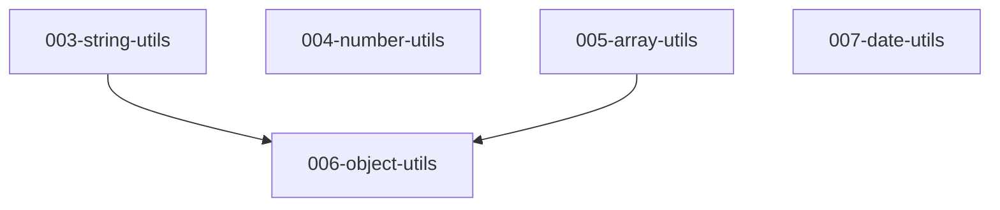

# Spec Kit 多阶段任务工作流资料总结与方案结论

## 1. 背景问题

当前“小贝 utils”项目使用的是类似下面的结构：

```text
specs/002-xiaobei-utils/
└── stages/
    ├── 20260523-104844-string-utils/
    ├── 20260523-105031-number-utils/
    └── 20260523-105343-array-utils/
```

每个 `stage` 都有自己的 `spec.md` 和质量清单。

这个结构在 3~5 个阶段时可以工作，但当阶段数量超过 15 个后，会出现以下问题：

- 阶段目录过多，阅读和查找成本上升
- 阶段之间的依赖关系不直观
- `.specify/feature.json` 一次只能指向一个当前 feature/stage
- `plan.md`、`tasks.md`、`analyze` 等后续流程容易上下文混乱
- branch、feature、stage、timestamp 之间不容易保持一致

因此需要判断：Spec Kit 是否有成熟的多阶段任务方案，以及当前项目应该如何演进。

---

## 2. 网上资料结论

本次查询了官方 Spec Kit 文档，以及一个社区同类项目 Spec Kitty 的工作流设计。

### 2.1 官方 Spec Kit 的核心模型

官方 Spec Kit 的标准目录模型是：

```text
.specify/
└── specs/
    └── 001-create-taskify/
        └── spec.md
```

在执行规划后，一个 feature 目录会形成：

```text
specs/[###-feature]/
├── plan.md
├── research.md
├── data-model.md
├── quickstart.md
├── contracts/
└── tasks.md
```

也就是说，官方默认模型是：

```text
一个 feature = 一个 specs/[###-feature] 目录
```

而不是：

```text
一个 feature 下面继续无限嵌套 stages
```

### 2.2 官方完整 SDD 工作流

官方的完整 Spec-Driven Development 流程是：

```text
/speckit.specify
→ review-spec gate
→ /speckit.plan
→ review-plan gate
→ /speckit.tasks
→ /speckit.implement
```

核心产物依次是：

```text
spec.md → plan.md → tasks.md → implementation
```

### 2.3 官方 tasks.md 内部的 phase 设计

官方 `tasks.md` 里有成熟的阶段组织方式：

```text
Phase 1: Setup
Phase 2: Foundational tasks
Phase 3+: User Stories in priority order
Final Phase: Polish & Cross-Cutting Concerns
```

每个 User Story phase 应该是一个：

```text
independently testable increment
```

也就是：

- 可以独立开发
- 可以独立测试
- 可以独立演示
- 可以独立交付价值

这说明官方确实支持“阶段化任务”，但这个阶段化主要发生在 **一个 feature 的 tasks.md 内部**，而不是在一个 feature 目录下再人为维护大量 `stages/` 子目录。

---

## 3. 对“多阶段”的关键判断

需要区分两类“阶段”：

### 3.1 feature 内部阶段

适合下面这种情况：

```text
一个明确 feature 内，有多个用户故事或实现步骤
```

例如：

```text
用户登录功能
├── Phase 1: Setup
├── Phase 2: Foundational
├── Phase 3: 用户输入账号密码登录
├── Phase 4: 登录失败提示
└── Phase 5: 登录状态保持
```

这种情况适合放在同一个 `specs/[feature]/tasks.md` 里。

### 3.2 大项目长期阶段

适合下面这种情况：

```text
一个大项目包含很多相对独立的能力模块
```

例如“小贝 utils”：

```text
01-string-utils
02-number-utils
03-array-utils
04-object-utils
05-date-utils
06-url-utils
07-storage-utils
08-dom-utils
09-event-utils
10-async-utils
...
```

如果阶段超过 15 个，这些阶段已经不再像一个 feature 内的 user story，而更像：

```text
Epic / Program / Roadmap
```

因此不建议继续全部塞进一个 feature 目录下的 `stages/`。

---

## 4. 社区方案参考：Spec Kitty 的 Work Package 模式

社区项目 Spec Kitty 提供了一个值得参考的思路。

它的规划流程类似：

```text
/spec-kitty.specify
/spec-kitty.plan
/spec-kitty.tasks
```

但是任务产物会拆成多个 work package：

```text
tasks/WP01.md
tasks/WP02.md
tasks/WP03.md
```

执行时可以按 work package 分发：

```text
Agent A implement WP01
Agent B implement WP02
Agent C implement WP03
```

它的启发是：

```text
大任务不要只生成一个巨大 tasks.md，而应该拆成可调度、可 review、可验收的工作包。
```

不过需要注意：

- Spec Kitty 是社区同类项目
- Work Package 模式不是官方 Spec Kit 的默认结构
- 但它对多阶段、多 agent、多任务并行很有参考价值

---

## 5. 三种方案对比

### 方案 A：继续使用单 feature + stages 子目录

结构：

```text
specs/002-xiaobei-utils/
└── stages/
    ├── 01-string-utils/
    ├── 02-number-utils/
    ├── 03-array-utils/
    └── ...
```

优点：

- 所有阶段集中在一个目录下
- 人工查看时有整体感
- 当前项目已有类似实践，迁移成本低

缺点：

- 偏离官方 Spec Kit 的 feature 目录模型
- 超过 15 个阶段后目录会变重
- `.specify/feature.json` 只能指向一个当前 stage
- 后续 `/speckit-plan`、`/speckit-tasks`、`/speckit-analyze` 容易上下文混乱
- branch 与 stage 的对应关系不自然

适合：

```text
阶段数量较少，通常 3~8 个以内
```

不适合：

```text
15+ 长期项目阶段
```

---

### 方案 B：一个 Epic + 多个 milestone feature

结构：

```text
specs/
├── 002-xiaobei-utils-epic/
│   ├── spec.md
│   ├── roadmap.md
│   ├── milestones.md
│   └── status.md
│
├── 003-basic-utils/
│   ├── spec.md
│   ├── plan.md
│   └── tasks.md
│
├── 004-data-utils/
│   ├── spec.md
│   ├── plan.md
│   └── tasks.md
│
└── 005-browser-utils/
    ├── spec.md
    ├── plan.md
    └── tasks.md
```

每个 milestone feature 里面包含 3~5 个相关能力。

例如：

```text
003-basic-utils
├── string-utils
├── number-utils
└── array-utils
```

优点：

- 比单个大 feature 更清晰
- 比每个阶段都独立 feature 更少目录
- 适合中等规模项目
- 里程碑级别容易评审和验收

缺点：

- 单个 milestone feature 仍可能变大
- 如果某个阶段需要独立 branch/PR，粒度可能不够细

适合：

```text
7~15 个阶段，且每 3~5 个阶段可以自然归类
```

---

### 方案 C：Epic + 每个阶段一个官方 Spec Kit feature

结构：

```text
specs/
├── 002-xiaobei-utils-epic/
│   ├── spec.md
│   ├── roadmap.md
│   ├── milestones.md
│   ├── dependency-map.md
│   └── status.md
│
├── 003-string-utils/
│   ├── spec.md
│   ├── plan.md
│   ├── tasks.md
│   └── checklists/
│
├── 004-number-utils/
│   ├── spec.md
│   ├── plan.md
│   ├── tasks.md
│   └── checklists/
│
├── 005-array-utils/
│   ├── spec.md
│   ├── plan.md
│   ├── tasks.md
│   └── checklists/
│
└── 006-object-utils/
    ├── spec.md
    ├── plan.md
    ├── tasks.md
    └── checklists/
```

核心思想：

```text
Epic 管全局路线
Feature 管单阶段交付
```

优点：

- 最符合官方 Spec Kit “一个 feature 一个目录”的模型
- 每个阶段可以独立 specify / plan / tasks / implement / analyze
- 每个阶段可以独立 branch、review、PR、验收
- 超过 15 个阶段时仍然清晰
- `.specify/feature.json` 每次只指向当前 feature，符合工具设计
- 后续自动化、任务追踪、GitHub issue 映射更自然

缺点：

- `specs/` 根目录会有更多 feature 目录
- 需要额外维护一个 Epic roadmap/status 索引

适合：

```text
15+ 阶段，或者长期演进型项目
```

---

## 6. 推荐结论

### 6.1 总结判断

Spec Kit 官方成熟支持的是：

```text
一个 feature 一个目录
spec.md → plan.md → tasks.md → implement
```

官方也支持任务内部 phase 化，但不是为“一个 feature 下无限 stages 子目录”设计的。

因此，如果项目超过 15 个阶段，最稳妥的设计是：

```text
Epic + 多个独立 Spec Kit feature
```

也就是：

```text
大项目 = Epic
阶段 = Feature
任务 = tasks.md 内部 phase/task
```

### 6.2 最终推荐

对“小贝 utils”这类长期工具库项目，推荐采用方案 C：

```text
specs/
├── 002-xiaobei-utils-epic/
├── 003-string-utils/
├── 004-number-utils/
├── 005-array-utils/
├── 006-object-utils/
├── 007-date-utils/
└── ...
```

其中：

- `002-xiaobei-utils-epic` 只负责总览，不直接承载所有实现任务
- 每个具体工具阶段单独成为一个 Spec Kit feature
- 每个 feature 独立生成 `spec.md`、`plan.md`、`tasks.md`
- `roadmap.md`、`status.md`、`dependency-map.md` 负责跨阶段管理

---

## 7. 建议的 Epic 文件设计

### 7.1 `roadmap.md`

用于描述阶段路线图。

```markdown
# Xiaobei Utils Roadmap

## Milestone 01: Basic Utils

| Feature          | Scope                         | Dependency | Status    |
| ---------------- | ----------------------------- | ---------- | --------- |
| 003-string-utils | trim / uppercase / lowercase  | None       | Spec Done |
| 004-number-utils | add / multiply / formatNumber | None       | Spec Done |
| 005-array-utils  | unique / sort / filter        | None       | Spec Done |

## Milestone 02: Data Utils

| Feature          | Scope                 | Dependency | Status  |
| ---------------- | --------------------- | ---------- | ------- |
| 006-object-utils | pick / omit / merge   | 003,005    | Planned |
| 007-date-utils   | format / parse / diff | None       | Planned |
```

### 7.2 `status.md`

用于追踪每个 feature 的工作流状态。

```markdown
# Xiaobei Utils Status

| Feature          | Spec | Plan    | Tasks   | Implement | Test    |
| ---------------- | ---- | ------- | ------- | --------- | ------- |
| 003-string-utils | Done | Pending | Pending | Pending   | Pending |
| 004-number-utils | Done | Pending | Pending | Pending   | Pending |
| 005-array-utils  | Done | Pending | Pending | Pending   | Pending |
```

### 7.3 `dependency-map.md`

用于描述阶段依赖关系。

````markdown
# Dependency Map


````

````

### 7.4 `milestones.md`

用于按里程碑分组。

```markdown
# Xiaobei Utils Milestones

## Milestone 01: Basic Utils

目标：提供最基础的数据处理工具。

包含：

- 003-string-utils
- 004-number-utils
- 005-array-utils

验收标准：

- 所有基础工具函数完成类型声明
- 所有基础工具函数具备简单测试
- 所有工具从统一入口导出

## Milestone 02: Data Utils

目标：提供对象、日期、URL 等通用数据处理能力。

包含：

- 006-object-utils
- 007-date-utils
- 008-url-utils
````

---

## 8. 对当前项目的迁移建议

当前已有：

```text
specs/002-xiaobei-utils/stages/
├── 20260523-104844-string-utils/
├── 20260523-105031-number-utils/
└── 20260523-105343-array-utils/
```

建议迁移为：

```text
specs/
├── 002-xiaobei-utils-epic/
│   ├── spec.md
│   ├── roadmap.md
│   ├── status.md
│   └── dependency-map.md
│
├── 003-string-utils/
├── 004-number-utils/
└── 005-array-utils/
```

映射关系：

| 当前阶段目录                          | 新 feature 目录          |
| ------------------------------------- | ------------------------ |
| `stages/20260523-104844-string-utils` | `specs/003-string-utils` |
| `stages/20260523-105031-number-utils` | `specs/004-number-utils` |
| `stages/20260523-105343-array-utils`  | `specs/005-array-utils`  |

迁移时建议先不要删除旧目录，可以：

1. 先建立新的 Epic 目录
2. 复制现有 stage spec 到新的 feature 目录
3. 更新 roadmap/status
4. 确认后续命令能正常指向新 feature
5. 最后再决定旧 `stages/` 是归档还是删除

---

## 9. 后续命令建议

如果采用推荐结构，后续创建新阶段时建议直接创建独立 feature：

```text
/speckit-specify 小贝项目 - 对象工具函数
/speckit-plan
/speckit-tasks
/speckit-implement
```

不要再默认写入：

```text
specs/002-xiaobei-utils/stages/
```

而是让它进入：

```text
specs/006-object-utils/
```

然后手动或自动更新：

```text
specs/002-xiaobei-utils-epic/roadmap.md
specs/002-xiaobei-utils-epic/status.md
```

---

## 10. 最终结论

如果只是 3~6 个阶段：

```text
单 feature + tasks.md phases 就够
```

如果是 7~15 个阶段：

```text
Epic + milestone feature
```

如果超过 15 个阶段：

```text
Epic + 每个阶段一个 Spec Kit feature
```

对当前“小贝 utils”项目，推荐采用：

```text
Epic + 每个阶段一个独立 Spec Kit feature
```

这是最贴近官方 Spec Kit 设计、最适合长期维护、也最适合未来自动化和多人/多 agent 协作的方案。

---

## 11. 资料来源

- Spec Kit README - Project Directory Structure
  https://github.com/github/spec-kit/blob/main/README.md

- Spec Kit Plan Template - Project Documentation Structure
  https://github.com/github/spec-kit/blob/main/templates/plan-template.md

- Spec Kit Quickstart - Generate Task List / Implement / Analyze
  https://github.com/github/spec-kit/blob/main/docs/quickstart.md

- Spec Kit Workflows Reference - Full SDD Cycle
  https://github.com/github/spec-kit/blob/main/docs/reference/workflows.md

- Spec Kit Tasks Template - Phase Structure
  https://github.com/github/spec-kit/blob/main/templates/commands/tasks.md

- Spec Kitty README - Complete Workflow Example
  https://github.com/priivacy-ai/spec-kitty/blob/main/README.md

- Spec Kitty SDD Explanation - Work Packages
  https://github.com/priivacy-ai/spec-kitty/blob/main/docs/explanation/spec-driven-development.md
