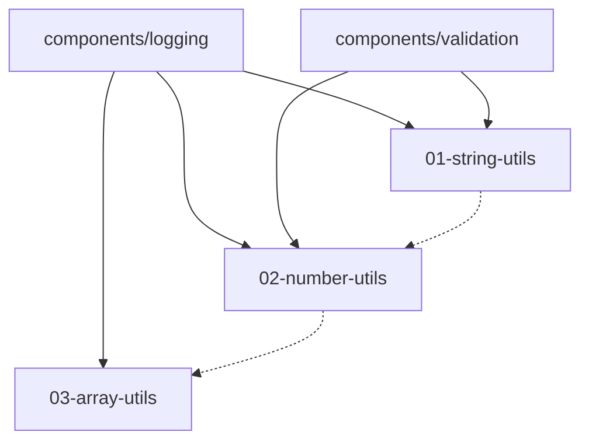

# Speckit 多阶段分组架构演进方案

---

## 文档信息

| 项目         | 内容                            |
| ------------ | ------------------------------- |
| **文档版本** | v1.0                            |
| **创建日期** | 2026-05-22                      |
| **适用场景** | 15-50 个阶段的大型 Speckit 项目 |
| **核心模式** | 多层分组 + 组件库               |

---

## 一、架构演进背景

### 1.1 当前架构挑战

当 Speckit feature 的阶段数量扩展到 **15-50 个**时，原有扁平结构会面临以下问题：

| 挑战类型          | 具体表现                             | 影响程度 |
| ----------------- | ------------------------------------ | -------- |
| **认知复杂度**    | 人无法同时理解 15+ 个独立阶段的细节  | 高       |
| **命名冲突**      | 阶段命名可能重复或混淆               | 中       |
| **导航困难**      | 扁平目录结构下查找特定阶段效率低下   | 中       |
| **依赖管理**      | 阶段间可能存在未记录的依赖关系       | 高       |
| **AI 上下文溢出** | 一次性加载过多文档超出模型上下文限制 | 高       |

### 1.2 演进目标

```text
┌─────────────────────────────────────────────────────────────────────┐
│                     架构演进目标                                     │
├─────────────────────────────────────────────────────────────────────┤
│  1. 降低认知复杂度：通过分组机制聚合相关阶段                         │
│  2. 支持并行开发：阶段间解耦，允许多团队并行工作                      │
│  3. 促进组件复用：提取共享逻辑，避免重复实现                          │
│  4. 保持向后兼容：保留旧路径，不破坏现有工作流                        │
│  5. AI 友好：支持按需加载，避免上下文稀释                            │
└─────────────────────────────────────────────────────────────────────┘
```

---

## 二、目标架构设计

### 2.1 目录结构

```text
specs/002-xiaobei-utils/
├── spec.md                    ← 全局规格索引
├── plan.md                    ← 全局实现计划
├── tasks.md                   ← 全局任务编排
├── research.md                ← 全局研究索引
├── data-model.md              ← 全局数据模型索引
├── quickstart.md              ← 全局快速入门索引
├── components/                ← 【新增】共享组件库
│   ├── logging/
│   │   ├── spec.md
│   │   ├── plan.md
│   │   ├── contract.md
│   │   └── changelog.md
│   └── validation/
│       ├── spec.md
│       ├── plan.md
│       ├── contract.md
│       └── changelog.md
├── contracts/                 ← 【保留】兼容旧路径
│   ├── string-utils.md
│   ├── number-utils.md
│   └── array-utils.md
├── checklists/
│   └── requirements.md
└── stages/
    ├── group-core/            ← 【新增】核心工具组
    │   ├── 01-string-utils/
    │   ├── 02-number-utils/
    │   └── group-spec.md      ← 组级规格说明
    ├── group-collection/      ← 【新增】集合工具组
    │   ├── 03-array-utils/
    │   └── group-spec.md
    └── group-advanced/        ← 【预留】高级工具组
        └── group-spec.md
```

### 2.2 层级职责定义

| 层级                 | 职责           | 说明                   |
| -------------------- | -------------- | ---------------------- |
| **根目录**           | 全局索引与约束 | 轻量化，仅包含全局信息 |
| **components/**      | 共享可复用组件 | 跨阶段共享，版本化管理 |
| **stages/group-\*/** | 阶段分组       | 按功能域聚合相关阶段   |
| **stage/xx-xxx/**    | 具体阶段       | 独立的文档和任务集合   |

---

## 三、执行计划

### 3.1 阶段划分与时间估算

| Phase       | 阶段名称     | 天数 | 核心任务                   |
| ----------- | ------------ | ---- | -------------------------- |
| **Phase 1** | 准备阶段     | 2    | 评估分组策略，识别共享组件 |
| **Phase 2** | 目录重构     | 2    | 创建分组目录，迁移现有阶段 |
| **Phase 3** | 组件库建设   | 3    | 创建组件文档，声明依赖     |
| **Phase 4** | 任务编排更新 | 2    | 更新全局和阶段 tasks.md    |
| **Phase 5** | 验证完善     | 1    | 验证链接完整性，归档变更   |
| **合计**    | -            | 10   | -                          |

### 3.2 详细任务清单

#### Phase 1: 准备阶段

| 任务        | 描述                                   | 负责人 | 依赖    |
| ----------- | -------------------------------------- | ------ | ------- |
| **P1-T001** | 评估现有阶段归属，确定分组策略         | 架构师 | 无      |
| **P1-T002** | 识别跨阶段共享逻辑，规划组件库内容     | 架构师 | P1-T001 |
| **P1-T003** | 更新全局 spec.md，添加分组和组件库说明 | 架构师 | P1-T002 |

#### Phase 2: 目录结构重构

| 任务        | 描述                                         | 负责人 | 依赖    |
| ----------- | -------------------------------------------- | ------ | ------- |
| **P2-T001** | 创建 components/ 目录及基础文档结构          | 开发者 | P1-T003 |
| **P2-T002** | 创建 group-core/、group-collection/ 分组目录 | 开发者 | P2-T001 |
| **P2-T003** | 迁移现有阶段到对应分组                       | 开发者 | P2-T002 |
| **P2-T004** | 创建每个分组的 group-spec.md                 | 开发者 | P2-T003 |

#### Phase 3: 组件库建设

| 任务        | 描述                                 | 负责人 | 依赖             |
| ----------- | ------------------------------------ | ------ | ---------------- |
| **P3-T001** | 创建 components/logging/ 组件文档    | 开发者 | P2-T001          |
| **P3-T002** | 创建 components/validation/ 组件文档 | 开发者 | P2-T001          |
| **P3-T003** | 更新阶段文档，添加对组件的依赖声明   | 开发者 | P3-T001, P3-T002 |
| **P3-T004** | 更新全局 plan.md，添加组件库说明     | 架构师 | P3-T003          |

#### Phase 4: 任务编排更新

| 任务        | 描述                                 | 负责人   | 依赖    |
| ----------- | ------------------------------------ | -------- | ------- |
| **P4-T001** | 更新全局 tasks.md，引入分组执行流程  | 项目经理 | P3-T004 |
| **P4-T002** | 更新阶段 tasks.md，添加组件依赖检查  | 开发者   | P4-T001 |
| **P4-T003** | 更新 contracts/ 旧文件，添加分组链接 | 开发者   | P4-T001 |

#### Phase 5: 验证与文档完善

| 任务        | 描述                                 | 负责人     | 依赖    |
| ----------- | ------------------------------------ | ---------- | ------- |
| **P5-T001** | 验证所有文档链接完整性               | QA         | P4-T003 |
| **P5-T002** | 更新全局 quickstart.md，添加分组导航 | 文档工程师 | P5-T001 |
| **P5-T003** | 归档重构变更记录到 research.md       | 架构师     | P5-T002 |

---

## 四、分组策略

### 4.1 分组定义

| 分组名称             | 职责范围     | 包含阶段示例               |
| -------------------- | ------------ | -------------------------- |
| **group-core**       | 基础工具函数 | string-utils、number-utils |
| **group-collection** | 集合数据处理 | array-utils、object-utils  |
| **group-date**       | 日期时间处理 | date-format、date-calc     |
| **group-advanced**   | 高级功能     | encryption、compression    |

### 4.2 分组命名规范

```text
group-{功能域}
├── {两位数字}-{阶段名称}/
│   ├── spec.md
│   ├── plan.md
│   ├── tasks.md
│   ├── contract.md
│   ├── data-model.md
│   └── quickstart.md
└── group-spec.md              ← 组级规格说明
```

### 4.3 分组维度选择指南

| 维度         | 适用场景       | 优点               | 缺点               |
| ------------ | -------------- | ------------------ | ------------------ |
| **功能域**   | 按业务功能聚合 | 逻辑清晰，便于维护 | 可能跨越多个技术栈 |
| **复杂度**   | 按实现难度区分 | 便于资源分配       | 边界模糊           |
| **交付顺序** | 按优先级排序   | 支持 MVP 优先      | 可能随时间变化     |

---

## 五、组件库设计

### 5.1 组件文档结构

```text
components/{组件名}/
├── spec.md          ← 组件规格定义
├── plan.md          ← 组件实现计划
├── contract.md      ← 组件接口契约
└── changelog.md     ← 版本变更记录
```

### 5.2 初始组件规划

| 组件名         | 职责         | 预期依赖者                 | 版本 |
| -------------- | ------------ | -------------------------- | ---- |
| **logging**    | 统一日志工具 | 所有阶段                   | v1.0 |
| **validation** | 输入验证工具 | string-utils、number-utils | v2.1 |

### 5.3 组件提取原则

```text
┌─────────────────────────────────────────────────────────────────┐
│                      组件提取决策流程                            │
├─────────────────────────────────────────────────────────────────┤
│  复用次数 ≥ 3 次？                                               │
│       ↓                                                         │
│  ┌──Yes──┐                                                      │
│  │ 是否  │                                                      │
│  │ 稳定？ │──Yes──→ 提取为共享组件                                │
│  └──No───┘                                                      │
│       ↓                                                         │
│  保持在阶段内部                                                  │
└─────────────────────────────────────────────────────────────────┘
```

---

## 六、依赖管理规范

### 6.1 依赖声明格式

```markdown
# stages/group-core/01-string-utils/plan.md

## Dependencies

- **Required**: components/logging@v1.0
- **Required**: components/validation@v2.1
- **Optional**: stages/group-core/02-number-utils@v1.0
```

### 6.2 依赖类型说明

| 类型         | 说明                 | 影响         |
| ------------ | -------------------- | ------------ |
| **Required** | 必须在本阶段前完成   | 强制执行顺序 |
| **Optional** | 可选依赖，不影响执行 | 灵活并行     |
| **Peer**     | 同级依赖，需版本兼容 | 协调版本     |

### 6.3 依赖可视化示例



---

## 七、兼容性保证

### 7.1 旧路径处理策略

| 策略             | 说明                             | 适用场景     |
| ---------------- | -------------------------------- | ------------ |
| **保留并重定向** | 保留旧文件，添加指向新位置的链接 | 当前推荐     |
| **索引化**       | 将旧文件改为轻量索引             | 后续优化阶段 |
| **删除**         | 直接删除旧文件                   | 完全稳定后   |

### 7.2 旧文件格式示例

```markdown
---
Status: Legacy (Compatible)
Canonical Document: ../stages/group-core/01-string-utils/contract.md
---

# String Utils Contract (Legacy)

> **Note**: This document is kept for backward compatibility.
> Please refer to the canonical version at: stages/group-core/01-string-utils/contract.md

...（原有内容）
```

---

## 八、风险评估与缓解

| 风险              | 等级 | 缓解措施                                 | 负责人   |
| ----------------- | ---- | ---------------------------------------- | -------- |
| **链接失效**      | 高   | 执行 P5-T001 验证所有链接                | QA       |
| **分组策略变更**  | 中   | 在 P1-T001 阶段充分评估，文档化决策      | 架构师   |
| **依赖循环**      | 中   | 建立依赖审查流程，在 tasks.md 中显式声明 | 项目经理 |
| **AI 上下文适配** | 低   | 保持阶段文档独立，AI 按需加载            | 架构师   |

---

## 九、验收标准

| 验收项                   | 验证方式                              | 责任人     |
| ------------------------ | ------------------------------------- | ---------- |
| 目录结构符合目标设计     | 检查目录树                            | 架构师     |
| 所有阶段已迁移到对应分组 | 核对阶段位置                          | 开发者     |
| 组件库文档完整           | 检查 components/ 目录                 | 开发者     |
| 依赖声明正确             | 审查 plan.md 中的依赖部分             | 架构师     |
| 旧路径保持兼容           | 验证 contracts/ 文件可访问            | QA         |
| 全局文档已更新           | 审查根目录 spec.md、plan.md、tasks.md | 文档工程师 |

---

## 十、后续扩展建议

### 10.1 阶段数量扩展路径

```text
当前（3个阶段） → 5-10个阶段 → 15+个阶段
     ↓                  ↓                ↓
  现有结构        分组机制        完整组件库模式
```

### 10.2 触发升级的条件

| 条件                        | 行动           |
| --------------------------- | -------------- |
| 阶段数量达到 5 个           | 引入分组机制   |
| 阶段数量达到 10 个          | 建立组件库     |
| 跨阶段复用逻辑出现 3 次以上 | 提取为共享组件 |

### 10.3 进阶优化方向

| 方向           | 描述                     | 优先级 |
| -------------- | ------------------------ | ------ |
| **版本控制**   | 为阶段和组件添加版本标识 | 高     |
| **CI/CD 集成** | 自动化验证依赖和链接     | 高     |
| **可视化工具** | 生成依赖关系图           | 中     |
| **权限管理**   | 按分组设置访问权限       | 低     |

---

## 十一、附录

### 附录 A: 全局 tasks.md 参考结构

```markdown
# Tasks: 小贝工具库 (大型项目版)

## Phase 1: Component Setup

- [ ] T001 Initialize shared components (logging, validation)
- [ ] T002 Define component version contracts

## Phase 2: Group Execution (Parallel)

- [ ] T003 Execute group-core stages
- [ ] T004 Execute group-collection stages
- [ ] T005 Execute group-date stages
- [ ] T006 Execute group-advanced stages

## Phase 3: Cross-Group Integration

- [ ] T007 Validate inter-group dependencies
- [ ] T008 Run integration tests

## Phase 4: Final Validation

- [ ] T009 Run lint and typecheck
- [ ] T010 Confirm no unit tests added
```

### 附录 B: 文档模板清单

| 文件            | 用途     | 是否必需       |
| --------------- | -------- | -------------- |
| `spec.md`       | 规格定义 | 是             |
| `plan.md`       | 实现计划 | 是             |
| `tasks.md`      | 任务清单 | 是             |
| `contract.md`   | 接口契约 | 是             |
| `data-model.md` | 数据模型 | 否             |
| `quickstart.md` | 快速入门 | 否             |
| `group-spec.md` | 组级规格 | 是（分组目录） |
| `changelog.md`  | 变更记录 | 是（组件）     |

---

## 十二、版本历史

| 版本 | 日期       | 作者     | 变更说明 |
| ---- | ---------- | -------- | -------- |
| v1.0 | 2026-05-22 | 架构团队 | 初始版本 |

---

**文档结束**

---

_本方案为渐进式演进设计，可根据实际阶段数量逐步引入，无需一次性全部实施。_
