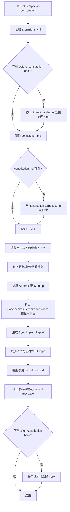

# /speckit-constitution 执行机制梳理

> 目的：用于学习和归档，说明 `/speckit-constitution` 在本项目 Spec Kit 工作流中的职责、输入输出、执行步骤、联动文件和注意事项。

## 1. 命令定位

`/speckit-constitution` 是 Spec Kit 中用于创建或更新项目宪章的命令。

它的核心职责不是实现业务功能，而是维护项目级治理规则：

- 项目的核心原则；
- 额外约束；
- 开发流程或质量门禁；
- 治理规则；
- 版本号和修订日期；
- 与后续 `spec`、`plan`、`tasks` 模板的一致性。

在本项目中，对应技能入口为：

```text
.claude/skills/speckit-constitution/SKILL.md
```

实际维护的宪章文件为：

```text
.specify/memory/constitution.md
```

如果该文件不存在，命令要求先从模板初始化：

```text
.specify/templates/constitution-template.md
```

## 2. 输入机制

命令支持用户在调用时直接提供原则或价值观输入，例如：

```text
/speckit-constitution 严格类型优先；功能必须可独立测试；避免过度设计
```

输入内容会作为 `$ARGUMENTS` 被命令处理。

处理优先级如下：

1. 用户显式提供的原则、价值观、治理要求；
2. 现有 `.specify/memory/constitution.md` 中已有内容；
3. 仓库上下文，例如 README、docs、项目说明文件；
4. 若关键字段无法推断，则写入 `TODO(<FIELD_NAME>): explanation` 并在影响报告中标记。

## 3. 前置 Hook 机制

执行主体逻辑前，命令会检查：

```text
.specify/extensions.yml
```

并读取：

```yaml
hooks.before_constitution
```

当前项目中该 hook 配置为：

```yaml
before_constitution:
  - extension: git
    command: speckit.git.initialize
    enabled: true
    optional: false
    prompt: Execute speckit.git.initialize?
    description: Initialize Git repository before constitution setup
    condition: null
```

含义：

- 在更新 constitution 前，应确保 Git 仓库已初始化；
- `optional: false` 表示这是强制前置 hook；
- 命令名中的点会转换成 slash command 形式：

```text
speckit.git.initialize -> /speckit-git-initialize
```

### Hook 执行判断规则

命令只做静态判断，不求值复杂条件：

- `enabled: false`：跳过；
- 未写 `enabled`：默认启用；
- `condition` 为空：视为可执行；
- `condition` 非空：跳过，由 HookExecutor 处理；
- YAML 解析失败：静默跳过 hook 检查。

## 4. 主执行流程

`/speckit-constitution` 的主流程可以理解为 8 步。

### 4.1 读取现有 constitution

读取：

```text
.specify/memory/constitution.md
```

如果不存在，应复制：

```text
.specify/templates/constitution-template.md
```

当前模板结构大致为：

```markdown
# [PROJECT_NAME] Constitution

## Core Principles

### [PRINCIPLE_1_NAME]

[PRINCIPLE_1_DESCRIPTION]

### [PRINCIPLE_2_NAME]

[PRINCIPLE_2_DESCRIPTION]

### [PRINCIPLE_3_NAME]

[PRINCIPLE_3_DESCRIPTION]

### [PRINCIPLE_4_NAME]

[PRINCIPLE_4_DESCRIPTION]

### [PRINCIPLE_5_NAME]

[PRINCIPLE_5_DESCRIPTION]

## [SECTION_2_NAME]

[SECTION_2_CONTENT]

## [SECTION_3_NAME]

[SECTION_3_CONTENT]

## Governance

[GOVERNANCE_RULES]

**Version**: [CONSTITUTION_VERSION] | **Ratified**: [RATIFICATION_DATE] | **Last Amended**: [LAST_AMENDED_DATE]
```

### 4.2 识别占位符

命令会查找类似下面的模板占位符：

```text
[PROJECT_NAME]
[PRINCIPLE_1_NAME]
[PRINCIPLE_1_DESCRIPTION]
[SECTION_2_NAME]
[GOVERNANCE_RULES]
[CONSTITUTION_VERSION]
[RATIFICATION_DATE]
[LAST_AMENDED_DATE]
```

要求最终文件中不能留下未解释的方括号占位符。

如果某些占位符暂时无法确定，必须写成：

```text
TODO(FIELD_NAME): explanation
```

并在 Sync Impact Report 中说明。

### 4.3 收集或推导实际值

命令会把占位符替换成具体内容。

典型字段来源：

| 字段                     | 来源                               |
| ------------------------ | ---------------------------------- |
| PROJECT_NAME             | 用户输入、仓库名、README、项目说明 |
| PRINCIPLE_x_NAME         | 用户提供的原则，或从项目规范推导   |
| PRINCIPLE_x_DESCRIPTION  | 每条原则的不可协商规则和理由       |
| SECTION_2_NAME / CONTENT | 额外约束，例如安全、性能、技术栈   |
| SECTION_3_NAME / CONTENT | 开发流程、评审流程、质量门禁       |
| GOVERNANCE_RULES         | 修订流程、版本策略、合规检查       |
| CONSTITUTION_VERSION     | 根据变更类型按 SemVer 递增         |
| RATIFICATION_DATE        | 初次采纳日期，未知则 TODO          |
| LAST_AMENDED_DATE        | 本次修改日期                       |

## 5. 版本号递增规则

宪章版本遵循语义化版本：

```text
MAJOR.MINOR.PATCH
```

递增规则：

| 变更类型 | 版本变化                               | 示例                   |
| -------- | -------------------------------------- | ---------------------- |
| MAJOR    | 不兼容的治理变更、删除或重定义核心原则 | 删除“必须测试优先”原则 |
| MINOR    | 新增原则、新增章节、显著扩展指导       | 新增安全治理章节       |
| PATCH    | 文案澄清、错别字、非语义调整           | 修正措辞或补充说明     |

如果无法判断版本变化类型，命令需要先给出理由，再决定版本 bump。

## 6. Constitution 内容生成要求

生成后的宪章必须满足：

- 保持模板的 Markdown 层级；
- 原则必须是声明式、可检查、可执行的规则；
- 每条原则要有简洁名称；
- 原则描述要包含不可协商要求；
- 不应使用模糊词，例如无理由的 “should”；
- 治理章节必须说明：
  - 修订流程；
  - 版本策略；
  - 合规检查方式；
- 没有未解释的 `[PLACEHOLDER]`；
- 日期使用 `YYYY-MM-DD` 格式；
- 版本行和影响报告中的版本一致。

## 7. 一致性传播机制

`/speckit-constitution` 不只是改 constitution 本身，还要检查依赖模板是否需要同步。

需要读取并检查的文件包括：

```text
.specify/templates/plan-template.md
.specify/templates/spec-template.md
.specify/templates/tasks-template.md
.specify/templates/commands/*.md
README.md
docs/quickstart.md
其他 agent/runtime guidance 文件
```

本项目当前存在的关键模板：

```text
.specify/templates/constitution-template.md
.specify/templates/spec-template.md
.specify/templates/plan-template.md
.specify/templates/tasks-template.md
.specify/templates/checklist-template.md
```

### 7.1 plan-template.md 的影响

`plan-template.md` 中有 Constitution Check 区块：

```markdown
## Constitution Check

_GATE: Must pass before Phase 0 research. Re-check after Phase 1 design._

[Gates determined based on constitution file]
```

如果 constitution 新增了强制原则，例如：

- 测试优先；
- 安全审计；
- 性能门禁；
- 文档同步；

那么 `plan-template.md` 的 Constitution Check 就应该能反映这些门禁。

### 7.2 spec-template.md 的影响

`spec-template.md` 负责需求规格结构。

如果 constitution 要求某些需求必须出现，例如：

- 安全需求；
- 可访问性需求；
- 性能指标；
- 审计日志；
- 回滚策略；

则 spec 模板可能需要新增或强化相关章节。

### 7.3 tasks-template.md 的影响

`tasks-template.md` 负责任务拆分结构。

如果 constitution 要求某些任务必须存在，例如：

- 测试任务必须先于实现；
- 安全检查任务必须存在；
- 性能验证任务必须存在；
- 文档更新任务必须存在；

则 tasks 模板应同步这些任务分类或说明。

## 8. Sync Impact Report

更新 constitution 后，命令要求在文件顶部添加 HTML 注释格式的同步影响报告。

示例结构：

```markdown
<!--
Sync Impact Report
Version change: 0.1.0 -> 0.2.0
Modified principles:
- [old] -> [new]
Added sections:
- Security Requirements
Removed sections:
- None
Templates requiring updates:
- ✅ .specify/templates/plan-template.md
- ⚠ .specify/templates/tasks-template.md
Follow-up TODOs:
- TODO(RATIFICATION_DATE): original adoption date unknown
-->
```

该报告用于说明：

- 版本变化；
- 哪些原则被新增、修改、删除；
- 哪些章节被新增或删除；
- 哪些模板已同步，哪些还待处理；
- 是否存在无法立即完成的 TODO。

## 9. 写回机制

最终命令会覆盖写回：

```text
.specify/memory/constitution.md
```

注意：

- 它不是新建另一个 constitution 文件；
- 不是生成某个 feature 目录下的文档；
- 它维护的是整个项目级别的 Spec Kit 宪章；
- 写回前必须完成格式和一致性校验。

## 10. 后置 Hook 机制

主流程完成后，命令再次检查：

```yaml
hooks.after_constitution
```

当前项目中配置为：

```yaml
after_constitution:
  - extension: git
    command: speckit.git.commit
    enabled: true
    optional: true
    prompt: Commit constitution changes?
    description: Auto-commit after constitution update
    condition: null
```

含义：

- 更新 constitution 后可选择自动提交；
- 因为 `optional: true`，不会强制执行；
- 对应 slash command 为：

```text
/speckit-git-commit
```

不过是否真正提交，还取决于 Git 扩展配置：

```text
.specify/extensions/git/git-config.yml
```

其中 `auto_commit.after_constitution.enabled` 如果为 `false`，执行自动提交脚本也可能跳过提交。

## 11. 与其他 Spec Kit 命令的关系

`/speckit-constitution` 是上游治理命令，会影响后续所有阶段。

典型链路：

```text
/speckit-constitution
        ↓
/specify templates updated
        ↓
/speckit-specify
        ↓
/speckit-plan
        ↓
/speckit-tasks
        ↓
/speckit-implement
```

影响关系：

| 命令               | 受 constitution 影响的点                           |
| ------------------ | -------------------------------------------------- |
| /speckit-specify   | 需求必须符合宪章定义的范围、质量、安全或合规要求   |
| /speckit-plan      | Constitution Check 门禁必须通过                    |
| /speckit-tasks     | 任务拆分要体现宪章要求的测试、安全、文档、治理任务 |
| /speckit-implement | 实现过程必须遵守宪章原则                           |
| /speckit-analyze   | 可基于宪章检查 spec/plan/tasks 一致性              |

## 12. 本项目当前状态观察

根据当前读取结果，本项目的：

```text
.specify/memory/constitution.md
```

仍然是模板占位状态，包含大量：

```text
[PROJECT_NAME]
[PRINCIPLE_1_NAME]
[PRINCIPLE_1_DESCRIPTION]
[CONSTITUTION_VERSION]
```

这意味着：

1. constitution 尚未真正初始化为项目级治理规则；
2. `/speckit-plan` 中的 Constitution Check 只能记录“模板占位，未定义具体门禁”；
3. 后续如果希望 Spec Kit 工作流更稳定，应优先执行一次正式的 `/speckit-constitution`；
4. 建议将本项目已有规范固化进 constitution，例如：
   - TypeScript 严格类型；
   - 安全边界；
   - 前后端职责边界；
   - 代码复用优先；
   - 变更必须可验证；
   - 规格、计划、任务三阶段一致性。

## 13. 推荐首次 constitution 内容方向

如果后续要正式初始化 constitution，可考虑 5 条核心原则：

### I. 类型安全优先

所有 TypeScript 代码必须显式声明关键输入输出类型，避免不必要的 `any`。

### II. 安全默认

认证、Token、密码、错误信息和外部输入处理必须遵守项目安全规范。

### III. 规格驱动交付

重要功能必须先有 spec，再有 plan，再有 tasks，最后 implement。

### IV. 最小可行变更

每次变更必须保持范围清晰，优先复用现有结构，避免过度设计。

### V. 可验证质量门禁

每个实现任务必须能通过 lint、类型检查、测试或明确的验收标准验证。

## 14. 常见踩坑

### 14.1 只改 constitution，不同步模板

如果新增了强制测试原则，但没有更新 `tasks-template.md`，后续任务可能不会生成测试任务。

### 14.2 留下未解释占位符

例如：

```text
[PRINCIPLE_1_NAME]
```

这是无效状态。必须替换或写成明确 TODO，并在影响报告中说明。

### 14.3 版本号不匹配

顶部 Sync Impact Report 的版本变化必须和文件底部 Version 行一致。

### 14.4 把临时项目偏好写成宪章

constitution 应该写稳定治理规则，不适合记录临时任务、单次 feature 细节或短期实验。

### 14.5 把实现细节写成原则

原则应描述治理约束，而不是具体代码实现。例如：

- 推荐：所有认证凭证必须避免暴露给前端脚本。
- 不推荐：必须在某个具体函数里调用某个实现方法。

## 15. 执行机制速查

```text
1. 读取 .specify/extensions.yml
2. 执行 before_constitution hook（如启用）
3. 读取 .specify/memory/constitution.md
4. 如缺失则从 .specify/templates/constitution-template.md 初始化
5. 识别 [PLACEHOLDER]
6. 根据用户输入、仓库上下文、已有内容推导值
7. 计算版本号 bump
8. 生成新 constitution 内容
9. 检查 plan/spec/tasks/commands/docs 模板是否需同步
10. 在 constitution 顶部写入 Sync Impact Report
11. 校验无未解释占位符、日期和版本一致
12. 覆盖写回 .specify/memory/constitution.md
13. 输出版本、变更理由、后续 TODO、建议 commit message
14. 执行 after_constitution hook（如启用）
```

## 16. Mermaid 流程图



## 17. 学习结论

`/speckit-constitution` 的本质是项目治理规则初始化/修订器。

它不是单纯写一个 Markdown，而是建立一套会影响后续 Spec Kit 命令的上游约束。好的 constitution 能让后续 `/speckit-specify`、`/speckit-plan`、`/speckit-tasks` 生成的内容更稳定、更一致，也能减少每次功能开发时反复解释项目原则的成本。
