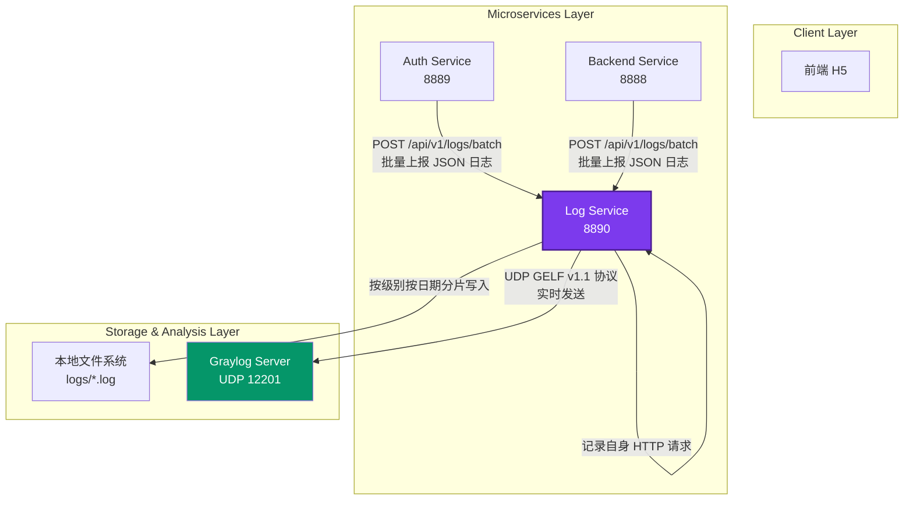
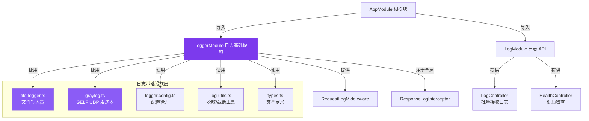
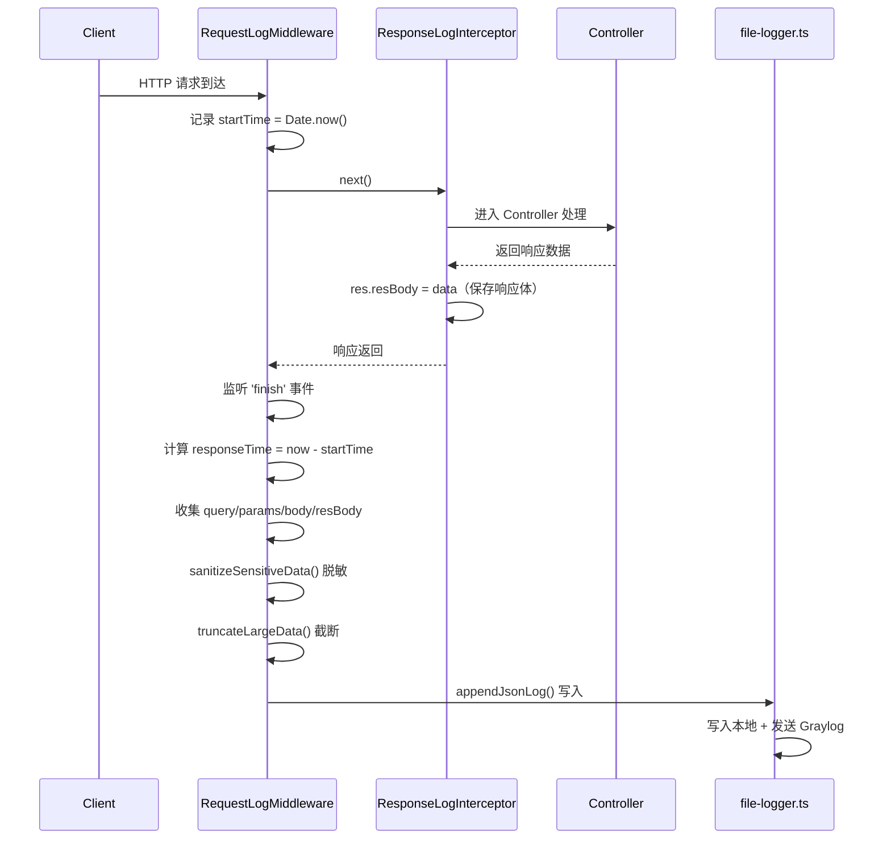

# 日志服务 (Log Service) - 架构设计文档

## 📋 文档信息

| 项 | 内容 |
|---|---|
| **服务名称** | Log Service（集中式日志服务） |
| **生成日期** | 2026-05-02 |
| **技术栈** | NestJS 11 + 原生 Node.js UDP + 本地文件系统 |
| **服务端口** | 8890（默认） |
| **文档版本** | v1.0 |
| **通信协议** | HTTP REST (日志接收) + UDP GELF (Graylog) |

---

## 🎯 服务定位与职责

### 核心价值定位

**Log Service 是 Monorepo 架构中的「可观测性基础设施」**，负责：

| 维度 | 职责 |
|---|---|
| **日志集中收集** | 接收 Auth Service、Backend Service 等所有微服务的日志上报 |
| **统一存储** | 按级别、按日期分片存储结构化 JSON 日志 |
| **格式标准化** | 将所有服务日志转换为 GELF（Graylog Extended Log Format）标准格式 |
| **双写保障** | 本地文件持久化 + 实时发送到 Graylog 分析平台 |
| **安全脱敏** | 自动过滤密码、Token 等敏感字段 |
| **自身可观测** | 记录本服务的所有 HTTP 请求和错误 |

### 在 Monorepo 中的系统架构图



---

## 🛠️ 核心技术栈详解

### 1. NestJS 框架特性

| 特性 | 使用情况 | 说明 |
|---|---|---|
| **模块化架构** | ✅ AppModule + LoggerModule + LogModule | 职责清晰分离 |
| **全局管道** | ✅ ValidationPipe | DTO 自动验证 |
| **API 版本** | ✅ URI 版本控制 | `/api/v1/*` |
| **Swagger 文档** | ✅ 完整 API 文档 | 日志上报接口 schema |
| **响应压缩** | ✅ compression 中间件 | 响应 > 1KB 自动 gzip |

### 2. 核心协议与格式

| 技术 | 版本 | 用途 | 说明 |
|---|---|---|---|
| **HTTP REST** | - | 日志接收接口 | POST /api/v1/logs/batch |
| **UDP GELF** | v1.1 | Graylog 上报 | 无连接、高性能、不可靠 |
| **JSON Lines** | - | 文件存储格式 | 每行一个 JSON 对象 |
| **Node.js dgram** | 内置 | UDP Socket | 原生 UDP 发送能力 |

### 3. 关键设计决策

#### ✅ 决策 1：UDP 而非 TCP 发送 Graylog

```
理由：
├── 日志允许少量丢失（不影响业务正确性）
├── UDP 无连接建立开销，吞吐量更高
├── 不需要等待 ACK，不阻塞主流程
├── Graylog 原生支持 GELF over UDP
└── 本地文件已有完整备份，不怕丢失
```

#### ✅ 决策 2：批量接收而非单条接收

```
理由：
├── 减少 HTTP 请求次数，降低网络开销
├── 高并发场景下降低 Log Service 负载
├── 业务服务侧可以攒批发送（100ms/10条 触发）
└── 与 Graylog 的批量处理模型匹配
```

#### ✅ 决策 3：本地文件双写保障

```
理由：
├── Graylog 可能宕机或网络分区
├── 文件系统是最可靠的存储
├── 便于直接 SSH 到服务器 grep 排查
└── 后续可以用 Filebeat 等工具增量采集
```

---

## 📦 模块架构设计

### 模块依赖关系图



### 模块详细说明

---

#### 🔧 LoggerModule - 日志基础设施核心

**文件位置**：`src/logger/`

**核心职责**：本服务自身的请求日志记录、日志写入基础设施

```typescript
// 核心组件一览
@Module({
  providers: [
    RequestLogMiddleware,        // 统一请求日志中间件
    {
      provide: APP_INTERCEPTOR,
      useClass: ResponseLogInterceptor,  // 捕获响应体供日志记录
    },
  ],
  exports: [RequestLogMiddleware],
})
export class LoggerModule {}
```

##### 📁 file-logger.ts - 文件写入引擎

**核心功能**：

1. **按级别分片存储**
   ```
   logs/
   ├── access-2026-05-02.log    # 正常访问日志
   ├── error-2026-05-02.log     # 错误日志
   ├── info-2026-05-02.log      # 信息日志
   ├── warn-2026-05-02.log      # 警告日志
   └── debug-2026-05-02.log     # 调试日志
   ```

2. **按天自动滚动**
   - 自动按日期创建新文件
   - 不需要额外的 logrotate 配置
   - 文件名格式：`{level}-{YYYY-MM-DD}.log`

3. **双写原子操作**
   ```typescript
   // 1. 同步写入本地文件（保证不丢失）
   fs.appendFileSync(filePath, logLine, 'utf8');

   // 2. 异步发送 Graylog（失败不影响主流程）
   if (config.graylogEnabled) {
     sendToGraylog(config, logData).catch(err => {
       console.warn('[GRAYLOG] Failed to send log:', err);
     });
   }
   ```

**关键设计**：
- 使用 `fs.appendFileSync` **同步写入**（日志量不大时最可靠）
- Graylog 发送 **异步不等待**（不阻塞）
- 写入失败 **只告警不抛异常**（日志故障不能影响业务）

---

##### 📡 graylog.ts - GELF v1.1 协议实现

**核心功能**：

1. **GELF 消息构建**（严格遵循 v1.1 规范）

| GELF 字段 | 必填 | 来源 | 说明 |
|---|---|---|---|
| `version` | ✅ | 固定 "1.1" | 协议版本 |
| `host` | ✅ | 配置 hostname | 来源服务标识 |
| `short_message` | ✅ | message / method+url | 摘要（截断到 1000 字符） |
| `full_message` | ❌ | stack | 完整堆栈（错误时） |
| `level` | ✅ | SyslogLevel 映射 | 数字 0-7 |
| `timestamp` | ✅ | Unix 时间戳（秒） | 精确到秒 |
| `_*` | ❌ | 所有其他字段 | 自定义字段必须以下划线开头 |

2. **日志级别映射**（Syslog 标准）

| 本服务级别 | Syslog 级别 | 数值 | 说明 |
|---|---|---|---|
| emerg/panic | EMERGENCY | 0 | 系统不可用 |
| fatal | CRITICAL | 2 | 严重错误 |
| error/err | ERROR | 3 | 错误 |
| warning/warn | WARNING | 4 | 警告 |
| notice | NOTICE | 5 | 重要通知 |
| info / access | INFO | 6 | 一般信息 |
| debug/trace | DEBUG | 7 | 调试信息 |

3. **UDP 发送流程**
   ```mermaid
   sequenceDiagram
       participant Caller as appendJsonLog()
       participant Builder as buildGelfMessage()
       participant UDP as dgram.createSocket()
       participant Graylog as Graylog Server

       Caller->>Builder: 传入原始 JSON 日志
       Builder->>Builder: 提取 short_message
       Builder->>Builder: 映射 Syslog level
       Builder->>Builder: 转换 timestamp 到秒
       Builder->>Builder: 所有自定义字段加下划线前缀
       Builder-->>Caller: 返回 GelfMessage

       Caller->>UDP: Buffer.from(JSON.stringify(gelf))
       UDP->>Graylog: socket.send(udp4, port 12201)
       UDP->>UDP: 立即关闭 socket（不等待）
   ```

**可靠性设计**：
- UDP 发送失败只打 `console.warn`，不抛出异常
- 发送是异步 fire-and-forget
- 本地文件始终有完整备份

---

##### ⚙️ logger.config.ts - 配置管理

**配置加载流程**：
```mermaid
graph LR
    A[首次调用 getLoggerConfig()] --> B[loadLoggerConfig()]
    B --> C[读取环境变量]
    C --> D[合并默认配置]
    D --> E[缓存到 cachedConfig 变量]
    E --> F[后续调用直接返回缓存]
```

**环境变量配置**：

| 变量名 | 类型 | 默认值 | 说明 |
|---|---|---|---|
| `LOGGER_HOSTNAME` | string | `os.hostname()` | 服务标识，用于 Graylog 过滤 |
| `GRAYLOG_ENABLED` | boolean | `false` | 是否启用 Graylog 上报 |
| `GRAYLOG_HOST` | string | - | Graylog 服务器地址 |
| `GRAYLOG_PORT` | number | `12201` | Graylog UDP 端口 |

---

##### 🛡️ log-utils.ts - 安全工具函数

| 函数 | 功能 | 说明 |
|---|---|---|
| `sanitizeSensitiveData()` | 敏感字段脱敏 | 递归遍历对象，密码/Token 等替换为 `***` |
| `truncateLargeData()` | 大对象截断 | 超过 maxLength 截断为 `{ ..., _truncated: true }` |
| `shouldSkipBodyLogging()` | 二进制跳过 | multipart/form-data 等不记录 body |
| `getConfigBool()` | 布尔配置读取 | 环境变量布尔值解析 |
| `getConfigNumber()` | 数值配置读取 | 环境变量数值解析 |
| `getConfigSensitiveFields()` | 敏感字段列表 | 默认 + 自定义配置合并 |

**默认敏感字段**：`password`、`token`、`authorization`、`secret`、`key`、`credential`

---

##### 📝 types.ts - 完整类型定义

| 类型 | 用途 |
|---|---|
| `ErrorLogInfo` | 传统错误日志格式 |
| `LoggerConfig` | 日志模块配置 |
| `GelfMessage` | GELF v1.1 标准消息格式 |
| `SyslogLevel` | Syslog 级别枚举 |
| `Express.Request/Response` | 扩展 Express 类型 |

---

#### 📮 LogModule - 日志接收 API

**文件位置**：`src/log/`

**核心职责**：对外提供 HTTP API 接收其他服务的日志上报

##### API 接口说明

| 接口 | 方法 | 说明 | 返回码 |
|---|---|---|---|
| `/api/v1/logs/batch` | POST | 批量接收日志 | 202 Accepted |
| `/api/v1/health` | GET | 健康检查 | 200 OK |

**批量日志上报 DTO 结构**：

```typescript
// 请求体
interface BatchLogsDto {
  logs: Array<{
    timestamp: string;      // ISO 格式时间戳
    level: string;          // debug/info/warn/error/access
    data: Record<string, unknown>;  // 日志数据（任意结构）
  }>;
}

// 响应
interface BatchLogsResponseDto {
  received: number;        // 成功接收的条数
  timestamp: string;
}
```

**处理流程**：
1. ValidationPipe 自动验证 DTO
2. 循环遍历每条日志，调用 `appendJsonLog()`
3. 返回 202 Accepted（不等待写入完成）

**注意**：返回 202 表示已接收但不一定已持久化，这是性能和一致性的权衡。

---

## 🌊 完整日志数据流

### 场景 1：其他服务上报日志到 Log Service

```mermaid
sequenceDiagram
    participant S as 业务服务<br/>(Auth/Backend)
    participant C as LogServiceClient
    participant L as Log Service
    participant F as 文件系统
    participant G as Graylog Server

    Note over S: 业务代码执行
    S->>C: LogServiceClient.logJsonLog(data)
    C->>C: 在内存中攒批
    C->>L: POST /api/v1/logs/batch
    Note over C->>L: 每 100ms 或满 10 条触发

    L->>L: ValidationPipe 验证 DTO
    L->>L: for 循环遍历每条日志
    L->>F: appendFileSync 写入本地文件
    L->>G: UDP GELF 发送（fire-and-forget）
    L-->>C: 202 Accepted { received: n }
```

### 场景 2：Log Service 自身请求日志



---

## 🔐 安全设计

### 1. 敏感数据自动脱敏

```typescript
// 输入
{
  username: 'admin',
  password: 'mysecret123',
  token: 'eyJhbGciOiJIUzI1NiIsInR5cCI6IkpXVCJ9...'
}

// 输出（脱敏后）
{
  username: 'admin',
  password: '***',
  token: '***'
}
```

### 2. 大对象截断防止日志爆炸

```typescript
// 超过 4KB 的 body 会被截断，防止
// 1. 磁盘空间快速耗尽
// 2. Graylog 单条消息过大（UDP MTU 限制）
{
  ...部分字段保留...,
  _truncated: true
}
```

### 3. 二进制内容跳过记录

```typescript
// multipart/form-data 文件上传请求
// content-type 包含 multipart/ 或 octet-stream
// body 记录为: "[SKIPPED: content-type multipart/form-data]"
```

### 4. 用户 IP 匿名化

> 🔮 **待实现**：生产环境可以对 IP 做哈希或掩码（如 192.168.1.x），满足合规要求。

---

## 📊 性能与可靠性

### 性能指标估算

| 指标 | 估算值 | 说明 |
|---|---|---|
| **单条日志大小** | ~500 bytes | JSON 结构化日志 |
| **文件写入 QPS** | ~10,000/s | fs.appendFileSync 纯内存操作 |
| **UDP 发送 QPS** | ~5,000/s | 受限于网络和 MTU |
| **支持服务数量** | ~10 个 | 当前架构设计容量 |
| **每日日志量** | ~10-50 GB | 取决于业务量和日志级别 |

### 可靠性保障机制

| 机制 | 作用 |
|---|---|
| **同步文件写入** | 保证日志不丢失（只要磁盘正常） |
| **异步 Graylog 发送** | Graylog 故障不影响主流程 |
| **写入失败不抛异常** | 日志系统故障不导致业务不可用 |
| **按级别分片** | 错误日志单独文件，grep 更快 |
| **按天滚动** | 不需要额外的日志轮转工具 |

### 性能优化点

| 优化 | 效果 |
|---|---|
| ✅ **批量接收 API** | 减少 HTTP 握手开销 |
| ✅ **UDP 无连接发送** | 不需要 TCP 三次握手 |
| ✅ **配置单例缓存** | 避免重复读取环境变量 |
| ✅ **fs.appendFileSync** | 比异步 write 更可靠且简单 |

---

## 🧪 可观测性与运维

### 健康检查

```bash
curl http://localhost:8890/api/v1/health

# 响应
{
  "status": "ok",
  "timestamp": "2026-05-02T10:30:00.000Z"
}
```

### 日志文件结构

```
services/log-service/logs/
├── access-2026-05-01.log
├── access-2026-05-02.log      # 当前访问日志
├── error-2026-05-01.log
├── error-2026-05-02.log       # 当前错误日志
├── info-2026-05-02.log
├── warn-2026-05-02.log
└── debug-2026-05-02.log
```

### 常用运维命令

```bash
# 实时查看错误日志
tail -f logs/error-$(date +%Y-%m-%d).log

# 搜索特定用户的请求
grep '"userId":"12345"' logs/access-$(date +%Y-%m-%d).log

# 统计各状态码数量
grep -o '"statusCode":[0-9]*' logs/access-$(date +%Y-%m-%d).log | sort | uniq -c

# 统计慢请求（> 1s）
grep '"responseTime":[0-9]\{4,\}' logs/access-$(date +%Y-%m-%d).log | wc -l
```

### Graylog 搜索示例

在 Graylog Web UI 中：

```
# 查找来自 auth-service 的错误
host:auth-service AND level:3

# 查找慢请求
_responseTime:>1000

# 查找特定 API 的日志
_url:"/api/v1/auth/login"

# 查找特定 IP 的访问
_ip:"192.168.1.100"
```

---

## ⚙️ 配置参考

### 完整环境变量配置

```bash
# ==========================================
# Log Service 完整配置示例
# ==========================================

# 服务端口
PORT=8890
NODE_ENV=production

# ==========================================
# 日志模块配置
# ==========================================

# 服务标识（在 Graylog 中用于区分不同服务）
LOGGER_HOSTNAME=log-service-prod

# Graylog 集成（可选）
GRAYLOG_ENABLED=true
GRAYLOG_HOST=graylog.example.com
GRAYLOG_PORT=12201

# 请求日志记录配置
REQUEST_LOG_BODY_ENABLED=true
RESPONSE_LOG_BODY_ENABLED=true
REQUEST_LOG_MAX_LENGTH=4096

# 额外的敏感字段（逗号分隔）
LOG_SENSITIVE_FIELDS=credit_card,ssn,phone
```

---

## 🔮 未来演进路线

### 短期优化（v1.1）

- [ ] **UDP 发送失败计数**：上报 Prometheus 指标
- [ ] **日志级别动态调整**：不需要重启服务
- [ ] **文件大小限制**：单文件超过 1GB 自动分割
- [ ] **自动清理 7 天前的旧日志**

### 中期演进（v2.0）

- [ ] **接入 Kafka**：作为日志缓冲层
- [ ] **支持 ElasticSearch 直接写入**：替代 Graylog
- [ ] **日志采样**：高流量时按比例采样
- [ ] **日志聚合告警**：错误率超过阈值自动告警

### 长期演进（v3.0）

- [ ] **分布式追踪集成**：OpenTelemetry
- [ ] **异常堆栈智能分析**：聚类相似错误
- [ ] **全链路日志查询**：跨服务关联日志
- [ ] **日志指标自动生成**：根据日志计算业务指标

---

## 📚 开发指南

### 新增日志字段

1. 在业务服务中调用 `appendJsonLog()` 时添加字段
2. 字段会自动加上 `_` 前缀发送到 Graylog
3. Graylog 端自动识别，不需要提前定义 Schema

### 新增日志级别

1. 在 `levelToSyslog` 映射中添加
2. 定义对应的 SyslogLevel 数值

### 本地开发调试

```bash
# 启动 Log Service
cd services/log-service
npm run start:dev

# 测试批量上报
curl -X POST http://localhost:8890/api/v1/logs/batch \
  -H "Content-Type: application/json" \
  -d '{
    "logs": [
      {
        "timestamp": "2026-05-02T10:30:00.000Z",
        "level": "info",
        "data": {
          "message": "Test log",
          "service": "test",
          "userId": "12345"
        }
      }
    ]
  }'
```

---

## 📋 检查清单

### 部署前检查

- [ ] Graylog 服务地址和端口配置正确
- [ ] `LOGGER_HOSTNAME` 能正确标识环境
- [ ] 日志目录有写入权限
- [ ] UDP 出站端口 12201 已开放
- [ ] 敏感字段列表已根据业务配置
- [ ] 文件系统有足够磁盘空间（建议预留 > 50GB）

### 运维检查

- [ ] 配置日志目录的监控（磁盘使用率）
- [ ] Graylog 接收端配置了索引
- [ ] 设置日志保留策略（如保留 30 天）
- [ ] 配置错误日志的告警规则

---

**文档结束** - Log Service 架构设计 v1.0
